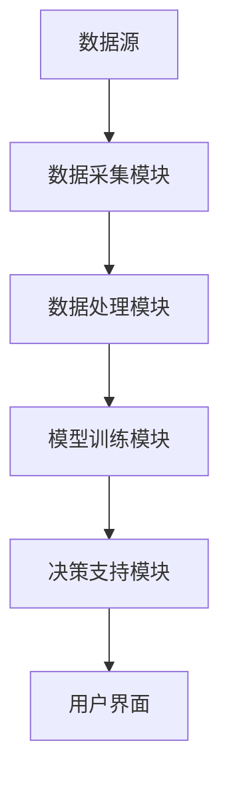

                 


# 多智能体AI如何增强价值投资的跨周期分析能力

> 关键词：多智能体AI, 价值投资, 跨周期分析, 强化学习, 协同学习, 系统架构设计

> 摘要：本文探讨了多智能体AI在价值投资中的应用，重点分析了其如何增强跨周期分析能力。通过详细讲解多智能体AI的原理、算法实现、系统架构设计以及实际项目案例，本文为读者提供了从理论到实践的全面指南。

---

# 第1章: 多智能体AI与价值投资的背景与概念

## 1.1 多智能体AI的定义与特点
### 1.1.1 多智能体AI的基本概念
多智能体AI（Multi-Agent AI）是由多个相互作用的智能体组成的系统，这些智能体能够通过协同和竞争完成复杂任务。每个智能体都有自己的目标、状态和决策机制。

### 1.1.2 多智能体AI的核心特点
- **分布式智能**：多个智能体协同工作，而非单一中心化决策。
- **自主性**：智能体能够自主感知环境并做出决策。
- **协作性**：智能体之间通过通信和协作实现整体目标。
- **动态性**：系统能够适应环境变化和智能体行为的动态调整。

### 1.1.3 多智能体AI与传统AI的区别
- **集中式 vs 分布式**：传统AI通常依赖于集中式计算，而多智能体AI是分布式计算。
- **单一决策者 vs 多决策者**：传统AI由一个决策者控制，而多智能体AI由多个决策者协同完成任务。
- **静态 vs 动态**：传统AI在静态环境中表现良好，而多智能体AI擅长处理动态复杂环境。

## 1.2 价值投资的核心理念
### 1.2.1 价值投资的定义
价值投资是一种投资策略，强调以低于内在价值的价格购买优质资产，长期持有以实现超额收益。

### 1.2.2 价值投资的基本原则
- **长期视角**：关注企业的长期价值，而非短期市场波动。
- **基本面分析**：通过财务数据和行业分析评估企业的内在价值。
- **安全边际**：买入价格低于内在价值，以降低风险。

### 1.2.3 价值投资的长期视角
价值投资强调在市场低迷时买入低估资产，在市场高估时卖出，通过长期持有优质资产实现财富增长。

## 1.3 多智能体AI在价值投资中的应用潜力
### 1.3.1 多智能体AI的优势
- **分布式计算能力**：能够处理海量数据和复杂关系。
- **协同学习能力**：多个智能体协同分析，提高决策准确性。
- **动态适应性**：能够快速适应市场变化和数据更新。

### 1.3.2 价值投资中的数据挑战
- **数据多样性**：需要处理财务数据、市场数据、宏观经济数据等多种信息。
- **数据动态性**：市场数据实时更新，需要快速处理和分析。
- **数据隐私性**：涉及敏感数据，需要考虑数据安全和隐私保护。

### 1.3.3 多智能体AI如何解决价值投资问题
通过分布式计算和协同学习，多智能体AI能够高效处理复杂数据，识别市场周期，优化投资策略，从而增强价值投资的跨周期分析能力。

---

# 第2章: 多智能体AI的原理与核心概念

## 2.1 多智能体系统的构成
### 2.1.1 多智能体系统的定义
多智能体系统是由多个智能体组成的分布式系统，这些智能体通过交互和协作完成特定任务。

### 2.1.2 多智能体系统的核心要素
- **智能体**：具有自主性、反应性和协作性的实体。
- **环境**：智能体所处的外部环境，包括数据源、市场和用户。
- **通信机制**：智能体之间的信息交换方式。
- **协作机制**：智能体协同完成任务的规则和策略。

## 2.2 多智能体AI的协同学习机制
### 2.2.1 协同学习的基本概念
协同学习是多个智能体通过共享信息和经验，共同优化学习目标的过程。

### 2.2.2 协同学习的实现方式
- **分布式学习**：每个智能体独立学习，然后共享结果。
- **联合学习**：智能体协同完成同一任务，共享数据和模型。
- **对抗学习**：智能体之间通过竞争优化学习效果。

## 2.3 多智能体AI的决策机制
### 2.3.1 多智能体决策的基本原理
多智能体决策基于强化学习和博弈论，通过智能体之间的协作和竞争，找到最优决策策略。

### 2.3.2 基于强化学习的决策模型
强化学习通过奖励机制，引导智能体做出最优决策。多智能体强化学习中，每个智能体都有独立的目标和奖励函数。

### 2.3.3 多智能体决策的优化方法
- **分布式优化**：每个智能体独立优化，然后共享优化结果。
- **集中式优化**：所有智能体的决策集中在一个中心进行优化。
- **混合式优化**：结合分布式和集中式优化方法。

---

# 第3章: 价值投资的跨周期分析框架

## 3.1 价值投资的跨周期分析目标
### 3.1.1 跨周期分析的定义
跨周期分析是指在不同市场周期中，分析资产价格的变化趋势，寻找长期投资机会。

### 3.1.2 跨周期分析的意义
- **捕捉长期趋势**：识别市场的长期波动规律。
- **降低短期波动影响**：通过长期视角减少短期市场波动对投资决策的影响。
- **优化投资策略**：根据市场周期调整投资策略，提高收益。

## 3.2 价值投资的跨周期分析方法
### 3.2.1 数据驱动的分析方法
通过历史数据和机器学习模型，预测市场周期的变化。

### 3.2.2 市场周期的识别与预测
- **市场周期识别**：通过数据分析，识别市场的牛熊周期。
- **市场周期预测**：基于历史数据和模型，预测未来的市场周期。

### 3.2.3 投资策略的制定
根据市场周期的变化，制定相应的投资策略，如在熊市中寻找低估资产，在牛市中持有优质资产。

## 3.3 多智能体AI在跨周期分析中的应用
### 3.3.1 多智能体AI如何支持跨周期分析
通过分布式计算和协同学习，多智能体AI能够高效处理海量数据，识别市场周期，优化投资策略。

### 3.3.2 多智能体AI在市场周期预测中的作用
- **数据处理**：多智能体AI能够快速处理大量数据，提取有效特征。
- **模型训练**：通过强化学习，训练出准确的市场周期预测模型。
- **决策优化**：基于预测结果，优化投资策略，提高收益。

### 3.3.3 多智能体AI在投资策略优化中的应用
- **协同学习**：多个智能体协同分析，提高策略的准确性和稳定性。
- **动态调整**：根据市场变化，实时调整投资策略，降低风险。

---

# 第4章: 多智能体AI在价值投资中的数据处理与特征提取

## 4.1 价值投资中的数据来源
### 4.1.1 财务数据
包括企业的收入、利润、资产负债表等财务指标。

### 4.1.2 市场数据
包括股票价格、成交量、市场指数等市场数据。

### 4.1.3 宏观经济数据
包括GDP、利率、通货膨胀率等宏观经济指标。

## 4.2 数据预处理与特征工程
### 4.2.1 数据清洗与标准化
去除噪声数据，标准化数据格式，确保数据的一致性。

### 4.2.2 特征选择与提取
通过统计分析和机器学习方法，选择最具预测性的特征。

### 4.2.3 数据增强与扩展
通过数据增强技术，增加数据的多样性和代表性。

## 4.3 多智能体AI的数据处理机制
### 4.3.1 分布式数据处理
多个智能体协同处理数据，提高处理效率。

### 4.3.2 多智能体协同数据处理
智能体之间共享数据和处理结果，优化整体数据处理效果。

### 4.3.3 数据隐私与安全保护
通过加密和访问控制，保护数据的隐私和安全。

---

# 第5章: 多智能体AI的算法原理与数学模型

## 5.1 多智能体协同学习的算法框架
### 5.1.1 协同学习的基本算法
包括分布式协同学习、联合学习和对抗学习等。

### 5.1.2 基于强化学习的协同算法
通过强化学习，智能体之间通过协作和竞争，优化学习效果。

### 5.1.3 基于博弈论的协同算法
通过博弈论模型，分析智能体之间的策略互动，优化整体决策。

## 5.2 多智能体强化学习的数学模型
### 5.2.1 强化学习的基本概念
强化学习通过智能体与环境的交互，学习最优策略。

### 5.2.2 多智能体强化学习的数学公式
$$ Q_i(a) = r_i + \gamma \max_{a'} Q_i(a') $$
其中，\( Q_i \) 表示智能体i的动作价值函数，\( r_i \) 是奖励，\( \gamma \) 是折扣因子。

### 5.2.3 多智能体强化学习的收敛性分析
通过数学证明，分析多智能体强化学习算法的收敛性。

## 5.3 多智能体AI的算法实现
### 5.3.1 算法流程
1. 初始化智能体和环境。
2. 智能体感知环境，做出决策。
3. 智能体与环境交互，获得奖励。
4. 智能体更新策略，优化动作价值函数。
5. 重复步骤2-4，直到收敛。

### 5.3.2 算法优化
通过分布式计算和并行处理，提高算法的效率和性能。

---

# 第6章: 多智能体AI在价值投资中的系统架构设计

## 6.1 系统功能设计
### 6.1.1 数据采集模块
负责采集财务数据、市场数据和宏观经济数据。

### 6.1.2 数据处理模块
负责数据清洗、特征提取和数据增强。

### 6.1.3 模型训练模块
负责训练多智能体AI模型，优化投资策略。

### 6.1.4 决策支持模块
根据模型预测结果，提供投资建议和策略优化。

## 6.2 系统架构设计
### 6.2.1 系统架构图


### 6.2.2 系统接口设计
- **数据接口**：与数据源对接，获取实时数据。
- **模型接口**：与第三方模型服务对接，提供预测结果。
- **用户接口**：提供用户交互界面，展示分析结果。

## 6.3 系统实现
### 6.3.1 环境配置
安装必要的库和工具，如TensorFlow、Keras、NumPy等。

### 6.3.2 核心代码实现
```python
import numpy as np
import tensorflow as tf

class MultiAgentAI:
    def __init__(self, num_agents):
        self.num_agents = num_agents
        self.agents = [Agent() for _ in range(num_agents)]
    
    def train(self, data):
        for agent in self.agents:
            agent.train(data)
    
    def predict(self, data):
        return [agent.predict(data) for agent in self.agents]

class Agent:
    def __init__(self):
        self.model = self.build_model()
    
    def build_model(self):
        model = tf.keras.Sequential([
            tf.keras.layers.Dense(64, activation='relu'),
            tf.keras.layers.Dense(1, activation='linear')
        ])
        model.compile(optimizer='adam', loss='mse')
        return model
    
    def train(self, data):
        self.model.fit(data, epochs=10, batch_size=32)
    
    def predict(self, data):
        return self.model.predict(data)
```

---

# 第7章: 项目实战与案例分析

## 7.1 项目背景
### 7.1.1 项目目标
通过多智能体AI技术，优化价值投资的跨周期分析能力。

### 7.1.2 项目需求
开发一个多智能体AI系统，能够分析市场数据，预测市场周期，优化投资策略。

## 7.2 环境配置
### 7.2.1 安装依赖
安装必要的Python库，如TensorFlow、Keras、NumPy等。

## 7.3 核心代码实现
### 7.3.1 数据预处理
```python
import pandas as pd
import numpy as np

# 加载数据
data = pd.read_csv('stock_data.csv')

# 数据清洗
data.dropna()

# 特征提取
features = data[['open', 'high', 'low', 'close', 'volume']]
```

### 7.3.2 模型训练
```python
from tensorflow.keras import layers

# 定义模型
model = tf.keras.Sequential([
    layers.Dense(64, activation='relu', input_shape=(5,)),
    layers.Dense(1)
])

# 编译模型
model.compile(optimizer='adam', loss='mse')

# 训练模型
model.fit(features, epochs=10, batch_size=32)
```

### 7.3.3 结果分析
```python
# 预测结果
predictions = model.predict(features)

# 计算误差
mse = np.mean((predictions - data['close'])**2)
print(f'Mean Squared Error: {mse}')
```

## 7.4 案例分析
### 7.4.1 案例背景
分析一只股票在不同市场周期中的表现。

### 7.4.2 数据分析
通过多智能体AI系统，预测市场周期，优化投资策略。

### 7.4.3 结果展示
展示预测结果与实际数据的对比，分析系统的准确性和稳定性。

---

# 第8章: 最佳实践与总结

## 8.1 最佳实践
### 8.1.1 数据处理
确保数据的准确性和完整性，选择合适的特征提取方法。

### 8.1.2 模型优化
通过交叉验证和超参数调优，提高模型的性能和准确性。

### 8.1.3 系统部署
确保系统的稳定性和安全性，方便用户使用和管理。

## 8.2 小结
多智能体AI通过分布式计算和协同学习，显著增强了价值投资的跨周期分析能力。通过本文的介绍，读者可以全面了解多智能体AI的原理、算法实现和系统架构设计，并通过实际案例掌握其在价值投资中的应用。

## 8.3 注意事项
- **数据隐私**：在处理敏感数据时，需要注意数据隐私和安全。
- **模型解释性**：复杂的模型可能缺乏解释性，需要简化或提供解释。
- **市场适应性**：多智能体AI系统需要适应不同市场环境和周期变化。

## 8.4 拓展阅读
- **多智能体系统**：深入学习多智能体系统的理论与实践。
- **强化学习算法**：研究更多强化学习算法及其在金融中的应用。
- **价值投资策略**：进一步研究价值投资策略的优化与创新。

---

# 作者：AI天才研究院/AI Genius Institute & 禅与计算机程序设计艺术 /Zen And The Art of Computer Programming

