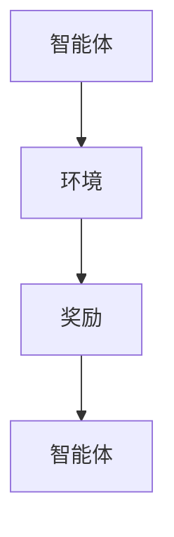
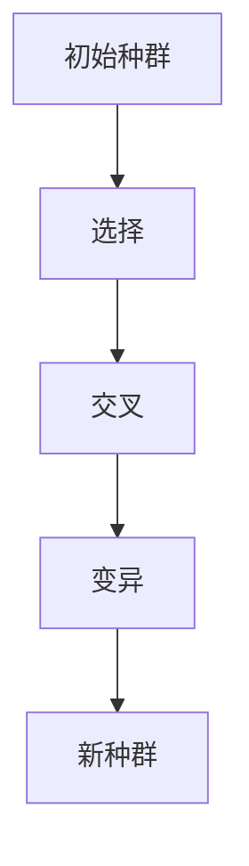
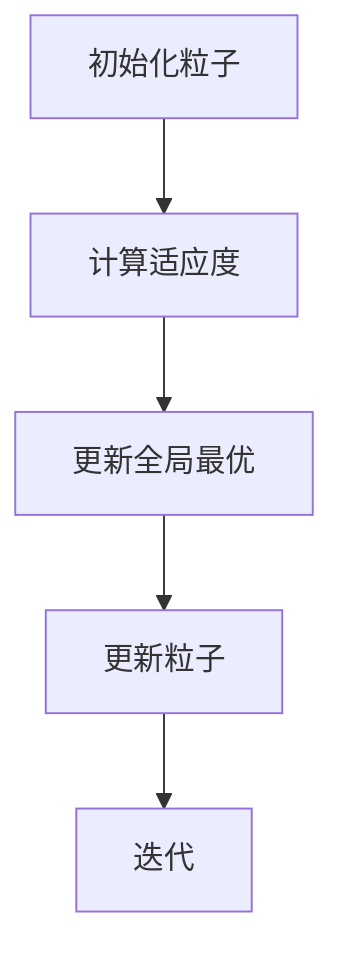

                 


# 多智能体系统优化价值投资的止损策略

> 关键词：多智能体系统，价值投资，止损策略，风险管理，强化学习，遗传算法，粒子群优化

> 摘要：本文探讨了多智能体系统在优化价值投资中的应用，特别是止损策略的优化。通过分析多智能体系统的优化方法，结合价值投资中的风险管理，提出了一种基于多智能体系统的动态止损策略，并通过数学模型和算法实现，展示了其在实际投资中的优势。

---

# 第一部分: 多智能体系统与价值投资概述

# 第1章: 多智能体系统与价值投资的背景

## 1.1 多智能体系统的定义与特点

### 1.1.1 多智能体系统的定义
多智能体系统（Multi-Agent System, MAS）是由多个智能体组成的系统，这些智能体能够通过协作完成复杂的任务。智能体是具有感知、决策和行动能力的实体，可以是软件程序或物理设备。

### 1.1.2 多智能体系统的核心特点
- **自主性**：每个智能体都能独立决策。
- **协作性**：智能体之间可以协作完成任务。
- **反应性**：智能体能够实时感知环境并做出反应。
- **分布式**：系统中的智能体是分布式的，不存在中央控制节点。

### 1.1.3 多智能体系统与传统单智能体系统的区别
| 特性            | 多智能体系统                          | 单智能体系统                          |
|-----------------|-------------------------------------|---------------------------------------|
| 决策中心化       | 去中心化，多个智能体协作决策           | 中心化，单个智能体决策                 |
| 任务复杂性       | 适合复杂任务，多个智能体协同完成       | 适合简单任务，单个智能体完成           |
| 灵活性           | 更高的灵活性，适应复杂环境             | 较低的灵活性，适应性有限               |

---

## 1.2 价值投资的基本概念

### 1.2.1 价值投资的定义
价值投资是一种投资策略，强调以低于市场价值的价格购买优质资产。其核心思想是寻找市场中的低估资产，长期持有，等待其价值回归。

### 1.2.2 价值投资的核心原则
- **安全边际**：购买价格低于内在价值。
- **长期视角**：关注企业的长期盈利能力。
- **分散投资**：降低风险。

### 1.2.3 价值投资与短线交易的区别
| 特性            | 价值投资                          | 短线交易                            |
|-----------------|----------------------------------|-------------------------------------|
| 投资期限        | 长期                               | 短期                                 |
| 投资策略        | 买入低估资产，长期持有             | 利用价格波动，短期买卖               |
| 风险承受能力     | 较低                              | 较高                                 |

---

## 1.3 多智能体系统在价值投资中的应用前景

### 1.3.1 多智能体系统在金融领域的潜在应用
- **市场预测**：利用多智能体系统分析市场趋势。
- **风险控制**：通过协作智能体实时监控和管理风险。
- **资产配置**：优化投资组合，提高收益。

### 1.3.2 多智能体系统在价值投资中的优势
- **分布式决策**：多个智能体可以同时分析不同资产。
- **协作优化**：通过协作，智能体可以发现更多的投资机会。
- **动态适应**：能够快速响应市场变化。

### 1.3.3 多智能体系统在价值投资中的挑战
- **复杂性**：多智能体系统的协作需要复杂的协调机制。
- **计算资源**：需要大量的计算资源支持。
- **市场适应性**：需要不断适应市场的变化。

---

## 1.4 本章小结

本章介绍了多智能体系统的定义和特点，以及价值投资的基本概念和原则。同时，分析了多智能体系统在价值投资中的应用前景及其优势和挑战。这些内容为后续章节奠定了基础。

---

# 第2章: 多智能体系统优化的数学模型

## 2.1 多智能体系统优化的基本原理

### 2.1.1 多智能体系统的优化目标
在价值投资中，多智能体系统的优化目标是通过协作最大化投资收益，同时最小化风险。具体目标包括：
1. 最大化投资组合的收益。
2. 最小化投资组合的风险。
3. 实现动态止损，降低潜在损失。

### 2.1.2 多智能体系统优化的数学模型
多智能体系统的优化可以表示为一个优化问题：
$$ \min_{x_i} \sum_{i=1}^{n} f_i(x_i) $$
其中，$x_i$ 表示第 $i$ 个智能体的状态，$f_i(x_i)$ 是智能体的优化目标函数。

### 2.1.3 多智能体系统优化的约束条件
1. 每个智能体的决策必须满足市场约束。
2. 智能体之间的协作必须满足整体优化目标。
3. 每个智能体的决策必须在规定的时间内完成。

---

## 2.2 多智能体系统优化的算法

### 2.2.1 强化学习算法
强化学习是一种通过智能体与环境交互来学习策略的方法。在价值投资中，智能体可以通过强化学习学习如何选择低估资产。

#### 强化学习的基本流程


### 2.2.2 遗传算法
遗传算法是一种基于自然选择和遗传机制的优化算法。在多智能体系统中，每个智能体的策略可以看作一个基因，通过遗传算法优化这些策略。

#### 遗传算法的步骤


### 2.2.3 粒子群优化算法
粒子群优化（PSO）是一种模拟鸟群觅食行为的优化算法。在价值投资中，可以用来优化投资组合的风险和收益。

#### 粒子群优化的基本步骤


---

## 2.3 多智能体系统优化的数学公式

### 2.3.1 强化学习的Q-learning算法公式
$$ Q(s,a) = Q(s,a) + \alpha [r + \gamma \max Q(s',a') - Q(s,a)] $$
其中：
- $s$ 是当前状态，
- $a$ 是动作，
- $r$ 是奖励，
- $\gamma$ 是折扣因子，
- $\alpha$ 是学习率。

### 2.3.2 遗传算法的适应度函数
$$ f(x) = \sum_{i=1}^{n} w_i x_i $$
其中，$w_i$ 是权重，$x_i$ 是决策变量。

### 2.3.3 粒子群优化算法的更新公式
$$ v_i = w v_i + c_1 r_1 (p_i - x_i) + c_2 r_2 (p_g - x_i) $$
$$ x_i = x_i + v_i $$
其中：
- $v_i$ 是速度，
- $x_i$ 是位置，
- $p_i$ 是个体最优，
- $p_g$ 是全局最优，
- $c_1$ 和 $c_2$ 是加速常数，
- $r_1$ 和 $r_2$ 是随机数。

---

## 2.4 本章小结

本章详细介绍了多智能体系统优化的基本原理和常用的优化算法，包括强化学习、遗传算法和粒子群优化算法。这些算法为后续章节中多智能体系统在价值投资中的应用提供了理论基础。

---

# 第3章: 价值投资中的止损策略

## 3.1 价值投资中的风险管理

### 3.1.1 风险管理的基本概念
风险管理是通过识别和评估风险，采取措施降低风险对投资目标的影响。在价值投资中，风险管理尤为重要，因为投资标的价格波动可能会影响投资组合的价值。

### 3.1.2 价值投资中的风险来源
1. **市场风险**：市场整体波动对资产价格的影响。
2. **个股风险**：特定股票的波动。
3. **流动性风险**：资产难以快速变现的风险。

### 3.1.3 价值投资中的风险管理策略
- **分散投资**：通过投资不同行业的资产降低风险。
- **设置止损**：当资产价格下跌到一定程度时，卖出以避免更大的损失。
- **定期评估**：定期重新评估投资组合，调整持仓。

---

## 3.2 止损策略的定义与作用

### 3.2.1 止损策略的定义
止损策略是一种风险管理策略，当资产价格下跌到一定程度时，投资者卖出该资产以避免更大的损失。在价值投资中，止损策略通常用于防止投资标的大幅下跌。

### 3.2.2 止损策略的作用
1. **限制损失**：当资产价格下跌超过预设阈值时，及时止损以避免更大的损失。
2. **锁定收益**：在资产价格达到目标价时，设置止损以保护利润。
3. **心理因素**：止损策略可以帮助投资者避免情绪化决策，如恐慌性抛售。

### 3.2.3 价值投资中止损策略的优化

---

## 3.3 基于多智能体系统的止损策略设计

### 3.3.1 多智能体系统在止损策略中的作用
在多智能体系统中，每个智能体可以负责监控不同的资产，并根据市场变化动态调整止损点。

#### 多智能体系统止损策略的设计流程
1. **数据采集**：智能体实时采集资产价格数据。
2. **风险评估**：每个智能体根据历史数据和市场趋势评估资产的风险。
3. **决策制定**：智能体根据风险评估结果制定止损策略。
4. **协作优化**：多个智能体协作，优化整体的止损策略。

### 3.3.2 基于多智能体系统的动态止损点设计
动态止损点可以根据资产价格的波动性和市场趋势动态调整。具体实现步骤如下：

1. **数据采集**：智能体实时采集资产价格数据。
2. **计算波动性**：使用统计方法计算资产价格的波动性。
3. **调整止损点**：根据波动性调整止损点的位置。

#### 动态止损点的计算公式
$$ \text{止损点} = \text{当前价格} - n \times \text{波动幅度} $$
其中，$n$ 是一个系数，根据市场情况调整。

---

## 3.4 基于多智能体系统的实时止损监控

### 3.4.1 实时止损监控的实现
实时止损监控需要多个智能体协作，每个智能体负责监控不同的资产，并根据市场变化动态调整止损点。

#### 实时止损监控的流程
1. **数据采集**：智能体实时采集资产价格数据。
2. **风险评估**：智能体根据历史数据和市场趋势评估资产的风险。
3. **决策制定**：智能体根据风险评估结果制定止损策略。
4. **协作优化**：多个智能体协作，优化整体的止损策略。

### 3.4.2 多智能体系统在实时止损中的优势
- **实时性**：智能体可以实时监控资产价格变化。
- **协作性**：多个智能体可以协作优化止损策略。
- **适应性**：智能体可以根据市场变化动态调整止损点。

---

## 3.5 本章小结

本章介绍了价值投资中的风险管理，特别是止损策略的重要性。同时，提出了基于多智能体系统的动态止损策略，并详细介绍了其实现方法。通过多智能体系统的协作，可以实现更高效的止损监控，降低投资风险。

---

# 第4章: 多智能体系统优化的止损策略实现

## 4.1 多智能体系统优化的止损策略设计

### 4.1.1 多智能体系统优化的目标
在价值投资中，多智能体系统的优化目标是通过协作最大化投资收益，同时最小化风险。具体目标包括：
1. 最大化投资组合的收益。
2. 最小化投资组合的风险。
3. 实现动态止损，降低潜在损失。

### 4.1.2 多智能体系统优化的止损策略设计
通过多智能体系统的协作，可以实现动态止损点的优化。每个智能体负责监控不同的资产，并根据市场变化动态调整止损点。

---

## 4.2 多智能体系统优化的止损策略实现

### 4.2.1 基于强化学习的止损策略实现
通过强化学习，智能体可以学习如何动态调整止损点。具体实现步骤如下：
1. **状态定义**：状态包括资产价格、波动性等。
2. **动作定义**：动作包括调整止损点或不调整。
3. **奖励函数**：奖励函数根据最终的收益和风险来定义。

### 4.2.2 基于遗传算法的止损策略实现
通过遗传算法，可以优化止损策略的参数，如止损比例和调整频率。

---

## 4.3 本章小结

本章详细介绍了多智能体系统优化的止损策略设计和实现方法。通过强化学习和遗传算法，可以实现动态止损点的优化，降低投资风险，提高投资收益。

---

# 第5章: 项目实战：多智能体系统优化的止损策略实现

## 5.1 项目环境安装

### 5.1.1 系统要求
- 操作系统：Linux/Windows/MacOS
- Python版本：Python 3.6+
- 需要安装的库：numpy, pandas, gym, matplotlib, pymermaid

### 5.1.2 环境配置
1. 安装Python环境。
2. 安装所需的Python库。

---

## 5.2 系统核心代码实现

### 5.2.1 强化学习智能体实现
```python
class Agent:
    def __init__(self, state_space, action_space):
        self.state_space = state_space
        self.action_space = action_space
        # 初始化Q表
        self.Q = defaultdict(int)
    
    def act(self, state):
        # 探索与利用策略
        if random.random() < 0.1:
            return random.choice(range(self.action_space))
        else:
            max_action = max(self.Q[state], key=lambda k: self.Q[state][k])
            return max_action
    
    def learn(self, state, action, reward, next_state):
        # Q-learning算法
        self.Q[state][action] += 0.1 * (reward + 0.9 * max(self.Q[next_state].values()) - self.Q[state][action])
```

### 5.2.2 多智能体协作实现
```python
class MultiAgentSystem:
    def __init__(self, num_agents):
        self.agents = [Agent(state_space, action_space) for _ in range(num_agents)]
    
    def step(self, states):
        actions = []
        for i in range(len(states)):
            actions.append(self.agents[i].act(states[i]))
        return actions
    
    def learn(self, states, actions, rewards, next_states):
        for i in range(len(states)):
            self.agents[i].learn(states[i], actions[i], rewards[i], next_states[i])
```

---

## 5.3 案例分析与实现解读

### 5.3.1 案例分析
假设我们有三个智能体，分别监控三只股票。每个智能体负责动态调整其对应的股票的止损点。

### 5.3.2 实现解读
通过多智能体系统的协作，可以实现动态止损点的优化。每个智能体根据市场变化实时调整止损点，从而降低投资风险。

---

## 5.4 项目小结

本章通过项目实战，详细介绍了多智能体系统优化的止损策略的实现过程。通过Python代码实现了一个多智能体系统，并通过案例分析展示了其在价值投资中的应用。

---

# 第6章: 总结与展望

## 6.1 总结

本文探讨了多智能体系统在优化价值投资中的应用，特别是止损策略的优化。通过分析多智能体系统的优化方法，结合价值投资中的风险管理，提出了一种基于多智能体系统的动态止损策略，并通过数学模型和算法实现，展示了其在实际投资中的优势。

---

## 6.2 未来展望

未来的研究方向包括：
1. **多智能体系统的进一步优化**：研究更高效的多智能体协作算法。
2. **风险管理的进一步研究**：探索更多的风险管理策略。
3. **实际应用中的案例分析**：通过更多的实际案例验证多智能体系统优化的止损策略的有效性。

---

# 作者

作者：AI天才研究院/AI Genius Institute & 禅与计算机程序设计艺术 /Zen And The Art of Computer Programming

---

# 致谢

感谢读者的耐心阅读，希望本文对您理解多智能体系统在价值投资中的应用有所帮助。

---

