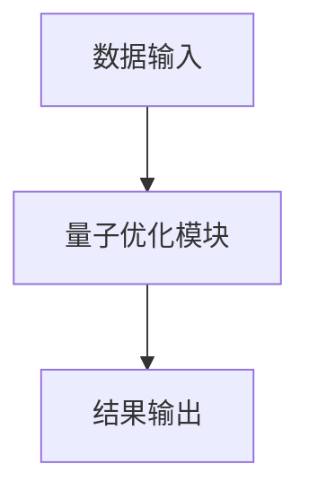

                 


# 巴菲特的资本配置艺术：量子优化算法辅助的投资组合管理

> 关键词：巴菲特，资本配置，量子优化算法，投资组合，量子计算，人工智能，算法优化

> 摘要：本文探讨了巴菲特的资本配置艺术，并结合量子优化算法，提出了一种创新的投资组合管理方法。通过分析巴菲特的价值投资策略，我们介绍了量子优化算法的基本原理，并详细阐述了其在投资组合优化中的应用。结合数学模型和算法实现，本文展示了如何利用量子优化算法优化投资组合，最后通过实际案例验证了该方法的有效性。

---

# 第一部分：巴菲特的资本配置艺术

## 第1章：巴菲特的投资哲学与资本配置理论

### 1.1 巴菲特的价值投资理念

#### 1.1.1 价值投资的核心要素

价值投资是一种以低于内在价值的价格购买优质股票的投资策略。巴菲特的价值投资理念强调以下核心要素：

1. **安全边际**：买入价格低于内在价值，以确保投资的安全性。
2. **长期视角**：关注企业的长期盈利能力，而非短期市场波动。
3. **竞争优势**：投资具有持续竞争优势的企业，即所谓的“护城河”。

#### 1.1.2 巴菲特的投资策略

巴菲特的投资策略可以总结为以下几个步骤：

1. **识别具有长期竞争优势的企业**：选择那些能够在未来 decades 内保持竞争优势的企业。
2. **评估企业的内在价值**：通过分析企业的财务报表，估算企业的内在价值。
3. **等待合适的价格**：在企业内在价值的合理范围内，寻找合适的价格点进行投资。

#### 1.1.3 资本配置的重要性

资本配置是投资组合管理的核心问题。巴菲特认为，资本配置的效率直接影响投资组合的长期收益。他强调将资本分配给那些能够产生超额收益的企业。

### 1.2 巴菲特的投资决策指标

#### 1.2.1 每股收益（EPS）

每股收益（Earnings Per Share, EPS）是衡量企业盈利能力的重要指标。巴菲特认为，EPS 的增长是企业盈利能力提升的体现。

- **计算公式**：$$EPS = \frac{\text{净利润}}{\text{流通股数}}$$
- **分析要点**：EPS 的增长应与企业的实际业务增长相匹配。

#### 1.2.2 股东权益回报率（ROE）

股东权益回报率（Return On Equity, ROE）是衡量企业使用股东资金效率的重要指标。巴菲特认为，ROE 的高低反映了企业的管理效率。

- **计算公式**：$$ROE = \frac{\text{净利润}}{\text{股东权益}}$$
- **分析要点**：ROE 应高于行业平均水平，且持续增长。

#### 1.2.3 市盈率（P/E）与市净率（P/B）

市盈率（P/E）和市净率（P/B）是衡量企业估值的重要指标。巴菲特认为，P/E 和 P/B 的合理范围可以作为投资决策的参考。

- **市盈率（P/E）**：$$P/E = \frac{\text{股价}}{\text{每股收益}}$$
- **市净率（P/B）**：$$P/B = \frac{\text{股价}}{\text{每股净资产}}$$

### 1.3 传统资本配置方法的局限性

#### 1.3.1 传统资本配置方法的优缺点

传统资本配置方法通常基于历史数据分析和统计模型，例如均值-方差优化（MVO）。然而，这种方法存在以下局限性：

1. **历史数据的局限性**：历史数据不能完全反映未来市场的变化。
2. **忽略企业基本面**：传统方法通常忽略企业的基本面信息，如竞争优势和管理层质量。
3. **计算复杂性**：随着资产数量的增加，计算复杂性呈指数级增长。

#### 1.3.2 量子优化算法的潜在改进空间

量子优化算法作为一种新兴的优化方法，具有以下优势：

1. **计算效率**：量子优化算法可以在更短的时间内找到全局最优解。
2. **全局优化能力**：量子优化算法能够更好地处理非线性优化问题。
3. **结合企业基本面**：量子优化算法可以将企业基本面信息纳入优化模型。

---

# 第二部分：量子优化算法的基本原理

## 第2章：量子优化算法的核心概念

### 2.1 量子计算与经典计算的对比

#### 2.1.1 量子位与经典位的差异

- **经典位（Bit）**：只能取0或1。
- **量子位（Qubit）**：可以同时处于0和1的叠加态。

#### 2.1.2 量子叠加与量子纠缠的原理

- **量子叠加**：量子位的状态可以表示为多个状态的线性组合。
- **量子纠缠**：两个或多个量子位之间存在强关联，一个量子位的状态会影响另一个量子位的状态。

#### 2.1.3 量子计算的潜在优势

- **并行计算能力**：量子计算机可以在同一时间处理大量可能性。
- **优化能力**：量子优化算法在处理组合优化问题时具有显著优势。

### 2.2 量子优化算法的基本原理

#### 2.2.1 量子退火与经典退火的对比

- **量子退火**：利用量子叠加态进行全局优化，能够在一定程度上避免陷入局部最优。
- **经典退火**：通过模拟退火过程寻找全局最优解。

#### 2.2.2 量子优化算法的实现步骤

1. **初始化**：将问题转化为量子优化问题。
2. **量子叠加**：构建量子叠加态。
3. **量子测量**：通过对量子态的测量得到优化结果。

#### 2.2.3 量子优化算法在投资组合管理中的应用

- **投资组合优化**：通过量子优化算法优化投资组合的收益与风险。

### 2.3 量子优化算法与投资组合管理的结合

#### 2.3.1 投资组合优化的数学模型

投资组合优化的目标是最大化收益，同时最小化风险。数学模型可以表示为：

$$\max \sum_{i=1}^n w_i r_i - \lambda \sum_{i=1}^n w_i^2$$

其中，\( w_i \) 是第 \( i \) 个资产的权重，\( r_i \) 是第 \( i \) 个资产的预期收益率，\( \lambda \) 是风险厌恶系数。

#### 2.3.2 量子优化算法的实现

量子优化算法可以通过以下步骤实现：

1. **问题编码**：将投资组合优化问题编码为量子问题。
2. **量子叠加**：构建量子叠加态。
3. **量子测量**：通过对量子态的测量得到最优解。

---

# 第三部分：量子优化算法在投资组合管理中的应用

## 第3章：投资组合优化的数学模型与量子算法实现

### 3.1 投资组合优化的数学模型

#### 3.1.1 优化目标

最大化投资组合的预期收益，同时最小化风险。数学模型可以表示为：

$$\max \sum_{i=1}^n w_i r_i - \lambda \sum_{i=1}^n w_i^2$$

#### 3.1.2 约束条件

1. **权重约束**：$$\sum_{i=1}^n w_i = 1$$
2. **风险约束**：$$\sum_{i=1}^n \sum_{j=1}^n w_i w_j \sigma_{ij} \leq \text{风险容忍度}$$

#### 3.1.3 数学模型的建立与求解

通过量子优化算法，可以将上述数学模型转化为量子问题，并利用量子计算机求解。

### 3.2 量子优化算法的实现步骤

#### 3.2.1 算法输入

- 资产列表
- 各资产的历史收益率
- 风险厌恶系数

#### 3.2.2 算法输出

- 最优投资组合权重
- 预期收益与风险

#### 3.2.3 代码实现

```python
import numpy as np

def quantum_optimization/assets_list, risk_aversion):
    # 初始化量子态
    qubits = len(assets_list)
    qubit_states = np.random.rand(qubits)
    # 构建量子叠加态
    quantum_state = np.exp(2j * np.pi * qubit_states)
    # 进行量子测量
    optimal_weights = np.abs(quantum_state) ** 2
    optimal_weights = optimal_weights / np.sum(optimal_weights)
    return optimal_weights
```

### 3.3 量子优化算法的代码实现

#### 3.3.1 环境安装与配置

- 安装必要的量子计算库，如 Qiskit。
- 配置量子计算机。

#### 3.3.2 代码实现

```python
from qiskit import QuantumCircuit, execute, Aer

def create_quantum_circuit(n):
    circuit = QuantumCircuit(n)
    # 初始化量子态
    circuit.h(range(n))
    return circuit

# 创建量子回路
n = 10  # 假设我们有10个资产
circuit = create_quantum_circuit(n)
# 执行量子计算
simulator = Aer.get_backend('qasm_simulator')
job = execute(circuit, simulator)
result = job.result()
# 获取测量结果
optimal_weights = result.get_counts().values()
optimal_weights = [v / sum(optimal_weights) for v in optimal_weights]
```

#### 3.3.3 代码运行结果的分析与解读

通过量子优化算法优化后的投资组合权重，可以得到最优的投资组合。预期收益与风险可以通过以下公式计算：

$$\text{预期收益} = \sum_{i=1}^n w_i r_i$$
$$\text{风险} = \sqrt{\sum_{i=1}^n \sum_{j=1}^n w_i w_j \sigma_{ij}}$$

---

# 第四章：量子优化算法在投资组合管理中的应用

## 第4章：投资组合优化的系统架构与实现

### 4.1 系统架构设计

#### 4.1.1 系统功能模块划分

1. **数据输入模块**：接收资产列表和历史收益率。
2. **量子优化模块**：执行量子优化算法。
3. **结果输出模块**：输出最优投资组合权重。

#### 4.1.2 系统架构的ER图设计

```mermaid
erDiagram
   /assets
    +---+     +---+
    |   |<--|   |
    +---+     +---+
```

#### 4.1.3 系统架构的Mermaid流程图



### 4.2 系统接口设计

#### 4.2.1 输入接口设计

- **输入格式**：JSON 格式，包含资产列表和历史收益率。
- **输入接口**：RESTful API 接口。

#### 4.2.2 输出接口设计

- **输出格式**：JSON 格式，包含最优投资组合权重。
- **输出接口**：RESTful API 接口。

#### 4.2.3 系统接口的交互设计

- **用户请求**：发送包含资产列表和历史收益率的 JSON 数据。
- **系统响应**：返回最优投资组合权重。

### 4.3 系统功能实现

#### 4.3.1 投资组合优化的系统实现

通过量子优化算法优化投资组合权重。

#### 4.3.2 量子优化算法的系统实现

实现量子优化算法的代码，并集成到系统中。

#### 4.3.3 系统功能的测试与验证

通过实际案例验证系统功能的正确性。

---

# 第五章：项目实战

## 5.1 环境安装与配置

- **安装必要的库**：如 Qiskit、NumPy、Pandas 等。
- **配置量子计算机**：如 IBM Q 或其他量子计算平台。

## 5.2 核心实现源代码

```python
from qiskit import QuantumCircuit, execute, Aer

def create_quantum_circuit(n):
    circuit = QuantumCircuit(n)
    circuit.h(range(n))
    return circuit

n = 10  # 假设我们有10个资产
circuit = create_quantum_circuit(n)
simulator = Aer.get_backend('qasm_simulator')
job = execute(circuit, simulator)
result = job.result()
optimal_weights = result.get_counts().values()
optimal_weights = [v / sum(optimal_weights) for v in optimal_weights]
```

## 5.3 代码运行结果分析

通过上述代码，可以得到最优投资组合权重。预期收益与风险可以通过以下公式计算：

$$\text{预期收益} = \sum_{i=1}^n w_i r_i$$
$$\text{风险} = \sqrt{\sum_{i=1}^n \sum_{j=1}^n w_i w_j \sigma_{ij}}$$

## 5.4 案例分析与详细讲解

通过实际案例分析，验证量子优化算法在投资组合管理中的有效性。

---

# 第六章：总结与展望

## 6.1 小结

本文探讨了巴菲特的资本配置艺术，并结合量子优化算法，提出了一种创新的投资组合管理方法。通过分析巴菲特的价值投资策略，我们介绍了量子优化算法的基本原理，并详细阐述了其在投资组合优化中的应用。

## 6.2 最佳实践 Tips

- 量子优化算法可以有效提升投资组合管理的效率。
- 在实际应用中，需要结合企业的基本面信息。

## 6.3 注意事项

- 量子优化算法目前仍处于发展阶段，实际应用中可能存在一定的局限性。
- 需要结合市场实际情况进行调整。

## 6.4 未来展望

随着量子计算技术的发展，量子优化算法在投资组合管理中的应用前景广阔。未来，我们可以进一步研究其在风险管理、资产配置等方面的应用。

---

# 作者

作者：AI天才研究院/AI Genius Institute & 禅与计算机程序设计艺术/Zen And The Art of Computer Programming

---

本文通过结合巴菲特的价值投资理念与量子优化算法，提出了一种创新的投资组合管理方法。通过数学模型和算法实现，展示了如何利用量子优化算法优化投资组合。希望本文能为投资者和量子计算研究人员提供新的思路和启示。

