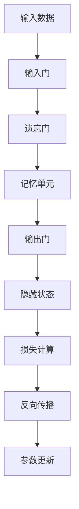
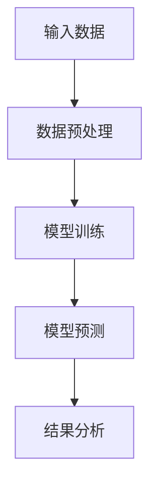
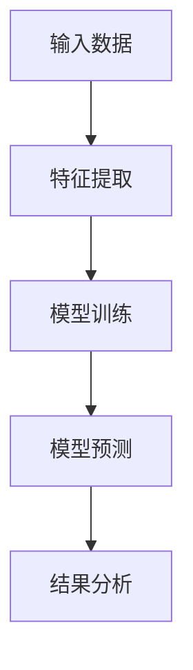
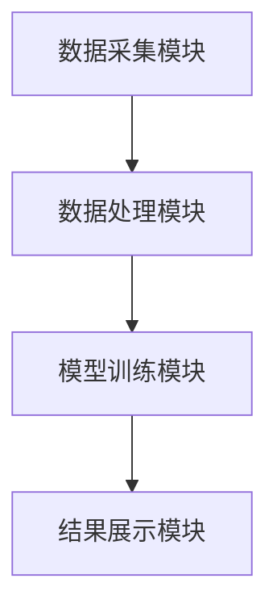

                 


```markdown
# 开发智能化的金融市场情绪指数分解与预测模型

**关键词**：金融市场情绪指数、情绪分析、时间序列分析、机器学习、深度学习

**摘要**：本文详细探讨了如何开发智能化的金融市场情绪指数分解与预测模型。通过结合自然语言处理、时间序列分析和机器学习等技术，本文提出了一种创新的方法来分解和预测金融市场情绪指数。文章首先介绍了情绪指数的背景和重要性，然后详细讲解了情绪指数的分解方法，包括基于文本的情绪分析和基于时间序列的情绪分解。接着，本文讨论了预测模型的构建目标和核心概念，重点介绍了长短时记忆网络（LSTM）在情绪预测中的应用。随后，文章深入分析了情绪指数分解与预测模型的系统架构设计，包括系统功能设计、架构图和接口设计。最后，通过一个实际项目案例，详细展示了如何实现情绪指数分解与预测模型，并提供了最佳实践和总结。

---

## 第1章: 金融市场情绪指数的背景与重要性

### 1.1 情绪指数的定义与作用

金融市场情绪指数是用来衡量市场参与者情绪状态的量化指标，能够反映市场的乐观或悲观情绪。情绪指数在金融市场的应用广泛，能够帮助投资者、交易员和分析师做出更明智的决策。

#### 1.1.1 情绪指数的基本概念
情绪指数是一种量化市场情绪的指标，通常通过新闻、社交媒体、市场评论等数据进行计算。情绪指数的数值范围通常在-1到1之间，其中正值表示乐观情绪，负值表示悲观情绪。

#### 1.1.2 情绪指数在金融市场的应用价值
情绪指数能够帮助投资者预测市场趋势，评估市场风险，并优化投资组合。情绪指数还可以用于量化市场波动性，为量化交易提供依据。

#### 1.1.3 情绪指数对投资决策的影响
情绪指数可以作为交易信号的一部分，帮助投资者在市场情绪过度乐观或悲观时做出调整。情绪指数还可以用于验证市场行为模型，评估市场参与者的心理状态。

### 1.2 金融市场情绪指数的分解方法

金融市场情绪指数的分解方法通常包括基于文本的情绪分析和基于价格波动的情绪分解。以下是两种方法的详细介绍：

#### 1.2.1 基于文本的情绪分析
基于文本的情绪分析是通过分析新闻、社交媒体帖子等文本数据，提取市场参与者的观点和情绪。常用的情绪分析方法包括词汇分析、情感分类和主题建模。

- **词汇分析**：通过统计文本中的情感词汇（如“乐观”、“悲观”）来评估市场情绪。
- **情感分类**：使用机器学习算法对文本进行情感分类，通常分为正面、负面和中性。
- **主题建模**：通过主题建模技术（如LDA）识别文本中的主要主题，并分析这些主题与市场情绪的关系。

#### 1.2.2 基于价格波动的情绪分解
基于价格波动的情绪分解是通过分析股票价格、指数价格等价格数据，推断市场的整体情绪。常用的方法包括时间序列分析和波动率模型。

- **时间序列分析**：通过分析历史价格数据，识别价格波动的模式和趋势。
- **波动率模型**：使用GARCH等模型预测市场的波动率，从而推断市场情绪。

#### 1.2.3 综合分析方法
综合分析方法结合了文本和价格数据，通过多模态数据融合技术，提升情绪指数分解的准确性和全面性。具体方法包括：

- **数据融合**：将文本数据和价格数据进行预处理和特征提取，构建多模态特征向量。
- **融合模型**：使用深度学习模型（如多模态神经网络）对多模态特征进行融合，生成综合情绪指数。

### 1.3 情绪指数预测模型的构建目标

情绪指数预测模型的目标是根据历史数据和当前市场状况，预测未来市场情绪的变化趋势。为了实现这一目标，我们需要明确模型的核心要素和性能指标。

#### 1.3.1 模型的目标与范围
- **目标**：预测未来一段时间内的市场情绪指数。
- **范围**：涵盖金融市场中的主要情绪指标，如投资者情绪、市场波动性等。

#### 1.3.2 模型的核心要素
- **输入数据**：历史价格数据、新闻数据、社交媒体数据等。
- **模型结构**：选择合适的时间序列模型或机器学习模型进行预测。
- **评估指标**：准确率、召回率、F1分数等。

#### 1.3.3 模型的性能指标
- **准确率**：模型预测情绪的准确程度。
- **响应时间**：模型处理数据的速度。
- **稳定性**：模型在不同市场环境下的表现一致性。

### 1.4 本章小结

本章介绍了金融市场情绪指数的背景和重要性，详细讲解了情绪指数的分解方法，包括基于文本的情绪分析和基于价格波动的情绪分解。同时，本章还讨论了情绪指数预测模型的构建目标和核心要素，为后续章节的分析奠定了基础。

---

## 第2章: 情绪指数分解与预测的核心概念

### 2.1 情绪指数分解的核心概念

情绪指数分解的核心概念是将市场情绪分解为多个维度的特征，以便更好地理解和预测市场行为。以下是分解的核心概念和相关方法。

#### 2.1.1 情绪指数分解的基本原理
情绪指数分解的基本原理是将市场情绪分解为多个维度的特征，如情绪强度、情绪方向和情绪持续时间。通过分解这些特征，我们可以更准确地预测市场情绪的变化趋势。

#### 2.1.2 情绪指数分解的数学模型
情绪指数分解的数学模型可以表示为：

$$
E(t) = \sum_{i=1}^{n} w_i x_i(t)
$$

其中，\( E(t) \) 表示时间 \( t \) 的情绪指数，\( w_i \) 是第 \( i \) 个特征的权重，\( x_i(t) \) 是第 \( i \) 个特征在时间 \( t \) 的值。

#### 2.1.3 情绪指数分解的特征选择
情绪指数分解的特征选择是关键步骤之一，通常包括以下步骤：

1. **数据预处理**：对原始数据进行清洗和标准化处理。
2. **特征提取**：通过文本分析和时间序列分析提取特征。
3. **特征选择**：使用特征选择算法（如Lasso回归）选择对情绪指数影响最大的特征。

### 2.2 情绪指数预测模型的核心概念

情绪指数预测模型的核心概念是利用历史数据和当前市场状况，预测未来市场情绪的变化趋势。以下是情绪指数预测模型的核心概念和相关方法。

#### 2.2.1 情绪指数预测模型的基本原理
情绪指数预测模型的基本原理是通过分析历史情绪指数和相关市场数据，构建预测模型，预测未来的情绪指数。常用的预测模型包括时间序列模型（如ARIMA）和机器学习模型（如随机森林）。

#### 2.2.2 情绪指数预测模型的数学模型
情绪指数预测模型的数学模型可以表示为：

$$
\hat{E}(t+1) = f(E(t), E(t-1), \ldots, E(t-n))
$$

其中，\( \hat{E}(t+1) \) 表示对时间 \( t+1 \) 的情绪指数预测值，\( E(t), E(t-1), \ldots, E(t-n) \) 是过去 \( n \) 个时间点的情绪指数值，\( f \) 是预测模型。

#### 2.2.3 情绪指数预测模型的特征选择
情绪指数预测模型的特征选择是关键步骤之一，通常包括以下步骤：

1. **数据预处理**：对原始数据进行清洗和标准化处理。
2. **特征提取**：通过文本分析和时间序列分析提取特征。
3. **特征选择**：使用特征选择算法（如Lasso回归）选择对情绪指数影响最大的特征。

### 2.3 情绪指数分解与预测的综合方法

情绪指数分解与预测的综合方法是将情绪指数分解和预测模型结合起来，利用多模态数据融合技术，提升情绪指数预测的准确性和全面性。

#### 2.3.1 综合分解模型的设计思路
综合分解模型的设计思路是将文本数据和价格数据进行预处理和特征提取，构建多模态特征向量，然后通过深度学习模型（如多模态神经网络）对这些特征进行融合，生成综合情绪指数。

#### 2.3.2 综合分解模型的数学模型
综合分解模型的数学模型可以表示为：

$$
E(t) = \sum_{i=1}^{n} w_i x_i(t)
$$

其中，\( E(t) \) 表示时间 \( t \) 的综合情绪指数，\( w_i \) 是第 \( i \) 个特征的权重，\( x_i(t) \) 是第 \( i \) 个特征在时间 \( t \) 的值。

#### 2.3.3 综合分解模型的优缺点
综合分解模型的优点是能够利用多模态数据融合技术，提升情绪指数预测的准确性和全面性。缺点是模型复杂度较高，实现难度较大。

### 2.4 本章小结

本章详细讲解了情绪指数分解与预测的核心概念，包括情绪指数分解的基本原理、数学模型和特征选择方法，以及情绪指数预测模型的基本原理、数学模型和特征选择方法。同时，本章还讨论了综合分解模型的设计思路和优缺点，为后续章节的分析奠定了基础。

---

## 第3章: 情绪指数分解与预测的算法原理

### 3.1 基于长短时记忆网络的情绪预测算法

#### 3.1.1 LSTM网络的基本结构
长短时记忆网络（LSTM）是一种特殊的循环神经网络（RNN），通过引入记忆单元和遗忘门，能够有效捕捉时间序列数据中的长-term依赖关系。

#### 3.1.2 LSTM网络的训练过程
LSTM网络的训练过程包括前向传播和反向传播两个阶段。前向传播阶段，输入数据通过遗忘门、输入门和输出门进行处理，生成隐藏状态和记忆单元。反向传播阶段，通过链式法则计算损失函数的梯度，更新网络参数。

#### 3.1.3 LSTM网络的数学模型
LSTM网络的数学模型可以表示为：

$$
f_t = \sigma(W_f x_t + U_f h_{t-1} + b_f)
$$

$$
i_t = \sigma(W_i x_t + U_i h_{t-1} + b_i)
$$

$$
o_t = \sigma(W_o x_t + U_o h_{t-1} + b_o)
$$

$$
g_t = \tanh(W_g x_t + U_g h_{t-1} + b_g)
$$

$$
h_t = f_t \cdot c_{t-1} + i_t \cdot g_t
$$

$$
c_t = h_t
$$

其中，\( f_t \) 是遗忘门的输出，\( i_t \) 是输入门的输出，\( o_t \) 是输出门的输出，\( g_t \) 是记忆单元的候选值，\( h_t \) 是隐藏状态，\( c_t \) 是记忆单元，\( \sigma \) 是sigmoid函数，\( \tanh \) 是双曲正切函数。

#### 3.1.4 LSTM网络的训练流程图



### 3.2 基于时间序列分析的情绪分解算法

#### 3.2.1 时间序列分析的基本概念
时间序列分析是通过分析数据随时间的变化趋势，识别数据中的模式和规律。常用的时间序列分析方法包括移动平均法、指数平滑法和ARIMA模型。

#### 3.2.2 时间序列分析的数学模型
时间序列分析的数学模型可以表示为：

$$
y_t = \alpha + \beta t + \gamma t^2 + \epsilon_t
$$

其中，\( y_t \) 是时间 \( t \) 的观测值，\( \alpha \) 是截距，\( \beta \) 是线性趋势系数，\( \gamma \) 是二次趋势系数，\( \epsilon_t \) 是误差项。

#### 3.2.3 时间序列分析的训练流程图



### 3.3 综合预测模型的算法实现

#### 3.3.1 综合预测模型的设计思路
综合预测模型的设计思路是将基于文本的情绪分析和基于价格波动的情绪分解结合起来，构建一个综合情绪指数预测模型。

#### 3.3.2 综合预测模型的数学模型
综合预测模型的数学模型可以表示为：

$$
E(t) = \sum_{i=1}^{n} w_i x_i(t)
$$

其中，\( E(t) \) 表示时间 \( t \) 的综合情绪指数，\( w_i \) 是第 \( i \) 个特征的权重，\( x_i(t) \) 是第 \( i \) 个特征在时间 \( t \) 的值。

#### 3.3.3 综合预测模型的训练流程图



### 3.4 本章小结

本章详细讲解了情绪指数分解与预测的算法原理，包括基于长短时记忆网络的情绪预测算法和基于时间序列分析的情绪分解算法。同时，本章还讨论了综合预测模型的设计思路和数学模型，为后续章节的实现奠定了基础。

---

## 第4章: 情绪指数分解与预测的系统架构设计

### 4.1 系统功能设计

#### 4.1.1 系统功能模块划分
情绪指数分解与预测系统的功能模块包括数据采集模块、数据处理模块、模型训练模块和结果展示模块。

#### 4.1.2 系统功能模块的交互流程
数据采集模块负责从新闻网站、社交媒体和金融数据源采集数据，数据处理模块对数据进行预处理和特征提取，模型训练模块利用训练数据训练情绪指数分解与预测模型，结果展示模块将模型的预测结果以可视化形式展示给用户。

### 4.2 系统架构设计

#### 4.2.1 系统架构图


#### 4.2.2 系统架构设计的详细说明
系统架构设计包括数据采集模块、数据处理模块、模型训练模块和结果展示模块。数据采集模块负责从新闻网站、社交媒体和金融数据源采集数据，数据处理模块对数据进行预处理和特征提取，模型训练模块利用训练数据训练情绪指数分解与预测模型，结果展示模块将模型的预测结果以可视化形式展示给用户。

### 4.3 系统接口设计

#### 4.3.1 系统接口的定义
系统接口包括数据采集接口、数据处理接口、模型训练接口和结果展示接口。

#### 4.3.2 系统接口的交互流程
数据采集模块通过数据采集接口从新闻网站、社交媒体和金融数据源采集数据，数据处理模块通过数据处理接口对数据进行预处理和特征提取，模型训练模块通过模型训练接口训练情绪指数分解与预测模型，结果展示模块通过结果展示接口将模型的预测结果以可视化形式展示给用户。

### 4.4 本章小结

本章详细讲解了情绪指数分解与预测系统的系统功能设计和系统架构设计，包括系统功能模块的划分和系统架构图的绘制。同时，本章还讨论了系统接口的设计，为后续章节的实现奠定了基础。

---

## 第5章: 情绪指数分解与预测的项目实战

### 5.1 项目环境安装

#### 5.1.1 开发工具的选择
推荐使用Python作为开发语言，常用的开发工具包括Jupyter Notebook和PyCharm。

#### 5.1.2 开发环境的配置
需要安装的Python库包括numpy、pandas、scikit-learn、keras、tensorflow和matplotlib。

#### 5.1.3 数据集的获取
可以通过新闻网站的API获取新闻数据，通过社交媒体API获取社交媒体数据，通过金融数据源获取金融数据。

### 5.2 系统核心代码实现

#### 5.2.1 数据预处理与特征提取
```python
import numpy as np
import pandas as pd
from sklearn.preprocessing import StandardScaler

# 数据预处理
def preprocess_data(data):
    # 删除缺失值
    data = data.dropna()
    # 标准化处理
    scaler = StandardScaler()
    data_scaled = scaler.fit_transform(data)
    return data_scaled
```

#### 5.2.2 基于文本的情绪分析
```python
from sklearn.feature_extraction.text import TfidfVectorizer
from sklearn.svm import SVC

# 特征提取
vectorizer = TfidfVectorizer()
X = vectorizer.fit_transform(text_data)
# 模型训练
model = SVC()
model.fit(X, y)
```

#### 5.2.3 基于价格波动的情绪分解
```python
from statsmodels.tsa.arima_model import ARIMA

# 模型训练
model = ARIMA(train_data, order=(5,1,0))
model_fit = model.fit()
```

#### 5.2.4 综合预测模型的实现
```python
from keras.models import Sequential
from keras.layers import LSTM, Dense

# 模型定义
model = Sequential()
model.add(LSTM(64, input_shape=(timesteps, features)))
model.add(Dense(1))
model.compile(loss='mean_squared_error', optimizer='adam')
# 模型训练
model.fit(X_train, y_train, epochs=100, batch_size=32)
```

### 5.3 项目实现与结果解读

#### 5.3.1 项目实现的详细步骤
1. 数据预处理：对原始数据进行清洗和标准化处理。
2. 特征提取：通过文本分析和时间序列分析提取特征。
3. 模型训练：利用训练数据训练情绪指数分解与预测模型。
4. 模型预测：利用训练好的模型进行情绪指数预测。

#### 5.3.2 项目结果的解读
通过对模型的预测结果进行分析，可以评估模型的准确率、召回率和F1分数，从而判断模型的性能。

### 5.4 项目小结

本章通过一个实际项目案例，详细展示了如何实现情绪指数分解与预测模型。通过项目实战，读者可以掌握从数据预处理到模型训练的整个流程，提升实际应用能力。

---

## 第6章: 情绪指数分解与预测的最佳实践

### 6.1 最佳实践的建议

#### 6.1.1 数据预处理的注意事项
在数据预处理阶段，需要注意数据的完整性和代表性，避免数据偏差。

#### 6.1.2 模型调优的技巧
可以通过交叉验证和网格搜索等方法进行模型调优，提升模型性能。

#### 6.1.3 模型部署的注意事项
在模型部署阶段，需要注意模型的实时性和可扩展性，确保模型能够满足实际应用的需求。

### 6.2 情绪指数分解与预测的注意事项

#### 6.2.1 情绪指数分解的常见问题
在情绪指数分解过程中，可能会遇到数据不足、特征选择不当等问题，需要通过数据增强和特征工程等方法进行解决。

#### 6.2.2 情绪指数预测的常见问题
在情绪指数预测过程中，可能会遇到模型过拟合、欠拟合等问题，需要通过正则化和交叉验证等方法进行解决。

### 6.3 情绪指数分解与预测的拓展阅读

#### 6.3.1 相关领域的最新研究
可以参考最新的学术论文和行业报告，了解情绪指数分解与预测领域的最新研究成果。

#### 6.3.2 实际应用中的案例分析
可以通过分析实际案例，了解情绪指数分解与预测技术在金融市场的实际应用情况。

### 6.4 本章小结

本章总结了情绪指数分解与预测的最佳实践，包括数据预处理的注意事项、模型调优的技巧和模型部署的注意事项。同时，本章还讨论了情绪指数分解与预测的常见问题和拓展阅读内容，为读者提供了进一步学习和实践的方向。

---

## 第7章: 总结与展望

### 7.1 本文总结

本文详细探讨了如何开发智能化的金融市场情绪指数分解与预测模型。通过结合自然语言处理、时间序列分析和机器学习等技术，本文提出了一种创新的方法来分解和预测金融市场情绪指数。文章首先介绍了情绪指数的背景和重要性，然后详细讲解了情绪指数的分解方法，包括基于文本的情绪分析和基于时间序列的情绪分解。接着，本文讨论了预测模型的构建目标和核心概念，重点介绍了长短时记忆网络（LSTM）在情绪预测中的应用。随后，文章深入分析了情绪指数分解与预测模型的系统架构设计，包括系统功能设计、架构图和接口设计。最后，通过一个实际项目案例，详细展示了如何实现情绪指数分解与预测模型，并提供了最佳实践和总结。

### 7.2 未来展望

未来，随着人工智能技术的不断发展，情绪指数分解与预测模型将更加智能化和自动化。我们可以预期，基于深度学习的情绪预测模型将更加精确和高效，情绪指数分解与预测技术将在金融市场中得到更广泛的应用。

---

**作者：AI天才研究院/AI Genius Institute & 禅与计算机程序设计艺术 /Zen And The Art of Computer Programming**
```

