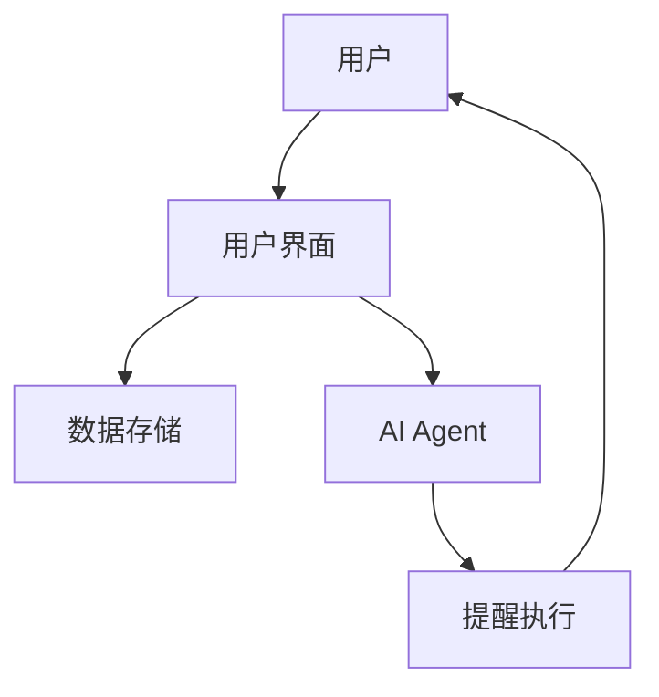
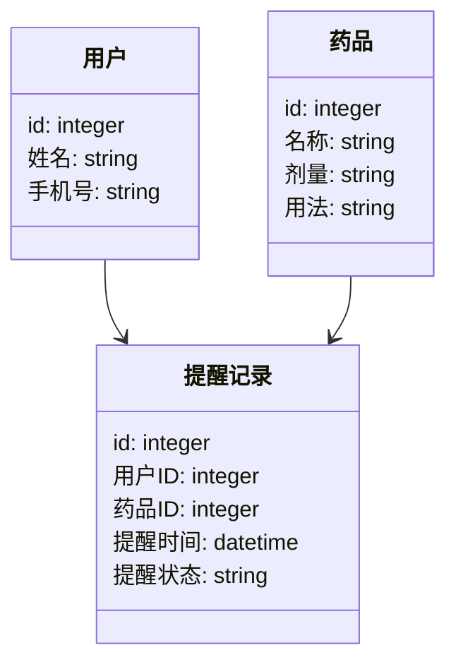
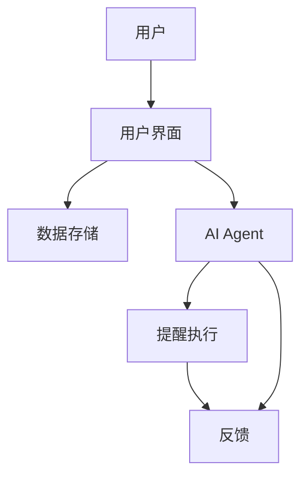

                 


```markdown
# 智能药箱：AI Agent的用药管理与提醒系统

> 关键词：智能药箱, AI Agent, 用药管理, 提醒系统, 系统设计, 算法实现, 智能健康

> 摘要：本文详细探讨了智能药箱在AI Agent技术下的用药管理与提醒系统的实现。从背景介绍到核心概念，从算法原理到系统架构设计，从项目实战到最佳实践，全面解析了智能药箱的设计与实现过程。通过本文，读者可以深入了解AI Agent在智能药箱中的应用，掌握系统设计的关键点，学习实际项目中的实现技巧，并获得最佳实践的建议。

---

## 第1章 智能药箱的背景与问题背景

### 1.1 智能药箱的背景

#### 1.1.1 传统药箱的局限性
- 传统药箱的主要功能是存储药品，不具备智能化管理功能。
- 用户需要手动记录药品信息，容易遗忘或混淆。
- 缺乏智能化的提醒功能，容易导致用户漏服或误服药品。

#### 1.1.2 AI Agent的引入与作用
- AI Agent（智能代理）的概念及其在智能药箱中的应用。
- AI Agent通过自然语言处理、机器学习等技术实现智能化的用药管理。
- AI Agent能够主动提醒用户用药时间、剂量，并根据用户反馈优化提醒策略。

#### 1.1.3 智能药箱的发展趋势
- 智能药箱逐渐成为家庭健康管理的重要工具。
- 通过AI Agent技术，智能药箱能够与智能家居、健康监测设备无缝连接。
- 智能药箱将朝着更加智能化、个性化和数据化的方向发展。

### 1.2 用药管理与提醒的必要性

#### 1.2.1 用药管理的重要性
- 正确的用药管理能够确保药物疗效，避免药物滥用和副作用。
- 对于慢性病患者、老年人等群体，用药管理尤为重要。

#### 1.2.2 提醒系统的核心作用
- 提醒系统能够帮助用户按时用药，避免漏服或误服。
- 提醒系统的智能化能够根据用户习惯调整提醒方式和时间。

#### 1.2.3 智能药箱的目标与价值
- 提供智能化的用药管理功能，包括药品存储、提醒、数据分析等。
- 通过AI Agent技术，实现个性化的用药管理方案，提升用户体验。

### 1.3 问题背景与问题描述

#### 1.3.1 当前用药管理的主要问题
- 用户忘记服药，导致病情加重。
- 药品管理混乱，容易混淆药品名称和用法。
- 缺乏个性化的用药提醒服务。

#### 1.3.2 智能药箱解决的核心问题
- 提供智能化的用药提醒服务，确保用户按时用药。
- 实现药品的智能化管理，避免药品混淆和误用。
- 提供数据分析功能，帮助用户和医生了解用药情况。

#### 1.3.3 问题的边界与外延
- 智能药箱的目标用户包括慢性病患者、老年人、需要长期服药的用户等。
- 系统的核心功能包括药品存储、提醒、数据分析等。
- 边界包括不涉及药品购买、配送等环节。

### 1.4 核心概念与系统结构

#### 1.4.1 AI Agent的核心概念
- AI Agent的定义：智能代理是一种能够感知环境并主动采取行动以实现目标的智能系统。
- AI Agent的核心原理：通过感知输入信息，进行分析、推理，并采取相应的行动。

#### 1.4.2 智能药箱的系统组成
- 用户界面：用户与系统交互的界面，支持输入和查看信息。
- 数据存储：存储药品信息、用户信息、提醒记录等。
- AI Agent：负责分析数据，生成提醒策略并执行提醒。

#### 1.4.3 用药管理与提醒的逻辑结构
- 用户输入药品信息：包括药品名称、剂量、用法、用药时间等。
- AI Agent分析数据：根据用户输入生成提醒策略。
- 提醒系统执行提醒：通过手机、智能手表等方式提醒用户用药。
- 数据分析与优化：根据用户反馈优化提醒策略。

---

## 第2章 AI Agent与智能药箱的核心概念

### 2.1 AI Agent的定义与原理

#### 2.1.1 AI Agent的基本定义
- AI Agent是一种智能系统，能够感知环境、理解用户需求并主动采取行动。
- AI Agent的核心特征包括自主性、反应性、目标导向性和社交能力。

#### 2.1.2 AI Agent的核心原理
- **感知**：通过传感器、用户输入等方式获取环境信息。
- **推理**：利用机器学习算法对信息进行分析和推理，生成相应的行动方案。
- **行动**：根据推理结果采取相应的行动，例如发送提醒、调整用药方案等。

#### 2.1.3 AI Agent与智能药箱的结合
- AI Agent在智能药箱中的具体应用：通过分析用户的用药习惯，优化提醒策略。
- 智能药箱通过AI Agent实现个性化的用药管理。

### 2.2 智能药箱的系统架构

#### 2.2.1 系统的组成模块
- **用户界面模块**：用户与系统交互的界面，支持添加药品、查看提醒记录等功能。
- **数据存储模块**：存储药品信息、用户信息、提醒记录等。
- **AI Agent模块**：负责分析数据，生成提醒策略并执行提醒。
- **提醒执行模块**：通过手机、智能手表等方式发送提醒。

#### 2.2.2 各模块之间的关系
- 用户通过界面输入药品信息，数据存储模块将信息存储起来。
- AI Agent模块定期分析数据，生成提醒策略。
- 提醒执行模块根据提醒策略发送提醒通知。
- 用户反馈提醒结果，AI Agent模块根据反馈优化提醒策略。

#### 2.2.3 系统的整体架构图



### 2.3 核心概念的对比与联系

#### 2.3.1 AI Agent与传统药箱的对比

| 特性         | 传统药箱          | 智能药箱（AI Agent） |
|--------------|-------------------|-----------------------|
| 功能         | 存储药品          | 存储药品 + 智能提醒    |
| 交互方式     | 手动操作          | 自动提醒 + 语音交互    |
| 数据处理     | 无                | 数据分析 + 个性化推荐  |

#### 2.3.2 智能药箱与普通提醒系统的对比

| 特性         | 普通提醒系统      | 智能药箱（AI Agent）  |
|--------------|-------------------|-----------------------|
| 功能         | 提醒              | 提醒 + 药品管理        |
| 数据处理     | 无                | 数据分析 + 个性化推荐  |
| 智能性       | 基于规则          | 基于机器学习          |

#### 2.3.3 核心概念的ER实体关系图

```mermaid
er
    actor 用户 {
        id: integer
        姓名: string
        手机号: string
    }
    entity 药品 {
        id: integer
        名称: string
        剂量: string
        用法: string
        用药时间: datetime
    }
    entity 提醒记录 {
        id: integer
        用户ID: integer
        药品ID: integer
        提醒时间: datetime
        提醒状态: string
    }
    用户 --> 提醒记录
    药品 --> 提醒记录
```

---

## 第3章 智能药箱的算法原理

### 3.1 AI Agent的算法原理

#### 3.1.1 自然语言处理（NLP）
- NLP在智能药箱中的应用：用户通过自然语言输入药品信息。
- 使用Python的`spaCy`库进行实体识别和语义分析。

#### 3.1.2 机器学习算法
- 使用监督学习算法训练AI Agent的提醒策略。
- 使用决策树、随机森林等算法进行用户行为分析。

#### 3.1.3 提醒策略生成
- 基于用户习惯和药品信息生成个性化提醒策略。
- 使用动态规划算法优化提醒时间安排。

### 3.2 算法实现的数学模型

#### 3.2.1 简单的提醒策略生成模型
$$
\text{提醒时间} = \text{用药时间} + \text{用户偏好偏移}
$$

#### 3.2.2 基于用户行为的提醒优化模型
$$
\text{优化参数} = \text{用户反馈} \times \text{历史数据权重}
$$

### 3.3 算法实现的Python代码示例

```python
import pandas as pd
from sklearn.tree import DecisionTreeClassifier

# 示例数据：用户用药记录
data = {
    '用户ID': [1, 2, 3, 4, 5],
    '药品ID': [1, 1, 2, 2, 3],
    '用药时间': ['08:00', '08:00', '12:00', '12:00', '18:00'],
    '用户反馈': [1, 1, 0, 0, 1]
}

df = pd.DataFrame(data)

# 训练决策树模型
model = DecisionTreeClassifier()
model.fit(df[['药品ID', '用药时间']], df['用户反馈'])

# 预测新用户反馈
new_data = {
    '药品ID': [4],
    '用药时间': ['12:00']
}
new_df = pd.DataFrame(new_data)
predicted_feedback = model.predict(new_df)
print(predicted_feedback)
```

### 3.4 算法实现的详细讲解

#### 3.4.1 自然语言处理流程
1. 用户通过语音或文本输入药品信息。
2. 使用NLP模型识别药品名称、剂量、用法等信息。
3. 将识别结果存入数据库。

#### 3.4.2 机器学习模型训练
1. 收集用户用药记录和反馈数据。
2. 使用监督学习算法训练模型。
3. 模型生成提醒策略并优化。

#### 3.4.3 提醒策略生成与优化
1. 基于用户习惯生成初步提醒策略。
2. 根据用户反馈优化提醒时间。
3. 动态调整提醒策略以适应用户需求。

---

## 第4章 智能药箱的系统分析与架构设计

### 4.1 系统功能设计

#### 4.1.1 用户管理
- 用户注册与登录
- 用户信息管理

#### 4.1.2 药品管理
- 药品信息录入与管理
- 药品库存管理

#### 4.1.3 提醒管理
- 提醒策略设置
- 提醒记录查询

#### 4.1.4 数据分析
- 用户用药数据分析
- 药品使用情况统计

### 4.2 系统架构设计

#### 4.2.1 领域模型


#### 4.2.2 系统架构图


#### 4.2.3 接口设计
- 用户接口：REST API
- 数据存储接口：数据库连接
- 提醒执行接口：消息队列

### 4.3 系统交互流程

#### 4.3.1 用户登录与药品录入
1. 用户通过界面登录系统。
2. 用户录入药品信息，系统存储到数据库。

#### 4.3.2 AI Agent生成提醒策略
1. AI Agent分析用户用药记录和药品信息。
2. 生成个性化提醒策略并存入数据库。

#### 4.3.3 提醒执行与反馈
1. 提醒执行模块根据策略发送提醒。
2. 用户反馈提醒结果，AI Agent调整策略。

---

## 第5章 智能药箱的项目实战

### 5.1 环境安装与配置

#### 5.1.1 安装Python与相关库
```bash
pip install flask
pip install pandas
pip install scikit-learn
```

#### 5.1.2 数据库选择与安装
- 使用MySQL或MongoDB存储数据。

### 5.2 核心代码实现

#### 5.2.1 用户认证模块
```python
from flask import Flask, request, jsonify
from flask_login import LoginManager

app = Flask(__name__)
login_manager = LoginManager()

@app.route('/login', methods=['POST'])
def login():
    username = request.form.get('username')
    password = request.form.get('password')
    # 这里需要与数据库进行验证
    return jsonify({'status': 'success', 'message': '登录成功'})

if __name__ == '__main__':
    app.run(debug=True)
```

#### 5.2.2 药品管理模块
```python
from flask import Flask, request, jsonify
import sqlite3

app = Flask(__name__)

@app.route('/add_medication', methods=['POST'])
def add_medication():
    data = request.get_json()
    name = data['name']
    dose = data['dose']
    usage = data['usage']
    time = data['time']
    conn = sqlite3.connect('medication.db')
    cursor = conn.cursor()
    cursor.execute('''
        INSERT INTO medications (name, dose, usage, time)
        VALUES (?, ?, ?, ?)
    ''', (name, dose, usage, time))
    conn.commit()
    conn.close()
    return jsonify({'status': 'success', 'message': '药品添加成功'})

if __name__ == '__main__':
    app.run(debug=True)
```

### 5.3 项目实战的详细讲解

#### 5.3.1 项目环境搭建
- 安装必要的开发工具和库。
- 配置开发环境，例如虚拟环境。

#### 5.3.2 核心功能实现
- 用户认证模块的实现。
- 药品管理模块的实现。
- 提醒功能的实现。

#### 5.3.3 系统测试与优化
- 功能测试：确保所有功能正常运行。
- 性能优化：优化数据库查询、提升系统响应速度。

---

## 第6章 最佳实践与总结

### 6.1 最佳实践

#### 6.1.1 数据隐私保护
- 加强用户数据的隐私保护，确保数据不被泄露。
- 使用加密技术保护敏感数据。

#### 6.1.2 系统维护与更新
- 定期更新系统，修复漏洞。
- 提供用户反馈渠道，持续优化系统功能。

### 6.2 小结与展望

#### 6.2.1 本文总结
- 本文详细探讨了智能药箱的设计与实现，从背景到架构，从算法到项目实战，全面解析了智能药箱的实现过程。

#### 6.2.2 未来展望
- 智能药箱将与更多智能设备集成，实现更全面的健康管理。
- AI Agent技术将进一步优化，提供更智能化的用药管理服务。

### 6.3 注意事项

#### 6.3.1 用户使用注意事项
- 用户应妥善保管账号和密码，防止他人盗用。
- 用户应定期检查药品信息，确保数据准确。

#### 6.3.2 开发者注意事项
- 开发者应遵循软件工程规范，确保代码质量和可维护性。
- 开发者应注重数据安全，防止数据泄露。

### 6.4 拓展阅读

#### 6.4.1 推荐书籍
- 《Python编程：从入门到实践》
- 《机器学习实战》

#### 6.4.2 推荐在线资源
- [Flask官方文档](https://flask-cn.readthedocs.io/zh_CN/latest/)
- [Scikit-learn官方文档](https://scikit-learn.org/stable/documentation.html)

---

## 作者信息

作者：AI天才研究院/AI Genius Institute & 禅与计算机程序设计艺术/Zen And The Art of Computer Programming

---

感谢您的阅读！希望本文能够为您提供智能药箱设计与实现的深入见解，并为您的项目提供有价值的参考！
```

