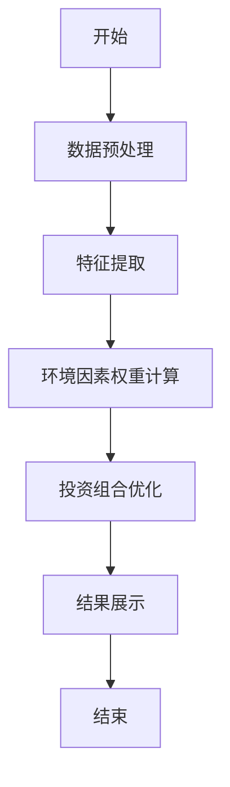
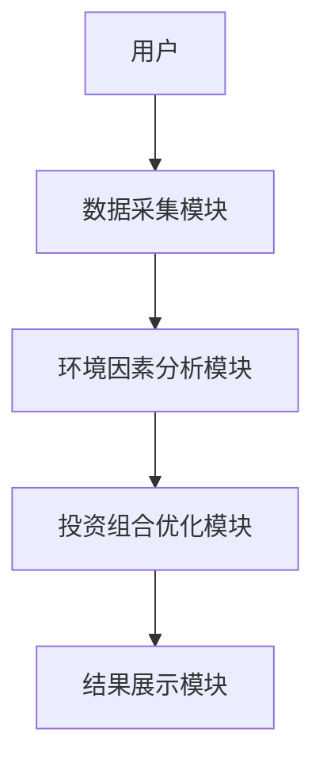
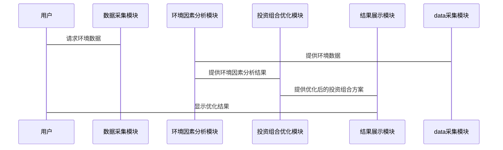

                 


# 构建智能化的个人投资组合环境因素评估工具

> 关键词：投资组合优化，环境因素评估，智能化工具，机器学习，系统架构设计

> 摘要：本文详细介绍了如何构建一个智能化的个人投资组合环境因素评估工具。通过分析环境因素对投资组合的影响，结合机器学习算法和系统架构设计，提出了一种高效的投资组合优化方法。本文从问题背景、核心概念、算法原理、系统架构到项目实战，全面阐述了该工具的设计与实现过程。

---

# 第一部分: 投资组合环境因素评估工具的背景与意义

## 第1章: 投资组合环境因素评估工具的背景与意义

### 1.1 问题背景与重要性

#### 1.1.1 投资组合管理的复杂性
投资组合管理是一个复杂的系统工程，涉及多种金融资产的配置与优化。投资者需要在风险与收益之间找到最佳平衡点，但市场的波动性和不确定性使得这一过程变得更加复杂。

#### 1.1.2 环境因素对投资决策的影响
环境因素，如经济指标、政策变化、社会事件等，都会对投资组合的收益和风险产生重要影响。传统的投资决策方法往往忽视了这些动态变化的环境因素，导致投资效果不佳。

#### 1.1.3 智能化工具的必要性
随着人工智能和大数据技术的快速发展，智能化工具能够帮助投资者更高效地分析和预测环境因素对投资组合的影响，从而做出更科学的投资决策。

### 1.2 问题描述与目标

#### 1.2.1 投资组合管理中的关键问题
- 如何量化环境因素对投资组合的影响？
- 如何动态调整投资组合以应对环境变化？
- 如何利用智能化算法优化投资组合？

#### 1.2.2 环境因素的多样性与动态性
环境因素包括经济指标（GDP、通货膨胀率）、政策变化（税收调整、监管政策）、社会事件（自然灾害、疫情）等，这些因素具有多样性和动态变化的特点，难以通过传统方法进行预测和分析。

#### 1.2.3 工具的目标与核心功能
- 提供环境因素的量化评估方法
- 实现投资组合的动态优化
- 提供基于机器学习的智能化决策支持

### 1.3 问题解决思路

#### 1.3.1 数据驱动的解决方案
通过收集和分析环境因素数据，利用大数据技术提取关键特征，为投资组合优化提供数据支持。

#### 1.3.2 智能化算法的应用
采用机器学习算法（如回归分析、随机森林、神经网络等）对环境因素进行预测和评估，为投资组合优化提供科学依据。

#### 1.3.3 人机协同的优化策略
结合人类专家的经验和机器学习模型的预测结果，实现人机协同的投资决策优化。

### 1.4 界限与外延

#### 1.4.1 工具的适用范围
- 适用于个人投资者和机构投资者
- 支持多种类型的金融资产（股票、债券、基金等）
- 适用于不同市场环境下的投资组合优化

#### 1.4.2 环境因素的边界定义
- 宏观环境因素（经济、政策、社会）
- 行业环境因素（行业政策、竞争格局）
- 微观环境因素（企业基本面、财务状况）

#### 1.4.3 投资组合优化的数学模型
投资组合优化可以通过数学模型（如均值-方差模型）实现，目标是在给定风险水平下最大化收益，或在给定收益下最小化风险。

### 1.5 核心概念与组成要素

#### 1.5.1 投资组合的核心要素
- 资产配置（资产种类、权重）
- 风险与收益的平衡
- 动态调整策略

#### 1.5.2 环境因素的分类与特征
- 宏观环境：经济指标、政策变化
- 行业环境：行业政策、竞争格局
- 微观环境：企业基本面、财务状况

#### 1.5.3 工具的系统架构组成
- 数据采集模块
- 环境因素分析模块
- 投资组合优化模块
- 结果展示与决策支持模块

---

# 第二部分: 环境因素评估工具的核心概念与联系

## 第2章: 环境因素评估工具的核心原理

### 2.1 核心概念原理

#### 2.1.1 环境因素的量化方法
- 通过标准化处理将环境因素转化为可量化的指标
- 使用因子分析方法提取关键环境因素

#### 2.1.2 投资组合优化的数学模型
- 均值-方差模型：$$\text{目标函数} = \min \sigma^2 \quad \text{在} \quad \mathbb{E}[r] \text{固定}$$
- 多目标优化模型：$$\max \mathbb{E}[r] - \lambda \sigma^2$$

#### 2.1.3 智能化算法的基本原理
- 机器学习算法（如随机森林、XGBoost）用于环境因素预测
- 聚类分析用于识别环境因素的相似性

### 2.2 环境因素与投资组合的关系

#### 2.2.1 环境因素对投资组合的影响
- 经济衰退可能导致股票收益下降
- 政策变化可能影响债券收益率

#### 2.2.2 不同环境因素的权重分配
- 根据历史数据计算环境因素的重要性，确定权重

#### 2.2.3 环境因素的动态变化与预测
- 使用时间序列模型（如ARIMA）预测环境因素的变化趋势

### 2.3 核心概念属性对比表

| 属性 | 环境因素 | 投资组合 |
|------|---------|----------|
| 定义 | 影响投资决策的外部条件 | 一组金融资产的组合 |
| 类型 | 经济、政治、社会等 | 股票、债券、基金等 |
| 影响 | 动态变化，影响收益与风险 | 优化收益与风险的平衡 |
| 量化 | 通过指标量化评估 | 通过数学模型优化 |

### 2.4 系统架构ER实体关系图

```mermaid
er
  %% 环境因素评估工具的实体关系图
  环境因素实体 --> 投资组合实体
  环境因素实体 --> 风险评估实体
  投资组合实体 --> 优化策略实体
  风险评估实体 --> 优化策略实体
```

---

# 第三部分: 环境因素评估工具的算法原理与数学模型

## 第3章: 环境因素评估的算法原理

### 3.1 算法原理概述

#### 3.1.1 数据预处理与特征提取
- 数据清洗：处理缺失值、异常值
- 特征提取：使用主成分分析（PCA）提取关键特征

#### 3.1.2 环境因素的权重计算
- 使用回归分析计算环境因素对投资组合收益的影响权重

#### 3.1.3 投资组合优化的算法选择
- 使用遗传算法优化投资组合的权重分配

### 3.2 算法流程图



### 3.3 算法实现代码

#### 3.3.1 环境因素预测模型

```python
import pandas as pd
from sklearn.ensemble import RandomForestRegressor
from sklearn.metrics import mean_squared_error

# 数据加载与预处理
data = pd.read_csv('environment_factors.csv')
X = data.drop(columns=['target'])
y = data['target']

# 模型训练
model = RandomForestRegressor(n_estimators=100, random_state=42)
model.fit(X, y)

# 模型预测
y_pred = model.predict(X)
print(f"预测准确性：{1 - mean_squared_error(y, y_pred)}")
```

#### 3.3.2 投资组合优化模型

```python
import numpy as np
from scipy.optimize import minimize

# 定义目标函数
def portfolio_optimization(weights, returns):
    return np.sum(weights * returns)

# 约束条件
def constraint(weights):
    return np.sum(weights) - 1

# 求解优化问题
initial_weights = np.array([0.2, 0.3, 0.5])
result = minimize(portfolio_optimization, initial_weights, 
                 args=(returns,), method='SLSQP', 
                 constraints={'type': 'eq', 'fun': constraint})

print(f"最优权重：{result.x}")
```

### 3.4 数学模型与公式

#### 3.4.1 线性回归模型
$$ y = \beta_0 + \beta_1 x_1 + \beta_2 x_2 + \cdots + \beta_n x_n + \epsilon $$

#### 3.4.2 随机森林算法
随机森林通过构建多个决策树并集成预测结果，能够有效处理高维数据和非线性关系。

---

# 第四部分: 系统架构设计与实现

## 第4章: 系统架构设计

### 4.1 问题场景介绍
投资者需要一个能够实时分析环境因素并优化投资组合的工具，以应对市场波动和不确定性。

### 4.2 系统功能设计

#### 4.2.1 数据采集模块
- 数据来源：金融市场数据、新闻资讯、政府公告
- 数据类型：时间序列数据、文本数据、结构化数据

#### 4.2.2 环境因素分析模块
- 环境因素提取：从文本数据中提取关键词
- 风险评估：基于环境因素预测市场风险

#### 4.2.3 投资组合优化模块
- 资产配置优化：动态调整资产权重
- 风险控制：设定最大风险承受能力

#### 4.2.4 结果展示与决策支持模块
- 可视化界面：展示环境因素分析结果和投资组合优化方案
- 决策支持：提供基于模型的优化建议

### 4.3 系统架构设计

#### 4.3.1 系统架构图



#### 4.3.2 系统功能模块接口设计
- 数据接口：提供REST API用于数据交互
- 模型接口：提供API用于环境因素预测和投资组合优化

#### 4.3.3 系统交互流程图



---

# 第五部分: 项目实战与应用

## 第5章: 项目实战

### 5.1 环境安装与依赖管理

```bash
pip install pandas scikit-learn matplotlib
```

### 5.2 系统核心实现源代码

#### 5.2.1 数据采集模块

```python
import requests
import json

def get_market_data(api_key):
    url = f"https://api.example.com/market_data?api_key={api_key}"
    response = requests.get(url)
    return response.json()
```

#### 5.2.2 环境因素分析模块

```python
from sklearn.feature_extraction.text import TfidfVectorizer

def analyze_environment_factors(text_data):
    vectorizer = TfidfVectorizer()
    tfidf = vectorizer.fit_transform(text_data)
    return tfidf
```

#### 5.2.3 投资组合优化模块

```python
import numpy as np
from scipy.optimize import minimize

def optimize_portfolio(weights, returns):
    return np.sum(weights * returns)

def constraint(weights):
    return np.sum(weights) - 1

initial_weights = np.array([0.2, 0.3, 0.5])
result = minimize(optimize_portfolio, initial_weights, 
                 args=(returns,), method='SLSQP', 
                 constraints={'type': 'eq', 'fun': constraint})
print(f"最优权重：{result.x}")
```

### 5.3 代码应用解读与分析

#### 5.3.1 数据采集模块解读
- 使用API获取市场数据，包括股票价格、经济指标等
- 数据清洗与预处理，确保数据质量

#### 5.3.2 环境因素分析模块解读
- 使用TF-IDF算法提取文本数据中的关键词，量化环境因素的影响
- 通过主成分分析（PCA）降低维度，提取关键特征

#### 5.3.3 投资组合优化模块解读
- 使用优化算法动态调整资产权重，实现投资组合的最大化收益
- 设置约束条件，确保投资组合的可行性和风险可控

### 5.4 实际案例分析

#### 5.4.1 数据准备
```python
import pandas as pd

data = pd.read_csv('sample_data.csv')
print(data.head())
```

#### 5.4.2 环境因素分析
```python
from sklearn.ensemble import RandomForestRegressor

model = RandomForestRegressor(n_estimators=100)
model.fit(X, y)
print(model.feature_importances_)
```

#### 5.4.3 投资组合优化
```python
import numpy as np
from scipy.optimize import minimize

def portfolio_optimization(weights, returns):
    return np.sum(weights * returns)

initial_weights = np.array([0.2, 0.3, 0.5])
result = minimize(portfolio_optimization, initial_weights, 
                 args=(returns,), method='SLSQP', 
                 constraints={'type': 'eq', 'fun': constraint})
print(f"最优权重：{result.x}")
```

### 5.5 项目小结

---

# 第六部分: 总结与扩展

## 第6章: 总结与扩展

### 6.1 最佳实践Tips

#### 6.1.1 数据质量的重要性
确保数据的准确性和完整性，避免因数据问题导致模型预测错误

#### 6.1.2 模型调优的技巧
通过交叉验证和网格搜索优化模型参数，提升预测精度

#### 6.1.3 系统架构的扩展性
设计模块化架构，方便未来功能扩展和性能优化

### 6.2 小结

### 6.3 注意事项

#### 6.3.1 数据隐私与安全
保护用户数据隐私，避免数据泄露风险

#### 6.3.2 模型的局限性
环境因素的复杂性和不确定性可能导致模型预测误差

### 6.4 拓展阅读

#### 6.4.1 推荐书籍
- 《投资学》
- 《机器学习实战》

#### 6.4.2 推荐课程
- 《量化投资与金融建模》
- 《机器学习与数据挖掘》

---

# 结语

通过本文的详细阐述，我们了解了构建智能化个人投资组合环境因素评估工具的核心概念、算法原理和系统架构设计。从数据采集到环境因素分析，再到投资组合优化，每一步都需要精确的设计与实现。希望本文能够为投资者和开发者提供有价值的参考，帮助他们更好地应对复杂多变的市场环境。

---

作者：AI天才研究院/AI Genius Institute & 禅与计算机程序设计艺术/Zen And The Art of Computer Programming

