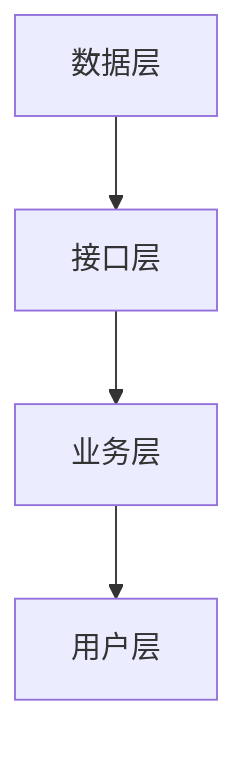
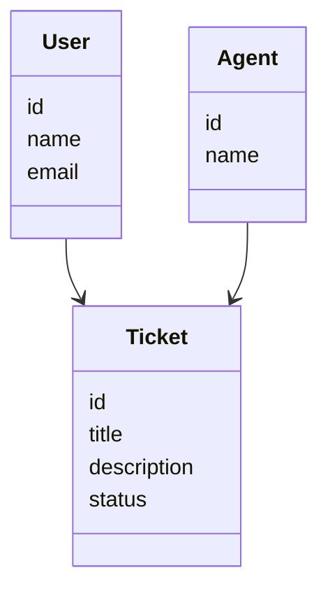
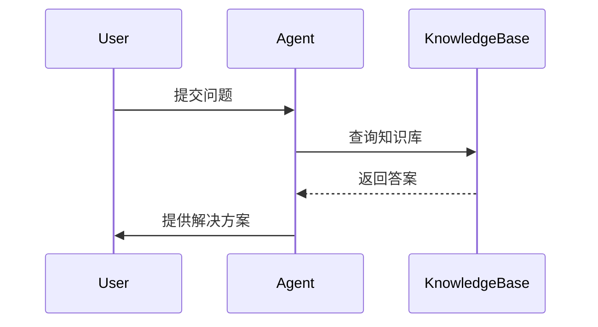

                 


# 选择适合企业的AI Agent平台

> 关键词：AI Agent，企业智能化，技术选型，系统架构，应用场景

> 摘要：随着人工智能技术的快速发展，AI Agent（智能体）逐渐成为企业智能化转型的重要工具。本文从AI Agent的基本概念出发，深入分析其技术原理、系统架构和应用场景，并结合实际案例，为企业选择适合的AI Agent平台提供全面的指导。文章内容涵盖AI Agent的核心概念、技术实现、系统架构、平台选型、实施与运营等多个方面，为企业在AI Agent平台的选择和应用中提供有价值的参考。

---

# 第一部分：AI Agent平台背景与概念

# 第1章：AI Agent平台背景与现状

## 1.1 AI Agent的基本概念

### 1.1.1 什么是AI Agent

AI Agent（智能体）是一种能够感知环境、自主决策并执行任务的智能系统。它能够通过传感器获取外部信息，利用算法进行分析和推理，并通过执行器对外界产生影响。AI Agent的核心在于其自主性和智能性，能够适应复杂环境并完成特定目标。

### 1.1.2 AI Agent的核心特征

- **自主性**：AI Agent能够自主决策，无需人工干预。
- **反应性**：能够实时感知环境并做出反应。
- **目标导向**：通过目标驱动进行决策和行动。
- **学习能力**：能够通过经验优化自身性能。

### 1.1.3 AI Agent与传统AI的区别

传统的AI系统（如专家系统）依赖于预定义的规则和数据，而AI Agent则具有更强的自主性和适应性，能够主动与环境交互并动态调整行为。

## 1.2 企业为什么要选择AI Agent平台

### 1.2.1 企业智能化转型的需求

随着市场竞争的加剧，企业需要通过智能化技术提升效率、降低成本并增强客户体验。AI Agent能够帮助企业实现自动化决策、智能客服、流程优化等目标。

### 1.2.2 AI Agent在企业中的应用场景

- **智能客服**：通过自然语言处理技术提供24/7的客户支持。
- **自动化运维**：监控系统状态并自动修复问题。
- **智能推荐**：根据用户行为推荐个性化的产品或服务。
- **供应链优化**：通过实时数据分析优化库存管理和物流调度。

### 1.2.3 企业采用AI Agent的优势

- **提升效率**：通过自动化减少人工干预，提高业务处理速度。
- **增强决策能力**：基于实时数据进行精准决策。
- **降低成本**：减少人力投入并优化资源利用。

## 1.3 当前AI Agent平台的发展现状

### 1.3.1 AI Agent平台的技术进展

近年来，AI Agent技术在自然语言处理、机器学习和知识图谱等领域取得了显著进展，尤其是在深度学习和强化学习算法的应用上。

### 1.3.2 市场上主流的AI Agent平台

目前市场上有许多AI Agent平台，如Rasa、Snips、Microsoft Bot Framework等。这些平台提供了丰富的功能和灵活的部署方式，满足不同企业的需求。

### 1.3.3 企业选择AI Agent平台的挑战

- **技术复杂性**：AI Agent的开发和部署需要较高的技术门槛。
- **数据隐私**：企业需要处理大量敏感数据，数据隐私和安全问题不容忽视。
- **成本问题**：高端AI Agent平台可能需要较高的研发投入和运维成本。

## 1.4 本章小结

本章介绍了AI Agent的基本概念、核心特征以及与传统AI的区别，并分析了企业在智能化转型中选择AI Agent平台的必要性和优势。同时，还探讨了当前AI Agent平台的技术进展和市场现状，以及企业在选择过程中可能面临的挑战。

---

# 第2章：AI Agent平台的核心概念与技术原理

## 2.1 AI Agent的基本原理

### 2.1.1 AI Agent的工作流程

AI Agent的工作流程可以分为感知、决策和执行三个阶段。感知阶段通过传感器获取环境信息，决策阶段基于感知信息进行分析和推理，执行阶段通过执行器对外界产生影响。

### 2.1.2 AI Agent的感知与决策机制

- **感知机制**：通过传感器或API获取外部数据，如文本、图像、语音等。
- **决策机制**：基于感知数据进行分析和推理，选择最优行动方案。

### 2.1.3 AI Agent的执行与反馈机制

AI Agent根据决策结果执行具体行动，并通过反馈机制不断优化自身行为。

## 2.2 AI Agent平台的关键技术

### 2.2.1 自然语言处理技术

自然语言处理（NLP）技术是AI Agent实现人机交互的核心技术，包括文本解析、语义理解等功能。

### 2.2.2 机器学习与深度学习

机器学习和深度学习技术用于训练AI Agent的学习模型，使其能够从数据中自动提取特征并进行预测。

### 2.2.3 知识图谱与推理引擎

知识图谱用于存储和管理领域知识，推理引擎则基于知识图谱进行推理和决策。

## 2.3 AI Agent的算法原理

### 2.3.1 基于规则的AI Agent

基于规则的AI Agent通过预定义的规则进行决策，适用于规则明确且变化较小的场景。

### 2.3.2 基于模型的AI Agent

基于模型的AI Agent通过训练数据构建预测模型，适用于复杂场景下的决策任务。

### 2.3.3 基于强化学习的AI Agent

基于强化学习的AI Agent通过与环境的交互不断优化自身策略，适用于动态变化的复杂环境。

## 2.4 本章小结

本章详细介绍了AI Agent的基本原理和技术实现，包括感知、决策和执行的全过程，以及自然语言处理、机器学习和知识图谱等关键技术。

---

# 第3章：AI Agent平台的技术实现与系统架构

## 3.1 AI Agent平台的系统架构

### 3.1.1 AI Agent平台的分层架构

AI Agent平台通常采用分层架构，包括数据层、接口层、业务层和用户层。

### 3.1.2 数据层：知识库与数据源

数据层负责管理AI Agent所需的数据，包括知识库、训练数据和实时数据。

### 3.1.3 接口层：API与交互协议

接口层负责定义AI Agent与其他系统之间的交互接口和协议。

### 3.1.4 业务层：场景化应用

业务层是AI Agent的具体应用场景，如智能客服、自动化运维等。

### 3.1.5 用户层：人机交互界面

用户层是AI Agent与最终用户的交互界面，包括文本、语音等多种形式。

## 3.2 AI Agent的实现流程

### 3.2.1 数据采集与预处理

数据采集是AI Agent系统的第一步，需要从多种数据源获取数据，并进行清洗和预处理。

### 3.2.2 模型训练与优化

基于预处理后的数据，训练AI Agent的学习模型，并通过优化算法提升模型性能。

### 3.2.3 系统集成与部署

将训练好的模型集成到AI Agent平台中，并部署到实际应用场景中。

## 3.3 系统架构的Mermaid图



## 3.4 本章小结

本章详细介绍了AI Agent平台的技术实现和系统架构，包括分层架构的设计、数据采集与预处理、模型训练与优化以及系统集成与部署的全过程。

---

# 第4章：AI Agent平台的算法原理与数学模型

## 4.1 基于规则的AI Agent

### 4.1.1 规则的定义与实现

基于规则的AI Agent通过预定义的规则进行决策，规则通常以条件-动作（If-Then）的形式表示。

### 4.1.2 规则的匹配与执行

AI Agent通过匹配输入数据与预定义规则，选择最优规则进行执行。

### 4.1.3 规则的优化与扩展

基于规则的AI Agent可以通过规则库的优化和扩展，提升其决策能力。

## 4.2 基于模型的AI Agent

### 4.2.1 概率模型与贝叶斯网络

贝叶斯网络是一种基于概率的推理模型，常用于不确定性场景下的决策。

### 4.2.2 逻辑回归与分类模型

逻辑回归和分类模型用于分类任务，如文本分类、用户画像等。

### 4.2.3 预测模型与决策树

决策树是一种基于树状结构的预测模型，适用于分类和回归任务。

## 4.3 基于强化学习的AI Agent

### 4.3.1 强化学习的基本原理

强化学习通过智能体与环境的交互，学习最优策略以最大化累积奖励。

### 4.3.2 Q-learning算法

Q-learning是一种常见的强化学习算法，通过Q值表记录状态-动作对的期望奖励值。

### 4.3.3 策略梯度算法

策略梯度算法通过优化策略的参数，直接优化策略的期望奖励。

## 4.4 算法实现的Python代码示例

```python
import numpy as np

class QLearning:
    def __init__(self, state_space, action_space, alpha=0.1, gamma=0.9):
        self.state_space = state_space
        self.action_space = action_space
        self.alpha = alpha
        self.gamma = gamma
        self.q_table = np.zeros((state_space, action_space))

    def choose_action(self, state):
        return np.argmax(self.q_table[state])

    def update(self, state, action, reward, next_state):
        self.q_table[state, action] += self.alpha * (reward + self.gamma * np.max(self.q_table[next_state]) - self.q_table[state, action])
```

## 4.5 本章小结

本章详细介绍了AI Agent的三种主要算法原理，包括基于规则的AI Agent、基于模型的AI Agent和基于强化学习的AI Agent，并通过Python代码示例展示了强化学习算法的实现。

---

# 第5章：AI Agent平台的系统分析与架构设计

## 5.1 问题场景介绍

AI Agent平台需要在企业中实现多种场景的应用，如智能客服、自动化运维等。本文以智能客服场景为例，介绍AI Agent平台的系统设计。

## 5.2 系统功能设计

### 5.2.1 领域模型设计

智能客服领域的实体关系模型如下：



### 5.2.2 系统架构设计

AI Agent平台的系统架构设计如下：



### 5.2.3 系统接口设计

AI Agent平台需要与企业现有的系统进行集成，如客户关系管理系统（CRM）和知识库系统。

## 5.3 本章小结

本章通过智能客服场景介绍了AI Agent平台的系统分析与架构设计，包括领域模型设计、系统架构设计和系统接口设计。

---

# 第6章：AI Agent平台的项目实战

## 6.1 环境安装与配置

### 6.1.1 安装Python和相关库

```bash
pip install numpy
pip install scikit-learn
pip install spacy
```

### 6.1.2 安装AI Agent平台

```bash
pip install rasa
```

## 6.2 系统核心实现源代码

### 6.2.1 自然语言处理模块

```python
import spacy

nlp = spacy.load("en_core_web_sm")
doc = nlp("What is the status of my order?")
```

### 6.2.2 机器学习模型训练

```python
from sklearn.feature_extraction.text import TfidfVectorizer
from sklearn.naive_bayes import MultinomialNB

vectorizer = TfidfVectorizer()
model = MultinomialNB()
```

## 6.3 代码应用解读与分析

通过上述代码示例，可以实现基本的自然语言处理和机器学习模型训练功能，为企业提供智能化的客服支持。

## 6.4 实际案例分析

以智能客服场景为例，通过AI Agent平台实现客户问题的自动分类和答案生成。

## 6.5 本章小结

本章通过实际案例分析，展示了AI Agent平台在智能客服场景中的应用，并详细介绍了系统核心实现源代码。

---

# 第7章：AI Agent平台的选择与优化

## 7.1 选择适合企业的AI Agent平台

### 7.1.1 技术选型

企业需要根据自身需求选择适合的AI Agent平台，包括技术栈、功能模块和部署方式。

### 7.1.2 平台评估指标

企业需要从性能、可扩展性、易用性和成本等多个方面对AI Agent平台进行评估。

### 7.1.3 平台对比分析

通过对比市场上主流的AI Agent平台，选择最适合企业需求的平台。

## 7.2 优化现有AI Agent系统

### 7.2.1 系统性能优化

通过算法优化和系统调优提升AI Agent系统的运行效率。

### 7.2.2 系统可扩展性优化

通过模块化设计和微服务架构提升AI Agent系统的可扩展性。

## 7.3 本章小结

本章为企业选择适合的AI Agent平台提供了具体的指导，并提出了优化现有AI Agent系统的建议。

---

# 第8章：AI Agent平台的实施与运营

## 8.1 环境部署与配置

### 8.1.1 系统环境部署

AI Agent平台需要在企业内部服务器或云平台上部署，确保系统的稳定运行。

### 8.1.2 系统配置优化

通过配置优化提升AI Agent平台的性能和安全性。

## 8.2 系统监控与维护

### 8.2.1 系统监控

通过日志监控和性能监控工具实时监控AI Agent平台的运行状态。

### 8.2.2 系统维护

定期更新模型和优化系统，确保AI Agent平台的性能和安全性。

## 8.3 风险管理与应对策略

### 8.3.1 数据隐私风险

企业需要采取加密技术和访问控制措施保护数据隐私。

### 8.3.2 系统故障风险

通过冗余设计和故障切换机制提升系统的容错能力。

## 8.4 本章小结

本章详细介绍了AI Agent平台的实施与运营过程，包括环境部署、系统监控、系统维护和风险管理等方面。

---

# 第9章：总结与展望

## 9.1 本章总结

本文从AI Agent的基本概念出发，详细分析了其技术原理、系统架构和应用场景，并结合实际案例介绍了AI Agent平台的选择与优化、实施与运营过程。

## 9.2 未来展望

随着人工智能技术的不断进步，AI Agent平台将在企业智能化转型中发挥越来越重要的作用。未来，AI Agent平台将更加智能化、个性化和自适应，为企业提供更强大的智能化支持。

---

# 作者：AI天才研究院/AI Genius Institute & 禅与计算机程序设计艺术/Zen And The Art of Computer Programming

---

感谢您的阅读！希望本文能够为企业选择适合的AI Agent平台提供有价值的参考和指导。

