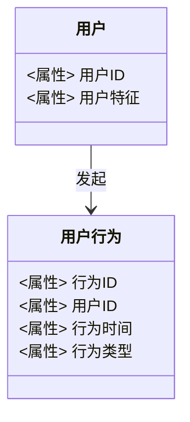
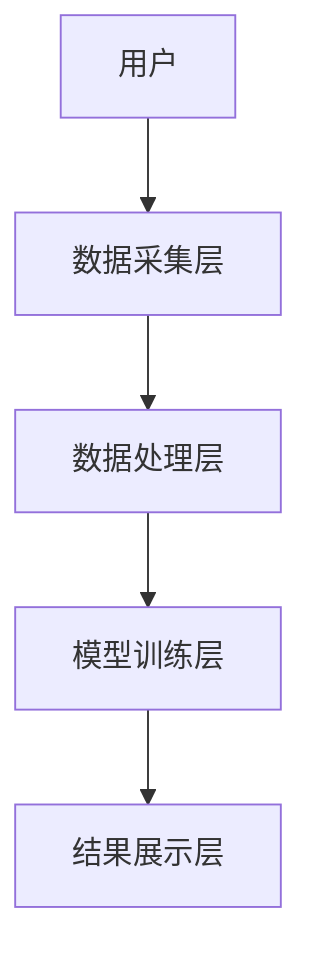

                 


# 金融科技用户行为分析与预测

## 关键词：金融科技，用户行为分析，预测模型，机器学习，行为预测，系统设计

## 摘要：本文从金融科技的发展背景出发，详细分析用户行为分析与预测的核心概念、算法原理、系统设计及项目实战。通过理论与实践相结合的方式，探讨如何利用大数据和机器学习技术，深入理解并预测用户的金融行为，为企业制定精准的营销策略和风险控制提供支持。

---

# 第1章 金融科技用户行为分析与预测的背景介绍

## 1.1 金融科技的发展现状

### 1.1.1 金融科技的定义与特点

金融科技（Financial Technology，简称FinTech）是指利用现代信息技术，如人工智能、大数据、区块链等，对传统金融行业进行创新和优化的新兴领域。其特点包括：

- **技术创新性**：依赖于前沿技术，如AI、大数据、云计算等。
- **服务便捷性**：通过线上平台提供快速、高效的金融服务。
- **数据驱动性**：以数据为基础，通过分析用户行为和市场趋势进行决策。
- **场景多样性**：覆盖支付、借贷、投资、保险等多个金融场景。

### 1.1.2 金融科技的核心技术与发展趋势

- **人工智能**：用于智能投顾、风险评估、客户画像等领域。
- **大数据分析**：通过对海量数据的挖掘，发现用户行为规律和市场趋势。
- **区块链技术**：应用于支付清算、供应链金融等场景，提升信任和效率。
- **云计算**：提供弹性计算资源，支持金融机构的数字化转型。
- **发展趋势**：智能化、个性化、实时化、普惠化。

### 1.1.3 金融科技对用户行为的影响

- **用户行为的变化**：线上支付、移动银行、智能投顾等服务改变了用户的金融行为模式。
- **数据驱动的决策**：金融机构通过分析用户行为数据，提供更精准的服务。
- **用户体验的提升**：通过技术手段优化用户交互，提升服务满意度。

## 1.2 用户行为分析的重要性

### 1.2.1 用户行为分析的定义与作用

用户行为分析是指通过收集和分析用户在特定场景下的行为数据，揭示用户的偏好、需求和行为模式的过程。在金融科技领域，用户行为分析能够帮助金融机构更好地理解客户，优化服务流程，降低风险。

- **定义**：通过对用户在系统中的操作记录、点击流数据、交易记录等进行分析，挖掘用户行为的规律和特征。
- **作用**：支持精准营销、风险控制、产品优化等。

### 1.2.2 金融科技中用户行为分析的独特性

金融科技用户行为分析的独特性主要体现在以下方面：

- **数据多样性**：包括交易数据、支付数据、社交数据等多源数据。
- **实时性**：金融交易具有时间敏感性，需要实时分析用户行为。
- **安全性**：金融数据涉及用户隐私和资金安全，对数据处理和存储有严格要求。

### 1.2.3 用户行为分析与金融科技的结合

- **精准营销**：通过分析用户行为，识别潜在客户，制定个性化营销策略。
- **风险控制**：通过分析用户行为数据，识别异常行为，防范金融诈骗。
- **产品优化**：通过用户行为数据，优化金融产品的设计和用户体验。

## 1.3 金融科技用户行为分析与预测的框架

### 1.3.1 分析框架的构建

金融科技用户行为分析与预测的框架通常包括以下步骤：

1. **数据采集**：收集用户行为数据，包括点击流数据、交易数据、社交数据等。
2. **数据预处理**：清洗数据，处理缺失值、异常值等。
3. **特征提取**：提取用户行为特征，如频率、时间、偏好等。
4. **模型训练**：利用机器学习算法，建立用户行为预测模型。
5. **模型评估**：通过测试数据，评估模型的准确性和稳定性。
6. **结果应用**：将模型应用于实际业务场景，指导决策。

### 1.3.2 数据来源与处理流程

- **数据来源**：
  - 用户操作日志：记录用户的点击、登录、交易等行为。
  - 交易数据：包括交易时间、金额、交易类型等。
  - 社交数据：用户在社交媒体上的行为数据。
- **处理流程**：
  - 数据清洗：去除无效数据、填充缺失值。
  - 数据转换：将数据转换为适合建模的格式。
  - 特征工程：提取有用的特征，如用户活跃度、交易频率等。

### 1.3.3 分析与预测的步骤

- **分析步骤**：
  - 用户画像：基于行为数据，构建用户画像。
  - 行为模式识别：识别用户的典型行为模式。
- **预测步骤**：
  - 基于历史数据，预测未来用户行为。
  - 结合实时数据，动态调整预测结果。

## 1.4 本章小结

本章从金融科技的发展现状出发，介绍了用户行为分析的重要性及其在金融科技领域的独特性。同时，构建了金融科技用户行为分析与预测的框架，为后续章节的深入分析奠定了基础。

---

# 第2章 核心概念与理论基础

## 2.1 用户行为分析的核心概念

### 2.1.1 用户行为的定义与分类

- **定义**：用户行为是指用户在与系统或服务交互过程中所表现出的各种操作和反应。
- **分类**：
  - **显性行为**：可以直接观测到的行为，如点击、登录、交易等。
  - **隐性行为**：用户未直接表现出来的行为，如注意力分配、情绪变化等。

### 2.1.2 用户行为分析的维度与层次

- **维度**：
  - 时间维度：行为发生的时间点、频率等。
  - 空间维度：行为发生的地理位置、设备类型等。
  - 内容维度：行为涉及的产品、服务、金额等。
- **层次**：
  - 表层行为：可直接观测的行为，如点击、注册。
  - 深层行为：隐藏在表层行为背后的心理、动机等。

### 2.1.3 用户行为分析的工具与方法

- **工具**：
  - 数据采集工具：Google Analytics、Flurry等。
  - 数据分析工具：Python、R、SQL等。
  - 数据可视化工具：Tableau、Power BI等。
- **方法**：
  - 定量分析：统计分析、回归分析等。
  - 定性分析：用户访谈、问卷调查等。

## 2.2 金融科技中的用户行为特征

### 2.2.1 金融科技用户的特征分析

- **用户画像**：
  - 年龄分布：金融科技用户多为年轻人，尤其是Z世代。
  - 性别比例：男性用户略高于女性用户。
  - 收入水平：高收入用户更倾向于使用高端金融服务。
  - 使用习惯：偏好移动端、高频交易用户等。

### 2.2.2 用户行为的时空分布特点

- **时间分布**：
  - 交易高峰时段：通常在工作日的上午和下午。
  - 用户活跃度：周末和节假日用户活跃度较高。
- **空间分布**：
  - 地理位置：一线城市用户更活跃。
  - 设备类型：移动端占比远高于PC端。

### 2.2.3 用户行为的驱动因素

- **内在因素**：
  - 用户需求：如投资理财、便捷支付等。
  - 用户动机：追求收益、厌恶风险等。
- **外在因素**：
  - 市场环境：如经济波动、政策变化等。
  - 产品设计：如用户体验、产品功能等。

## 2.3 用户行为分析与预测的理论基础

### 2.3.1 数据挖掘与机器学习基础

- **数据挖掘**：从大量数据中提取有价值的信息和知识。
- **机器学习**：利用算法训练模型，预测未来行为。

### 2.3.2 统计学与行为科学基础

- **统计学**：用于数据的描述性分析和推断性分析。
- **行为科学**：研究用户的行为模式和决策过程。

### 2.3.3 金融科技中的行为建模

- **行为建模**：通过数学模型描述和预测用户行为。
- **模型类型**：
  - 回归模型：用于预测连续型变量。
  - 分类模型：用于预测分类变量。

## 2.4 核心概念与联系

### 2.4.1 用户行为的ER实体关系图

```mermaid
er
actor: 用户
action: 用户行为
attributes: 行为特征
```

### 2.4.2 用户行为的领域模型类图



## 2.5 本章小结

本章详细介绍了用户行为分析的核心概念和金融科技中的用户行为特征，并从理论基础角度探讨了用户行为分析与预测的实现路径。

---

# 第3章 用户行为分析的算法原理

## 3.1 常见的用户行为分析算法

### 3.1.1 回归分析

- **线性回归**：
  - 模型：$y = \beta_0 + \beta_1x + \epsilon$
  - 用途：预测连续型变量，如用户留存率。

### 3.1.2 聚类分析

- **K-means聚类**：
  - 步骤：数据预处理、特征提取、聚类中心初始化、迭代计算。
  - 代码示例：
    ```python
    from sklearn.cluster import KMeans
    model = KMeans(n_clusters=3, random_state=0)
    model.fit(X)
    ```
  - 用途：将用户分为不同的群体，如高价值用户、普通用户等。

### 3.1.3 分类算法

- **决策树分类**：
  - 算法：ID3、C4.5、CART等。
  - 代码示例：
    ```python
    from sklearn.tree import DecisionTreeClassifier
    model = DecisionTreeClassifier()
    model.fit(X, y)
    ```

## 3.2 算法原理与实现

### 3.2.1 回归分析的数学模型

- **线性回归的最小二乘法**：
  - 目标函数：$\min \sum_{i=1}^n (y_i - (\beta_0 + \beta_1x_i))^2$
  - 解法：通过求导找到$\beta_0$和$\beta_1$的最优解。

### 3.2.2 聚类分析的实现步骤

- **步骤**：
  1. 数据预处理：标准化或归一化。
  2. 特征提取：选择影响聚类效果的关键特征。
  3. 聚类中心初始化：随机选择初始聚类中心。
  4. 迭代计算：计算每个样本到聚类中心的距离，更新聚类中心。
  5. 模型评估：计算聚类结果的纯度和轮廓系数。

### 3.2.3 分类算法的实现细节

- **决策树的实现**：
  - 基于信息增益或基尼指数选择最优特征分裂。
  - 使用交叉验证评估模型性能。

## 3.3 算法选择与优化

### 3.3.1 算法选择的依据

- **数据类型**：连续型数据选择回归算法，分类数据选择分类算法。
- **数据规模**：大数据量选择高效的算法，如随机森林。
- **模型解释性**：需要解释性选择决策树，不需解释性选择神经网络。

### 3.3.2 模型优化策略

- **参数调优**：使用网格搜索或随机搜索优化模型参数。
- **特征选择**：去除冗余特征，提升模型性能。
- **模型集成**：使用投票法、堆叠法等提升模型的泛化能力。

## 3.4 本章小结

本章详细介绍了用户行为分析中常用的回归、聚类和分类算法，并从数学模型和代码实现的角度探讨了这些算法的原理和优化策略。

---

# 第4章 金融科技用户行为预测模型的构建

## 4.1 数据预处理与特征工程

### 4.1.1 数据清洗

- **处理缺失值**：删除或填充缺失值。
- **去除异常值**：使用箱线图或Z-score方法检测异常值。

### 4.1.2 特征提取

- **文本特征提取**：使用TF-IDF提取关键词。
- **数值特征提取**：标准化或归一化处理。

## 4.2 模型训练与评估

### 4.2.1 模型训练

- **训练步骤**：
  1. 数据分割：将数据划分为训练集和测试集。
  2. 模型训练：使用训练数据训练预测模型。
  3. 模型评估：使用测试数据评估模型性能。

### 4.2.2 模型评估

- **评估指标**：
  - 分类模型：准确率、召回率、F1值。
  - 回归模型：均方误差（MSE）、平均绝对误差（MAE）。

## 4.3 模型优化与部署

### 4.3.1 模型优化

- **超参数调优**：使用网格搜索或随机搜索优化模型参数。
- **模型融合**：使用集成学习提升模型性能。

### 4.3.2 模型部署

- **部署流程**：
  1. 将模型封装成API接口。
  2. 集成到现有系统中。
  3. 监控模型性能，及时优化。

## 4.4 本章小结

本章详细探讨了金融科技用户行为预测模型的构建过程，包括数据预处理、特征工程、模型训练与优化，并讨论了模型部署的相关问题。

---

# 第5章 金融科技用户行为分析与预测的系统设计

## 5.1 系统架构设计

### 5.1.1 分层架构

- **数据层**：数据采集、存储和预处理。
- **计算层**：模型训练、特征提取。
- **应用层**：用户行为分析、预测结果展示。

### 5.1.2 系统架构图



## 5.2 接口设计与交互流程

### 5.2.1 系统接口设计

- **API接口**：
  - 数据接口：提供数据采集和存储接口。
  - 模型接口：提供行为分析和预测接口。

### 5.2.2 交互流程

- **用户登录**：用户通过身份验证进入系统。
- **数据采集**：系统记录用户的操作行为。
- **行为分析**：系统对用户行为进行实时分析。
- **结果展示**：系统将分析结果以可视化形式展示给用户。

## 5.3 系统实现细节

### 5.3.1 数据库设计

- **数据库选型**：根据数据量选择关系型数据库或NoSQL数据库。
- **表结构设计**：
  - 用户表：存储用户基本信息。
  - 行为表：存储用户行为记录。

### 5.3.2 系统功能模块

- **数据采集模块**：负责采集用户行为数据。
- **数据分析模块**：负责对数据进行清洗、特征提取和建模。
- **结果展示模块**：负责将分析结果以图表形式展示。

## 5.4 本章小结

本章从系统设计的角度，探讨了金融科技用户行为分析与预测的实现方案，包括系统架构设计、接口设计、数据库设计和功能模块实现。

---

# 第6章 项目实战：金融科技用户行为分析与预测

## 6.1 环境安装与配置

### 6.1.1 开发环境

- **操作系统**：Windows/Mac/Linux。
- **开发工具**：PyCharm、Jupyter Notebook。
- **依赖库安装**：
  ```bash
  pip install numpy pandas scikit-learn matplotlib
  ```

### 6.1.2 数据集准备

- **数据来源**：
  - 交易数据：CSV格式，包括交易时间、金额、用户ID等。
  - 行为数据：JSON格式，包括用户点击流数据。

## 6.2 核心代码实现

### 6.2.1 数据预处理代码

```python
import pandas as pd
import numpy as np

# 读取数据
data = pd.read_csv('user_behavior.csv')

# 处理缺失值
data = data.dropna()

# 删除异常值
 outliers = data[data['amount'] > data['amount'].mean() + 3 * data['amount'].std()]
 data_clean = data[~data.index.isin(outliers.index)]
```

### 6.2.2 特征提取代码

```python
from sklearn.preprocessing import StandardScaler

# 标准化处理
scaler = StandardScaler()
X = scaler.fit_transform(data_clean.drop('label', axis=1))
y = data_clean['label']
```

### 6.2.3 模型训练代码

```python
from sklearn.tree import DecisionTreeClassifier
from sklearn.metrics import accuracy_score

# 训练模型
model = DecisionTreeClassifier()
model.fit(X, y)

# 预测结果
y_pred = model.predict(X)
print("准确率：", accuracy_score(y, y_pred))
```

## 6.3 项目总结与优化

### 6.3.1 项目总结

- **项目成果**：成功构建了用户行为分析与预测模型。
- **项目经验**：数据预处理和特征工程对模型性能影响较大。

### 6.3.2 模型优化建议

- **特征优化**：引入更多特征，如用户社交网络数据。
- **模型优化**：尝试使用其他算法，如随机森林、梯度提升树。

## 6.4 本章小结

本章通过一个实际的项目案例，详细展示了金融科技用户行为分析与预测的实现过程，包括环境配置、数据处理、模型训练和结果分析。

---

# 第7章 总结与展望

## 7.1 总结

本文从金融科技的发展背景出发，详细探讨了用户行为分析与预测的核心概念、算法原理、系统设计及项目实现。通过对用户行为数据的深入分析，构建了用户行为预测模型，为金融机构提供了理论支持和实践指导。

## 7.2 金融科技用户行为分析的未来展望

- **技术进步**：随着AI和大数据技术的不断发展，用户行为分析将更加精准和实时。
- **应用场景扩展**：用户行为分析将应用于更多金融场景，如智能投顾、风险管理等。
- **数据隐私保护**：随着数据隐私法规的完善，用户行为分析需要更加注重数据安全和隐私保护。

## 7.3 本章小结

本章总结了全文的主要内容，并对金融科技用户行为分析的未来发展方向进行了展望。

---

# 作者：AI天才研究院/AI Genius Institute & 禅与计算机程序设计艺术 /Zen And The Art of Computer Programming

