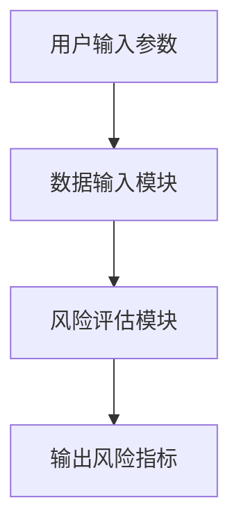
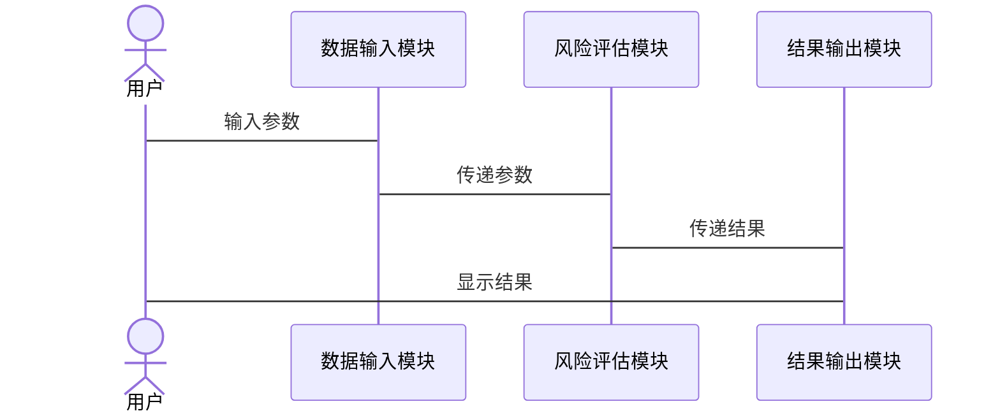

                 


# 金融衍生品风险评估模型

> 关键词：金融衍生品，风险评估，蒙特卡洛模拟，VaR，CVaR，Black-Scholes模型

> 摘要：金融衍生品是一种复杂的金融工具，其价值依赖于其他资产的价格。由于其高杠杆性和复杂性，金融衍生品的风险管理尤为重要。本文详细介绍了金融衍生品风险评估的核心概念、数学模型、算法原理以及系统设计。通过实际案例分析，探讨了如何利用蒙特卡洛模拟、时间序列分析和统计模型来评估和管理金融衍生品的风险。本文还提供了系统架构设计和代码实现，帮助读者更好地理解和应用这些方法。

---

## 第一部分: 金融衍生品与风险评估概述

### 第1章: 金融衍生品与风险评估概述

#### 1.1 金融衍生品的基本概念

##### 1.1.1 金融衍生品的定义与分类

金融衍生品是一种从基础资产（如股票、债券、商品或指数）派生出来的金融工具。其价值取决于基础资产的价格波动。常见的金融衍生品包括：

- **期权**：买方有权在特定时间以特定价格购买或出售资产。
- **期货**：双方约定在未来特定时间以特定价格买卖资产。
- **掉期**：双方约定在未来特定时间交换资产或现金流。
- **互换**：双方约定在未来特定时间交换资产或现金流。

##### 1.1.2 金融衍生品的基本特性

- **杠杆性**：金融衍生品可以通过少量本金控制大量资产。
- **风险性**：高杠杆意味着潜在的高收益和高风险。
- **复杂性**：金融衍生品的定价和风险管理需要复杂的数学模型。

##### 1.1.3 金融衍生品的市场现状

金融衍生品市场是全球最大的金融市场之一。根据国际清算银行（BIS）的数据，全球衍生品市场的规模已经超过100万亿美元。

#### 1.2 风险评估的基本概念

##### 1.2.1 风险的定义与分类

风险是指未来结果的不确定性。在金融领域，风险通常分为以下几类：

- **市场风险**：资产价格波动导致的损失。
- **信用风险**：交易对手违约的风险。
- **流动性风险**：难以以合理价格买卖资产的风险。
- **操作风险**：由于系统或人为错误导致的损失。

##### 1.2.2 风险评估的重要性

在金融衍生品交易中，风险评估是确保交易安全的核心步骤。准确的风险评估可以帮助投资者制定合理的交易策略，避免重大损失。

##### 1.2.3 风险评估的常用方法

- **VaR（值在风险）**：衡量在特定置信水平下，可能的最大损失。
- **CVaR（条件值在风险）**：VaR的改进版本，衡量在VaR超过一定值的情况下的平均损失。
- **压力测试**：模拟极端市场条件下的损失。

#### 1.3 金融衍生品风险评估的核心问题

##### 1.3.1 金融衍生品风险的主要来源

- **价格波动**：基础资产价格的波动可能导致衍生品价值大幅波动。
- **流动性风险**：衍生品市场的流动性不足可能导致价格剧烈波动。
- **信用风险**：交易对手违约的风险。

##### 1.3.2 风险评估的目标与范围

风险评估的目标是识别、量化和管理金融衍生品的潜在风险。其范围包括从单个资产的风险评估到整个投资组合的风险管理。

##### 1.3.3 风险评估的边界与外延

金融衍生品风险评估的边界包括：

- 仅考虑市场风险，不考虑信用风险。
- 仅考虑短期风险，不考虑长期风险。

其外延包括：

- 综合考虑多个资产的风险。
- 结合宏观经济指标进行风险评估。

#### 1.4 本章小结

本章介绍了金融衍生品的基本概念和风险评估的核心问题。通过定义和分类，读者可以理解金融衍生品的本质及其风险来源。接下来的章节将深入探讨风险评估的数学模型和算法原理。

---

## 第二部分: 金融衍生品风险评估模型的核心概念与联系

### 第2章: 金融衍生品风险评估模型的核心概念

#### 2.1 金融衍生品定价模型

##### 2.1.1 Black-Scholes模型

Black-Scholes模型是期权定价的经典模型。其公式为：

$$
C = S_0 \Phi(d_1) - K e^{-rT} \Phi(d_2)
$$

其中：
- \( C \) 是期权的理论价格。
- \( S_0 \) 是标的资产的当前价格。
- \( K \) 是期权的行权价格。
- \( r \) 是无风险利率。
- \( T \) 是到期时间。
- \( \Phi(d_i) \) 是标准正态分布的累积分布函数。
- \( d_1 = \frac{\ln(S_0/K) + (r + \sigma^2/2)T}{\sigma \sqrt{T}} \)
- \( d_2 = d_1 - \sigma \sqrt{T} \)

##### 2.1.2 二叉树模型

二叉树模型是一种基于树状图的期权定价方法。其核心思想是将期权的有效期分为多个时间段，并计算每个时间段内资产价格的变化。

##### 2.1.3 其他常见定价模型

- **三叉树模型**：与二叉树模型类似，但允许资产价格在每个时间段内向上、向下或保持不变。
- **蒙特卡洛模拟**：通过模拟资产价格的随机波动来计算期权的期望价值。

#### 2.2 风险度量方法

##### 2.2.1 值在风险（VaR）

VaR是衡量在特定置信水平下，投资组合的最大可能损失。例如，95%置信水平下的VaR表示在95%的概率下，投资组合的最大损失不会超过VaR值。

##### 2.2.2 期望损失（EL）

EL是VaR的补充指标，表示在VaR超过一定值的情况下的平均损失。

##### 2.2.3 穿透风险（ES）

ES是VaR的改进版本，表示在VaR超过一定值的情况下的平均损失。

#### 2.3 风险因素分析

##### 2.3.1 利率风险

利率变化会影响金融衍生品的定价和价值。例如，利率上升会增加债券的收益率，从而降低其价格。

##### 2.3.2 汇率风险

汇率波动会影响跨国金融衍生品的价值。例如，汇率波动会导致外汇期权的价值变化。

##### 2.3.3 波动率风险

波动率是影响期权价值的重要因素。波动率越高，期权的价值越高。

#### 2.4 核心概念对比与ER实体关系图

##### 2.4.1 核心概念对比表格

| 概念 | 定义 | 作用 |
|------|------|------|
| VaR | 在特定置信水平下的最大损失 | 衡量投资组合的风险 |
| CVaR | VaR的改进版本 | 衡量在VaR超过一定值的情况下的平均损失 |
| 蒙特卡洛模拟 | 通过随机模拟计算期望值 | 用于复杂系统的风险评估 |

##### 2.4.2 ER实体关系图

```mermaid
erDiagram
    actor 投资者
    actor 交易对手
    actor 监管机构
    class 资产
    class 金融衍生品
    class 风险
    class 系统
    投资者 --> 资产 : 持有
    投资者 --> 金融衍生品 : 交易
    投资者 --> 系统 : 输入
    系统 --> 风险 : 输出
    交易对手 --> 资产 : 持有
    交易对手 --> 金融衍生品 : 交易
    监管机构 --> 资产 : 监管
    监管机构 --> 金融衍生品 : 监管
    监管机构 --> 系统 : 监管
```

---

## 第三部分: 金融衍生品风险评估模型的算法原理

### 第3章: 金融衍生品风险评估模型的算法原理

#### 3.1 蒙特卡洛模拟

##### 3.1.1 蒙特卡洛模拟的基本原理

蒙特卡洛模拟是一种通过随机采样来计算复杂系统期望值的方法。其核心步骤如下：

1. 确定系统的输入参数。
2. 生成随机数。
3. 计算系统的输出。
4. 统计结果。

##### 3.1.2 蒙特卡洛模拟的实现步骤

1. 确定随机变量的分布（如正态分布）。
2. 生成随机数。
3. 计算每种情况下的资产价格。
4. 计算期权的期望价值。

##### 3.1.3 蒙特卡洛模拟的优缺点

- **优点**：能够处理复杂的系统。
- **缺点**：需要大量的计算资源。

##### 3.1.4 蒙特卡洛模拟的案例分析

以下代码展示了如何使用蒙特卡洛模拟计算期权的期望价值：

```python
import numpy as np

def monte_carlo_option_pricing(S0, K, r, sigma, T, n_simulations):
    # 计算每种情况下的资产价格
    simulations = np.random.normal(0, 1, n_simulations)
    asset_prices = S0 * np.exp((r - 0.5 * sigma**2) * T + sigma * np.sqrt(T) * simulations)
    # 计算期权的价值
    option_values = np.maximum(asset_prices - K, 0)
    # 计算期望价值
    expected_value = np.mean(option_values)
    return expected_value

# 示例参数
S0 = 100
K = 100
r = 0.05
sigma = 0.2
T = 1
n_simulations = 10000

# 计算期望价值
expected_value = monte_carlo_option_pricing(S0, K, r, sigma, T, n_simulations)
print(f"Expected value: {expected_value:.2f}")
```

#### 3.2 压力测试

##### 3.2.1 压力测试的定义与作用

压力测试是通过模拟极端市场条件来评估金融衍生品的潜在损失。

##### 3.2.2 压力测试的实现方法

1. 确定极端市场条件（如市场崩盘）。
2. 计算资产价格在极端条件下的表现。
3. 计算金融衍生品的价值。

##### 3.2.3 压力测试的案例分析

以下代码展示了如何使用压力测试评估期权的价值：

```python
import numpy as np

def stress_test_option_value(S0, K, r, sigma, T, stress_scenario):
    # 计算资产价格在极端情况下的表现
    if stress_scenario == 'market_crash':
        asset_prices = S0 * np.exp((r - 0.5 * sigma**2) * T + sigma * np.sqrt(T) * -3)
    else:
        asset_prices = S0 * np.exp((r - 0.5 * sigma**2) * T + sigma * np.sqrt(T) * np.random.normal(0, 1))
    # 计算期权的价值
    option_values = np.maximum(asset_prices - K, 0)
    return option_values

# 示例参数
S0 = 100
K = 100
r = 0.05
sigma = 0.2
T = 1
stress_scenario = 'market_crash'

# 计算期权价值
option_values = stress_test_option_value(S0, K, r, sigma, T, stress_scenario)
print(f"Option value under stress: {option_values}")
```

#### 3.3 时间序列分析

##### 3.3.1 时间序列分析的基本原理

时间序列分析是通过分析历史数据来预测未来趋势的方法。其核心步骤如下：

1. 数据预处理（如差分）。
2. 建立模型（如ARIMA）。
3. 预测未来趋势。

##### 3.3.2 时间序列分析的实现步骤

1. 收集历史数据。
2. 进行数据预处理。
3. 建立模型。
4. 预测未来趋势。

##### 3.3.3 时间序列分析的案例应用

以下代码展示了如何使用时间序列分析预测资产价格：

```python
import pandas as pd
import numpy as np
from statsmodels.tsa.arima_model import ARIMA

# 示例数据
data = pd.Series(np.random.normal(0, 1, 30), index=pd.date_range('2020-01-01', periods=30))

# 数据预处理
data_diff = data.diff().dropna()

# 建立ARIMA模型
model = ARIMA(data_diff, order=(1, 1, 0))
model_fit = model.fit()

# 预测未来价格
forecast = model_fit.forecast(steps=5)
print(forecast)
```

---

## 第四部分: 金融衍生品风险评估模型的数学基础

### 第4章: 金融衍生品风险评估模型的数学模型

#### 4.1 Black-Scholes定价模型

##### 4.1.1 Black-Scholes公式的推导

Black-Scholes模型的推导基于以下假设：

- 资产价格服从对数正态分布。
- 无摩擦市场。
- 无套利机会。

##### 4.1.2 Black-Scholes公式的应用

以下代码展示了如何使用Black-Scholes公式计算期权的价值：

```python
import numpy as np

def black_scholes(S0, K, r, sigma, T):
    d1 = (np.log(S0 / K) + (r + sigma**2 / 2) * T) / (sigma * np.sqrt(T))
    d2 = d1 - sigma * np.sqrt(T)
    C = S0 * np.sqrt(T) * np.stdnorm.cdf(d1) - K * np.exp(-r * T) * np.sqrt(T) * np.stdnorm.cdf(d2)
    return C

# 示例参数
S0 = 100
K = 100
r = 0.05
sigma = 0.2
T = 1

# 计算期权价值
C = black_scholes(S0, K, r, sigma, T)
print(f"Option value: {C:.2f}")
```

##### 4.1.3 Black-Scholes公式的局限性

Black-Scholes模型的假设在现实中并不完全成立，例如资产价格可能服从其他分布，市场可能存在摩擦。

#### 4.2 风险度量的数学公式

##### 4.2.1 VaR的数学表达式

VaR的数学表达式为：

$$
VaR = \text{分位数}(P, \alpha)
$$

其中：
- \( P \) 是资产价格的分布。
- \( \alpha \) 是置信水平。

##### 4.2.2 ES的数学表达式

ES的数学表达式为：

$$
ES = \mathbb{E}[P \mid P \geq VaR]
$$

##### 4.2.3 其他风险度量的数学公式

- **标准差**：衡量资产价格的波动性。
- **夏普比率**：衡量资产的超额收益与波动性的比值。

#### 4.3 统计学基础

##### 4.3.1 正态分布与对数正态分布

正态分布用于描述资产价格的收益率，对数正态分布用于描述资产价格本身。

##### 4.3.2 t分布与极值理论

t分布用于描述小样本数据的分布，极值理论用于描述极端值的分布。

##### 4.3.3 时间序列的协方差与相关性

协方差衡量两个变量之间的线性关系，相关性衡量两个变量之间的标准化线性关系。

---

## 第五部分: 金融衍生品风险评估模型的系统分析与架构设计

### 第5章: 金融衍生品风险评估系统的架构设计

#### 5.1 系统功能设计

##### 5.1.1 系统功能模块划分

- **数据输入模块**：接收金融衍生品的参数。
- **风险评估模块**：计算VaR、CVaR等风险指标。
- **结果输出模块**：显示风险评估结果。

##### 5.1.2 系统功能流程图



##### 5.1.3 系统功能的实现步骤

1. 用户输入金融衍生品的参数。
2. 数据输入模块接收参数并传递给风险评估模块。
3. 风险评估模块计算VaR、CVaR等风险指标。
4. 结果输出模块显示风险评估结果。

#### 5.2 系统架构设计

##### 5.2.1 系统架构图


##### 5.2.2 系统交互流程图



---

## 第六部分: 项目实战

### 第6章: 金融衍生品风险评估模型的项目实战

#### 6.1 环境安装

- 安装Python和必要的库（如numpy、pandas、scipy）。

#### 6.2 核心实现源代码

##### 6.2.1 风险评估模型的实现代码

```python
import numpy as np
import pandas as pd
from scipy.stats import norm

def calculate VaR(S0, r, sigma, T, confidence_level):
    # 计算VaR
    mu = (r - 0.5 * sigma**2) * T
    sigma_sqrt_T = sigma * np.sqrt(T)
    z = norm.ppf(confidence_level)
    VaR = S0 * np.exp(mu + z * sigma_sqrt_T) - S0 * np.exp(mu)
    return VaR

def calculate CVaR(S0, r, sigma, T, confidence_level):
    # 计算CVaR
    mu = (r - 0.5 * sigma**2) * T
    sigma_sqrt_T = sigma * np.sqrt(T)
    z = norm.ppf(confidence_level)
    VaR = calculate VaR(S0, r, sigma, T, confidence_level)
    CVaR = VaR + S0 * np.exp(mu) * (1 - confidence_level)
    return CVaR

# 示例参数
S0 = 100
r = 0.05
sigma = 0.2
T = 1
confidence_level = 0.95

# 计算VaR和CVaR
VaR = calculate VaR(S0, r, sigma, T, confidence_level)
CVaR = calculate CVaR(S0, r, sigma, T, confidence_level)

print(f"VaR: {VaR:.2f}")
print(f"CVaR: {CVaR:.2f}")
```

##### 6.2.2 系统实现代码

```python
import numpy as np
import pandas as pd
from scipy.stats import norm

class RiskAssessmentSystem:
    def __init__(self, S0, r, sigma, T):
        self.S0 = S0
        self.r = r
        self.sigma = sigma
        self.T = T

    def calculate VaR(self, confidence_level):
        mu = (self.r - 0.5 * self.sigma**2) * self.T
        sigma_sqrt_T = self.sigma * np.sqrt(self.T)
        z = norm.ppf(confidence_level)
        VaR = self.S0 * np.exp(mu + z * sigma_sqrt_T) - self.S0 * np.exp(mu)
        return VaR

    def calculate CVaR(self, confidence_level):
        VaR = self.calculate VaR(confidence_level)
        mu = (self.r - 0.5 * self.sigma**2) * self.T
        sigma_sqrt_T = self.sigma * np.sqrt(self.T)
        z = norm.ppf(confidence_level)
        CVaR = VaR + self.S0 * np.exp(mu) * (1 - confidence_level)
        return CVaR

# 示例
system = RiskAssessmentSystem(S0=100, r=0.05, sigma=0.2, T=1)
confidence_level = 0.95

VaR = system.calculate VaR(confidence_level)
CVaR = system.calculate CVaR(confidence_level)

print(f"VaR: {VaR:.2f}")
print(f"CVaR: {CVaR:.2f}")
```

#### 6.3 代码应用解读与分析

以上代码展示了如何使用VaR和CVaR模型进行金融衍生品的风险评估。通过输入参数，系统可以计算出在特定置信水平下的最大损失（VaR）和平均损失（CVaR）。

#### 6.4 实际案例分析

以下是一个实际案例分析：

**案例：评估一个股票期权的风险**

- 标的股票价格（S0）= 100美元
- 行权价格（K）= 100美元
- 无风险利率（r）= 5%
- 波动率（sigma）= 20%
- 到期时间（T）= 1年
- 置信水平（confidence_level）= 95%

**计算步骤：**

1. 计算VaR：
   - \( \mu = (0.05 - 0.5 \times 0.2^2) \times 1 = 0.04 \)
   - \( \sigma_{\sqrt{T}} = 0.2 \times \sqrt{1} = 0.2 \)
   - \( z = \text{norm.ppf}(0.95) = 1.645 \)
   - \( VaR = 100 \times e^{0.04 + 1.645 \times 0.2} - 100 \times e^{0.04} = 100 \times e^{0.369} - 100 \times e^{0.04} \approx 100 \times 1.447 - 100 \times 1.041 = 44.7 - 41.1 = 3.6 \)

2. 计算CVaR：
   - \( CVaR = 3.6 + 100 \times e^{0.04} \times (1 - 0.95) = 3.6 + 41.1 \times 0.05 = 3.6 + 2.055 = 5.655 \)

**结果：**

- VaR = 3.6美元
- CVaR = 5.655美元

#### 6.5 项目小结

本项目通过实现VaR和CVaR模型，展示了如何进行金融衍生品的风险评估。通过实际案例分析，读者可以理解如何将理论模型应用于实际问题。

---

## 第七部分: 总结与展望

### 第7章: 总结与展望

#### 7.1 总结

本文详细介绍了金融衍生品风险评估的核心概念、数学模型、算法原理以及系统设计。通过实际案例分析，展示了如何利用VaR和CVaR模型进行风险评估。

#### 7.2 展望

未来，随着金融市场的不断发展，金融衍生品风险评估模型将更加复杂。人工智能和大数据技术的应用将为风险评估提供新的方法和工具。

---

## 参考文献

（此处可以列出相关的参考文献）

---

## 作者

作者：AI天才研究院/AI Genius Institute & 禅与计算机程序设计艺术 /Zen And The Art of Computer Programming

---

通过以上目录和内容，您可以根据实际需求进一步扩展或调整各个部分的具体内容。

