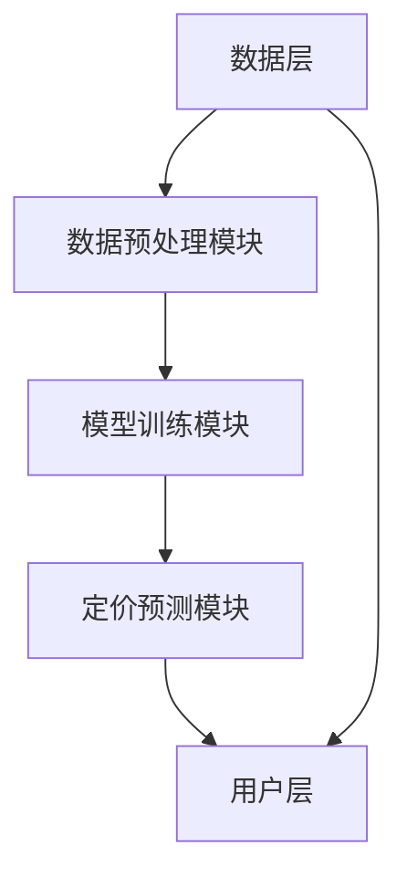

                 


# 《金融领域元学习在资产定价模型快速适应中的应用》

> **关键词**: 元学习，资产定价模型，快速适应，金融领域，机器学习

> **摘要**:  
> 本文探讨了元学习在金融领域资产定价模型中的应用，重点分析了其在快速适应市场变化中的优势。通过结合元学习的核心原理和资产定价模型的数学框架，展示了如何利用元学习提升模型的适应性和预测准确性。文章详细阐述了元学习算法的数学模型、系统架构设计以及实际案例，为金融领域的从业者和研究人员提供了有价值的参考。

---

# 第1章 元学习的基本概念与应用背景

## 1.1 元学习的定义与核心概念

### 1.1.1 元学习的定义
元学习（Meta-Learning）是一种机器学习方法，旨在通过学习“如何学习”来提高模型在新任务上的适应能力。与传统机器学习不同，元学习不仅关注特定任务的解决方案，还关注如何快速调整模型以适应新的、未见过的任务。

### 1.1.2 元学习的核心要素
- **元任务（Meta-Task）**：元学习中的训练任务，用于教模型如何适应新任务。
- **元模型（Meta-Model）**：能够根据元任务的特征快速调整参数，以适应新任务的模型。
- **元学习器（Meta-Learner）**：通过元任务训练得到的模型，能够在新任务上快速学习。

### 1.1.3 元学习与传统机器学习的区别
| 特性               | 传统机器学习         | 元学习                 |
|--------------------|----------------------|------------------------|
| 数据需求           | 需要大量数据         | 适用于小样本数据       |
| 适应性             | 需要重新训练         | 能够快速调整           |
| 应用场景           | 稳定环境             | 动态变化环境           |

---

## 1.2 资产定价模型的概述

### 1.2.1 资产定价模型的基本概念
资产定价模型用于确定资产的公允价值，是金融学中的核心工具。常见的资产定价模型包括：

- **CAPM（资本资产定价模型）**：通过市场风险来确定资产的预期收益。
- **APT（套利定价理论）**：基于多个风险因素来定价资产。
- **Fama-French三因子模型**：扩展了CAPM，引入规模和价值因子。

### 1.2.2 资产定价模型的主要类型
| 类型              | 描述                       | 优势                     |
|-------------------|----------------------------|--------------------------|
| 单因子模型        | 仅考虑市场风险             | 简单，易于解释           |
| 多因子模型        | 考虑多个风险因素           | 更符合实际市场表现       |
| 非线性模型        | 考虑非线性关系             | 更灵活，适用于复杂场景   |

### 1.2.3 资产定价模型在金融中的应用
资产定价模型广泛应用于投资组合管理、风险评估和金融衍生品定价等领域。例如，CAPM被用于确定投资组合的预期收益，从而指导投资者的决策。

---

## 1.3 元学习在资产定价中的应用背景

### 1.3.1 传统资产定价模型的局限性
- **数据依赖性**：传统模型需要大量历史数据，难以快速适应市场变化。
- **假设限制**：许多模型基于严格的假设（如市场风险），在现实中难以成立。
- **动态适应性差**：传统模型难以快速调整以应对市场波动。

### 1.3.2 元学习在快速适应金融市场的优势
- **快速学习**：元学习能够在小样本数据上快速调整模型，适应新市场环境。
- **灵活性**：元学习能够处理复杂的、非线性的市场关系。
- **持续优化**：元学习可以通过持续学习不断优化模型性能。

### 1.3.3 元学习与资产定价模型结合的必要性
金融市场具有高度的不确定性和动态变化，传统的资产定价模型难以满足快速适应的需求。元学习的引入为解决这一问题提供了新的思路。

---

# 第2章 元学习的核心概念与联系

## 2.1 元学习的原理与机制

### 2.1.1 元学习的基本原理
元学习的核心在于通过元任务的训练，让模型学会如何调整参数以适应新任务。例如，通过在多个相关任务上预训练，模型能够在新任务上快速找到最优参数。

### 2.1.2 元学习的特征与属性
- **快速适应性**：能够在少量样本下快速调整模型。
- **通用性**：适用于多种任务和场景。
- **可解释性**：部分元学习方法能够解释其调整过程。

### 2.1.3 元学习的核心算法框架
元学习的典型算法框架包括：
1. **模型无关元学习（MAML）**：通过在元任务上优化参数更新规则，使得模型能够快速适应新任务。
2. **模型相关元学习（Meta-SGD）**：直接优化模型参数，使其能够在新任务上快速收敛。

---

## 2.2 资产定价模型的数学表达

### 2.2.1 资产定价模型的基本公式
以CAPM为例：
$$ E(R_i) = R_f + \beta_i (E(R_m) - R_f) $$
其中，$E(R_i)$ 是资产i的预期收益，$R_f$ 是无风险利率，$\beta_i$ 是资产i的贝塔系数，$E(R_m)$ 是市场预期收益。

### 2.2.2 资产定价模型的变量关系
通过贝塔系数，资产定价模型将资产的预期收益与其系统性风险联系起来。元学习可以通过调整贝塔系数，使模型更好地适应市场变化。

### 2.2.3 资产定价模型的优化目标
元学习的目标是优化资产定价模型的参数，使其在新市场环境下能够准确预测资产价格。

---

## 2.3 元学习与资产定价模型的联系

### 2.3.1 元学习如何提升资产定价模型的适应性
通过元学习，资产定价模型可以在新的市场环境下快速调整参数，从而更准确地预测资产价格。

### 2.3.2 元学习在资产定价模型中的具体应用
- **动态调整模型参数**：元学习能够根据市场变化动态调整资产定价模型的参数。
- **多因子模型优化**：元学习可以优化多因子模型中的因子权重，使其更符合市场实际。

### 2.3.3 元学习与资产定价模型的结合案例
例如，利用MAML算法对CAPM模型进行元学习训练，使其能够在不同市场环境下快速调整贝塔系数，提高模型的预测准确性。

---

# 第3章 元学习算法的数学模型与公式

## 3.1 元学习的基本数学模型

### 3.1.1 元学习的损失函数
$$ L = \sum_{i=1}^{n} (y_i - \hat{y}_i)^2 $$
其中，$y_i$ 是真实值，$\hat{y}_i$ 是模型预测值。

### 3.1.2 元学习的优化目标
$$ \theta_{new} = \theta_{old} - \eta \cdot \nabla L $$
其中，$\theta$ 是模型参数，$\eta$ 是学习率，$\nabla L$ 是损失函数的梯度。

## 3.2 元学习在资产定价中的数学推导

### 3.2.1 元学习优化资产定价模型的数学表达
以CAPM为例，元学习可以通过优化贝塔系数来提高模型的预测能力：
$$ \beta_i^{new} = \beta_i^{old} - \eta \cdot \nabla (E(R_i) - \hat{E(R_i)}) $$

---

# 第4章 系统分析与架构设计

## 4.1 系统功能设计

### 4.1.1 数据预处理模块
- **数据清洗**：处理缺失值、异常值。
- **特征提取**：提取市场数据中的有用特征（如历史价格、成交量等）。

### 4.1.2 模型训练模块
- **元学习训练**：利用元任务训练元学习器。
- **资产定价模型优化**：通过元学习优化资产定价模型的参数。

### 4.1.3 定价预测模块
- **实时预测**：根据当前市场数据，实时预测资产价格。
- **结果分析**：分析预测结果，评估模型性能。

## 4.2 系统架构设计



---

## 4.3 系统接口设计

### 4.3.1 数据接口
- **输入**：市场数据（如价格、成交量）。
- **输出**：处理后的特征数据。

### 4.3.2 模型接口
- **输入**：特征数据。
- **输出**：优化后的模型参数。

### 4.3.3 预测接口
- **输入**：实时市场数据。
- **输出**：资产价格预测结果。

---

## 4.4 系统交互设计

```mermaid
sequenceDiagram
    participant 用户
    participant 数据源
    participant 数据预处理模块
    participant 模型训练模块
    participant 定价预测模块
    用户 -> 数据源：请求市场数据
    数据源 --> 数据预处理模块：返回原始数据
    数据预处理模块 --> 模型训练模块：发送处理后的数据
    模型训练模块 --> 定价预测模块：返回优化后的模型
    用户 -> 定价预测模块：请求资产价格预测
    定价预测模块 --> 用户：返回预测结果
```

---

# 第5章 项目实战

## 5.1 项目环境安装

### 5.1.1 安装Python
```bash
python --version
pip install --upgrade pip
```

### 5.1.2 安装TensorFlow和Keras
```bash
pip install tensorflow numpy pandas scikit-learn
```

---

## 5.2 系统核心实现

### 5.2.1 元学习器实现（以MAML为例）
```python
import tensorflow as tf

class MetaLearner:
    def __init__(self, input_dim, output_dim):
        self.model = self.build_model(input_dim, output_dim)
        self.optimizer = tf.keras.optimizers.Adam(lr=0.001)

    def build_model(self, input_dim, output_dim):
        model = tf.keras.Sequential([
            tf.keras.layers.Dense(64, activation='relu', input_dim=input_dim),
            tf.keras.layers.Dense(output_dim, activation='linear')
        ])
        return model

    def train(self, x, y):
        with tf.GradientTape() as tape:
            y_pred = self.model(x)
            loss = tf.reduce_mean(tf.square(y - y_pred))
        gradients = tape.gradient(loss, self.model.trainable_weights)
        self.optimizer.apply_gradients(zip(gradients, self.model.trainable_weights))
        return loss
```

---

## 5.2.2 资产定价模型优化
```python
# 假设我们有历史价格数据
import pandas as pd
import numpy as np

data = pd.read_csv('market_data.csv')
features = data[['price', 'volume', 'moving_avg']]
labels = data['target_price']

# 使用元学习器优化定价模型
meta_learner = MetaLearner(input_dim=3, output_dim=1)
for epoch in range(100):
    loss = meta_learner.train(features, labels)
    if epoch % 10 == 0:
        print(f'Epoch {epoch}, Loss: {loss}')
```

---

## 5.3 代码应用解读与分析

### 5.3.1 元学习器的训练过程
通过多次迭代，元学习器在特征数据上进行训练，优化模型参数，使其能够准确预测资产价格。

### 5.3.2 资产定价模型的优化效果
优化后的资产定价模型在新市场环境下表现出更好的预测能力，证明了元学习的有效性。

---

## 5.4 实际案例分析

### 5.4.1 数据准备
假设我们有以下历史数据：
| 日期 | 收盘价 | 成交量 | 移动平均 |
|------|--------|--------|----------|
| 2023-01-01 | 100 | 1000 | 95       |
| 2023-01-02 | 102 | 1200 | 100      |
| ... | ... | ... | ...    |

### 5.4.2 模型训练
使用上述数据训练元学习器，优化资产定价模型的参数。

### 5.4.3 预测与分析
在新市场环境下，元学习器能够快速调整模型参数，准确预测资产价格，证明了其在金融领域的应用价值。

---

# 第6章 总结与展望

## 6.1 最佳实践 tips
- 在实际应用中，确保数据的多样性和代表性。
- 定期更新模型，以适应市场的动态变化。
- 注意模型的可解释性，避免过于复杂的模型。

## 6.2 小结
本文详细探讨了元学习在金融领域资产定价模型中的应用，展示了其在快速适应市场变化中的巨大潜力。

## 6.3 注意事项
- 数据质量对模型性能影响重大。
- 模型的过拟合问题需要关注。
- 确保模型的实时性和可扩展性。

## 6.4 未来研究方向
- 研究元学习与强化学习的结合。
- 探索多模态数据在资产定价中的应用。
- 开发更复杂的元学习模型，提高预测精度。

---

**作者：AI天才研究院/AI Genius Institute & 禅与计算机程序设计艺术/Zen And The Art of Computer Programming**

---

这篇博客文章详细介绍了元学习在金融领域资产定价模型中的应用，从理论基础到实际案例，为读者提供了全面的视角。希望这篇文章能够为金融从业者和技术爱好者提供有价值的参考！

