                 


# 第4章: AI Agent个性化定制的系统架构

## 4.1 系统整体架构设计

### 4.1.1 系统模块划分
系统架构采用模块化设计，主要划分为以下几个核心模块：
- 用户需求收集与分析模块（User Request Collector & Analyzer）
- 定制化参数调整模块（Custom Parameter Tuner）
- 模型推理与输出模块（Model Inference & Output）
- 结果优化与反馈模块（Result Optimizer & Feedback）

### 4.1.2 模块之间的关系
模块之间的交互遵循以下逻辑流程：
1. 用户需求收集模块接收用户的输入请求。
2. 用户需求分析模块对请求进行解析和分类。
3. 定制化参数调整模块根据用户需求调整模型参数或生成提示模板。
4. 模型推理模块基于调整后的参数进行生成任务。
5. 结果优化模块对输出结果进行质量评估和优化调整。
6. 反馈模块将优化后的结果返回给用户，并收集用户的反馈信息，用于后续的模型优化。

### 4.1.3 系统的可扩展性设计
为了保证系统的可扩展性，我们采用了以下设计：
- 模块化设计：各个功能模块相对独立，便于后续的功能扩展。
- 插件式架构：支持第三方开发者开发并接入新的功能模块或模型。
- 异构模型支持：系统架构允许同时支持多种不同的大语言模型，如GPT、PaLM等。
- 分布式部署：系统可以弹性扩展，支持高并发请求。

## 4.2 系统功能设计

### 4.2.1 用户需求收集与分析模块
#### 功能说明
- 接收用户的自然语言输入请求。
- 解析用户的意图和需求。
- 生成用户画像和需求模型。

#### 核心功能
1. **需求解析**：
   - 使用NLP技术对用户输入进行语义分析。
   - 识别用户的需求类型、关键词和意图。
2. **用户画像生成**：
   - 基于用户的输入生成用户画像。
   - 分析用户的使用习惯和偏好。
3. **需求分类**：
   - 根据预设的分类标准对用户需求进行分类。
   - 匹配合适的模型参数和提示模板。

#### 交互流程
1. 用户输入自然语言请求。
2. 请求被传递到需求收集模块。
3. 模块对请求进行解析和分类。
4. 分析结果被传递到参数调整模块。

### 4.2.2 定制化参数调整模块
#### 功能说明
- 根据用户需求调整模型参数。
- 生成个性化提示模板。
- 管理多个用户的定制化配置。

#### 核心功能
1. **参数调整**：
   - 根据用户需求调整模型的温度（temperature）、top-k等参数。
   - 支持动态调整参数，以优化生成结果的质量和相关性。
2. **提示模板生成**：
   - 基于用户需求生成合适的提示（prompt）。
   - 支持多轮对话和上下文记忆。
3. **配置管理**：
   - 管理不同用户的定制化配置。
   - 支持版本控制和回滚。

#### 实现细节
- 使用可配置的参数管理框架，支持动态修改和保存。
- 提供可视化界面，便于用户和开发者调整参数。
- 提供预设的模板库，支持快速生成个性化提示。

### 4.2.3 模型推理与输出模块
#### 功能说明
- 接收调整后的模型参数和提示模板。
- 调用大语言模型进行生成任务。
- 返回生成的输出结果。

#### 核心功能
1. **模型调用**：
   - 根据不同的需求选择合适的模型。
   - 支持调用本地模型或云服务模型。
2. **生成控制**：
   - 根据参数控制生成的输出长度、风格和语气。
   - 支持中断和重试机制。
3. **输出处理**：
   - 对生成的结果进行初步的质量评估。
   - 提供多种输出格式（文本、JSON等）。

#### 技术实现
- 使用API调用主流的大语言模型（如OpenAI、Anthropic等）。
- 支持本地模型的部署和管理。
- 提供生成结果的缓存和日志记录。

### 4.2.4 结果优化与反馈模块
#### 功能说明
- 对生成的输出结果进行优化。
- 收集用户反馈，用于模型优化。
- 提供结果的可视化展示和分析。

#### 核心功能
1. **结果优化**：
   - 使用后处理技术优化生成结果。
   - 支持多种优化策略（如语言风格调整、内容润色等）。
2. **用户反馈收集**：
   - 收集用户的满意度评分和具体反馈。
   - 分析反馈信息，生成改进建议。
3. **模型优化**：
   - 基于反馈信息优化模型参数。
   - 更新提示模板和模型配置。

#### 技术实现
- 使用NLP工具对生成结果进行优化（如语言风格调整、语法校正）。
- 建立用户反馈分析系统，自动提取关键信息。
- 提供反馈循环机制，持续优化模型表现。

## 4.3 系统架构设计

### 4.3.1 系统架构图


### 4.3.2 系统功能模块类图


### 4.3.3 系统交互序列图


## 4.4 系统接口设计

### 4.4.1 系统接口定义
以下是系统主要接口的定义：

```mermaid
classDiagram
    class 用户需求收集模块 {
        + receiveRequest(request: String) -> requestInfo
        + analyzeRequest(requestInfo: RequestInfo) -> userProfile
    }
    class 用户需求分析模块 {
        + classifyRequest(requestInfo: RequestInfo) -> requestCategory
        + analyzePreferences(userProfile: UserProfile) -> preferences
    }
    class 定制化参数调整模块 {
        + adjustParameters(preferences: Preferences) -> tunedParams
        + generatePrompt(requestCategory: RequestCategory, tunedParams: TunedParams) -> prompt
    }
    class 模型推理模块 {
        + invokeLLM(prompt: String, tunedParams: TunedParams) -> output
    }
    class 结果优化模块 {
        + optimizeOutput(output: String) -> optimizedOutput
        + collectFeedback(feedback: String) -> improvementPlan
    }
```



### 4.4.2 接口调用流程
1. 用户发送请求到用户需求收集模块。
2. 用户需求收集模块解析请求并生成请求信息。
3. 请求信息被传递到用户需求分析模块进行分类和分析。
4. 分析结果被传递到定制化参数调整模块，生成调整后的参数和提示模板。
5. 提示模板和调整后的参数被传递到模型推理模块，生成输出结果。
6. 输出结果被传递到结果优化模块进行优化，并返回给用户。
7. 用户的反馈被收集，用于后续的模型优化。

---

## 4.5 项目实战

### 4.5.1 环境安装
为了运行本系统，需要安装以下工具和库：
- Python 3.8+
- pip
- transformers库
- torch库
- mermaid CLI工具

安装命令：
```bash
pip install transformers torch mermaid-cli
```

### 4.5.2 核心实现代码

#### 用户需求收集模块
```python
class UserRequestCollector:
    def __init__(self):
        self.active = True

    def receive_request(self, request: str) -> dict:
        # 解析请求并生成请求信息
        request_info = {
            'text': request,
            'intent': self._analyze_intent(request),
            'keywords': self._extract_keywords(request)
        }
        return request_info

    def _analyze_intent(self, text: str) -> str:
        # 使用NLP模型分析意图
        pass

    def _extract_keywords(self, text: str) -> list:
        # 提取关键词
        pass
```

#### 用户需求分析模块
```python
class UserAnalyzer:
    def __init__(self):
        self.user_profiles = {}

    def analyze_request(self, request_info: dict) -> dict:
        user_profile = {
            'intent': request_info['intent'],
            'preferences': self._get_preferences(request_info['keywords'])
        }
        return user_profile

    def _get_preferences(self, keywords: list) -> dict:
        # 分析关键词，生成偏好设置
        pass
```

#### 定制化参数调整模块
```python
class ParameterTuner:
    def __init__(self):
        self.tuned_params = {}

    def adjust_parameters(self, preferences: dict) -> dict:
        # 根据偏好调整模型参数
        tuned = {
            'temperature': self._calculate_temperature(preferences),
            'top_k': self._calculate_top_k(preferences)
        }
        return tuned

    def _calculate_temperature(self, prefs: dict) -> float:
        # 根据偏好计算温度参数
        pass

    def _calculate_top_k(self, prefs: dict) -> int:
        # 根据偏好计算top_k参数
        pass
```

#### 模型推理模块
```python
class ModelInferencer:
    def __init__(self):
        self.model = self._init_model()

    def _init_model(self):
        # 初始化大语言模型
        pass

    def generate_response(self, prompt: str, params: dict) -> str:
        # 调用模型生成响应
        pass
```

#### 结果优化模块
```python
class ResultOptimizer:
    def __init__(self):
        self.feedback = {}

    def optimize_output(self, output: str) -> str:
        # 对输出进行优化
        pass

    def collect_feedback(self, feedback: str) -> dict:
        # 收集用户反馈
        pass
```

### 4.5.3 代码应用解读
1. 用户输入请求，例如“帮我写一封邮件”。
2. 用户需求收集模块接收请求并解析意图和关键词。
3. 用户需求分析模块生成用户画像和偏好设置。
4. 定制化参数调整模块根据偏好调整模型参数。
5. 模型推理模块生成初步响应。
6. 结果优化模块优化响应并返回给用户。
7. 用户反馈被收集并用于后续优化。

---

## 4.6 最佳实践 Tips

1. **模块化设计**：确保每个功能模块独立，便于维护和扩展。
2. **可扩展性**：支持多种模型和参数调整策略，满足不同需求。
3. **反馈机制**：建立有效的用户反馈系统，持续优化模型性能。
4. **性能优化**：针对高并发场景进行系统优化，确保响应速度和稳定性。
5. **安全性和隐私保护**：确保用户数据的安全性和隐私性，符合相关法规要求。

---

## 4.7 小结

本章详细介绍了AI Agent个性化定制系统的整体架构设计，包括系统模块划分、功能设计、系统架构图、交互序列图以及接口设计。通过模块化设计和插件式架构，系统具备良好的可扩展性和灵活性。各模块之间协同工作，确保用户需求能够被准确解析和满足，生成高质量的个性化输出结果。在后续章节中，我们将通过实际案例进一步展示系统的设计和实现过程。

