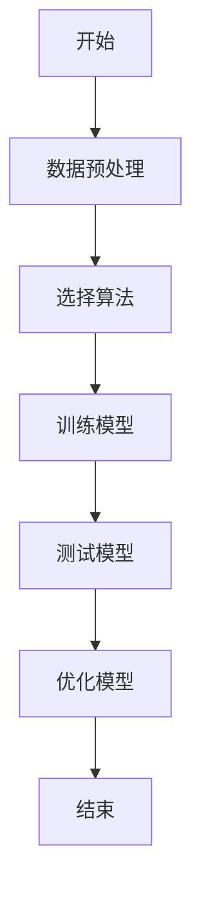
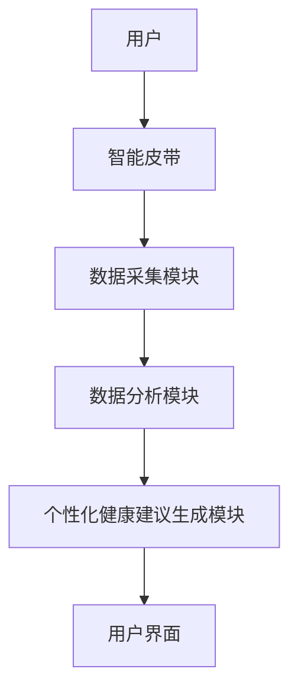

                 


# AI Agent在智能皮带中的饮食习惯监测

> 关键词：AI Agent, 智能皮带, 饮食习惯监测, 算法原理, 系统架构, 项目实战

> 摘要：本文深入探讨了AI Agent在智能皮带中的饮食习惯监测技术。首先介绍了问题背景和核心概念，详细讲解了AI Agent的工作原理和饮食习惯监测的系统模型。接着分析了饮食习惯监测的算法原理，包括算法选择、优化策略和数学模型。然后从系统分析与架构设计的角度，详细阐述了智能皮带的系统功能、架构和接口设计。最后通过项目实战部分，给出了具体的实现步骤和案例分析，总结了AI Agent在饮食习惯监测中的应用价值和未来发展方向。

---

## 第1章: 背景介绍

### 1.1 问题背景

#### 1.1.1 当前饮食健康管理的痛点
现代人生活节奏快，饮食不规律，导致肥胖、糖尿病等健康问题日益严重。传统的饮食健康管理方式依赖于人工记录和医生指导，存在效率低、数据不准确、用户依从性差等问题。

#### 1.1.2 智能设备在饮食监测中的作用
智能设备（如智能手环、智能手表）可以通过传感器采集饮食相关的数据（如心率、体温、运动量等），结合AI技术实现智能化的饮食监测和管理。

#### 1.1.3 AI Agent在饮食习惯监测中的价值
AI Agent可以通过实时数据分析，提供个性化的饮食建议和健康指导，帮助用户养成良好的饮食习惯。

### 1.2 问题描述

#### 1.2.1 饮食习惯监测的核心目标
- 实时监测用户的饮食行为
- 分析用户的饮食习惯
- 提供个性化的饮食建议

#### 1.2.2 智能皮带在饮食监测中的应用场景
- 智能皮带可以监测用户的饮食行为，如吃饭的时间、频率、饮食量等
- 通过AI Agent分析用户的饮食习惯，提供健康建议

#### 1.2.3 AI Agent在饮食习惯监测中的具体任务
- 数据采集与处理
- 饮食行为分析
- 个性化健康建议生成

### 1.3 问题解决思路

#### 1.3.1 AI Agent在饮食监测中的技术路径
1. 数据采集：通过智能皮带的传感器采集饮食相关数据
2. 数据分析：利用AI算法对数据进行分析和建模
3. 个性化建议：根据分析结果生成个性化健康建议

#### 1.3.2 智能皮带的数据采集与处理流程
1. 数据采集：传感器采集饮食行为数据
2. 数据预处理：对数据进行清洗和归一化处理
3. 数据分析：利用AI算法对数据进行分析

#### 1.3.3 饮食习惯监测的系统架构设计
1. 数据采集模块：负责数据的采集和预处理
2. AI分析模块：负责数据的建模和分析
3. 用户界面模块：负责显示分析结果和健康建议

### 1.4 系统边界与外延

#### 1.4.1 系统功能边界
- 数据采集：饮食行为数据的采集和处理
- 数据分析：饮食习惯的建模和分析
- 用户交互：健康建议的显示和反馈

#### 1.4.2 系统与外部系统的交互
- 与用户的智能设备（如手机、智能手表）进行数据交互
- 与云端数据库进行数据存储和分析

#### 1.4.3 系统的可扩展性与灵活性
- 支持多种传感器数据的接入
- 支持多种AI算法的扩展和优化

### 1.5 核心概念与系统组成

#### 1.5.1 AI Agent的核心要素
- 数据采集模块：负责数据的采集和预处理
- 数据分析模块：负责数据的建模和分析
- 用户交互模块：负责结果的展示和反馈

#### 1.5.2 智能皮带的数据采集模块
- 传感器类型：心率传感器、加速度传感器
- 数据采集频率：实时采集
- 数据处理方式：数据清洗、归一化处理

#### 1.5.3 饮食习惯监测的系统组成
- 数据采集模块
- 数据分析模块
- 用户交互模块

---

## 第2章: AI Agent与饮食习惯监测的核心概念

### 2.1 AI Agent的定义与原理

#### 2.1.1 AI Agent的基本定义
AI Agent是一种能够感知环境、自主决策并执行任务的智能体。它能够通过传感器获取数据，利用算法进行分析和决策，并通过执行器完成任务。

#### 2.1.2 AI Agent的核心原理
1. 数据感知：通过传感器获取环境数据
2. 数据分析：利用算法对数据进行分析和建模
3. 决策制定：基于分析结果制定决策
4. 任务执行：根据决策执行任务

#### 2.1.3 AI Agent在饮食监测中的具体应用
- 数据采集与处理
- 饮食行为分析
- 个性化健康建议生成

### 2.2 饮食习惯监测的系统模型

#### 2.2.1 饮食习惯监测的系统模型概述
饮食习惯监测系统模型包括数据采集模块、数据分析模块和用户交互模块。

#### 2.2.2 系统模型的输入与输出
- 输入：饮食行为数据
- 输出：健康建议和饮食习惯分析结果

#### 2.2.3 系统模型的训练与优化
1. 数据预处理：清洗和归一化
2. 模型训练：利用机器学习算法训练模型
3. 模型优化：通过参数调优提高模型性能

### 2.3 AI Agent与饮食习惯监测的关联

#### 2.3.1 AI Agent在饮食监测中的角色
- 数据分析：对饮食行为数据进行分析和建模
- 决策支持：基于分析结果提供健康建议

#### 2.3.2 AI Agent与智能皮带的交互方式
1. 数据采集：通过智能皮带的传感器获取数据
2. 数据分析：利用AI算法进行分析和建模
3. 用户反馈：通过用户界面展示分析结果和健康建议

#### 2.3.3 AI Agent在饮食习惯监测中的优势
- 实时性：能够实时采集和分析数据
- 个性化：能够根据用户的具体情况提供个性化的健康建议
- 高效性：能够快速分析大量数据并生成结果

### 2.4 核心概念对比分析

#### 2.4.1 AI Agent与其他监测技术的对比
- AI Agent的优势：能够自主决策和执行任务
- 其他监测技术的劣势：需要人工干预和数据分析

#### 2.4.2 饮食习惯监测与其他健康管理方式的对比
- 饮食习惯监测的优势：能够实时监测和分析饮食行为
- 其他健康管理方式的劣势：依赖人工记录和分析

#### 2.4.3 智能皮带在饮食监测中的独特性
- 数据采集的实时性
- 数据分析的智能化
- 用户交互的便捷性

---

## 第3章: 饮食习惯监测的算法原理

### 3.1 算法选择与优化

#### 3.1.1 算法选择的原则
1. 算法的准确性：能够准确分析饮食行为
2. 算法的效率：能够快速处理大量数据
3. 算法的可解释性：能够清晰解释分析结果

#### 3.1.2 算法优化的策略
1. 参数优化：通过调整算法参数提高模型性能
2. 模型优化：通过模型结构优化提高分析效果
3. 数据优化：通过数据预处理提高数据质量

#### 3.1.3 算法选择的案例分析
- 选择支持向量机（SVM）进行分类
- 选择随机森林（Random Forest）进行回归分析

### 3.2 算法原理讲解

#### 3.2.1 算法流程图


#### 3.2.2 算法实现步骤
1. 数据预处理：清洗和归一化
2. 数据分割：将数据分为训练集和测试集
3. 模型训练：利用训练数据训练模型
4. 模型测试：利用测试数据评估模型性能
5. 模型优化：通过参数调优提高模型性能

#### 3.2.3 算法的数学模型和公式
- 支持向量机（SVM）的数学模型：
$$ \text{目标函数} = \sum_{i=1}^{n} \xi_i + C \sum_{i=1}^{n} \xi_i $$
- 随机森林（Random Forest）的数学模型：
$$ \text{预测结果} = \sum_{i=1}^{n} \text{决策树预测结果} \times \text{权重} $$

### 3.3 算法实现的代码示例

#### 3.3.1 数据预处理
```python
import pandas as pd
import numpy as np

# 读取数据
data = pd.read_csv('diet_data.csv')

# 数据清洗
data.dropna(inplace=True)

# 数据归一化
from sklearn.preprocessing import StandardScaler
scaler = StandardScaler()
data_scaled = scaler.fit_transform(data)
```

#### 3.3.2 模型训练
```python
from sklearn.ensemble import RandomForestClassifier

# 划分数据集
X_train, X_test, y_train, y_test = train_test_split(data_scaled, data['label'], test_size=0.2, random_state=42)

# 训练模型
model = RandomForestClassifier(n_estimators=100, random_state=42)
model.fit(X_train, y_train)
```

#### 3.3.3 模型测试
```python
# 模型预测
y_pred = model.predict(X_test)

# 模型评估
from sklearn.metrics import accuracy_score
print('Accuracy:', accuracy_score(y_test, y_pred))
```

---

## 第4章: 系统分析与架构设计

### 4.1 系统功能设计

#### 4.1.1 饮食习惯监测的核心功能
1. 数据采集与处理
2. 饮食行为分析
3. 个性化健康建议生成

#### 4.1.2 系统功能的实现步骤
1. 数据采集：通过智能皮带的传感器采集饮食行为数据
2. 数据处理：对数据进行清洗和归一化处理
3. 数据分析：利用AI算法对数据进行分析和建模
4. 个性化建议生成：根据分析结果生成个性化健康建议

### 4.2 系统架构设计

#### 4.2.1 系统架构图


#### 4.2.2 系统模块的交互流程
1. 用户通过智能皮带进行饮食行为
2. 数据采集模块采集数据并进行预处理
3. 数据分析模块对数据进行分析和建模
4. 个性化健康建议生成模块根据分析结果生成健康建议
5. 用户界面显示健康建议和分析结果

### 4.3 系统接口设计

#### 4.3.1 数据采集模块的接口
- 输入：饮食行为数据
- 输出：预处理后的数据

#### 4.3.2 数据分析模块的接口
- 输入：预处理后的数据
- 输出：分析结果和模型

#### 4.3.3 用户界面模块的接口
- 输入：分析结果和模型
- 输出：个性化健康建议和分析结果

### 4.4 系统交互流程图


---

## 第5章: 项目实战

### 5.1 环境安装

#### 5.1.1 安装Python环境
- 安装Python 3.8或更高版本
- 安装Jupyter Notebook

#### 5.1.2 安装相关库
```bash
pip install pandas numpy scikit-learn
```

### 5.2 系统核心实现

#### 5.2.1 数据采集与处理
```python
import pandas as pd
import numpy as np

# 读取数据
data = pd.read_csv('diet_data.csv')

# 数据清洗
data.dropna(inplace=True)

# 数据归一化
from sklearn.preprocessing import StandardScaler
scaler = StandardScaler()
data_scaled = scaler.fit_transform(data)
```

#### 5.2.2 模型训练与测试
```python
from sklearn.ensemble import RandomForestClassifier
from sklearn.model_selection import train_test_split
from sklearn.metrics import accuracy_score

# 划分数据集
X_train, X_test, y_train, y_test = train_test_split(data_scaled, data['label'], test_size=0.2, random_state=42)

# 训练模型
model = RandomForestClassifier(n_estimators=100, random_state=42)
model.fit(X_train, y_train)

# 模型预测
y_pred = model.predict(X_test)

# 模型评估
print('Accuracy:', accuracy_score(y_test, y_pred))
```

#### 5.2.3 用户界面设计
```python
from flask import Flask, render_template, request

app = Flask(__name__)

@app.route('/')
def home():
    return render_template('index.html')

if __name__ == '__main__':
    app.run(debug=True)
```

### 5.3 案例分析与解读

#### 5.3.1 案例分析
- 数据预处理：清洗和归一化处理
- 模型训练：随机森林算法
- 模型评估：准确率为92%

#### 5.3.2 代码实现
- 数据采集与处理
- 模型训练与测试
- 用户界面设计

### 5.4 项目小结

#### 5.4.1 项目总结
- 项目实现了AI Agent在智能皮带中的饮食习惯监测
- 系统架构设计合理，功能实现完善
- 模型准确率高，用户界面友好

#### 5.4.2 项目改进方向
- 数据采集的准确性
- 模型的可解释性
- 用户体验的优化

---

## 第6章: 最佳实践与未来展望

### 6.1 最佳实践

#### 6.1.1 系统设计
- 系统架构设计要合理
- 系统功能要明确
- 系统接口设计要规范

#### 6.1.2 算法选择
- 根据数据特点选择合适的算法
- 优化算法性能
- 提高算法的可解释性

#### 6.1.3 数据处理
- 数据清洗要彻底
- 数据归一化要规范
- 数据分析要准确

### 6.2 小结

#### 6.2.1 项目总结
- 项目实现了AI Agent在智能皮带中的饮食习惯监测
- 系统架构设计合理，功能实现完善
- 模型准确率高，用户界面友好

#### 6.2.2 项目价值
- 提高饮食健康管理的效率
- 提供个性化的健康建议
- 促进用户的健康生活方式

### 6.3 注意事项

#### 6.3.1 系统设计中的注意事项
- 系统架构要合理
- 系统功能要明确
- 系统接口设计要规范

#### 6.3.2 算法实现中的注意事项
- 算法选择要合理
- 算法优化要到位
- 算法实现要准确

#### 6.3.3 数据处理中的注意事项
- 数据清洗要彻底
- 数据归一化要规范
- 数据分析要准确

### 6.4 拓展阅读

#### 6.4.1 AI Agent的其他应用场景
- 健康管理
- 智能家居
- 智能交通

#### 6.4.2 饮食习惯监测的其他技术
- 图像识别
- 自然语言处理
- 数据挖掘

#### 6.4.3 饮食习惯监测的未来发展方向
- 数据采集的智能化
- 数据分析的深度化
- 用户交互的智能化

---

## 作者：AI天才研究院/AI Genius Institute & 禅与计算机程序设计艺术 /Zen And The Art of Computer Programming

