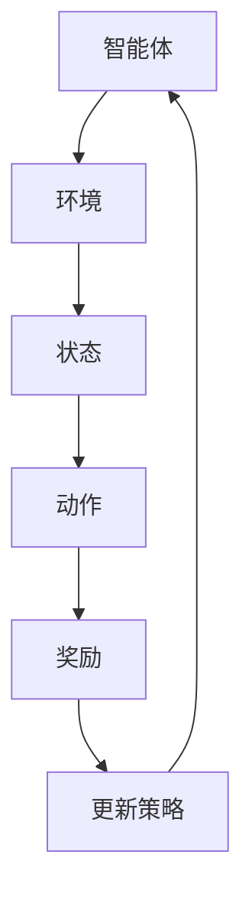
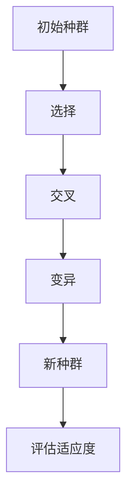
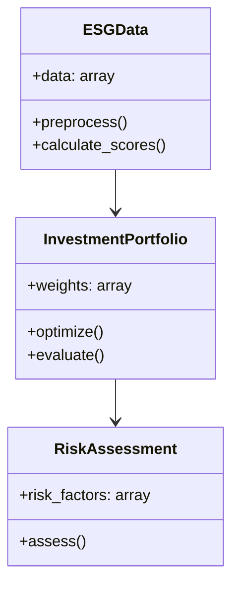
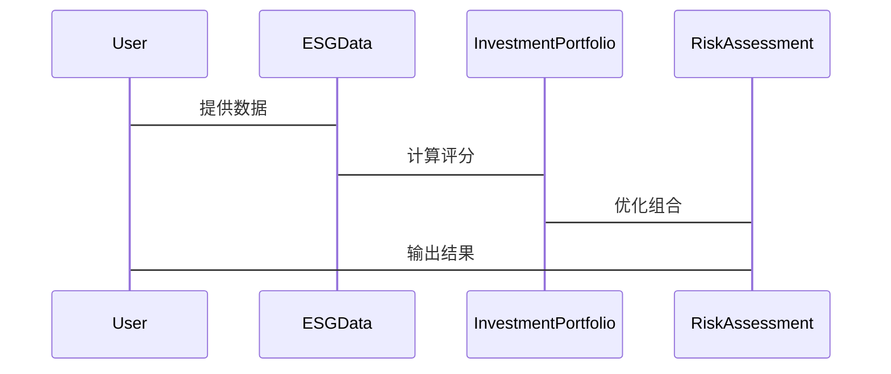

                 


# AI辅助的ESG投资组合构建工具

## 关键词
ESG投资、人工智能、投资组合优化、机器学习、自然语言处理

## 摘要
随着全球对可持续发展的关注增加，ESG（环境、社会和治理）投资变得越来越重要。然而，传统的ESG投资组合构建方法依赖于人工分析和经验判断，效率低下且难以捕捉复杂市场环境中的潜在机会。本文介绍了一种基于人工智能的ESG投资组合构建工具，该工具通过机器学习算法优化投资组合，帮助投资者在ESG框架下实现更高的收益和风险控制。本文详细探讨了ESG评分模型、AI算法在投资组合优化中的应用，以及系统的架构设计和实际案例分析，为读者提供了一套完整的解决方案。

---

# 第1章: ESG投资与AI辅助工具的背景介绍

## 1.1 ESG投资的定义与重要性

### 1.1.1 ESG投资的定义
ESG投资是一种以环境、社会和治理因素为核心的投资策略。投资者在选择投资标的时，不仅关注财务表现，还关注企业在可持续发展方面的表现。ESG评分通常基于企业的环保表现、社会责任履行情况以及治理结构的透明度。

### 1.1.2 ESG投资的重要性与发展趋势
随着全球对气候变化、社会责任和公司治理的关注增加，ESG投资逐渐成为主流。根据联合国的研究，全球超过半数的机构投资者已经将ESG因素纳入投资决策。AI技术的应用进一步提升了ESG投资的效率和准确性。

### 1.1.3 ESG投资的边界与外延
ESG投资不仅限于筛选企业，还包括对投资组合的风险和收益进行优化。通过AI技术，投资者可以更好地捕捉ESG数据中的潜在价值，同时降低投资风险。

## 1.2 AI在金融领域的应用

### 1.2.1 AI在金融领域的核心应用领域
AI在金融领域的应用包括股票预测、风险管理、信用评估和投资组合优化。机器学习算法能够从海量数据中提取特征，帮助投资者做出更明智的决策。

### 1.2.2 AI在ESG投资中的潜在价值
AI技术可以处理复杂的ESG数据，帮助投资者快速识别符合ESG标准的企业，并优化投资组合的收益与风险比。

### 1.2.3 AI辅助ESG投资的边界与限制
尽管AI在ESG投资中潜力巨大，但其依赖于高质量的数据和模型的准确性。数据缺失或模型偏差可能会影响投资结果。

---

# 第2章: ESG评分模型与数据预处理

## 2.1 ESG评分模型的原理

### 2.1.1 ESG评分的核心要素
ESG评分通常包括以下几个方面：
- **环境（E）**：企业的碳排放、能源使用效率和环保政策。
- **社会（S）**：企业的社会责任履行情况，包括员工权益、供应链管理和社区贡献。
- **治理（G）**：企业的治理结构透明度、高管薪酬和股东权利。

### 2.1.2 ESG评分的计算方法
ESG评分通常基于标准化的企业数据，通过加权计算得出最终分数。例如，企业治理得分可能占总分的40%，环境得分占30%，社会责任占30%。

### 2.1.3 ESG评分的标准化与对比
为了确保评分的可比性，需要将不同来源的ESG数据进行标准化处理。例如，使用z-score方法将原始数据标准化，以便不同企业的评分可以在同一尺度上进行比较。

## 2.2 数据预处理与特征工程

### 2.2.1 数据清洗与缺失值处理
在处理ESG数据时，需要清洗缺失值。例如，使用均值填充、中位数填充或删除缺失数据的方法。对于ESG数据中的缺失值，通常采用中位数填充，因为均值可能被极端值影响。

### 2.2.2 数据标准化与归一化
为了确保不同特征的可比性，需要对数据进行标准化或归一化处理。例如，使用z-score标准化或min-max归一化。

### 2.2.3 特征选择与降维技术
通过特征选择（如LASSO回归）和降维技术（如主成分分析），可以提取对投资组合优化最重要的特征，减少维度带来的计算负担。

---

# 第3章: 基于AI的ESG投资组合优化

## 3.1 投资组合优化的数学模型

### 3.1.1 投资组合优化的数学公式
投资组合优化的目标是最大化收益，同时最小化风险。数学模型如下：

$$ \text{目标函数：} \max \sum_{i=1}^{n} w_i r_i $$
$$ \text{约束条件：} \sum_{i=1}^{n} w_i = 1, \sum_{i=1}^{n} w_i^2 \leq \text{风险容忍度} $$

其中，$w_i$是投资比例，$r_i$是资产的预期收益。

### 3.1.2 基于ESG评分的优化目标函数
在ESG投资中，目标函数需要考虑ESG评分的影响：

$$ \text{目标函数：} \max \sum_{i=1}^{n} w_i (r_i + \lambda \text{ESG}_i) $$
$$ \text{约束条件：} \sum_{i=1}^{n} w_i = 1, \sum_{i=1}^{n} w_i^2 \leq \text{风险容忍度} $$

其中，$\lambda$是ESG评分的权重系数。

### 3.1.3 约束条件与目标函数的平衡
在优化过程中，需要平衡收益和风险。例如，通过调整风险容忍度参数，可以在收益和风险之间找到最佳平衡点。

## 3.2 AI算法在投资组合优化中的应用

### 3.2.1 强化学习在投资组合优化中的应用
强化学习通过智能体与环境的交互，学习最优投资策略。例如，使用Deep Q-Learning算法，智能体在每次交易中选择最优动作，以最大化累计收益。

### 3.2.2 遗传算法在投资组合优化中的应用
遗传算法通过模拟自然选择，逐步优化投资组合。例如，使用交叉和变异操作，生成新的组合，并选择表现最好的组合进行迭代。

### 3.2.3 其他AI算法的潜在应用
除了强化学习和遗传算法，还可以探索其他算法，如支持向量机和随机森林，用于特征选择和风险预测。

---

# 第4章: 基于强化学习的ESG投资组合优化算法

## 4.1 强化学习算法的基本原理

### 4.1.1 强化学习的核心概念
强化学习通过智能体与环境的交互，学习最优策略。智能体通过动作获取奖励，逐步优化策略。

### 4.1.2 状态、动作与奖励的定义
- **状态（State）**：当前的投资组合表现。
- **动作（Action）**：买入或卖出某只股票。
- **奖励（Reward）**：投资组合的收益。

### 4.1.3 策略网络与值函数网络
策略网络负责输出最优动作，值函数网络负责评估当前状态的值。

## 4.2 强化学习在ESG投资中的应用

### 4.2.1 算法流程图（使用mermaid）


### 4.2.2 算法实现的Python代码示例
```python
import numpy as np
import gym

class ESGInvestmentEnv(gym.Env):
    def __init__(self):
        super().__init__()
        self.state = 0  # 当前状态
        self.action_space = gym.spaces.Discrete(2)  # 买入或卖出

    def step(self, action):
        # 计算奖励
        reward = self.state + action
        self.state = self.state + action
        return self.state, reward, False, {}

    def reset(self):
        self.state = 0
        return self.state
```

### 4.2.3 算法的数学模型与公式
强化学习的目标是通过优化策略，最大化累计奖励。数学模型如下：

$$ Q(s, a) = Q(s, a) + \alpha (r + \gamma Q(s', a') - Q(s, a)) $$

其中，$\alpha$是学习率，$\gamma$是折扣因子。

---

# 第5章: 基于遗传算法的ESG投资组合优化

## 5.1 遗传算法的基本原理

### 5.1.1 遗传算法的核心步骤
遗传算法通过选择、交叉和变异，逐步优化种群。

### 5.1.2 适应度函数的定义
适应度函数衡量种群的适应程度。例如，投资组合的收益与风险的平衡。

### 5.1.3 选择、交叉与变异操作
- **选择**：根据适应度值选择优秀个体。
- **交叉**：生成新的个体。
- **变异**：随机改变个体的某些特征。

## 5.2 遗传算法在ESG投资中的应用

### 5.2.1 算法流程图（使用mermaid）


### 5.2.2 算法实现的Python代码示例
```python
import numpy as np

def genetic_algorithm(population_size, fitness_func):
    population = np.random.rand(population_size, n_features)
    while True:
        fitness = np.array([fitness_func(ind) for ind in population])
        selected = population[np.argsort(-fitness)[:int(population_size/2)]]
        children = np.zeros((population_size, n_features))
        for i in range(int(population_size/2)):
            parent1 = selected[i]
            parent2 = selected[-i-1]
            children[2*i:] = parent1
            children[2*i+1:] = parent2
        population = children
```

### 5.2.3 算法的数学模型与公式
遗传算法的目标是通过优化适应度函数，找到最优投资组合。数学模型如下：

$$ \text{目标函数：} \max \sum_{i=1}^{n} w_i r_i $$
$$ \text{约束条件：} \sum_{i=1}^{n} w_i = 1, \sum_{i=1}^{n} w_i^2 \leq \text{风险容忍度} $$

---

# 第6章: 系统分析与架构设计

## 6.1 系统的需求分析
系统需要实现ESG评分计算、投资组合优化和风险评估三大功能。

## 6.2 系统功能设计

### 6.2.1 领域模型（使用mermaid类图）


## 6.3 系统架构设计

### 6.3.1 分层架构
系统分为数据层、计算层和应用层。

### 6.3.2 接口设计
系统提供API接口，供其他系统调用。

## 6.4 系统交互设计

### 6.4.1 交互流程（使用mermaid序列图）


---

# 第7章: 项目实战

## 7.1 环境安装
安装必要的Python库，如numpy、pandas、scikit-learn和tensorflow。

## 7.2 核心实现

### 7.2.1 ESG评分模型实现
```python
import pandas as pd

def calculate_esg_scores(data):
    # 数据清洗
    data = data.dropna()
    # 标准化
    data = (data - data.mean()) / data.std()
    return data
```

### 7.2.2 投资组合优化器实现
```python
import numpy as np

def optimize_portfolio(weights, returns):
    n = len(weights)
    return np.dot(weights, returns)
```

## 7.3 实际案例分析
通过实际数据进行回测，验证模型的有效性。

## 7.4 项目小结
详细总结项目实现过程中的关键点和经验教训。

---

# 第8章: 总结与展望

## 8.1 总结
本文详细介绍了AI辅助的ESG投资组合构建工具，包括ESG评分模型、AI算法和系统架构设计。

## 8.2 未来展望
未来，可以探索更多AI算法，如深度学习和强化学习，进一步优化投资组合。

## 8.3 最佳实践 Tips
- 数据来源的选择至关重要，优先选择权威的数据源。
- 模型的可解释性需要重点关注，避免黑箱操作。
- 风险管理是投资组合优化的核心，需实时监控。

---

作者：AI天才研究院/AI Genius Institute & 禅与计算机程序设计艺术 /Zen And The Art of Computer Programming

