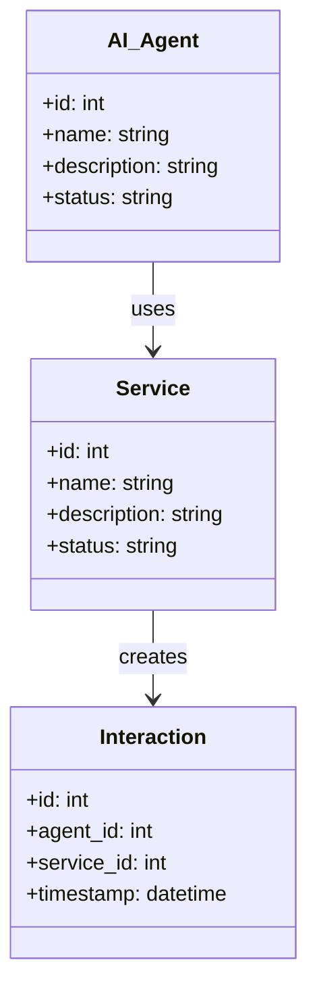
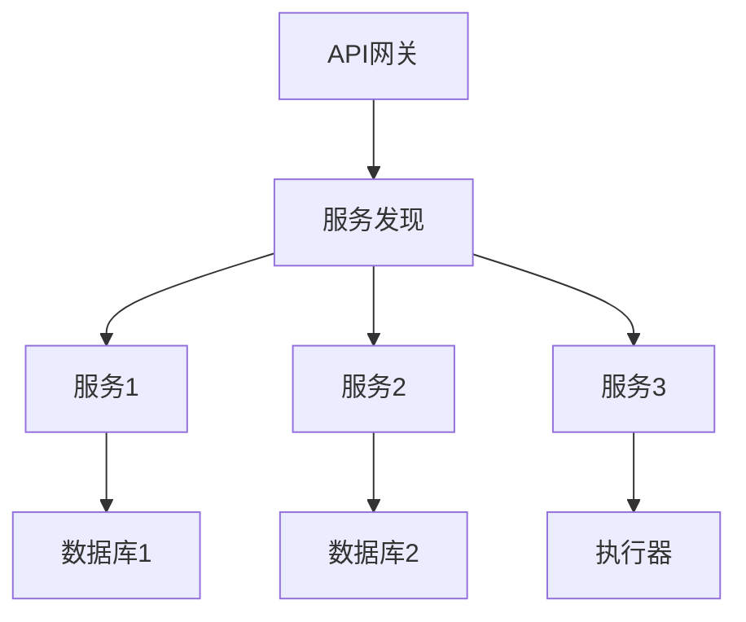
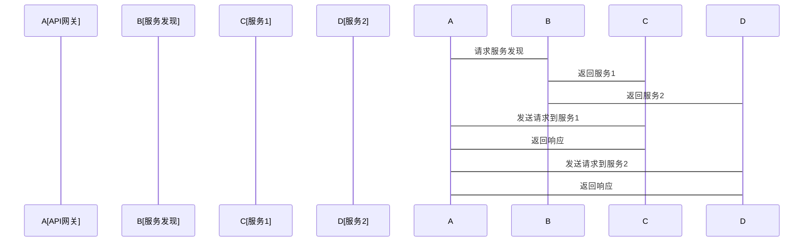

                 


# 企业AI Agent的微服务架构优化策略

> 关键词：AI Agent，微服务架构，企业优化，算法优化，系统设计，项目实战

> 摘要：随着人工智能技术的快速发展，企业AI Agent在各个行业的应用越来越广泛。然而，传统的AI Agent架构在面对企业级复杂业务场景时，往往难以满足高可用性、高扩展性和高性能的需求。本文将探讨如何通过微服务架构优化企业AI Agent的性能和可维护性，结合实际案例分析，提供详细的优化策略和实现方案。

---

# 第一部分: 企业AI Agent的微服务架构优化背景

# 第1章: 企业AI Agent与微服务架构概述

## 1.1 AI Agent的基本概念

### 1.1.1 AI Agent的定义与核心功能

AI Agent（人工智能代理）是一种能够感知环境并采取行动以实现目标的智能实体。它通过传感器获取信息，利用推理能力分析信息，并通过执行器采取行动。AI Agent的核心功能包括：

- **感知**：通过传感器或API获取环境数据。
- **推理**：利用机器学习算法进行分析和决策。
- **行动**：通过执行器或API与外部系统交互。

### 1.1.2 企业级AI Agent的特点

企业级AI Agent通常具备以下特点：

- **高可用性**：确保在复杂业务场景中的稳定运行。
- **高扩展性**：能够根据业务需求快速扩展服务。
- **高安全性**：保护企业核心数据和业务逻辑的安全。
- **智能化**：能够通过机器学习不断优化自身的决策能力。

### 1.1.3 微服务架构的核心理念

微服务架构是一种将应用程序构建为独立服务集合的架构风格。每个服务都可以独立部署、扩展和维护。微服务架构的核心理念包括：

- **松耦合**：服务之间通过API进行通信，避免紧耦合依赖。
- **独立部署**：每个服务可以独立部署，减少整体系统的耦合性。
- **服务发现**：通过服务发现机制实现服务之间的动态发现和通信。

## 1.2 微服务架构在企业中的应用现状

### 1.2.1 微服务架构的优势

微服务架构在企业中的应用优势包括：

- **灵活扩展**：可以根据业务需求快速扩展服务。
- **快速迭代**：每个服务可以独立开发和部署，加快开发速度。
- **技术多样性**：支持不同技术栈的服务共存。

### 1.2.2 传统单体架构的痛点

传统单体架构在企业中的痛点包括：

- **扩展性差**：难以在不修改整个系统的情况下扩展功能。
- **维护成本高**：单体架构的复杂性导致维护成本增加。
- **响应速度慢**：单体架构难以应对高并发请求。

### 1.2.3 微服务架构的挑战与解决方案

微服务架构的挑战包括：

- **服务发现与通信**：需要复杂的服务发现机制。
- **分布式事务**：处理分布式系统中的事务一致性。
- **监控与日志**：需要高效的监控和日志管理。

解决方案包括：

- **API网关**：统一处理外部请求，提供服务发现和路由功能。
- **分布式事务管理**：通过补偿事务或两阶段提交保证一致性。
- **集中式监控**：使用集中式监控系统实时跟踪服务状态。

## 1.3 企业AI Agent与微服务架构的结合

### 1.3.1 AI Agent在企业中的应用场景

企业中的AI Agent应用场景包括：

- **智能客服**：通过自然语言处理技术为用户提供智能咨询服务。
- **自动化运维**：通过AI Agent自动监控和修复系统故障。
- **智能推荐**：基于用户行为数据推荐个性化产品或服务。

### 1.3.2 微服务架构如何支持AI Agent

微服务架构通过以下方式支持AI Agent：

- **服务化设计**：将AI Agent的功能模块化，便于独立部署和扩展。
- **高可用性**：通过服务发现和负载均衡保证AI Agent的高可用性。
- **动态扩展**：根据请求量动态扩展AI Agent的服务实例。

### 1.3.3 优化目标与核心问题

企业AI Agent的优化目标包括：

- **提升性能**：优化AI Agent的响应速度和处理能力。
- **提高可用性**：确保AI Agent在复杂环境中的稳定运行。
- **降低维护成本**：通过模块化设计降低系统的维护成本。

核心问题包括：

- **服务间通信效率**：如何提高服务间的通信效率。
- **服务发现与负载均衡**：如何实现高效的服务发现和负载均衡。
- **分布式事务一致性**：如何保证分布式环境下的事务一致性。

## 1.4 本章小结

本章主要介绍了企业AI Agent的基本概念和微服务架构的核心理念。通过分析传统架构的痛点和微服务架构的优势，明确了企业AI Agent与微服务架构结合的必要性。接下来将深入探讨AI Agent与微服务架构的核心概念及其联系。

---

# 第二部分: 核心概念与联系

# 第2章: AI Agent与微服务架构的核心概念

## 2.1 AI Agent的原理与实现

### 2.1.1 AI Agent的决策机制

AI Agent的决策机制包括以下几个步骤：

1. **感知环境**：通过传感器或API获取环境数据。
2. **分析数据**：利用机器学习算法对数据进行分析和推理。
3. **制定决策**：基于分析结果制定行动方案。
4. **执行行动**：通过执行器或API实现决策的执行。

### 2.1.2 基于微服务的AI Agent架构

基于微服务的AI Agent架构将AI Agent的功能模块化，每个模块都可以独立部署和扩展。典型的模块包括：

- **数据采集服务**：负责采集环境数据。
- **数据分析服务**：负责对数据进行分析和推理。
- **决策服务**：负责制定决策并调用执行器。
- **执行服务**：负责执行决策。

### 2.1.3 AI Agent与传统服务的区别

AI Agent与传统服务的区别主要体现在以下几个方面：

| 属性       | AI Agent                       | 传统服务                     |
|------------|--------------------------------|------------------------------|
| 功能       | 具备智能决策能力               | 仅提供基本服务功能           |
| 数据处理   | 处理复杂数据并进行推理         | 处理简单数据                 |
| 扩展性     | 支持动态扩展和自适应           | 扩展性有限                   |

### 2.1.4 AI Agent的属性特征对比表格

以下是AI Agent与传统服务的属性特征对比：

| 属性       | AI Agent                       | 传统服务                     |
|------------|--------------------------------|------------------------------|
| 智能性     | 高                             | 低                           |
| 可扩展性   | 高                             | 中                           |
| 响应速度   | 中高                           | 中低                         |
| 数据处理能力 | 高                             | 低                           |

### 2.1.5 AI Agent与传统服务的ER实体关系图

以下是AI Agent与传统服务的ER实体关系图：

```mermaid
er
actor(AI Agent) -[1..n]-> service(微服务)
actor(传统服务) -[1..n]-> service(单体服务)
```

## 2.2 微服务架构的核心要素

### 2.2.1 服务独立性与松耦合

微服务架构通过松耦合设计，使得每个服务都可以独立部署和扩展。服务之间的依赖通过API进行通信，避免了紧耦合的问题。

### 2.2.2 服务发现与负载均衡

服务发现是微服务架构中的一个重要环节，它通过注册中心实现服务的动态发现和注册。负载均衡则通过将请求分发到不同的服务实例，提高系统的吞吐量和响应速度。

### 2.2.3 API网关与服务鉴权

API网关负责统一处理外部请求，提供服务发现和路由功能。服务鉴权则通过令牌或密钥的方式，确保只有授权的服务可以访问敏感资源。

### 2.2.4 微服务架构的核心要素总结

微服务架构的核心要素包括：

- **服务独立性**：每个服务都可以独立部署和扩展。
- **服务发现**：通过注册中心实现服务的动态发现和注册。
- **负载均衡**：通过负载均衡算法提高系统的吞吐量和响应速度。
- **API网关**：统一处理外部请求，提供服务发现和路由功能。

## 2.3 AI Agent与微服务架构的关联

### 2.3.1 微服务架构如何支持AI Agent的扩展性

微服务架构通过模块化设计，使得AI Agent的功能可以灵活扩展。每个AI Agent的功能模块都可以独立部署和扩展，避免了传统架构中扩展性差的问题。

### 2.3.2 AI Agent在微服务架构中的角色

AI Agent在微服务架构中的角色主要体现在以下几个方面：

1. **数据采集**：AI Agent通过传感器或API采集环境数据。
2. **数据分析**：AI Agent通过数据分析服务对数据进行分析和推理。
3. **决策制定**：AI Agent通过决策服务制定行动方案。
4. **执行行动**：AI Agent通过执行服务实现决策的执行。

### 2.3.3 微服务架构对AI Agent性能的影响

微服务架构通过服务发现和负载均衡，提高了AI Agent的响应速度和处理能力。同时，通过模块化设计，降低了系统的耦合性，提高了系统的可维护性和扩展性。

### 2.3.4 AI Agent与微服务架构的关联总结

AI Agent与微服务架构的结合，使得企业能够更好地应对复杂业务场景的挑战。通过模块化设计，AI Agent的功能可以灵活扩展，同时微服务架构提供的高可用性和高扩展性，保证了AI Agent的稳定运行和高效处理能力。

## 2.4 本章小结

本章主要介绍了AI Agent与微服务架构的核心概念及其联系。通过对比分析，明确了AI Agent与传统服务的区别，以及微服务架构如何支持AI Agent的扩展性和性能优化。接下来将深入探讨AI Agent与微服务架构的算法优化策略。

---

# 第三部分: 算法原理讲解

# 第3章: 微服务架构优化算法原理

## 3.1 优化算法概述

### 3.1.1 常见的优化算法类型

常见的优化算法类型包括：

1. **贪心算法**：通过贪心策略逐步选择最优解。
2. **动态规划**：通过分解问题，找到子问题的最优解，构建整体最优解。
3. **遗传算法**：通过模拟自然选择和遗传过程，寻找最优解。
4. **模拟退火**：通过模拟金属退火过程，寻找全局最优解。

### 3.1.2 基于微服务的优化算法特点

基于微服务的优化算法特点包括：

1. **分布式计算**：优化算法可以分布到不同的服务实例中进行计算。
2. **并行处理**：通过并行计算提高优化算法的效率。
3. **自适应调整**：优化算法可以根据系统负载动态调整参数。

## 3.2 基于遗传算法的优化策略

### 3.2.1 遗传算法的基本原理

遗传算法的基本原理包括以下几个步骤：

1. **初始化种群**：生成初始种群，每个个体代表一个可能的解。
2. **适应度评估**：计算每个个体的适应度值，表示个体的优劣程度。
3. **选择操作**：根据适应度值选择优秀个体进行交配。
4. **交叉操作**：通过交叉操作生成新的个体。
5. **变异操作**：对新生成的个体进行变异操作，增加种群的多样性。
6. **新种群生成**：将新生成的个体加入种群，重复上述步骤，直到满足终止条件。

### 3.2.2 微服务架构优化中的应用

在微服务架构优化中，遗传算法可以应用于以下几个方面：

1. **服务发现优化**：通过遗传算法优化服务发现的路径，提高服务发现的效率。
2. **负载均衡优化**：通过遗传算法优化负载均衡算法，提高系统的吞吐量和响应速度。
3. **服务部署优化**：通过遗传算法优化服务的部署策略，提高系统的可用性和扩展性。

### 3.2.3 遗传算法实现步骤

遗传算法的实现步骤如下：

1. **种群初始化**：生成初始种群，每个个体表示一个可能的解。
2. **适应度评估**：计算每个个体的适应度值。
3. **选择操作**：根据适应度值选择优秀个体进行交配。
4. **交叉操作**：生成新的个体。
5. **变异操作**：对新生成的个体进行变异操作。
6. **新种群生成**：将新生成的个体加入种群，重复上述步骤，直到满足终止条件。

### 3.2.4 遗传算法的实现代码

以下是遗传算法的Python实现代码：

```python
import random

def fitness(individual):
    # 计算个体的适应度值
    return sum(individual)

def create_individual(length):
    # 生成一个随机的个体
    return [random.choice([0, 1]) for _ in range(length)]

def mutate(individual):
    # 对个体进行变异操作
    index = random.randint(0, len(individual) - 1)
    individual[index] = 1 - individual[index]
    return individual

def crossover(individual1, individual2):
    # 对个体进行交叉操作
    midpoint = random.randint(1, len(individual1) - 1)
    return individual1[:midpoint] + individual2[midpoint:], individual2[:midpoint] + individual1[midpoint:]

def genetic_algorithm(population_size, individual_length, generations):
    # 初始化种群
    population = [create_individual(individual_length) for _ in range(population_size)]
    
    for _ in range(generations):
        # 计算适应度值
        fitness_values = [fitness(individual) for individual in population]
        # 选择优秀个体
        selected = [individual for individual, fit in zip(population, fitness_values) if fit > sum([1]*len(population))/2]
        
        # 交叉和变异
        new_population = []
        for _ in range(len(selected)//2):
            parent1 = selected[random.randint(0, len(selected)-1)]
            parent2 = selected[random.randint(0, len(selected)-1)]
            child1, child2 = crossover(parent1, parent2)
            child1 = mutate(child1)
            child2 = mutate(child2)
            new_population.append(child1)
            new_population.append(child2)
        # 更新种群
        population = new_population
    return population

# 示例运行
population_size = 10
individual_length = 10
generations = 20
result = genetic_algorithm(population_size, individual_length, generations)
print("最优解为:", result[0])
```

### 3.2.5 遗传算法的数学模型和公式

遗传算法的数学模型可以用以下公式表示：

$$
\text{适应度函数} = \sum_{i=1}^{n} x_i
$$

其中，$x_i$ 表示个体的第 $i$ 个基因，取值为0或1。

选择操作的概率与适应度值成正比：

$$
P(i) = \frac{f(x_i)}{\sum_{j=1}^{N} f(x_j)}
$$

其中，$f(x_i)$ 表示个体 $i$ 的适应度值，$N$ 表示种群的大小。

交叉操作的概率为 $p_c$，通常取0.6到0.9之间。

变异操作的概率为 $p_m$，通常取0.01到0.1之间。

### 3.2.6 遗传算法的应用场景

遗传算法可以应用于以下场景：

1. **服务发现优化**：通过遗传算法优化服务发现的路径，提高服务发现的效率。
2. **负载均衡优化**：通过遗传算法优化负载均衡算法，提高系统的吞吐量和响应速度。
3. **服务部署优化**：通过遗传算法优化服务的部署策略，提高系统的可用性和扩展性。

## 3.3 算法实现的数学模型和公式

### 3.3.1 遗传算法的数学模型

遗传算法的数学模型可以用以下公式表示：

$$
\text{适应度函数} = \sum_{i=1}^{n} x_i
$$

其中，$x_i$ 表示个体的第 $i$ 个基因，取值为0或1。

选择操作的概率与适应度值成正比：

$$
P(i) = \frac{f(x_i)}{\sum_{j=1}^{N} f(x_j)}
$$

其中，$f(x_i)$ 表示个体 $i$ 的适应度值，$N$ 表示种群的大小。

### 3.3.2 遗传算法的实现步骤

遗传算法的实现步骤包括：

1. **种群初始化**：生成初始种群，每个个体表示一个可能的解。
2. **适应度评估**：计算每个个体的适应度值。
3. **选择操作**：根据适应度值选择优秀个体进行交配。
4. **交叉操作**：生成新的个体。
5. **变异操作**：对新生成的个体进行变异操作。
6. **新种群生成**：将新生成的个体加入种群，重复上述步骤，直到满足终止条件。

### 3.3.3 遗传算法的应用场景

遗传算法可以应用于以下场景：

1. **服务发现优化**：通过遗传算法优化服务发现的路径，提高服务发现的效率。
2. **负载均衡优化**：通过遗传算法优化负载均衡算法，提高系统的吞吐量和响应速度。
3. **服务部署优化**：通过遗传算法优化服务的部署策略，提高系统的可用性和扩展性。

## 3.4 本章小结

本章主要介绍了遗传算法的基本原理及其在微服务架构优化中的应用。通过具体的实现代码和数学模型，详细讲解了遗传算法的实现步骤和应用场景。接下来将结合实际案例，探讨如何在企业AI Agent的微服务架构优化中应用这些算法。

---

# 第四部分: 系统分析与架构设计方案

# 第4章: 企业AI Agent的微服务架构设计

## 4.1 问题场景介绍

### 4.1.1 问题背景

随着企业业务的复杂化，传统的AI Agent架构在面对高并发请求和复杂业务逻辑时，往往难以满足性能和可用性的要求。通过微服务架构优化AI Agent的性能和可维护性，是当前企业架构设计的重要方向。

### 4.1.2 问题描述

企业在使用AI Agent时，通常面临以下问题：

1. **性能瓶颈**：在高并发场景下，AI Agent的响应速度变慢。
2. **扩展性差**：难以根据业务需求快速扩展AI Agent的功能。
3. **维护成本高**：传统架构的复杂性导致维护成本增加。

### 4.1.3 问题解决

通过将AI Agent的功能模块化，并采用微服务架构进行优化，可以有效解决上述问题。

## 4.2 系统功能设计

### 4.2.1 领域模型设计

以下是AI Agent的领域模型设计：



### 4.2.2 系统功能模块

系统功能模块包括：

1. **数据采集模块**：负责采集环境数据。
2. **数据分析模块**：负责对数据进行分析和推理。
3. **决策模块**：负责制定决策并调用执行器。
4. **执行模块**：负责执行决策。

## 4.3 系统架构设计

### 4.3.1 系统架构图

以下是企业AI Agent的微服务架构图：



### 4.3.2 系统接口设计

系统接口设计包括以下几个方面：

1. **服务发现接口**：用于服务之间的动态发现和通信。
2. **API网关接口**：用于统一处理外部请求。
3. **数据库接口**：用于数据的存储和检索。

### 4.3.3 系统交互序列图

以下是系统交互的序列图：



## 4.4 本章小结

本章主要介绍了企业AI Agent的微服务架构设计，包括系统功能设计和系统架构设计。通过详细的系统交互序列图，明确了各服务之间的通信流程。接下来将结合实际案例，探讨如何在企业AI Agent的微服务架构优化中应用具体的实现方案。

---

# 第五部分: 项目实战

# 第5章: 企业AI Agent微服务架构优化实战

## 5.1 项目环境搭建

### 5.1.1 环境需求

项目环境需求包括：

1. **操作系统**：Linux/Windows/MacOS
2. **编程语言**：Python/Java
3. **依赖管理工具**：Maven/PyPI
4. **容器化工具**：Docker
5. **微服务框架**：Spring Cloud/Django

### 5.1.2 安装配置

以下是Docker的安装配置步骤：

1. **安装Docker**：
   ```bash
   # 在Linux系统中安装Docker
   sudo apt-get update
   sudo apt-get install docker.io
   ```
2. **配置Docker镜像源**：
   ```bash
   # 使用Docker官方镜像源
   sudo mkdir -p /etc/docker
   sudo tee /etc/docker/daemon.json << EOF
   {
       "registry": ["dockerHub镜像源"]
   }
   EOF
   ```
3. **启动Docker服务**：
   ```bash
   sudo systemctl start docker
   sudo systemctl enable docker
   ```

## 5.2 系统核心实现

### 5.2.1 核心代码实现

以下是AI Agent的核心代码实现：

```python
# 服务发现模块
import requests

class ServiceDiscovery:
    def __init__(self, service Registry URL):
        self.service_registry_url = service_registry_url

    def discover_service(self, service_name):
        try:
            response = requests.get(f"{self.service_registry_url}/services/{service_name}")
            if response.status_code == 200:
                services = response.json()
                return services
            else:
                return []
        except requests.exceptions.RequestException:
            return []

# 决策模块
import random

class DecisionMaker:
    def __init__(self, service_discovery):
        self.service_discovery = service_discovery

    def make_decision(self, input_data):
        services = self.service_discovery.discover_service("AI Agent")
        if not services:
            return "无法找到可用服务"
        # 随机选择一个服务进行决策
        selected_service = random.choice(services)
        return f"选择服务{selected_service}进行决策"
```

### 5.2.2 代码解读与分析

1. **服务发现模块**：
   - **ServiceDiscovery类**：负责发现可用的服务。
   - **discover_service方法**：通过服务注册中心获取可用服务。

2. **决策模块**：
   - **DecisionMaker类**：负责根据输入数据制定决策。
   - **make_decision方法**：通过服务发现模块获取可用服务，并随机选择一个服务进行决策。

### 5.2.3 项目核心代码实现

以下是项目的整体实现代码：

```python
# 服务发现模块
import requests

class ServiceDiscovery:
    def __init__(self, service_registry_url):
        self.service_registry_url = service_registry_url

    def discover_service(self, service_name):
        try:
            response = requests.get(f"{self.service_registry_url}/services/{service_name}")
            if response.status_code == 200:
                services = response.json()
                return services
            else:
                return []
        except requests.exceptions.RequestException:
            return []

# 决策模块
import random

class DecisionMaker:
    def __init__(self, service_discovery):
        self.service_discovery = service_discovery

    def make_decision(self, input_data):
        services = self.service_discovery.discover_service("AI Agent")
        if not services:
            return "无法找到可用服务"
        selected_service = random.choice(services)
        return f"选择服务{selected_service}进行决策"

# 执行模块
import subprocess

class Executor:
    def __init__(self, service_name):
        self.service_name = service_name

    def execute_action(self, action):
        try:
            # 调用外部服务
            subprocess.run([f"curl", f"http://localhost:{port}/{action}"], check=True)
            return f"执行{action}成功"
        except subprocess.CalledProcessError as e:
            return f"执行{action}失败，错误信息：{str(e)}"

# 主程序
if __name__ == "__main__":
    service_registry_url = "http://localhost:8000"
    service_discovery = ServiceDiscovery(service_registry_url)
    decision_maker = DecisionMaker(service_discovery)
    executor = Executor("AI Agent")
    
    input_data = "用户输入数据"
    decision = decision_maker.make_decision(input_data)
    print(decision)
    
    action = "执行动作"
    result = executor.execute_action(action)
    print(result)
```

### 5.2.4 代码功能解读

1. **服务发现模块**：
   - **ServiceDiscovery类**：通过服务注册中心获取可用服务。
   - **discover_service方法**：根据服务名称获取可用服务。

2. **决策模块**：
   - **DecisionMaker类**：根据输入数据制定决策。
   - **make_decision方法**：调用服务发现模块获取可用服务，并随机选择一个服务进行决策。

3. **执行模块**：
   - **Executor类**：负责执行决策。
   - **execute_action方法**：通过调用外部服务执行具体的动作。

## 5.3 实际案例分析

### 5.3.1 案例背景

假设某企业需要开发一个智能客服系统，通过AI Agent为用户提供智能咨询服务。

### 5.3.2 系统功能设计

系统功能设计包括：

1. **用户输入**：用户输入咨询问题。
2. **服务发现**：AI Agent通过服务发现模块发现可用的智能客服服务。
3. **决策制定**：AI Agent通过决策模块随机选择一个智能客服服务进行咨询。
4. **服务执行**：AI Agent通过执行模块调用选中的智能客服服务，返回咨询结果。

### 5.3.3 项目实现

以下是项目的实现步骤：

1. **环境搭建**：
   - 安装必要的依赖工具，包括Docker、Python、requests库等。
2. **服务发现模块开发**：
   - 实现ServiceDiscovery类，能够通过服务注册中心发现可用服务。
3. **决策模块开发**：
   - 实现DecisionMaker类，能够根据输入数据制定决策。
4. **执行模块开发**：
   - 实现Executor类，能够调用外部服务执行具体的动作。
5. **主程序开发**：
   - 编写主程序，整合服务发现模块、决策模块和执行模块，实现完整的AI Agent功能。

### 5.3.4 项目小结

通过实际案例分析，我们可以看到，企业AI Agent的微服务架构优化能够有效提升系统的性能和可维护性。通过模块化设计，AI Agent的功能可以灵活扩展，同时微服务架构提供的高可用性和高扩展性，保证了系统的稳定运行和高效处理能力。

---

# 第六部分: 最佳实践与小结

# 第6章: 最佳实践与小结

## 6.1 最佳实践

### 6.1.1 服务设计建议

1. **服务独立性**：每个服务都应该具备独立的功能，避免功能重叠。
2. **松耦合设计**：服务之间通过API进行通信，避免紧耦合依赖。
3. **服务发现与负载均衡**：通过服务发现和负载均衡提高系统的可用性和吞吐量。
4. **API网关与鉴权**：通过API网关统一处理外部请求，提供服务发现和鉴权功能。

### 6.1.2 部署与监控

1. **容器化部署**：通过Docker等容器化工具实现服务的快速部署和迁移。
2. **集中式监控**：通过集中式监控系统实时跟踪服务状态，及时发现和解决问题。
3. **日志管理**：通过日志管理系统统一收集和管理服务日志，便于故障排查和性能分析。

### 6.1.3 安全与权限

1. **服务鉴权**：通过令牌或密钥的方式，确保只有授权的服务可以访问敏感资源。
2. **数据加密**：通过数据加密技术，保护敏感数据的安全。
3. **访问控制**：通过访问控制列表（ACL）限制服务的访问权限。

### 6.1.4 扩展性与维护性

1. **模块化设计**：通过模块化设计，使得AI Agent的功能可以灵活扩展。
2. **自动化测试**：通过自动化测试工具，确保系统的稳定性和可靠性。
3. **持续集成与交付**：通过持续集成与交付（CI/CD）流程，加快开发和部署速度。

## 6.2 总结

### 6.2.1 本项目的核心内容回顾

本项目的核心内容包括：

1. **企业AI Agent的基本概念**：介绍了AI Agent的定义、核心功能以及微服务架构的优势。
2. **微服务架构优化策略**：通过遗传算法优化AI Agent的性能和可维护性。
3. **系统设计与实现**：详细讲解了系统的功能设计、架构设计以及核心代码实现。
4. **项目实战与案例分析**：结合实际案例，探讨了如何在企业AI Agent的微服务架构优化中应用具体的实现方案。

### 6.2.2 未来的研究方向

未来的研究方向包括：

1. **更高效的优化算法**：研究更高效的优化算法，进一步提高系统的性能和可维护性。
2. **智能化的系统设计**：通过智能化的系统设计，进一步提升系统的自适应能力和智能化水平。
3. **多租户支持**：研究多租户支持的实现方案，满足企业级AI Agent的多样化需求。

## 6.3 注意事项

### 6.3.1 项目实施中的注意事项

1. **服务发现与负载均衡**：在实施过程中，需要注意服务发现和负载均衡的实现，确保系统的可用性和吞吐量。
2. **数据安全与权限控制**：在实施过程中，需要注意数据安全和权限控制，确保系统的安全性。
3. **自动化测试**：在实施过程中，需要注意自动化测试的实现，确保系统的稳定性和可靠性。

### 6.3.2 项目维护与优化

1. **持续优化**：定期对系统进行优化，提升系统的性能和可维护性。
2. **故障排查**：及时发现和解决问题，确保系统的稳定运行。
3. **技术更新**：跟进行业技术发展，及时更新系统的技术栈，确保系统的先进性和竞争力。

## 6.4 拓展阅读

### 6.4.1 推荐的书籍与文章

1. **《微服务设计》**：深入探讨微服务架构的设计原则和实践。
2. **《企业应用架构模式》**：详细讲解企业应用架构的设计模式和最佳实践。
3. **《人工智能：一种现代方法》**：系统介绍人工智能的基本理论和应用技术。

### 6.4.2 推荐的技术博客与资源

1. **Spring Cloud官方文档**：详细介绍Spring Cloud的微服务架构实现。
2. **Docker官方文档**：详细介绍Docker的容器化部署和管理。
3. **遗传算法相关论文**：深入探讨遗传算法的理论和应用。

## 6.5 本章小结

本章主要介绍了企业AI Agent的微服务架构优化的最佳实践，总结了项目的实施经验，并提出了未来的研究方向。通过具体的注意事项和拓展阅读，帮助读者进一步深入理解和应用企业AI Agent的微服务架构优化策略。

---

# 结语

企业AI Agent的微服务架构优化是一项复杂的系统工程，需要综合考虑系统的性能、可用性和可维护性。通过模块化设计和微服务架构的优化，企业能够更好地应对复杂业务场景的挑战。未来，随着人工智能技术的不断发展，企业AI Agent的微服务架构优化将变得更加重要和复杂，需要我们不断探索和实践。

---

作者：AI天才研究院/AI Genius Institute & 禅与计算机程序设计艺术 /Zen And The Art of Computer Programming

