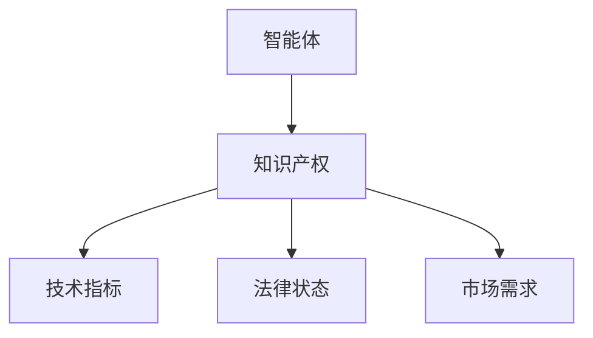
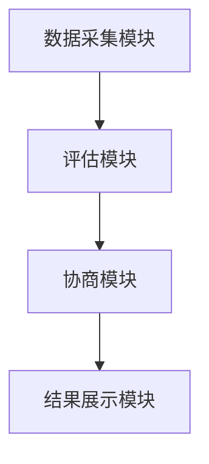
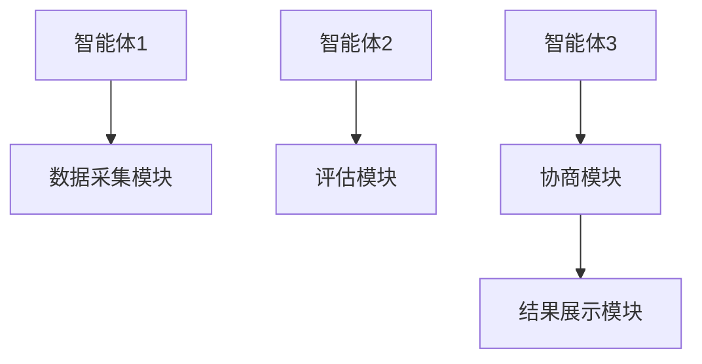
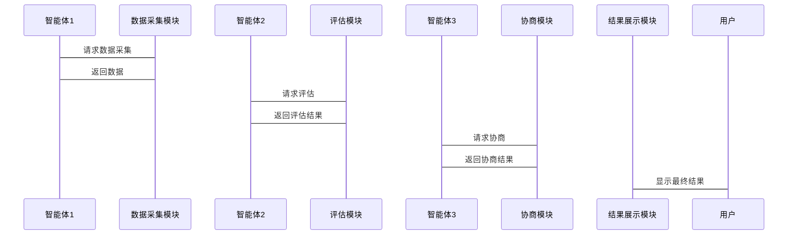

                 


# 多智能体系统在知识产权价值动态评估中的应用

> 关键词：多智能体系统，知识产权评估，动态价值，分布式计算，博弈论，人工智能

> 摘要：随着知识产权在现代社会中的重要性日益增加，对其价值进行动态评估变得至关重要。传统的评估方法难以应对复杂多变的市场环境和技术创新。本文探讨了多智能体系统（MAS）在知识产权价值动态评估中的应用，分析了其核心概念、算法原理、系统架构，并通过具体案例展示了其实现过程。通过本文的介绍，读者将深入了解如何利用MAS提升知识产权评估的准确性和效率。

---

## 第一部分: 多智能体系统与知识产权价值评估背景

### 第1章: 多智能体系统概述

#### 1.1 多智能体系统的基本概念

##### 1.1.1 多智能体系统的定义
多智能体系统（Multi-Agent System, MAS）是由多个智能体（Agent）组成的分布式系统，这些智能体能够自主决策、协同工作，并通过交互完成复杂任务。智能体是指具有感知环境、自主决策和执行任务能力的实体。

##### 1.1.2 多智能体系统的特征
- **自主性**：智能体能够自主决策，无需外部干预。
- **反应性**：能够实时感知环境变化并做出响应。
- **协作性**：多个智能体通过协作完成共同目标。
- **分布式性**：系统中的智能体分布在不同的位置，具有独立性。

##### 1.1.3 多智能体系统的分类
- **基于任务的MAS**：智能体协作完成特定任务。
- **基于市场的MAS**：智能体通过市场机制进行资源分配和交易。
- **基于目标的MAS**：智能体通过协商达成一致目标。

#### 1.2 知识产权价值评估的背景

##### 1.2.1 知识产权的基本概念
知识产权是指对创造性的智力成果依法享有的专有权利，主要包括专利权、商标权、著作权、商业秘密等。知识产权的价值评估是指对其经济价值进行量化的过程。

##### 1.2.2 知识产权价值评估的重要性
知识产权是企业核心竞争力的体现，其价值直接影响企业的市场地位和经济收益。准确评估知识产权价值，有助于企业在交易、融资、法律保护等方面做出合理决策。

##### 1.2.3 知识产权价值评估的挑战
- **动态性**：市场环境和技术发展不断变化，影响知识产权价值。
- **多维性**：知识产权价值受技术、法律、市场等多因素影响。
- **不确定性**：评估结果具有一定的主观性和不确定性。

#### 1.3 多智能体系统在知识产权评估中的应用前景

##### 1.3.1 多智能体系统的优势
- **分布式计算**：能够处理复杂问题，提高计算效率。
- **协作能力**：多个智能体协同工作，提供全面评估。
- **动态调整**：能够实时适应环境变化，保持评估准确性。

##### 1.3.2 知识产权评估中的复杂性
- 知识产权评估需要综合考虑技术、法律、市场等多个因素。
- 不同利益相关者（如发明人、律师、市场分析师）需要协同工作。

##### 1.3.3 多智能体系统的适用性
- 多智能体系统能够处理多维度、多利益相关者的复杂问题。
- 智能体之间的协作和信息共享有助于全面评估知识产权价值。

### 第2章: 多智能体系统与知识产权价值评估的结合

#### 2.1 知识产权评估的核心问题

##### 2.1.1 知识产权的动态性
- 知识产权价值随时间变化，受市场和技术的影响。
- 需要动态调整评估模型和参数。

##### 2.1.2 知识产权的多维度评估
- 技术评估：技术的先进性和实用性。
- 法律评估：知识产权的法律保护状况。
- 市场评估：市场需求和竞争情况。

##### 2.1.3 知识产权评估的不确定性
- 数据的不完整性和主观性。
- 不同评估方法和参数可能导致结果差异。

#### 2.2 多智能体系统在知识产权评估中的角色

##### 2.2.1 智能体的分工与协作
- 数据采集智能体：收集技术、法律、市场等数据。
- 评估智能体：基于数据进行技术、法律和市场评估。
- 协商智能体：协调不同评估结果，得出最终价值。

##### 2.2.2 智能体的信息共享与决策
- 智能体之间通过通信共享信息和数据。
- 协商机制确保评估结果的准确性和一致性。

##### 2.2.3 智能体的动态调整能力
- 系统能够实时调整评估模型和参数。
- 根据市场反馈动态更新评估结果。

---

## 第二部分: 多智能体系统在知识产权评估中的核心概念与联系

### 第3章: 核心概念与联系

#### 3.1 知识产权评估的核心概念

##### 3.1.1 知识产权评估的维度
- 技术维度：技术的创新性和实用性。
- 法律维度：知识产权的法律保护和权利状态。
- 市场维度：市场需求、竞争状况和经济价值。

##### 3.1.2 知识产权评估的模型
- 技术评估模型：基于技术指标进行评分。
- 市场评估模型：基于市场需求和竞争情况预测价值。
- 综合评估模型：结合技术、法律和市场因素进行综合评估。

#### 3.2 多智能体系统的概念对比

##### 3.2.1 多智能体系统与单智能体系统的对比
| 特性         | 单智能体系统            | 多智能体系统            |
|--------------|-------------------------|-------------------------|
| 独立性       | 高                     | 中                     |
| 分布式计算   | 低                     | 高                     |
| 协作能力     | 低                     | 高                     |
| 适应性       | 低                     | 高                     |

#### 3.3 实体关系图

##### 3.3.1 实体关系图（ER图）


---

## 第三部分: 多智能体系统在知识产权评估中的算法原理

### 第4章: 算法原理讲解

#### 4.1 分布式计算算法

##### 4.1.1 分布式计算的定义
分布式计算是指将计算任务分配到多个计算节点上，通过协作完成任务。多智能体系统中的分布式计算能够提高计算效率和资源利用率。

##### 4.1.2 分布式计算的实现步骤
1. **任务分解**：将整体任务分解为多个子任务。
2. **任务分配**：将子任务分配给不同的智能体。
3. **任务执行**：智能体独立执行分配的任务。
4. **结果汇总**：将各智能体的结果汇总，得到最终结果。

##### 4.1.3 分布式计算的优缺点
- **优点**：提高计算效率，增强系统的容错性。
- **缺点**：需要复杂的通信和协调机制。

#### 4.2 协商算法

##### 4.2.1 协商算法的定义
协商算法是指多个智能体通过协商达成一致的算法。在知识产权评估中，协商算法用于协调不同智能体的评估结果，得出最终的价值。

##### 4.2.2 协商算法的实现步骤
1. **初始化**：设定协商的目标和初始条件。
2. **协商过程**：智能体之间交换信息，调整各自的评估结果。
3. **达成一致**：通过多次协商，智能体达成一致的评估结果。

##### 4.2.3 协商算法的优缺点
- **优点**：能够综合不同智能体的评估结果，提高评估的准确性。
- **缺点**：协商过程可能较复杂，需要较高的通信成本。

#### 4.3 博弈论模型

##### 4.3.1 博弈论模型的定义
博弈论模型是指在多智能体系统中，多个智能体作为博弈参与者，通过策略选择和相互作用来实现目标的模型。

##### 4.3.2 博弈论模型的实现步骤
1. **定义博弈参与者**：确定参与博弈的智能体。
2. **定义策略空间**：确定每个智能体的策略集合。
3. **定义收益函数**：确定每个智能体的收益计算方式。
4. **求解纳什均衡**：找到博弈的均衡点，确定最终的策略组合。

##### 4.3.3 博弈论模型的优缺点
- **优点**：能够模拟复杂的竞争和协作关系，提供决策依据。
- **缺点**：模型的复杂性可能较高，需要大量的计算资源。

---

## 第四部分: 系统分析与架构设计方案

### 第5章: 系统架构设计

#### 5.1 系统功能设计

##### 5.1.1 系统功能模块
- 数据采集模块：收集技术、法律、市场等数据。
- 评估模块：基于数据进行技术、法律和市场评估。
- 协商模块：协调不同智能体的评估结果，得出最终价值。
- 结果展示模块：以可视化方式展示评估结果。

##### 5.1.2 功能模块的交互流程


#### 5.2 系统架构设计

##### 5.2.1 系统架构图


#### 5.3 系统接口设计

##### 5.3.1 系统接口描述
- 数据采集模块接口：提供数据采集功能。
- 评估模块接口：提供技术、法律和市场评估功能。
- 协商模块接口：提供协商功能，协调评估结果。
- 结果展示模块接口：提供结果展示功能。

##### 5.3.2 系统交互序列图


---

## 第五部分: 项目实战

### 第6章: 项目实战

#### 6.1 环境安装

##### 6.1.1 系统需求
- 操作系统：支持Linux或Windows。
- 开发工具：安装Python、Java等编程语言的开发环境。
- 依赖库：安装必要的依赖库，如numpy、pandas、scikit-learn等。

#### 6.2 系统核心实现

##### 6.2.1 核心代码实现
```python
class Agent:
    def __init__(self, id):
        self.id = id
        self.data = {}

    def collect_data(self):
        # 数据采集逻辑
        pass

    def evaluate(self):
        # 评估逻辑
        pass

    def negotiate(self):
        # 协商逻辑
        pass
```

##### 6.2.2 代码解读与分析
- **Agent类**：表示一个智能体，包含数据采集、评估和协商方法。
- **collect_data方法**：负责采集数据。
- **evaluate方法**：负责评估。
- **negotiate方法**：负责协商。

#### 6.3 实际案例分析

##### 6.3.1 案例背景
假设我们要评估一件专利的价值，涉及技术、法律和市场三个维度。

##### 6.3.2 案例分析步骤
1. **数据采集**：采集专利的技术指标、法律状态和市场需求。
2. **评估**：分别从技术、法律和市场三个维度进行评估。
3. **协商**：协调不同智能体的评估结果，得出最终价值。

##### 6.3.3 案例实现
```python
agent1 = Agent(1)
agent1.collect_data()  # 采集技术数据
agent2 = Agent(2)
agent2.collect_data()  # 采集法律数据
agent3 = Agent(3)
agent3.collect_data()  # 采集市场数据

agent1.evaluate()  # 技术评估
agent2.evaluate()  # 法律评估
agent3.evaluate()  # 市场评估

agent1.negotiate()  # 协商技术评估结果
agent2.negotiate()  # 协商法律评估结果
agent3.negotiate()  # 协商市场评估结果

# 最终价值
final_value = (agent1.value + agent2.value + agent3.value) / 3
```

#### 6.4 项目小结

##### 6.4.1 项目总结
通过多智能体系统的应用，能够提高知识产权评估的准确性和效率。每个智能体负责不同的任务，通过协作和协商，最终得出全面的评估结果。

##### 6.4.2 经验总结
- 系统设计需要模块化，确保各智能体的分工明确。
- 数据采集和评估模块需要准确可靠。
- 协商模块的设计需要考虑多种可能的协商策略。

---

## 第六部分: 最佳实践

### 第7章: 最佳实践

#### 7.1 小结

##### 7.1.1 核心内容回顾
本文详细介绍了多智能体系统在知识产权价值动态评估中的应用，包括核心概念、算法原理、系统架构和项目实战。

##### 7.1.2 主要结论
多智能体系统能够有效应对知识产权评估中的复杂性和动态性，通过协作和协商，提高评估的准确性和效率。

#### 7.2 注意事项

##### 7.2.1 系统设计注意事项
- 确保智能体之间的通信和协作机制可靠。
- 考虑系统的可扩展性和可维护性。
- 注意数据隐私和安全问题。

##### 7.2.2 评估结果的注意事项
- 评估结果具有一定的主观性，需要结合实际情况进行调整。
- 注意数据的准确性和完整性。

#### 7.3 未来研究方向

##### 7.3.1 智能体协作机制的优化
- 研究更高效的协商算法和协作机制。
- 探索基于博弈论的智能体协作模型。

##### 7.3.2 知识产权评估的动态性研究
- 研究如何实时更新评估结果，应对市场和技术的变化。
- 探索基于机器学习的动态评估模型。

#### 7.4 拓展阅读

##### 7.4.1 推荐书籍
- 《多智能体系统》
- 《知识产权评估方法》

##### 7.4.2 推荐论文
- "Multi-Agent Systems for Intellectual Property Valuation"
- "Game Theory in Intellectual Property Assessment"

---

## 作者：AI天才研究院/AI Genius Institute & 禅与计算机程序设计艺术 /Zen And The Art of Computer Programming

---

本文通过详细的背景介绍、核心概念、算法原理和项目实战，全面探讨了多智能体系统在知识产权价值动态评估中的应用。通过本文的介绍，读者可以深入了解多智能体系统的优势及其在知识产权评估中的具体应用，为实际工作提供理论和实践指导。

