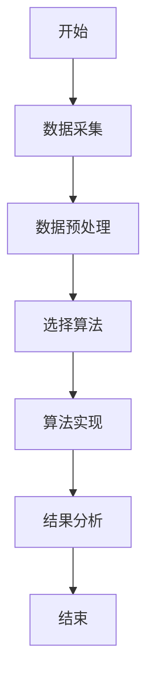
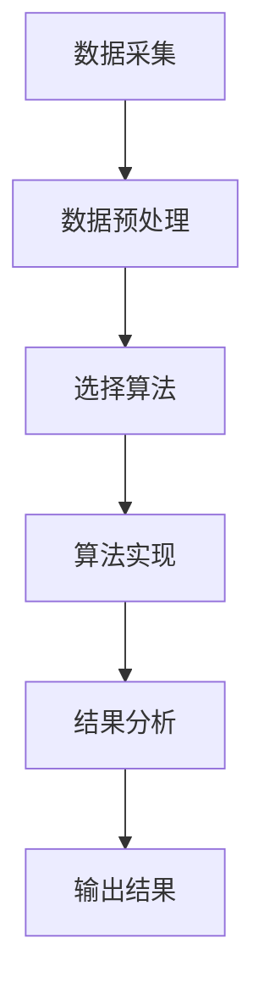
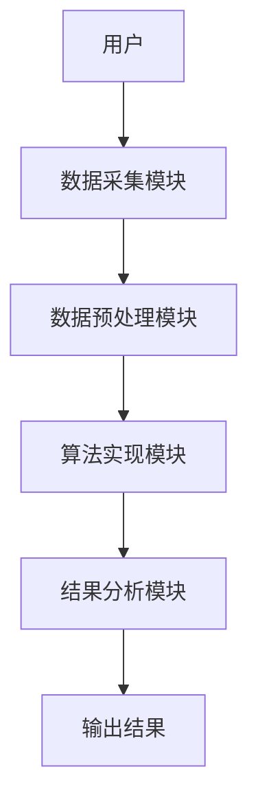

                 


```markdown
# 多智能体系统在识别市场定价偏差中的应用

> 关键词：多智能体系统，市场定价偏差，定价偏差识别，博弈论模型，分布式计算

> 摘要：多智能体系统（Multi-Agent System, MAS）是一种由多个智能体组成的分布式系统，这些智能体能够通过协作或竞争来完成特定任务。在市场定价领域，多智能体系统能够通过分析市场数据、识别定价偏差，从而帮助市场参与者做出更明智的决策。本文将从多智能体系统的定义、市场定价偏差的类型、多智能体系统在定价偏差识别中的算法原理、数学模型、系统架构设计以及项目实战等方面展开详细讨论，帮助读者全面理解多智能体系统在识别市场定价偏差中的应用。

---

## 第1章 多智能体系统与市场定价偏差概述

### 1.1 多智能体系统的基本概念

#### 1.1.1 多智能体系统的定义
多智能体系统（MAS）是由多个智能体（Agent）组成的分布式系统，这些智能体能够通过感知环境、自主决策并采取行动来实现特定目标。智能体可以是软件程序、机器人或其他任何形式的独立实体。

#### 1.1.2 多智能体系统的特征
- **自主性**：智能体能够自主决策。
- **反应性**：智能体能够根据环境变化调整行为。
- **协作性**：多个智能体可以协作完成任务。
- **分布式性**：智能体分布在不同的位置，通过通信进行协作。

#### 1.1.3 多智能体系统与单智能体系统的区别
| 特性             | 单智能体系统       | 多智能体系统       |
|------------------|-------------------|-------------------|
| 决策中心化       | 单一决策中心       | 分散决策中心       |
| 任务处理         | 单一智能体处理任务   | 多个智能体协作处理任务 |
| 通信需求         | 无需通信           | 需要通信           |
| 系统复杂性       | 系统简单           | 系统复杂           |

### 1.2 市场定价偏差的基本概念

#### 1.2.1 市场定价偏差的定义
市场定价偏差是指市场中商品或服务的实际定价与理论定价之间的差异。这种差异可能是由于市场信息不对称、供需失衡、市场操纵或其他因素引起的。

#### 1.2.2 市场定价偏差的类型
1. **短期偏差**：由于短期市场波动引起的定价偏差。
2. **长期偏差**：由于市场结构或政策变化引起的长期定价偏差。
3. **局部偏差**：仅在特定市场或区域出现的定价偏差。
4. **全局偏差**：影响整个市场的定价偏差。

#### 1.2.3 市场定价偏差的影响
- **影响市场公平性**：定价偏差可能导致市场参与者利益受损。
- **影响市场效率**：定价偏差可能导致资源浪费和市场低效。
- **影响市场稳定性**：较大的定价偏差可能导致市场波动。

### 1.3 多智能体系统在市场定价中的应用背景

#### 1.3.1 市场定价偏差的复杂性
市场定价偏差的形成涉及多个因素，如供需关系、市场参与者行为、政策法规等。这些因素相互作用，使得定价偏差的识别和预测具有很高的复杂性。

#### 1.3.2 多智能体系统的优势
- **分布式计算能力**：多智能体系统能够分布式地处理大量数据，提高计算效率。
- **协作能力**：多个智能体可以协作分析市场数据，识别定价偏差。
- **适应性**：智能体能够根据市场变化动态调整行为。

#### 1.3.3 应用场景与实际案例
- **股票市场**：多智能体系统可以用于识别股票价格的异常波动。
- **商品市场**：用于检测商品价格的不合理波动。
- **金融衍生品市场**：用于识别金融衍生品的定价偏差。

---

## 第2章 多智能体系统的核心概念与联系

### 2.1 多智能体系统的原理

#### 2.1.1 智能体的结构与功能
智能体通常包括以下几个部分：
- **感知层**：感知环境信息。
- **决策层**：根据感知信息做出决策。
- **行动层**：根据决策采取行动。

#### 2.1.2 智能体的通信机制
智能体之间通过通信机制进行信息交换，常见的通信机制包括：
- **发布-订阅模型**：智能体发布信息，其他智能体订阅信息。
- **点对点通信**：智能体之间直接通信。
- **广播通信**：智能体向所有其他智能体发送信息。

#### 2.1.3 智能体的协作与竞争
智能体可以协作完成任务，也可以通过竞争优化系统性能。例如，在股票市场中，多个智能体可以协作分析市场数据，同时在某些情况下，它们也可以通过竞争优化定价策略。

### 2.2 市场定价偏差的分析方法

#### 2.2.1 市场定价偏差的检测方法
- **统计方法**：通过统计分析检测数据分布的异常。
- **机器学习方法**：使用监督学习或无监督学习算法识别定价偏差。
- **博弈论方法**：通过博弈论模型分析市场参与者的策略，识别定价偏差。

#### 2.2.2 市场定价偏差的分类方法
- **基于时间序列分析的分类**：通过时间序列分析将定价偏差分类。
- **基于聚类分析的分类**：通过聚类分析将相似的定价偏差归为一类。
- **基于规则的分类**：根据预定义的规则将定价偏差分类。

#### 2.2.3 市场定价偏差的量化方法
- **均值偏差法**：计算实际价格与理论价格的均值偏差。
- **标准差法**：通过标准差衡量定价偏差的波动程度。
- **回归分析法**：通过回归分析量化定价偏差的影响因素。

### 2.3 多智能体系统与市场定价偏差的关系

#### 2.3.1 多智能体系统如何识别定价偏差
多智能体系统通过分布式计算和协作分析，能够高效识别市场中的定价偏差。

#### 2.3.2 多智能体系统如何预测定价偏差
通过博弈论模型和时间序列分析，多智能体系统可以预测未来的定价偏差。

#### 2.3.3 多智能体系统如何优化定价偏差
通过优化智能体的决策策略，多智能体系统可以有效优化市场中的定价偏差。

---

## 第3章 多智能体系统在市场定价偏差识别中的算法原理

### 3.1 多智能体系统的核心算法

#### 3.1.1 分布式计算算法
分布式计算算法用于在多智能体系统中进行数据处理和分析。常见的分布式计算算法包括：
- **MapReduce**：用于大规模数据处理。
- **分布式一致性算法**：用于保证分布式系统的一致性。

#### 3.1.2 博弈论模型
博弈论模型用于分析市场参与者的策略行为。常见的博弈论模型包括：
- **纳什均衡**：分析市场参与者的均衡策略。
- **拍卖理论**：分析拍卖市场中的定价行为。

#### 3.1.3 聚类与分类算法
聚类与分类算法用于识别和分类定价偏差。常见的算法包括：
- **K-means聚类**：用于将定价偏差分为不同的类别。
- **决策树分类**：用于分类定价偏差的类型。

### 3.2 多智能体系统在定价偏差识别中的算法实现

#### 3.2.1 算法流程图


#### 3.2.2 算法实现的步骤
1. 数据采集：从市场数据源获取数据。
2. 数据预处理：清洗数据，处理缺失值。
3. 选择算法：根据具体需求选择合适的算法。
4. 算法实现：实现选择的算法，进行定价偏差识别。
5. 结果分析：分析算法结果，优化算法。

#### 3.2.3 算法的优化与改进
- **并行计算**：通过并行计算提高算法效率。
- **模型优化**：通过模型优化提高算法准确性。
- **动态调整**：根据市场变化动态调整算法参数。

---

## 第4章 多智能体系统在市场定价偏差识别中的数学模型与公式

### 4.1 多智能体系统的数学模型

#### 4.1.1 智能体的收益函数
$$ R(a) = \sum_{i=1}^{n} w_i x_i $$
其中，\( R(a) \) 表示智能体的收益，\( w_i \) 表示权重，\( x_i \) 表示决策变量。

#### 4.1.2 智能体的决策函数
$$ D(a) = \arg \max_{a} R(a) $$
其中，\( D(a) \) 表示智能体的决策函数。

#### 4.1.3 智能体的交互模型
$$ I(a_i, a_j) = \begin{cases} 
\text{通信} & \text{如果 } a_i \text{ 和 } a_j \text{ 需要通信} \\
\text{不通信} & \text{否则}
\end{cases} $$

### 4.2 市场定价偏差的数学公式

#### 4.2.1 定价偏差的度量公式
$$ \text{偏差} = \text{实际价格} - \text{理论价格} $$

#### 4.2.2 定价偏差的预测公式
$$ P(t) = \alpha P(t-1) + \beta \epsilon(t) $$
其中，\( P(t) \) 表示第 \( t \) 时刻的定价偏差，\( \alpha \) 表示自回归系数，\( \beta \) 表示误差项系数，\( \epsilon(t) \) 表示随机误差。

#### 4.2.3 定价偏差的优化公式
$$ \min_{x} \sum_{i=1}^{n} (x_i - \text{理论值})^2 $$
其中，\( x_i \) 表示实际价格，理论值表示理论定价。

---

## 第5章 多智能体系统在市场定价偏差识别中的系统分析与架构设计

### 5.1 系统应用场景分析

#### 5.1.1 市场定价偏差识别的典型场景
- **股票市场**：识别股票价格的异常波动。
- **商品市场**：检测商品价格的不合理波动。
- **金融衍生品市场**：识别金融衍生品的定价偏差。

#### 5.1.2 系统的输入输出分析
- **输入**：市场数据，如价格、成交量等。
- **输出**：定价偏差识别结果，如偏差类型、偏差程度等。

#### 5.1.3 系统的性能指标
- **处理速度**：系统处理数据的速度。
- **准确率**：系统识别定价偏差的准确率。
- **响应时间**：系统响应用户请求的时间。

### 5.2 系统功能设计

#### 5.2.1 系统功能模块划分
- **数据采集模块**：采集市场数据。
- **数据预处理模块**：清洗数据，处理缺失值。
- **算法实现模块**：实现定价偏差识别算法。
- **结果分析模块**：分析算法结果，优化算法。

#### 5.2.2 系统功能流程图


#### 5.2.3 系统功能的实现方式
- **数据采集**：通过API接口采集市场数据。
- **数据预处理**：使用Python的pandas库进行数据清洗。
- **算法实现**：使用机器学习算法（如随机森林、支持向量机）进行定价偏差识别。
- **结果分析**：通过可视化工具（如Matplotlib）分析算法结果。

### 5.3 系统架构设计

#### 5.3.1 系统架构的总体设计


#### 5.3.2 系统架构的详细设计
- **数据采集模块**：负责从市场数据源采集数据。
- **数据预处理模块**：对采集的数据进行清洗和转换。
- **算法实现模块**：根据预处理后的数据，选择合适的算法进行定价偏差识别。
- **结果分析模块**：分析算法结果，优化算法参数。

#### 5.3.3 系统架构的优化与改进
- **分布式架构**：通过分布式计算提高系统性能。
- **容错设计**：通过冗余设计提高系统的可靠性。
- **动态扩展**：根据负载变化动态调整系统资源。

---

## 第6章 多智能体系统在市场定价偏差识别中的项目实战

### 6.1 环境搭建与配置

#### 6.1.1 开发环境的选择
推荐使用Python作为开发语言，结合以下库：
- **NumPy**：用于数值计算。
- **Pandas**：用于数据处理。
- **Scikit-learn**：用于机器学习算法。
- **Matplotlib**：用于数据可视化。

#### 6.1.2 系统安装与配置
1. 安装Python：建议使用Anaconda或Miniconda。
2. 安装依赖库：
   ```bash
   pip install numpy pandas scikit-learn matplotlib
   ```

### 6.2 系统核心实现源代码

#### 6.2.1 数据采集模块
```python
import requests

def get_market_data(symbol):
    url = f"https://api.example.com/stock/{symbol}"
    response = requests.get(url)
    data = response.json()
    return data
```

#### 6.2.2 数据预处理模块
```python
import pandas as pd

def preprocess_data(data):
    df = pd.DataFrame(data)
    df = df.dropna()
    return df
```

#### 6.2.3 算法实现模块
```python
from sklearn.ensemble import RandomForestRegressor

def detect_pricing_bias(data):
    X = data.drop('price', axis=1)
    y = data['price']
    model = RandomForestRegressor()
    model.fit(X, y)
    return model.predict(X)
```

#### 6.2.4 结果分析模块
```python
import matplotlib.pyplot as plt

def analyze_results(predicted_prices, actual_prices):
    plt.scatter(predicted_prices, actual_prices)
    plt.xlabel('Predicted Prices')
    plt.ylabel('Actual Prices')
    plt.title('Pricing Bias Analysis')
    plt.show()
```

### 6.3 代码应用解读与分析

#### 6.3.1 代码解读
- **数据采集模块**：从API接口获取市场数据。
- **数据预处理模块**：清洗数据，处理缺失值。
- **算法实现模块**：使用随机森林算法预测定价偏差。
- **结果分析模块**：通过散点图分析预测结果与实际结果的偏差。

#### 6.3.2 代码实现步骤
1. 采集数据：从API接口获取市场数据。
2. 数据预处理：清洗数据，处理缺失值。
3. 算法实现：使用随机森林算法进行定价偏差识别。
4. 结果分析：通过散点图分析定价偏差。

### 6.4 实际案例分析

#### 6.4.1 案例背景
假设我们有一个股票市场数据集，包含股票代码、交易时间、收盘价等信息。我们的目标是识别股票价格的异常波动。

#### 6.4.2 数据采集与预处理
```python
import pandas as pd
import requests

def get_stock_data(symbol):
    url = f"https://api.example.com/stock/{symbol}"
    response = requests.get(url)
    data = response.json()
    return data

data = get_stock_data('AAPL')
df = preprocess_data(data)
```

#### 6.4.3 算法实现与结果分析
```python
X = df.drop('close_price', axis=1)
y = df['close_price']
model = RandomForestRegressor()
model.fit(X, y)
predicted_prices = model.predict(X)
analyze_results(predicted_prices, y)
```

### 6.5 项目小结

#### 6.5.1 项目总结
通过本项目，我们实现了多智能体系统在市场定价偏差识别中的应用。我们使用了随机森林算法进行定价偏差识别，并通过数据可视化工具分析了预测结果与实际结果的偏差。

#### 6.5.2 注意事项
- **数据质量**：数据清洗和预处理非常重要。
- **算法选择**：选择合适的算法可以提高系统性能。
- **系统优化**：通过分布式计算和动态扩展可以提高系统效率。

#### 6.5.3 拓展阅读
- **《多智能体系统的理论与应用》**：深入了解多智能体系统的理论和应用。
- **《机器学习在金融中的应用》**：学习机器学习在金融中的具体应用。

---

## 第7章 总结与最佳实践

### 7.1 总结
多智能体系统在识别市场定价偏差中的应用具有重要的理论和实践意义。通过多智能体系统的协作和分布式计算，我们可以高效识别市场中的定价偏差，帮助市场参与者做出更明智的决策。

### 7.2 最佳实践

#### 7.2.1 小结
- **理论学习**：深入理解多智能体系统的理论和算法。
- **实践操作**：通过项目实战掌握多智能体系统的应用。
- **持续优化**：根据市场变化不断优化系统性能。

#### 7.2.2 注意事项
- **数据隐私**：注意数据隐私和安全。
- **系统维护**：定期维护和更新系统。
- **团队协作**：多智能体系统的开发需要团队协作。

#### 7.2.3 拓展阅读
- **《分布式系统：原理与设计》**：学习分布式系统的原理和设计。
- **《博弈论与经济行为》**：深入了解博弈论在经济行为中的应用。

---

## 作者信息

作者：AI天才研究院（AI Genius Institute） & 禅与计算机程序设计艺术（Zen And The Art of Computer Programming）

---

希望这篇文章能够为读者提供一个多智能体系统在识别市场定价偏差中的应用的全面指南。通过理论学习和实践操作，读者可以更好地理解多智能体系统在市场定价偏差识别中的应用，并将其应用于实际工作中。
</think>

```markdown
# 多智能体系统在识别市场定价偏差中的应用

> 关键词：多智能体系统，市场定价偏差，定价偏差识别，博弈论模型，分布式计算

> 摘要：多智能体系统（Multi-Agent System, MAS）是一种由多个智能体组成的分布式系统，这些智能体能够通过协作或竞争来完成特定任务。在市场定价领域，多智能体系统能够通过分析市场数据、识别定价偏差，从而帮助市场参与者做出更明智的决策。本文将从多智能体系统的定义、市场定价偏差的类型、多智能体系统在定价偏差识别中的算法原理、数学模型、系统架构设计以及项目实战等方面展开详细讨论，帮助读者全面理解多智能体系统在识别市场定价偏差中的应用。

---

## 第1章 多智能体系统与市场定价偏差概述

### 1.1 多智能体系统的基本概念

#### 1.1.1 多智能体系统的定义
多智能体系统（MAS）是由多个智能体（Agent）组成的分布式系统，这些智能体能够通过感知环境、自主决策并采取行动来实现特定目标。智能体可以是软件程序、机器人或其他任何形式的独立实体。

#### 1.1.2 多智能体系统的特征
- **自主性**：智能体能够自主决策。
- **反应性**：智能体能够根据环境变化调整行为。
- **协作性**：多个智能体可以协作完成任务。
- **分布式性**：智能体分布在不同的位置，通过通信进行协作。

#### 1.1.3 多智能体系统与单智能体系统的区别
| 特性             | 单智能体系统       | 多智能体系统       |
|------------------|-------------------|-------------------|
| 决策中心化       | 单一决策中心       | 分散决策中心       |
| 任务处理         | 单一智能体处理任务   | 多个智能体协作处理任务 |
| 通信需求         | 无需通信           | 需要通信           |
| 系统复杂性       | 系统简单           | 系统复杂           |

### 1.2 市场定价偏差的基本概念

#### 1.2.1 市场定价偏差的定义
市场定价偏差是指市场中商品或服务的实际定价与理论定价之间的差异。这种差异可能是由于市场信息不对称、供需失衡、市场操纵或其他因素引起的。

#### 1.2.2 市场定价偏差的类型
1. **短期偏差**：由于短期市场波动引起的定价偏差。
2. **长期偏差**：由于市场结构或政策变化引起的长期定价偏差。
3. **局部偏差**：仅在特定市场或区域出现的定价偏差。
4. **全局偏差**：影响整个市场的定价偏差。

#### 1.2.3 市场定价偏差的影响
- **影响市场公平性**：定价偏差可能导致市场参与者利益受损。
- **影响市场效率**：定价偏差可能导致资源浪费和市场低效。
- **影响市场稳定性**：较大的定价偏差可能导致市场波动。

### 1.3 多智能体系统在市场定价中的应用背景

#### 1.3.1 市场定价偏差的复杂性
市场定价偏差的形成涉及多个因素，如供需关系、市场参与者行为、政策法规等。这些因素相互作用，使得定价偏差的识别和预测具有很高的复杂性。

#### 1.3.2 多智能体系统的优势
- **分布式计算能力**：多智能体系统能够分布式地处理大量数据，提高计算效率。
- **协作能力**：多个智能体可以协作分析市场数据，识别定价偏差。
- **适应性**：智能体能够根据市场变化动态调整行为。

#### 1.3.3 应用场景与实际案例
- **股票市场**：多智能体系统可以用于识别股票价格的异常波动。
- **商品市场**：用于检测商品价格的不合理波动。
- **金融衍生品市场**：用于识别金融衍生品的定价偏差。

---

## 第2章 多智能体系统的核心概念与联系

### 2.1 多智能体系统的原理

#### 2.1.1 智能体的结构与功能
智能体通常包括以下几个部分：
- **感知层**：感知环境信息。
- **决策层**：根据感知信息做出决策。
- **行动层**：根据决策采取行动。

#### 2.1.2 智能体的通信机制
智能体之间通过通信机制进行信息交换，常见的通信机制包括：
- **发布-订阅模型**：智能体发布信息，其他智能体订阅信息。
- **点对点通信**：智能体之间直接通信。
- **广播通信**：智能体向所有其他智能体发送信息。

#### 2.1.3 智能体的协作与竞争
智能体可以协作完成任务，也可以通过竞争优化系统性能。例如，在股票市场中，多个智能体可以协作分析市场数据，同时在某些情况下，它们也可以通过竞争优化定价策略。

### 2.2 市场定价偏差的分析方法

#### 2.2.1 市场定价偏差的检测方法
- **统计方法**：通过统计分析检测数据分布的异常。
- **机器学习方法**：使用监督学习或无监督学习算法识别定价偏差。
- **博弈论方法**：通过博弈论模型分析市场参与者的策略，识别定价偏差。

#### 2.2.2 市场定价偏差的分类方法
- **基于时间序列分析的分类**：通过时间序列分析将定价偏差分类。
- **基于聚类分析的分类**：通过聚类分析将相似的定价偏差归为一类。
- **基于规则的分类**：根据预定义的规则将定价偏差分类。

#### 2.2.3 市场定价偏差的量化方法
- **均值偏差法**：计算实际价格与理论价格的均值偏差。
- **标准差法**：通过标准差衡量定价偏差的波动程度。
- **回归分析法**：通过回归分析量化定价偏差的影响因素。

### 2.3 多智能体系统与市场定价偏差的关系

#### 2.3.1 多智能体系统如何识别定价偏差
多智能体系统通过分布式计算和协作分析，能够高效识别市场中的定价偏差。

#### 2.3.2 多智能体系统如何预测定价偏差
通过博弈论模型和时间序列分析，多智能体系统可以预测未来的定价偏差。

#### 2.3.3 多智能体系统如何优化定价偏差
通过优化智能体的决策策略，多智能体系统可以有效优化市场中的定价偏差。

---

## 第3章 多智能体系统在市场定价偏差识别中的算法原理

### 3.1 多智能体系统的核心算法

#### 3.1.1 分布式计算算法
分布式计算算法用于在多智能体系统中进行数据处理和分析。常见的分布式计算算法包括：
- **MapReduce**：用于大规模数据处理。
- **分布式一致性算法**：用于保证分布式系统的一致性。

#### 3.1.2 博弈论模型
博弈论模型用于分析市场参与者的策略行为。常见的博弈论模型包括：
- **纳什均衡**：分析市场参与者的均衡策略。
- **拍卖理论**：分析拍卖市场中的定价行为。

#### 3.1.3 聚类与分类算法
聚类与分类算法用于识别和分类定价偏差。常见的算法包括：
- **K-means聚类**：用于将定价偏差分为不同的类别。
- **决策树分类**：用于分类定价偏差的类型。

### 3.2 多智能体系统在定价偏差识别中的算法实现

#### 3.2.1 算法流程图


#### 3.2.2 算法实现的步骤
1. 数据采集：从市场数据源获取数据。
2. 数据预处理：清洗数据，处理缺失值。
3. 选择算法：根据具体需求选择合适的算法。
4. 算法实现：实现选择的算法，进行定价偏差识别。
5. 结果分析：分析算法结果，优化算法。

#### 3.2.3 算法的优化与改进
- **并行计算**：通过并行计算提高算法效率。
- **模型优化**：通过模型优化提高算法准确性。
- **动态调整**：根据市场变化动态调整算法参数。

---

## 第4章 多智能体系统在市场定价偏差识别中的数学模型与公式

### 4.1 多智能体系统的数学模型

#### 4.1.1 智能体的收益函数
$$ R(a) = \sum_{i=1}^{n} w_i x_i $$
其中，\( R(a) \) 表示智能体的收益，\( w_i \) 表示权重，\( x_i \) 表示决策变量。

#### 4.1.2 智能体的决策函数
$$ D(a) = \arg \max_{a} R(a) $$
其中，\( D(a) \) 表示智能体的决策函数。

#### 4.1.3 智能体的交互模型
$$ I(a_i, a_j) = \begin{cases} 
\text{通信} & \text{如果 } a_i \text{ 和 } a_j \text{ 需要通信} \\
\text{不通信} & \text{否则}
\end{cases} $$

### 4.2 市场定价偏差的数学公式

#### 4.2.1 定价偏差的度量公式
$$ \text{偏差} = \text{实际价格} - \text{理论价格} $$

#### 4.2.2 定价偏差的预测公式
$$ P(t) = \alpha P(t-1) + \beta \epsilon(t) $$
其中，\( P(t) \) 表示第 \( t \) 时刻的定价偏差，\( \alpha \) 表示自回归系数，\( \beta \) 表示误差项系数，\( \epsilon(t) \) 表示随机误差。

#### 4.2.3 定价偏差的优化公式
$$ \min_{x} \sum_{i=1}^{n} (x_i - \text{理论值})^2 $$
其中，\( x_i \) 表示实际价格，理论值表示理论定价。

---

## 第5章 多智能体系统在市场定价偏差识别中的系统分析与架构设计

### 5.1 系统应用场景分析

#### 5.1.1 市场定价偏差识别的典型场景
- **股票市场**：识别股票价格的异常波动。
- **商品市场**：检测商品价格的不合理波动。
- **金融衍生品市场**：识别金融衍生品的定价偏差。

#### 5.1.2 系统的输入输出分析
- **输入**：市场数据，如价格、成交量等。
- **输出**：定价偏差识别结果，如偏差类型、偏差程度等。

#### 5.1.3 系统的性能指标
- **处理速度**：系统处理数据的速度。
- **准确率**：系统识别定价偏差的准确率。
- **响应时间**：系统响应用户请求的时间。

### 5.2 系统功能设计

#### 5.2.1 系统功能模块划分
- **数据采集模块**：采集市场数据。
- **数据预处理模块**：清洗数据，处理缺失值。
- **算法实现模块**：实现定价偏差识别算法。
- **结果分析模块**：分析算法结果，优化算法。

#### 5.2.2 系统功能流程图


#### 5.2.3 系统功能的实现方式
- **数据采集**：通过API接口采集市场数据。
- **数据预处理**：使用Python的pandas库进行数据清洗。
- **算法实现**：使用机器学习算法（如随机森林、支持向量机）进行定价偏差识别。
- **结果分析**：通过可视化工具（如Matplotlib）分析算法结果。

### 5.3 系统架构设计

#### 5.3.1 系统架构的总体设计


#### 5.3.2 系统架构的详细设计
- **数据采集模块**：负责从市场数据源采集数据。
- **数据预处理模块**：对采集的数据进行清洗和转换。
- **算法实现模块**：根据预处理后的数据，选择合适的算法进行定价偏差识别。
- **结果分析模块**：分析算法结果，优化算法参数。

#### 5.3.3 系统架构的优化与改进
- **分布式架构**：通过分布式计算提高系统性能。
- **容错设计**：通过冗余设计提高系统的可靠性。
- **动态扩展**：根据负载变化动态调整系统资源。

---

## 第6章 多智能体系统在市场定价偏差识别中的项目实战

### 6.1 环境搭建与配置

#### 6.1.1 开发环境的选择
推荐使用Python作为开发语言，结合以下库：
- **NumPy**：用于数值计算。
- **Pandas**：用于数据处理。
- **Scikit-learn**：用于机器学习算法。
- **Matplotlib**：用于数据可视化。

#### 6.1.2 系统安装与配置
1. 安装Python：建议使用Anaconda或Miniconda。
2. 安装依赖库：
   ```bash
   pip install numpy pandas scikit-learn matplotlib
   ```

### 6.2 系统核心实现源代码

#### 6.2.1 数据采集模块
```python
import requests

def get_market_data(symbol):
    url = f"https://api.example.com/stock/{symbol}"
    response = requests.get(url)
    data = response.json()
    return data
```

#### 6.2.2 数据预处理模块
```python
import pandas as pd

def preprocess_data(data):
    df = pd.DataFrame(data)
    df = df.dropna()
    return df
```

#### 6.2.3 算法实现模块
```python
from sklearn.ensemble import RandomForestRegressor

def detect_pricing_bias(data):
    X = data.drop('price', axis=1)
    y = data['price']
    model = RandomForestRegressor()
    model.fit(X, y)
    return model.predict(X)
```

#### 6.2.4 结果分析模块
```python
import matplotlib.pyplot as plt

def analyze_results(predicted_prices, actual_prices):
    plt.scatter(predicted_prices, actual_prices)
    plt.xlabel('Predicted Prices')
    plt.ylabel('Actual Prices')
    plt.title('Pricing Bias Analysis')
    plt.show()
```

### 6.3 代码应用解读与分析

#### 6.3.1 代码解读
- **数据采集模块**：从API接口获取市场数据。
- **数据预处理模块**：清洗数据，处理缺失值。
- **算法实现模块**：使用随机森林算法预测定价偏差。
- **结果分析模块**：通过散点图分析预测结果与实际结果的偏差。

#### 6.3.2 代码实现步骤
1. 采集数据：从API接口获取市场数据。
2. 数据预处理：清洗数据，处理缺失值。
3. 算法实现：使用随机森林算法进行定价偏差识别。
4. 结果分析：通过散点图分析定价偏差。

### 6.4 实际案例分析

#### 6.4.1 案例背景
假设我们有一个股票市场数据集，包含股票代码、交易时间、收盘价等信息。我们的目标是识别股票价格的异常波动。

#### 6.4.2 数据采集与预处理
```python
import pandas as pd
import requests

def get_stock_data(symbol):
    url = f"https://api.example.com/stock/{symbol}"
    response = requests.get(url)
    data = response.json()
    return data

data = get_stock_data('AAPL')
df = preprocess_data(data)
```

#### 6.4.3 算法实现与结果分析
```python
X = df.drop('close_price', axis=1)
y = df['close_price']
model = RandomForestRegressor()
model.fit(X, y)
predicted_prices = model.predict(X)
analyze_results(predicted_prices, y)
```

### 6.5 项目小结

#### 6.5.1 项目总结
通过本项目，我们实现了多智能体系统在市场定价偏差识别中的应用。我们使用了随机森林算法进行定价偏差识别，并通过数据可视化工具分析了预测结果与实际结果的偏差。

#### 6.5.2 注意事项
- **数据质量**：数据清洗和预处理非常重要。
- **算法选择**：选择合适的算法可以提高系统性能。
- **系统优化**：通过分布式计算和动态扩展可以提高系统效率。

#### 6.5.3 拓展阅读
- **《多智能体系统的理论与应用》**：深入了解多智能体系统的理论和应用。
- **《机器学习在金融中的应用》**：学习机器学习在金融中的具体应用。

---

## 第7章 总结与最佳实践

### 7.1 总结
多智能体系统在识别市场定价偏差中的应用具有重要的理论和实践意义。通过多智能体系统的协作和分布式计算，我们可以高效识别市场中的定价偏差，帮助市场参与者做出更明智的决策。

### 7.2 最佳实践

#### 7.2.1 小结
- **理论学习**：深入理解多智能体系统的理论和算法。
- **实践操作**：通过项目实战掌握多智能体系统的应用。
- **持续优化**：根据市场变化不断优化系统性能。

#### 7.2.2 注意事项
- **数据隐私**：注意数据隐私和安全。
- **系统维护**：定期维护和更新系统。
- **团队协作**：多智能体系统的开发需要团队协作。

#### 7.2.3 拓展阅读
- **《分布式系统：原理与设计》**：学习分布式系统的原理和设计。
- **《博弈论与经济行为》**：深入了解博弈论在经济行为中的应用。

---

## 作者信息

作者：AI天才研究院（AI Genius Institute） & 禅与计算机程序设计艺术（Zen And The Art of Computer Programming）

---

希望这篇文章能够为读者提供一个多智能体系统在识别市场定价偏差中的应用的全面指南。通过理论学习和实践操作，读者可以更好地理解多智能体系统在市场定价偏差识别中的应用，并将其应用于实际工作中。
```

