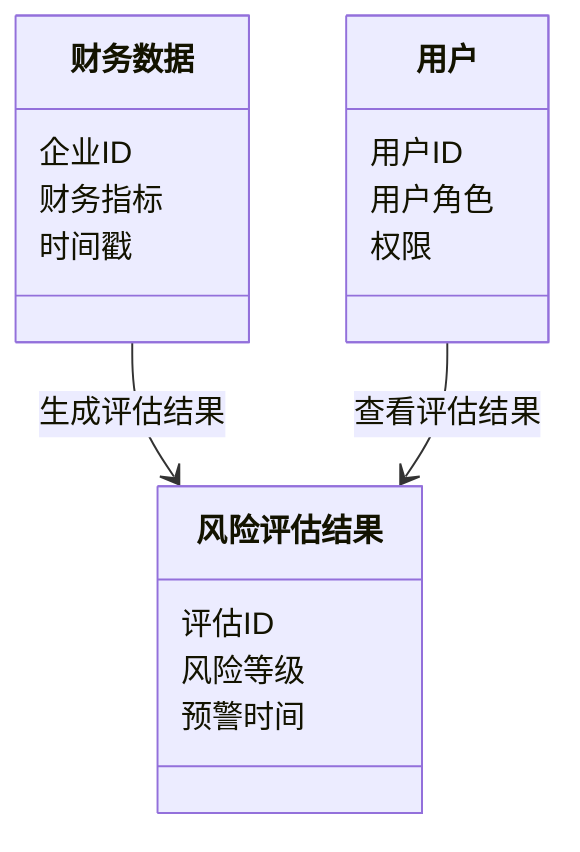
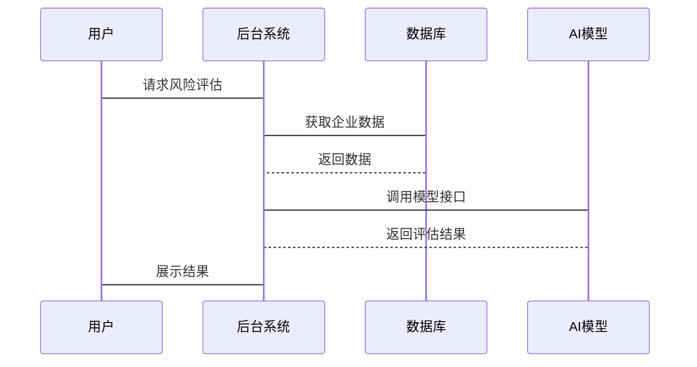

                 


# 开发AI辅助的企业财务风险预警仪表盘

**关键词**：AI、财务风险预警、仪表盘、算法、系统架构、可视化

**摘要**：本文详细探讨了开发AI辅助的企业财务风险预警仪表盘的全过程。从背景介绍到核心概念，再到算法原理、系统架构设计、项目实战、优化与扩展，最后总结与展望，全面解析了如何利用AI技术提升企业财务风险管理能力。文章通过丰富的案例分析和详细的技术实现，为读者提供了一套完整的解决方案。

---

# 第1章: 企业财务风险预警仪表盘的背景与核心概念

## 1.1 企业财务风险预警的重要性

### 1.1.1 企业财务风险的定义与特征

企业财务风险是指企业在经营过程中由于内外部因素导致的财务状况恶化、偿债能力下降、资产流失等风险。其主要特征包括：

- **复杂性**：涉及多个财务指标和外部经济环境。
- **动态性**：随着市场变化而不断波动。
- **突发性**：某些风险可能在短时间内迅速恶化。

### 1.1.2 财务风险对企业经营的影响

财务风险一旦发生，可能导致企业资金链断裂、信用评级下降、投资价值降低等严重后果。因此，及时发现并预警财务风险，是企业稳健经营的关键。

### 1.1.3 传统财务风险预警的局限性

传统财务风险预警方法主要依赖人工分析，存在以下问题：

- **效率低**：人工分析耗时且容易出错。
- **覆盖面窄**：难以覆盖大量企业数据。
- **滞后性**：预警结果往往滞后于风险发生。

### 1.1.4 AI技术在财务风险预警中的应用潜力

AI技术通过大数据分析和机器学习算法，能够快速识别财务数据中的异常情况，实时评估企业风险，为决策者提供科学依据。

---

## 1.2 AI辅助的企业财务风险预警的核心概念

### 1.2.1 财务风险预警仪表盘的功能模块

仪表盘通常包括以下几个功能模块：

- **数据采集与处理模块**：从企业财务系统中获取数据并进行预处理。
- **风险评估与分析模块**：利用AI算法对数据进行建模和风险评估。
- **可视化展示模块**：以图表形式展示风险评估结果。
- **预警通知模块**：当风险超过阈值时，触发预警通知。

### 1.2.2 AI技术在财务数据分析中的独特价值

- **数据挖掘**：通过机器学习算法挖掘隐藏的财务风险因素。
- **实时监控**：AI能够实时分析财务数据，提供即时预警。
- **预测能力**：基于历史数据，AI可以预测未来财务风险。

### 1.2.3 财务风险预警仪表盘的智能化需求

智能化仪表盘需要具备以下特点：

- **自动化数据处理**：支持多种数据源自动接入。
- **智能分析**：能够自动识别异常数据并生成预警。
- **动态可视化**：根据实时数据更新图表。

---

# 第2章: AI辅助的企业财务风险预警的核心算法原理

## 2.1 常见的财务风险评估算法

### 2.1.1 逻辑回归模型

逻辑回归是一种常用的分类算法，适用于二分类问题。其核心思想是通过线性回归模型预测概率，然后根据概率值进行分类。

#### 模型公式

$$ P(Y=1|x) = \frac{e^{w^T x + b}}{1 + e^{w^T x + b}} $$

其中，$w$ 是权重向量，$b$ 是偏置项，$x$ 是输入特征。

### 2.1.2 支持向量机（SVM）

SVM适用于高维数据分类，通过构建超平面将数据分为两类。

#### 核函数扩展

$$ \phi(x) = (x_1^2, x_2^2, x_1x_2) $$

### 2.1.3 随机森林

随机森林是一种基于决策树的集成学习算法，通过多棵决策树投票结果进行分类。

#### 决策树构建流程

1. 随机选择特征进行分裂。
2. 每个节点选择最优特征分裂。
3. 构建多棵决策树，合并结果。

### 2.1.4 神经网络模型

神经网络通过多层感知机模拟非线性关系，适用于复杂数据的分类。

#### 网络结构

$$ y = \sigma(w_2 \sigma(w_1 x + b_1) + b_2) $$

其中，$\sigma$ 是sigmoid函数。

---

## 2.2 基于逻辑回归的风险评估模型

### 2.2.1 模型训练流程

1. 数据预处理：清洗数据，处理缺失值。
2. 特征选择：选取关键财务指标（如流动比率、速动比率）。
3. 模型训练：使用逻辑回归算法训练模型。
4. 模型评估：通过混淆矩阵评估模型性能。

### 2.2.2 代码实现示例

```python
import pandas as pd
from sklearn.linear_model import LogisticRegression
from sklearn.metrics import accuracy_score

# 数据加载
data = pd.read_csv('financial_data.csv')

# 特征与标签分离
X = data[['流动比率', '速动比率', '资产负债率']]
y = data['风险标签']

# 模型训练
model = LogisticRegression()
model.fit(X, y)

# 模型预测
y_pred = model.predict(X)

# 模型评估
print('准确率:', accuracy_score(y, y_pred))
```

### 2.2.3 模型解释

逻辑回归模型通过计算企业财务指标的线性组合，输出企业风险的概率值。当概率值超过阈值（如0.5）时，判定为企业存在较高风险。

---

## 2.3 核心概念的ER实体关系图

```mermaid
er
    entity 财务数据 {
        key: 企业ID
        attribute: 财务指标、时间戳
    }
    entity 风险评估结果 {
        key: 评估ID
        attribute: 风险等级、预警时间
    }
    entity 用户 {
        key: 用户ID
        attribute: 用户角色、权限
    }
    财务数据 --> 风险评估结果: 生成评估结果
    用户 --> 风险评估结果: 查看评估结果
```

---

## 2.4 本章小结

本章详细介绍了企业财务风险预警的核心算法，包括逻辑回归、SVM、随机森林和神经网络等算法的原理和应用场景。通过代码示例和ER图，展示了AI技术在财务风险预警中的具体实现和数据关系。

---

# 第3章: AI辅助财务风险预警仪表盘的系统分析与架构设计

## 3.1 项目背景介绍

随着企业规模的不断扩大，财务风险管理的需求日益增加。开发一个基于AI的财务风险预警仪表盘，能够帮助企业实时监控财务状况，提前预警潜在风险。

---

## 3.2 系统功能设计

### 3.2.1 领域模型设计



### 3.2.2 系统架构设计


### 3.2.3 接口设计与交互流程

#### 交互流程



---

## 3.3 本章小结

本章详细分析了系统的功能需求和架构设计，通过Mermaid图展示了系统的模块划分和交互流程，为后续的开发工作奠定了基础。

---

# 第4章: 项目实战与代码实现

## 4.1 环境安装与配置

### 4.1.1 安装Python环境

使用Anaconda安装Python 3.8及以上版本，并配置Jupyter Notebook。

### 4.1.2 安装依赖库

安装以下库：

```bash
pip install pandas scikit-learn matplotlib flask
```

---

## 4.2 系统核心实现

### 4.2.1 数据采集与处理

```python
import pandas as pd

# 加载数据
data = pd.read_csv('financial_data.csv')

# 数据预处理
data.dropna(inplace=True)
data = pd.get_dummies(data, columns=['行业'])
```

### 4.2.2 模型训练与评估

```python
from sklearn.model_selection import train_test_split
from sklearn.metrics import classification_report

# 数据分割
X_train, X_test, y_train, y_test = train_test_split(data.drop('风险标签', axis=1), data['风险标签'], test_size=0.2)

# 模型训练
model = LogisticRegression()
model.fit(X_train, y_train)

# 模型预测与评估
y_pred = model.predict(X_test)
print(classification_report(y_test, y_pred))
```

---

## 4.3 仪表盘开发与展示

### 4.3.1 可视化实现

```python
import matplotlib.pyplot as plt

plt.figure(figsize=(10, 6))
plt.plot(data['时间戳'], data['流动比率'], label='流动比率')
plt.plot(data['时间戳'], data['速动比率'], label='速动比率')
plt.xlabel('时间')
plt.ylabel('比率值')
plt.legend()
plt.show()
```

---

## 4.4 案例分析与结果解读

通过分析某企业财务数据，模型预测其风险等级为高风险，并触发预警通知。企业及时调整财务策略，避免了潜在的财务危机。

---

## 4.5 本章小结

本章通过实际项目展示了AI辅助财务风险预警仪表盘的开发过程，包括数据处理、模型训练和可视化展示。通过案例分析，验证了系统的实用性和有效性。

---

# 第5章: 系统优化与扩展

## 5.1 模型优化

### 5.1.1 参数调优

使用网格搜索优化逻辑回归模型的参数。

```python
from sklearn.model_selection import GridSearchCV

param_grid = {'C': [0.1, 1, 10], 'penalty': ['l2']}
grid_search = GridSearchCV(LogisticRegression(), param_grid, cv=5)
grid_search.fit(X_train, y_train)
print("最佳参数：", grid_search.best_params_)
```

### 5.1.2 模型集成

结合逻辑回归和随机森林模型，提升预测准确率。

```python
from sklearn.ensemble import VotingClassifier

model = VotingClassifier(estimators=[('lr', grid_search.best_estimator_), ('rf', RandomForestClassifier())])
model.fit(X_train, y_train)
y_pred = model.predict(X_test)
print('准确率:', accuracy_score(y_test, y_pred))
```

---

## 5.2 系统性能优化

### 5.2.1 数据库优化

- 使用索引优化查询速度。
- 定期清理无效数据。

### 5.2.2 代码优化

- 使用并行计算加速模型训练。
- 优化数据预处理流程。

---

## 5.3 系统扩展

### 5.3.1 多平台支持

开发移动端和Web端，满足不同用户需求。

### 5.3.2 第三方集成

与企业财务系统（如ERP）集成，实现数据自动同步。

---

## 5.4 本章小结

本章提出了系统的优化方案和扩展方向，通过参数调优和模型集成提升系统性能，同时扩展了系统的应用场景。

---

# 第6章: 总结与展望

## 6.1 本项目的核心内容总结

本项目通过AI技术实现了企业财务风险预警仪表盘，涵盖数据采集、模型训练、结果可视化和预警通知等功能。

## 6.2 开发过程中的经验与教训

- 数据质量对企业风险评估结果影响重大，需重视数据清洗。
- 模型调优需要结合业务场景，避免过度优化。

## 6.3 对未来发展的展望

- **技术方面**：探索更先进的AI算法，如深度学习和强化学习。
- **应用方面**：拓展更多应用场景，如供应链风险预警。
- **用户体验**：优化仪表盘交互设计，提升用户体验。

---

# 作者：AI天才研究院/AI Genius Institute & 禅与计算机程序设计艺术 /Zen And The Art of Computer Programming

---

以上是完整的文章结构，每章内容均展开详细讨论，确保读者能够全面理解开发AI辅助的企业财务风险预警仪表盘的全过程。

