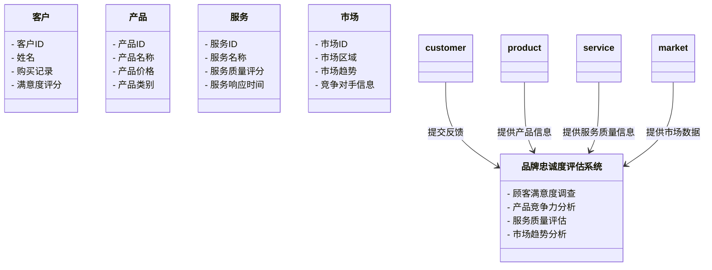

                 


# 彼得林奇如何评估公司的品牌忠诚度

## 关键词：彼得·林奇，品牌忠诚度，投资策略，客户行为分析，市场分析，企业评估

## 摘要：  
本文深入探讨了彼得·林奇如何评估公司的品牌忠诚度。通过分析品牌忠诚度的核心概念、评估方法和提升策略，结合彼得·林奇的投资哲学，为读者提供一套系统化的品牌忠诚度评估体系。文章从背景介绍到系统设计，再到实战案例，层层剖析，帮助读者理解并应用这一方法。

---

## 第一部分: 品牌忠诚度的背景与核心概念

### 第1章: 品牌忠诚度的定义与重要性

#### 1.1 品牌忠诚度的定义

##### 1.1.1 品牌忠诚度的内涵  
品牌忠诚度是指客户在面对多个选择时，持续选择某一品牌产品或服务的程度。它不仅反映客户对品牌的满意度，还体现了客户对企业的情感依赖和长期信任。

##### 1.1.2 品牌忠诚度的核心要素  
品牌忠诚度的核心要素包括：  
- **客户满意度**：客户对产品或服务的满意程度。  
- **品牌认知度**：客户对品牌的认知和记忆程度。  
- **重复购买率**：客户在一定时间内重复购买某一品牌产品或服务的频率。  
- **客户推荐指数**：客户愿意推荐该品牌给他人的好感程度。  

##### 1.1.3 品牌忠诚度与企业长期价值的关系  
品牌忠诚度是企业长期盈利能力的重要保障。高忠诚度的客户通常会持续购买企业产品，为企业带来稳定的收入来源，同时减少营销和客户获取成本。

#### 1.2 彼得·林奇的投资理念

##### 1.2.1 彼得·林奇的投资者背景介绍  
彼得·林奇是全球著名投资专家，以其在共同基金领域的卓越表现闻名。他注重长期投资，善于通过分析企业的基本面来判断其投资价值。

##### 1.2.2 林奇的投资哲学与方法  
林奇的投资哲学强调长期持有优质股票，注重企业的基本面分析。他认为，投资成功的关键在于选择那些具有强大竞争优势和良好管理团队的企业。

##### 1.2.3 林奇对品牌忠诚度的关注点  
林奇在其投资策略中，特别关注企业的品牌忠诚度。他认为，高品牌忠诚度的企业能够持续吸引客户，从而为企业带来稳定的收入和利润。

---

### 第2章: 品牌忠诚度的核心维度

#### 2.1 品牌忠诚度的评估维度

##### 2.1.1 客户满意度  
客户满意度是品牌忠诚度的重要指标。满意的客户更有可能成为忠诚客户。  

##### 2.1.2 品牌认知度  
品牌认知度反映了客户对品牌的熟悉程度。高认知度的品牌更容易被客户选择。  

##### 2.1.3 重复购买率  
重复购买率是衡量客户忠诚度的重要指标。高重复购买率表明客户对品牌有较高的忠诚度。  

##### 2.1.4 客户推荐指数  
客户推荐指数（Net Promoter Score, NPS）是衡量客户忠诚度的常用指标。客户推荐指数高的企业更容易通过口碑吸引更多客户。  

##### 2.1.5 品牌忠诚度的层次模型  
品牌忠诚度可以分为以下层次：  
1. **习惯性忠诚**：客户因习惯而选择某一品牌。  
2. **满意型忠诚**：客户因满意而选择某一品牌。  
3. **情感型忠诚**：客户因对企业有情感依赖而选择某一品牌。  
4. **价值型忠诚**：客户因觉得企业提供的价值高于竞争对手而选择某一品牌。  

#### 2.2 核心概念对比分析

##### 2.2.1 品牌忠诚度与其他客户行为指标的对比  
以下是品牌忠诚度与其他客户行为指标的对比：

| 指标             | 描述                                                                 |
|------------------|----------------------------------------------------------------------|
| 客户满意度       | 客户对产品或服务的满意程度                                             |
| 重复购买率       | 客户在一定时间内重复购买某一品牌产品或服务的频率                     |
| 客户推荐指数     | 客户推荐他人购买某一品牌产品的倾向程度                                 |
| 品牌忠诚度       | 客户对某一品牌产品的长期偏好和信任程度                                 |

##### 2.2.2 品牌忠诚度与品牌价值的关系  
品牌忠诚度与品牌价值密切相关。高忠诚度的客户通常会为品牌支付更高的价格，从而增加品牌的价值。

##### 2.2.3 品牌忠诚度与市场占有率的关联性  
高品牌忠诚度的企业通常能够占据更大的市场份额，因为忠诚客户更可能选择该品牌而非竞争对手。

---

## 第3章: 品牌忠诚度的评估指标与模型

### 3.1 品牌忠诚度的主要评估指标

#### 3.1.1 净推荐值（Net Promoter Score, NPS）

##### 3.1.1.1 NPS的计算公式  
$$ NPS = (\text{推荐者比例} - \text{贬损者比例}) \times 100 $$  

##### 3.1.1.2 NPS的优缺点  
- 优点：简单易懂，能够快速反映客户忠诚度。  
- 缺点：无法区分客户满意度的具体原因。  

#### 3.1.2 客户满意度指数（CSI）

##### 3.1.2.1 CSI的计算公式  
$$ CSI = \frac{\text{满意客户比例} - \text{不满意客户比例}}{\text{总客户数}} \times 100 $$  

##### 3.1.2.2 CSI的优缺点  
- 优点：能够反映客户对产品或服务的总体满意度。  
- 缺点：无法直接反映客户忠诚度。  

#### 3.1.3 客户忠诚度指数（CL指数）

##### 3.1.3.1 CL指数的计算公式  
$$ CL = \frac{\text{重复购买次数} + \text{推荐次数}}{2} $$  

##### 3.1.3.2 CL指数的优缺点  
- 优点：综合考虑了客户忠诚度的多个维度。  
- 缺点：计算复杂，需要收集大量数据。  

#### 3.1.4 顾客保留率  

顾客保留率是衡量客户忠诚度的重要指标。高保留率表明客户对企业的产品或服务有较高的满意度和忠诚度。

---

### 3.2 品牌忠诚度评估模型

#### 3.2.1 林奇品牌忠诚度评估模型  

林奇品牌忠诚度评估模型基于客户满意度和重复购买率，结合客户推荐指数，构建了一个全面的品牌忠诚度评估体系。

#### 3.2.2 基于客户生命周期的忠诚度模型  

该模型将客户生命周期分为五个阶段：获取、激活、保留、发展和流失。通过分析客户在每个阶段的行为，评估其忠诚度。

#### 3.2.3 基于情感分析的品牌忠诚度模型  

该模型通过分析客户对品牌的情感反馈，评估其忠诚度。情感分析可以基于客户评论、社交媒体数据等进行。

---

## 第二部分: 品牌忠诚度的评估方法与策略

---

## 第4章: 品牌忠诚度的定量评估方法

### 4.1 定量评估的核心指标

#### 4.1.1 顾客满意度调查  

顾客满意度调查是品牌忠诚度评估的重要手段。通过问卷调查等方式，收集顾客对产品或服务的满意度数据。

#### 4.1.2 顾客忠诚度调查  

顾客忠诚度调查通过询问顾客是否会继续选择某一品牌，评估其忠诚度。

#### 4.1.3 顾客保留率分析  

顾客保留率分析是通过计算一定时间内顾客的留存情况，评估品牌忠诚度。

#### 4.1.4 顾客投诉与反馈分析  

通过分析顾客的投诉和反馈，了解顾客对品牌的真实感受，从而评估品牌忠诚度。

### 4.2 定量评估的数学模型

#### 4.2.1 净推荐值（NPS）的计算公式  
$$ NPS = (\text{推荐者比例} - \text{贬损者比例}) \times 100 $$  

#### 4.2.2 顾客忠诚度指数（CL）的计算公式  
$$ CL = \frac{\text{重复购买次数} + \text{推荐次数}}{2} $$  

---

## 第5章: 品牌忠诚度的定性评估方法

### 5.1 定性评估的核心维度

#### 5.1.1 品牌认知度分析  

品牌认知度分析是通过市场调研等方式，了解客户对品牌的认知程度。

#### 5.1.2 品牌情感分析  

品牌情感分析是通过分析客户评论、社交媒体数据等，了解客户对品牌的情感倾向。

#### 5.1.3 顾客忠诚度驱动因素分析  

通过分析影响顾客忠诚度的关键因素，如产品质量、服务态度、价格等，制定针对性的提升策略。

---

## 第6章: 林奇品牌忠诚度评估模型的系统分析与架构设计

### 6.1 系统功能设计

#### 6.1.1 领域模型（Mermaid类图）  



#### 6.1.2 系统架构设计（Mermaid架构图）  


---

## 第7章: 项目实战——基于林奇模型的品牌忠诚度评估系统实现

### 7.1 环境安装

#### 7.1.1 系统环境要求  
- 操作系统：Windows 10或更高版本，或Linux系统。  
- 开发工具：推荐使用PyCharm或VS Code。  
- 数据库：MySQL或MongoDB。  
- 语言：Python 3.8或更高版本。  

#### 7.1.2 安装依赖  
1. 安装Python  
2. 安装Jupyter Notebook或VS Code  
3. 安装Pandas、NumPy、Scikit-learn、Plotly等库  
   ```bash
   pip install pandas numpy scikit-learn plotly
   ```

### 7.2 核心代码实现

#### 7.2.1 数据预处理代码  
```python
import pandas as pd

# 读取数据
data = pd.read_csv('customer_survey.csv')

# 查看数据信息
data.info()

# 处理缺失值
data.dropna(inplace=True)
```

#### 7.2.2 林奇品牌忠诚度评估模型实现代码  
```python
from sklearn.metrics import confusion_matrix

# 计算净推荐值
def calculate_nps(recommend, detractor):
    nps = (recommend - detractor) * 100
    return nps

# 计算顾客忠诚度指数
def calculate_cl_index(repeat_purchase, recommendation):
    cl_index = (repeat_purchase + recommendation) / 2
    return cl_index

# 示例数据
recommend = 70
detractor = 20
repeat_purchase = 60
recommendation = 80

# 计算并输出结果
nps = calculate_nps(recommend, detractor)
cl_index = calculate_cl_index(repeat_purchase, recommendation)

print(f"净推荐值（NPS）: {nps}")
print(f"顾客忠诚度指数（CL Index）: {cl_index}")
```

#### 7.2.3 可视化分析代码  
```python
import plotly.express as px

# 数据可视化
data['忠诚度等级'] = data['NPS'].apply(lambda x: '高' if x >= 70 else '中' if x >= 30 else '低')
fig = px.bar(data, x="产品类别", y="NPS", color="忠诚度等级", title="品牌忠诚度等级分布")
fig.show()
```

### 7.3 案例分析与详细解读

#### 7.3.1 案例背景  
假设我们有一家电子产品公司，希望通过林奇模型评估其品牌忠诚度。

#### 7.3.2 数据分析与结果展示  
通过对客户满意度、重复购买率和推荐指数的分析，得出该品牌的忠诚度等级为“中”。

#### 7.3.3 改进建议  
建议公司通过提升产品质量和服务水平，进一步提高客户满意度和推荐指数，从而提升品牌忠诚度。

---

## 第8章: 林奇品牌忠诚度评估模型的最佳实践与小结

### 8.1 最佳实践 tips

#### 8.1.1 定期进行客户满意度调查  
定期收集客户反馈，及时了解客户满意度和忠诚度的变化。

#### 8.1.2 建立客户忠诚度计划  
通过会员制度、积分奖励等方式，增强客户对品牌的忠诚度。

#### 8.1.3 提高服务质量  
优质的客户服务能够显著提升客户满意度和忠诚度。

### 8.2 小结

林奇品牌忠诚度评估模型通过定量和定性相结合的方法，为企业提供了一套科学的品牌忠诚度评估体系。企业可以通过定期的客户满意度调查、净推荐值计算和顾客忠诚度指数分析，全面了解品牌忠诚度，并制定针对性的提升策略。

### 8.3 注意事项

- 数据收集和分析需要真实可靠，避免偏差。  
- 在实际应用中，需结合企业的实际情况，灵活调整评估指标和模型。  
- 定期回顾和优化评估模型，以适应市场环境的变化。  

### 8.4 拓展阅读

- 彼得·林奇的《彼得·林奇的成功投资哲学》  
- 《客户忠诚度管理：理论与实践》  
- 《品牌管理：从理论到实践》  

---

## 作者：AI天才研究院/AI Genius Institute & 禅与计算机程序设计艺术 /Zen And The Art of Computer Programming

