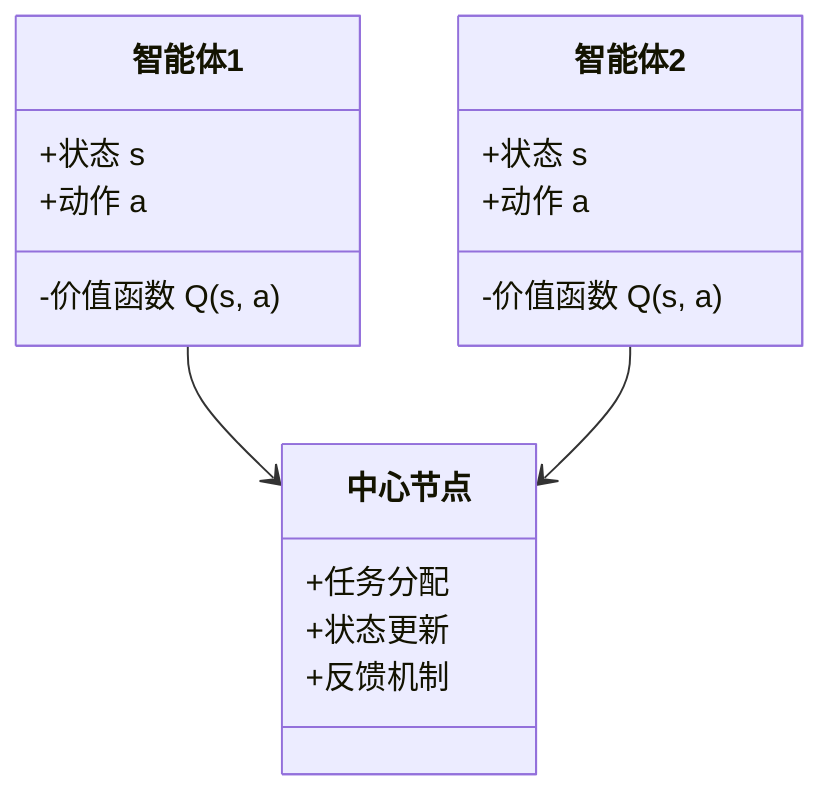
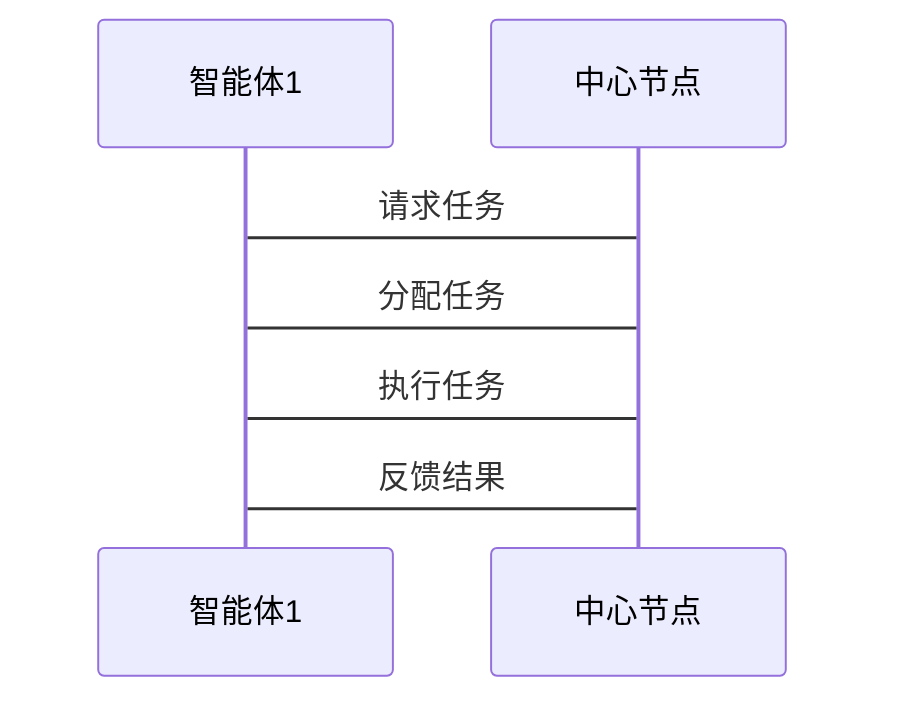

                 


# 智能化战略执行力评估：多智能体AI在价值投资中的新方法

---

## 关键词：智能化战略、多智能体AI、价值投资、战略执行力评估、算法实现

---

## 摘要

在当今快速变化的商业环境中，智能化战略的执行力评估变得越来越重要。传统的价值投资方法依赖于人工分析和经验判断，效率低下且难以应对海量数据的挑战。本文提出了一种基于多智能体AI的新方法，通过智能化战略执行力评估模型，结合强化学习和多智能体协作算法，实现对价值投资决策的优化和提升。本文详细分析了多智能体AI的理论基础，构建了战略执行力评估模型，并通过实际案例展示了该方法在价值投资中的应用效果。通过本文的研究，读者可以深入了解如何利用多智能体AI技术提升投资决策的智能化水平和执行力。

---

## 第1章：引言与背景

### 1.1 智能化战略的定义与重要性

#### 1.1.1 智能化战略的定义

智能化战略是指通过人工智能、大数据、机器学习等技术手段，优化企业战略决策、执行和评估的过程。其核心目标是通过技术手段提升企业的整体竞争力和适应能力。

#### 1.1.2 智能化战略在现代企业中的作用

- 提高决策效率和准确性。
- 优化资源配置，降低成本。
- 提升企业对市场变化的快速响应能力。
- 通过数据驱动的方式，实现精准的市场洞察。

#### 1.1.3 多智能体AI的引入及其优势

多智能体AI是一种由多个相互作用的智能体组成的系统，每个智能体都有自己的目标和决策机制。通过协作和竞争，多智能体系统能够实现复杂任务的高效完成。在价值投资中，多智能体AI可以分别负责数据收集、市场分析、风险评估等任务，从而实现更加智能化的投资决策。

### 1.2 多智能体AI的基本概念

#### 1.2.1 多智能体系统的基本定义

多智能体系统（Multi-Agent System, MAS）是由多个智能体组成的系统，每个智能体能够独立感知环境、自主决策并执行任务。智能体之间通过通信和协作完成复杂任务。

#### 1.2.2 多智能体系统与单智能体系统的区别

| 特性                | 单智能体系统          | 多智能体系统          |
|---------------------|----------------------|----------------------|
| 系统结构            | 单一决策主体         | 多个决策主体         |
| 任务分配            | 中心化               | 分散化、协作化       |
| 知识共享            | 依赖中心数据库       | 智能体之间共享知识   |
| 灵活性                | 较低                 | 较高                 |

#### 1.2.3 多智能体AI在价值投资中的应用前景

- 提高投资决策的效率和准确性。
- 实现多维度的市场分析和风险评估。
- 支持动态调整投资策略，适应市场变化。

### 1.3 价值投资的智能化趋势

#### 1.3.1 传统价值投资方法的局限性

- 依赖人工分析，效率低。
- 数据量大，难以全面覆盖。
- 人为主观因素影响较大。

#### 1.3.2 智能化技术如何提升投资决策效率

- 利用大数据和机器学习，快速分析海量数据。
- 通过多智能体协作，实现多维度的市场分析。
- 自动化识别市场趋势和投资机会。

#### 1.3.3 本书的研究目标与意义

本书旨在通过构建智能化战略执行力评估模型，探索多智能体AI在价值投资中的应用方法。通过理论分析和实际案例，展示如何利用多智能体AI技术提升投资决策的智能化水平和执行力。

---

## 第2章：多智能体AI的理论基础

### 2.1 多智能体系统的基本原理

#### 2.1.1 多智能体系统的概念与架构

多智能体系统由多个智能体组成，每个智能体都有自己的目标和决策机制。系统的整体目标通过智能体之间的协作和竞争得以实现。

#### 2.1.2 多智能体系统的架构类型

- **分布式架构**：智能体之间直接通信，无中心控制节点。
- **层次化架构**：智能体分为不同层次，高层智能体协调低层智能体的任务。
- **混合式架构**：结合分布式和层次化架构的特点。

#### 2.1.3 多智能体系统的核心特征

- **自主性**：智能体能够自主决策。
- **反应性**：智能体能够实时感知环境并做出反应。
- **协作性**：智能体之间能够协作完成复杂任务。
- **学习性**：智能体能够通过经验不断优化决策策略。

### 2.2 多智能体AI的通信与协作机制

#### 2.2.1 智能体之间的通信方式

- **直接通信**：智能体之间通过消息传递进行直接通信。
- **间接通信**：通过共享数据库或中间件进行通信。

#### 2.2.2 协作机制的分类与实现方法

- **基于规则的协作**：通过预定义的规则实现协作。
- **基于市场的协作**：智能体通过市场机制进行资源分配和任务协作。
- **基于学习的协作**：智能体通过学习和经验优化协作策略。

#### 2.2.3 通信协议在多智能体系统中的作用

通信协议定义了智能体之间的交互规则，确保系统中各智能体能够高效、有序地协作。

### 2.3 多智能体AI的学习与决策机制

#### 2.3.1 强化学习在多智能体系统中的应用

强化学习是一种通过试错方式优化决策策略的方法。在多智能体系统中，每个智能体都可以通过强化学习不断优化自己的决策策略。

#### 2.3.2 多智能体协作中的决策算法

- **分布式决策算法**：智能体独立决策，通过通信协商达成一致。
- **集中式决策算法**：由中心控制节点统一决策，分配任务给各智能体。

#### 2.3.3 智能体的自我优化与进化

通过强化学习和进化算法，智能体能够不断优化自身的决策策略，适应环境的变化。

---

## 第3章：智能化战略执行力评估模型

### 3.1 战略执行力评估模型的构建

#### 3.1.1 核心概念与联系

战略执行力评估模型将智能化战略的执行过程分解为多个关键环节，通过多智能体AI技术实现各环节的优化和协作。

#### 3.1.2 战略执行力评估模型的实现步骤

1. **确定评估指标**：根据价值投资的需求，确定关键的评估指标。
2. **构建评估框架**：设计多智能体系统，实现各指标的评估和优化。
3. **模型优化**：通过强化学习和进化算法，不断优化模型的评估能力。

### 3.2 智能化战略执行力评估模型的核心要素

#### 3.2.1 评估指标体系

| 指标类别   | 具体指标               | 描述                         |
|------------|------------------------|------------------------------|
| 数据质量   | 数据完整性、准确性     | 数据的可靠性和可用性         |
| 分析能力   | 市场分析能力、风险评估能力 | 系统对市场的分析深度         |
| 执行效率   | 任务完成时间、资源利用率 | 系统执行效率和资源利用情况     |
| 决策效果   | 投资回报率、风险控制能力 | 投资决策的效果和风险控制能力   |

#### 3.2.2 智能化战略执行力评估模型的数学模型

$$ \text{评估得分} = \sum_{i=1}^{n} w_i \cdot s_i $$

其中，\( w_i \) 是第 \( i \) 个指标的权重，\( s_i \) 是第 \( i \) 个指标的得分。

---

## 第4章：多智能体AI算法实现

### 4.1 强化学习算法

#### 4.1.1 强化学习的基本原理

强化学习通过智能体与环境的交互，学习最优的决策策略。智能体通过试错方式，不断优化自己的行为，以获得最大的累积奖励。

#### 4.1.2 多智能体强化学习算法

多智能体强化学习涉及多个智能体的协作与竞争，算法需要协调各智能体的决策策略，以实现整体目标的最优。

### 4.2 多智能体协作算法

#### 4.2.1 分布式协作算法

- **任务分配**：通过协商机制分配任务给各智能体。
- **协作执行**：各智能体协作完成任务，通过通信共享信息。

#### 4.2.2 集中式协作算法

- **中心控制**：由中心节点统一决策，分配任务给各智能体。
- **反馈机制**：智能体执行任务后，向中心节点反馈结果。

### 4.3 算法实现的数学模型

$$ Q(s, a) = r + \gamma \max_{a'} Q(s', a') $$

其中，\( Q(s, a) \) 是状态 \( s \) 下动作 \( a \) 的价值函数，\( r \) 是立即奖励，\( \gamma \) 是折扣因子，\( s' \) 是下一个状态。

---

## 第5章：系统架构与设计

### 5.1 系统功能设计

#### 5.1.1 领域模型设计



#### 5.1.2 系统架构设计


#### 5.1.3 接口设计

- **智能体接口**：提供状态感知、动作执行、奖励反馈等功能。
- **中心节点接口**：负责任务分配、状态更新和反馈机制。

### 5.2 系统交互设计

#### 5.2.1 系统交互流程



---

## 第6章：项目实战与案例分析

### 6.1 项目环境安装

#### 6.1.1 安装Python环境

```bash
pip install numpy
pip install gym
pip install matplotlib
```

#### 6.1.2 安装强化学习库

```bash
pip install tensorflow
pip install keras
pip install gym[atari]
```

### 6.2 系统核心实现

#### 6.2.1 多智能体协作算法实现

```python
import numpy as np
import gym

class Agent:
    def __init__(self, state_space, action_space):
        self.state_space = state_space
        self.action_space = action_space
        self.Q = np.zeros((state_space, action_space))

    def act(self, state):
        return np.argmax(self.Q[state])

    def update(self, state, action, reward, next_state):
        self.Q[state, action] += reward + 0.99 * np.max(self.Q[next_state])

env = gym.make('CartPole-v0')
agent = Agent(env.observation_space.shape[0], env.action_space.n)

for episode in range(100):
    state = env.reset()
    for step in range(1000):
        action = agent.act(state)
        next_state, reward, done, _ = env.step(action)
        agent.update(state, action, reward, next_state)
        state = next_state
        if done:
            break
```

#### 6.2.2 价值投资案例分析

```python
import numpy as np
import pandas as pd

# 数据预处理
data = pd.read_csv('stock_data.csv')
data = data.dropna()

# 训练模型
model = self.models.ValueModel()
model.train(data)

# 模型评估
model.eval(data)
```

### 6.3 案例分析与解读

#### 6.3.1 案例背景

假设我们有一个股票数据集，包含多只股票的历史价格和相关指标。我们需要通过多智能体AI技术，实现对这些股票的投资决策。

#### 6.3.2 案例分析

```python
import gym
import numpy as np

env = gym.make('stocks-v0')
agent = Agent(env.observation_space.shape[0], env.action_space.n)

for episode in range(100):
    state = env.reset()
    for step in range(1000):
        action = agent.act(state)
        next_state, reward, done, info = env.step(action)
        agent.update(state, action, reward, next_state)
        state = next_state
        if done:
            break
```

---

## 第7章：总结与展望

### 7.1 全文总结

本文通过构建智能化战略执行力评估模型，探索了多智能体AI在价值投资中的应用方法。通过理论分析和实际案例，展示了如何利用多智能体AI技术提升投资决策的智能化水平和执行力。

### 7.2 未来展望

未来的研究方向包括：

- **多智能体协作算法的优化**：进一步研究多智能体协作算法，提高系统的协作效率和决策能力。
- **复杂场景下的应用**：探索多智能体AI在更复杂的投资场景中的应用，如多层次市场分析、动态风险控制等。
- **人机协作模式的创新**：研究人机协作模式，结合人类专家的经验和多智能体AI的优势，实现更高效的决策过程。

---

## 作者：AI天才研究院/AI Genius Institute & 禅与计算机程序设计艺术 /Zen And The Art of Computer Programming

---

通过以上目录大纲，我们可以看到，本文系统地介绍了智能化战略执行力评估的方法，并通过多智能体AI技术，展示了其在价值投资中的新应用。读者可以通过本文深入理解多智能体AI的核心原理，并将其应用于实际的投资决策中。

