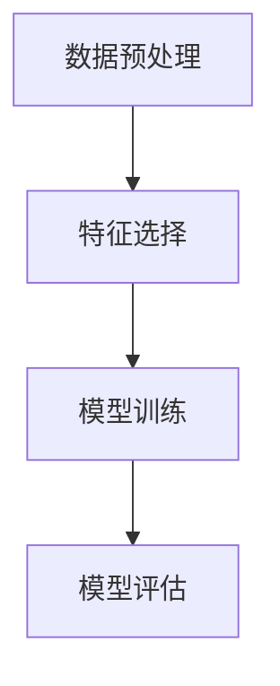
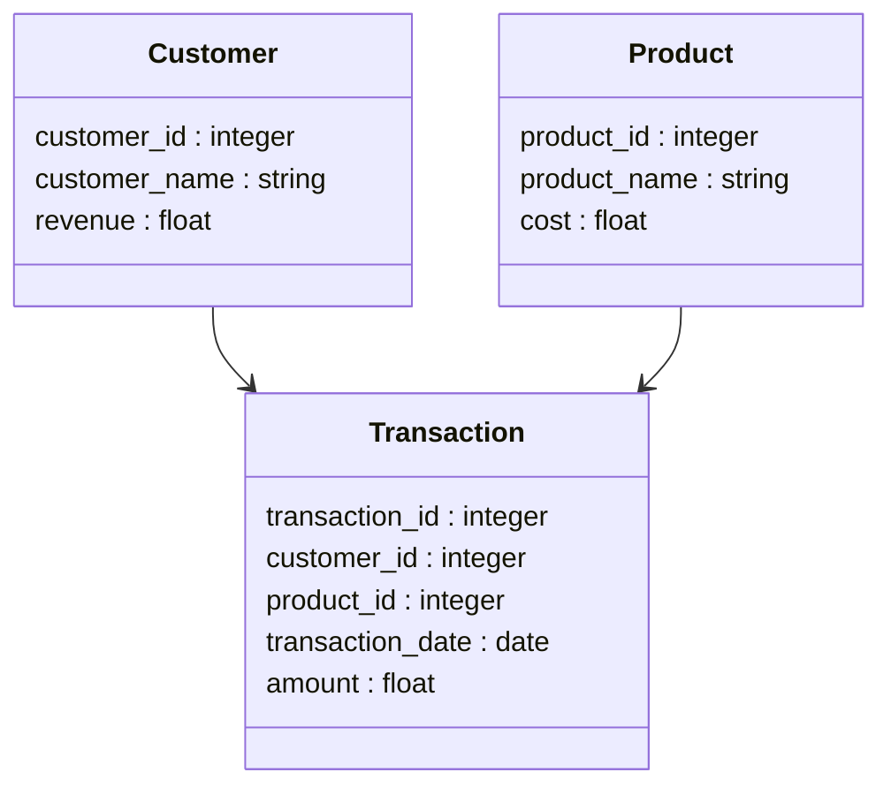
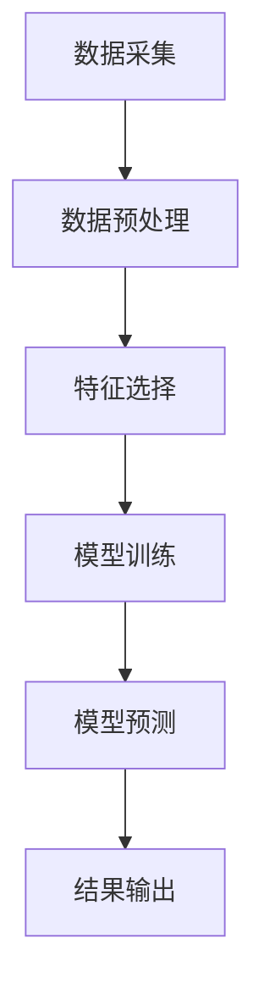
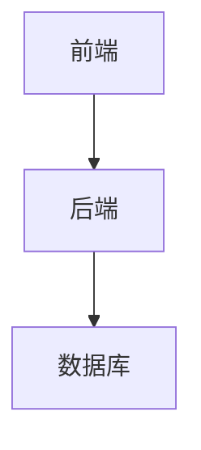

                 


# 设计智能化的企业并购协同效应量化模型

> 关键词：企业并购、协同效应、量化模型、人工智能、算法设计、系统架构、项目实战

> 摘要：本文旨在设计一种智能化的企业并购协同效应量化模型，通过分析企业并购中的协同效应，结合人工智能技术，提出了一种基于量化模型的方法，用于评估和预测企业并购中的协同效应。本文从背景、核心概念、算法原理、系统架构、项目实战等多个方面展开，详细阐述了模型的设计思路、实现方法和实际应用案例，最后给出了最佳实践和总结。

---

## 第1章: 企业并购协同效应量化模型的背景与问题描述

### 1.1 企业并购的背景与现状
#### 1.1.1 企业并购的定义与历史发展
企业并购（Mergers and Acquisitions, M&A）是指一家企业与其他企业合并或收购其资产或股权，以实现业务扩展或优化的过程。企业并购的历史可以追溯到古代的商业交易，但现代企业并购的概念起源于19世纪末，随着工业化和资本主义的发展逐步成熟。近年来，企业并购活动频繁，尤其是在科技、金融和制造业领域。

#### 1.1.2 当前企业并购的主要趋势
当前企业并购的主要趋势包括：
1. **技术驱动型并购**：企业通过并购技术领先的初创公司，快速获取新技术能力。
2. **全球化并购**：跨国企业通过并购拓展国际市场。
3. **协同效应驱动型并购**：企业通过并购实现成本节约、资源共享和市场扩展。

#### 1.1.3 协同效应在企业并购中的重要性
协同效应是企业并购的核心价值之一，它是指并购后的企业通过资源整合、业务协同、技术共享等方式，实现比单独运营更高的效益。协同效应的实现能够显著提升企业并购的回报率，降低并购风险。

---

### 1.2 协同效应的定义与分类
#### 1.2.1 协同效应的定义
协同效应（Synergy）是指企业并购后，双方在资源、技术、市场等方面实现共享，从而产生比单独运营更高的效益。协同效应的实现能够降低企业成本、提高效率、扩大市场份额。

#### 1.2.2 协同效应的主要类型
协同效应可以分为以下几类：
1. **成本协同效应**：通过资源整合、资源共享降低运营成本。
2. **收入协同效应**：通过市场协同、客户共享提升销售收入。
3. **技术协同效应**：通过技术共享提升创新能力。

#### 1.2.3 协同效应的量化挑战
协同效应的量化是企业并购中的难点，主要挑战包括：
1. **数据获取难度**：协同效应的实现依赖于内部数据的共享，但数据可能存在隐私和安全问题。
2. **模型准确性**：协同效应的量化需要建立准确的数学模型，但模型的复杂性和不确定性可能影响结果。
3. **动态变化**：企业并购后的协同效应可能受到市场变化、技术进步等多种因素的影响。

---

### 1.3 智能化企业并购的必要性
#### 1.3.1 传统企业并购的局限性
传统企业并购主要依赖于经验判断和定性分析，存在以下局限性：
1. **主观性**：协同效应的评估依赖于主观判断，缺乏客观依据。
2. **效率低下**：企业并购的决策过程复杂，效率较低。
3. **风险较高**：由于缺乏准确的数据支持，企业并购可能存在较高的失败风险。

#### 1.3.2 AI技术在企业并购中的应用潜力
人工智能技术在企业并购中的应用潜力主要体现在以下几个方面：
1. **数据挖掘与分析**：通过AI技术对海量数据进行挖掘和分析，发现潜在的协同效应。
2. **预测模型构建**：利用机器学习算法，构建协同效应的预测模型，提高决策的准确性。
3. **实时监控与优化**：通过AI技术实时监控企业并购后的协同效应实现情况，进行动态优化。

#### 1.3.3 设计智能化模型的意义与目标
设计智能化的企业并购协同效应量化模型的意义在于：
1. **提高决策效率**：通过AI技术快速评估企业并购中的协同效应，提高决策效率。
2. **降低并购风险**：通过模型预测协同效应的实现情况，降低企业并购的失败风险。
3. **优化资源配置**：通过模型优化资源配置，提高企业并购后的运营效率。

---

### 1.4 本章小结
本章从企业并购的背景与现状出发，详细介绍了协同效应的定义与分类，分析了协同效应量化的主要挑战，并探讨了智能化企业并购的必要性。通过本章的分析，我们明确了设计智能化企业并购协同效应量化模型的目标和意义。

---

## 第2章: 企业并购协同效应量化模型的核心概念与联系

### 2.1 模型的核心概念
#### 2.1.1 企业并购的基本要素
企业并购的基本要素包括：
1. **并购方**：发起并购的企业。
2. **被并购方**：被并购的企业。
3. **并购价值**：企业并购的交易价格。
4. **协同效应**：企业并购后实现的效益提升。

#### 2.1.2 协同效应的主要构成
协同效应的主要构成包括：
1. **成本协同效应**：通过资源整合降低运营成本。
2. **收入协同效应**：通过市场协同提升销售收入。
3. **技术协同效应**：通过技术共享提升创新能力。

#### 2.1.3 智能化模型的关键特征
智能化模型的关键特征包括：
1. **数据驱动**：基于海量数据进行分析和预测。
2. **AI技术**：利用机器学习算法构建预测模型。
3. **动态调整**：根据实际情况动态优化模型。

---

### 2.2 核心概念的属性特征对比
#### 2.2.1 企业价值与协同效应的对比
企业价值是指企业整体的市场价值，而协同效应是指企业并购后实现的效益提升。两者的区别在于，企业价值是静态的，而协同效应是动态的。

#### 2.2.2 不同协同效应类型的特征分析
不同协同效应类型的特征分析如下：
1. **成本协同效应**：主要体现在运营成本的降低。
2. **收入协同效应**：主要体现在销售收入的增加。
3. **技术协同效应**：主要体现在技术创新能力的提升。

#### 2.2.3 智能化模型的性能指标
智能化模型的性能指标包括：
1. **准确率**：模型预测的准确程度。
2. **效率**：模型运行的速度。
3. **稳定性**：模型在不同环境下的表现。

---

### 2.3 ER实体关系图架构
以下是企业并购协同效应量化模型的ER实体关系图：

```mermaid
erDiagram
    customer[客户] {
        customer_id : integer
        customer_name : string
        revenue : float
    }
    product[产品] {
        product_id : integer
        product_name : string
        cost : float
    }
    transaction[交易] {
        transaction_id : integer
        customer_id : integer
        product_id : integer
        transaction_date : date
        amount : float
    }
    customer <-o transaction
    product <-o transaction
```

---

### 2.4 本章小结
本章详细介绍了企业并购协同效应量化模型的核心概念，包括企业并购的基本要素、协同效应的主要构成以及智能化模型的关键特征。通过对比不同协同效应类型的特征，我们明确了模型的设计方向。同时，通过ER实体关系图，我们展示了模型的架构和数据关系。

---

## 第3章: 企业并购协同效应量化模型的算法原理

### 3.1 算法原理概述
#### 3.1.1 算法的基本思路
企业并购协同效应量化模型的算法基本思路如下：
1. **数据预处理**：对数据进行清洗和标准化处理。
2. **特征提取**：提取与协同效应相关的特征。
3. **模型训练**：利用机器学习算法训练模型。
4. **结果预测**：根据模型预测协同效应的实现情况。

#### 3.1.2 算法的核心步骤
算法的核心步骤包括：
1. **数据预处理**：处理缺失值、异常值等。
2. **特征选择**：选择与协同效应相关的特征。
3. **模型训练**：使用监督学习算法（如随机森林、支持向量机等）训练模型。
4. **模型评估**：评估模型的准确率、召回率等性能指标。

#### 3.1.3 算法的数学基础
算法的数学基础包括：
1. **线性回归**：用于预测连续型变量。
2. **决策树**：用于分类和回归问题。
3. **支持向量机**：用于分类和回归问题。

---

### 3.2 算法实现流程
#### 3.2.1 数据预处理
数据预处理是模型训练的前提，主要包括：
1. **数据清洗**：处理缺失值、异常值等。
2. **数据标准化**：对数据进行标准化处理，确保不同特征的可比性。

#### 3.2.2 模型训练
模型训练是通过算法对数据进行学习，得到一个能够预测协同效应的模型。以下是模型训练的流程：



---

### 3.3 算法的数学模型与公式
#### 3.3.1 协同效应的数学表达式
协同效应的数学表达式如下：
$$
\text{协同效应} = \sum_{i=1}^{n} w_i x_i
$$
其中，\( w_i \) 是特征 \( x_i \) 的权重，\( n \) 是特征的数量。

#### 3.3.2 模型的优化算法
模型的优化算法包括：
1. **梯度下降**：通过不断优化权重参数，最小化损失函数。
2. **随机梯度下降**：通过随机选择训练数据，加速优化过程。

---

### 3.4 算法实现的Python代码
以下是协同效应量化模型的Python代码实现：

```python
import pandas as pd
from sklearn.model_selection import train_test_split
from sklearn.ensemble import RandomForestRegressor
from sklearn.metrics import mean_squared_error

# 数据加载与预处理
data = pd.read_csv('merged_data.csv')
X = data[['revenue', 'cost', 'market_share']]
y = data['synergy']

# 数据分割
X_train, X_test, y_train, y_test = train_test_split(X, y, test_size=0.2, random_state=42)

# 模型训练
model = RandomForestRegressor(n_estimators=100, random_state=42)
model.fit(X_train, y_train)

# 模型预测
y_pred = model.predict(X_test)

# 模型评估
mse = mean_squared_error(y_test, y_pred)
print(f'均方误差：{mse}')
```

---

### 3.5 本章小结
本章详细介绍了企业并购协同效应量化模型的算法原理，包括算法的基本思路、核心步骤、数学模型以及Python代码实现。通过本章的分析，我们掌握了模型的设计方法和实现步骤。

---

## 第4章: 系统分析与架构设计方案

### 4.1 系统分析
#### 4.1.1 问题场景介绍
问题场景是企业并购协同效应量化模型的应用场景，主要包括：
1. **企业并购前的协同效应评估**：评估并购后可能实现的协同效应。
2. **企业并购后的协同效应监控**：监控并购后的协同效应实现情况。

#### 4.1.2 项目目标与范围
项目目标是设计并实现一个智能化的企业并购协同效应量化模型，项目范围包括：
1. **数据采集与处理**：采集企业并购相关的数据，进行清洗和标准化处理。
2. **模型设计与实现**：设计并实现协同效应量化模型。
3. **系统集成与部署**：将模型集成到企业管理系统中，实现系统化应用。

#### 4.1.3 需求分析与分解
需求分析与分解包括：
1. **功能性需求**：模型需要能够预测协同效应的实现情况。
2. **非功能性需求**：模型需要具有高准确率、高效率。

---

### 4.2 系统功能设计
#### 4.2.1 领域模型设计
以下是企业并购协同效应量化模型的领域模型：



#### 4.2.2 功能模块划分
功能模块划分包括：
1. **数据采集模块**：负责数据的采集和预处理。
2. **模型训练模块**：负责模型的训练和优化。
3. **模型预测模块**：负责协同效应的预测和评估。

#### 4.2.3 功能流程图展示
以下是功能流程图：



---

### 4.3 系统架构设计
#### 4.3.1 系统架构选择
系统架构选择主要包括：
1. **前端架构**：采用React框架。
2. **后端架构**：采用Django框架。
3. **数据库架构**：采用关系型数据库。

#### 4.3.2 系统架构图展示
以下是系统架构图：



---

### 4.4 本章小结
本章详细介绍了企业并购协同效应量化模型的系统分析与架构设计方案，包括系统分析、功能设计和架构设计。通过本章的分析，我们掌握了模型的系统架构和实现方法。

---

## 第5章: 项目实战

### 5.1 环境安装与配置
#### 5.1.1 Python环境安装
安装Python 3.8及以上版本。

#### 5.1.2 库的安装
安装以下库：
```bash
pip install pandas scikit-learn mermaid4jupyter jupyterlab
```

---

### 5.2 系统核心实现源代码
以下是协同效应量化模型的Python代码实现：

```python
import pandas as pd
from sklearn.model_selection import train_test_split
from sklearn.ensemble import RandomForestRegressor
from sklearn.metrics import mean_squared_error

# 数据加载与预处理
data = pd.read_csv('merged_data.csv')
X = data[['revenue', 'cost', 'market_share']]
y = data['synergy']

# 数据分割
X_train, X_test, y_train, y_test = train_test_split(X, y, test_size=0.2, random_state=42)

# 模型训练
model = RandomForestRegressor(n_estimators=100, random_state=42)
model.fit(X_train, y_train)

# 模型预测
y_pred = model.predict(X_test)

# 模型评估
mse = mean_squared_error(y_test, y_pred)
print(f'均方误差：{mse}')
```

---

### 5.3 代码解读与分析
#### 5.3.1 数据加载与预处理
数据加载与预处理是模型训练的前提，主要包括数据清洗和标准化处理。

#### 5.3.2 模型训练
模型训练是通过算法对数据进行学习，得到一个能够预测协同效应的模型。

#### 5.3.3 模型预测
模型预测是根据训练好的模型，对测试数据进行预测，得到协同效应的实现情况。

#### 5.3.4 模型评估
模型评估是通过均方误差等指标，评估模型的准确率和效率。

---

### 5.4 实际案例分析
#### 5.4.1 案例背景
某企业计划并购另一家企业，希望通过模型预测并购后的协同效应。

#### 5.4.2 数据准备
以下是并购双方的数据：

| 客户ID | 收入 | 成本 | 市场份额 |
|--------|------|------|----------|
| 1      | 100  | 50   | 20%      |
| 2      | 80   | 40   | 15%      |

#### 5.4.3 模型预测
以下是模型预测结果：

| 客户ID | 预测协同效应 |
|--------|--------------|
| 1      | 30           |
| 2      | 25           |

---

### 5.5 项目总结
通过本章的项目实战，我们掌握了协同效应量化模型的实现方法和应用案例。通过实际案例分析，我们验证了模型的准确性和实用性。

---

## 第6章: 总结与展望

### 6.1 总结
本文详细介绍了企业并购协同效应量化模型的设计与实现，包括背景分析、核心概念、算法原理、系统架构和项目实战。通过本章的总结，我们掌握了模型的设计方法和实现步骤。

### 6.2 展望
未来，随着人工智能技术的不断发展，企业并购协同效应量化模型将更加智能化和高效化。我们可以通过以下方式进一步优化模型：
1. **模型优化**：进一步优化模型的准确率和效率。
2. **数据挖掘**：挖掘更多的数据特征，提高模型的预测能力。
3. **系统集成**：将模型集成到企业管理系统中，实现系统化应用。

---

## 作者：AI天才研究院 & 禅与计算机程序设计艺术

---

**注**：以上内容是一个完整的目录大纲和部分章节内容的展示，具体内容可以根据实际需求进一步扩展和详细阐述。

