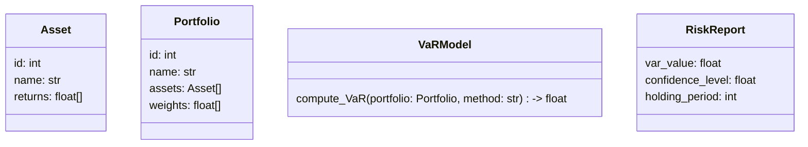
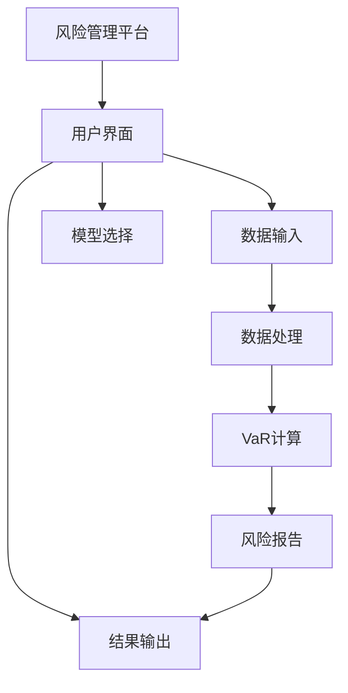

                 


# 《金融风险VaR模型比较与选择》

---

## 关键词：VaR模型，金融风险，风险管理，风险度量，风险模型

---

## 摘要：  
本文深入探讨了金融风险VaR（Value at Risk，风险价值）模型的核心概念、算法原理、应用场景以及优缺点。通过比较不同VaR模型的实现方法和适用场景，帮助读者理解如何选择最适合的VaR模型。文章从理论到实践，结合数学公式、代码实现和实际案例，全面解析VaR模型在金融风险管理中的应用。

---

# 第一章：VaR模型的背景与基础

## 1.1 金融风险的基本概念

### 1.1.1 金融风险的定义与分类  
金融风险是指在金融活动中，由于市场波动、资产价格变化、利率变动等因素，导致资产损失或收益下降的可能性。常见的金融风险包括市场风险、信用风险、流动性风险和操作风险。

### 1.1.2 金融风险管理的重要性  
金融风险管理是金融机构和投资者的重要任务，旨在通过识别、评估和控制风险，降低潜在损失，确保资产安全和稳健收益。

### 1.1.3 VaR模型在金融风险管理中的地位  
VaR模型是金融风险管理的核心工具之一，用于衡量投资组合在一定置信水平下的潜在损失。它能够将复杂的风险因素量化，为决策提供支持。

---

## 1.2 VaR模型的定义与特点

### 1.2.1 VaR模型的定义  
VaR是指在给定的置信水平和持有期内，投资组合可能遭受的最大损失。例如，95%置信水平下的1天VaR表示，在95%的概率下，投资组合在1天内不会超过这个损失值。

### 1.2.2 VaR模型的核心特点  
- **置信水平**：VaR计算基于置信水平，常见的置信水平有95%、99%等。  
- **时间跨度**：通常为1天、1周或1个月。  
- **尾部风险**：VaR关注的是“极端情况”下的损失，适用于衡量市场风险。

### 1.2.3 VaR模型与传统风险度量方法的区别  
传统的标准差和波动率等方法仅衡量资产的波动性，而VaR则直接量化潜在损失，更符合实际风险管理需求。

---

## 1.3 VaR模型的应用场景

### 1.3.1 金融市场的风险管理  
- 机构投资者用于评估投资组合的风险。  
- 金融机构用于满足监管要求。

### 1.3.2 投资组合风险评估  
- 帮助投资者了解在不同市场条件下的潜在损失。  
- 支持投资决策和风险控制。

### 1.3.3 金融机构的监管合规  
- 符合巴塞尔协议等监管要求。  
- 用于资本充足性评估。

---

## 1.4 本章小结  
本章介绍了金融风险的基本概念、VaR模型的定义与特点，以及其在金融风险管理中的应用场景。VaR模型作为一种重要的风险度量工具，为金融机构和投资者提供了有效的风险管理手段。

---

# 第二章：VaR模型的核心概念

## 2.1 VaR模型的数学定义

### 2.1.1 VaR的统计定义  
VaR是投资组合在给定置信水平和持有时间下的潜在最大损失。  

例如，95%置信水平下的1天VaR表示在95%的概率下，投资组合在1天内的损失不会超过这个值。

### 2.1.2 VaR的概率解释  
VaR是投资组合收益分布的分位数。例如，95%置信水平下的VaR对应于收益分布的第5%分位数的负值。

### 2.1.3 VaR的经济意义  
VaR为投资者提供了在特定置信水平下的潜在损失上限，帮助其了解投资组合在极端情况下的风险。

---

## 2.2 VaR模型的计算方法

### 2.2.1 方差-协方差法  
- **原理**：基于资产收益率的均值和协方差矩阵，计算投资组合的VaR。  
- **步骤**：  
  1. 计算资产收益率的均值和协方差矩阵。  
  2. 确定投资组合的权重。  
  3. 计算投资组合的方差和标准差。  
  4. 根据标准正态分布，确定VaR值。  

### 2.2.2 历史模拟法  
- **原理**：基于历史资产收益率数据，计算投资组合的历史VaR。  
- **步骤**：  
  1. 收集历史收益率数据。  
  2. 计算投资组合的历史收益率。  
  3. 排序收益率并确定VaR值。  

### 2.2.3 蒙特卡罗模拟法  
- **原理**：通过模拟大量随机资产收益率，计算投资组合的VaR。  
- **步骤**：  
  1. 生成资产收益率的随机数。  
  2. 计算投资组合的模拟收益率。  
  3. 排序模拟收益率并确定VaR值。  

---

## 2.3 VaR模型的优缺点

### 2.3.1 VaR模型的优点  
- **直观易懂**：VaR值直接量化潜在损失，便于理解和应用。  
- **综合性强**：能够同时考虑多个资产的联合风险。  
- **适用性广**：适用于不同类型的投资组合和市场环境。  

### 2.3.2 VaR模型的缺点  
- **尾部风险忽视**：VaR无法捕捉“超出VaR”的极端损失。  
- **假设依赖性**：基于假设的收益率分布，可能与实际市场不符。  
- **计算复杂性**：蒙特卡罗模拟等方法计算成本较高。  

---

## 2.4 本章小结  
本章详细介绍了VaR模型的数学定义、计算方法及其优缺点。VaR模型是一种有效的风险管理工具，但在实际应用中需要注意其局限性。

---

# 第三章：VaR模型的算法原理与数学模型

## 3.1 方差-协方差法的原理与实现

### 3.1.1 方差-协方差法的数学模型

$$ \text{VaR} = z \times \sqrt{w^T \Sigma w} $$  

其中，$z$为标准正态分布的分位数，$\Sigma$为协方差矩阵，$w$为投资组合权重。

### 3.1.2 方差-协方差法的实现步骤

1. 收集资产收益率数据。  
2. 计算资产收益率的均值和协方差矩阵。  
3. 确定投资组合的权重。  
4. 计算投资组合的方差和标准差。  
5. 根据置信水平，确定分位数$z$。  
6. 计算VaR值。

### 3.1.3 方差-协方差法的代码实现

```python
import numpy as np

# 假设收益率矩阵为returns，权重向量为weights
cov_matrix = np.cov(returns.T)
variance = weights.T @ cov_matrix @ weights
std_deviation = np.sqrt(variance)
z = np.percentile(np.random.normal(0, 1, 100000), 95)
var = z * std_deviation
```

---

## 3.2 历史模拟法的原理与实现

### 3.2.1 历史模拟法的数学模型

$$ \text{VaR} = \text{quantile}(p) \text{ of portfolio returns} $$  

其中，$p$为置信水平的分位数。

### 3.2.2 历史模拟法的实现步骤

1. 收集资产的历史收益率数据。  
2. 计算投资组合的历史收益率。  
3. 对收益率进行排序，确定VaR值。  

### 3.2.3 历史模拟法的代码实现

```python
import numpy as np

# 假设组合收益率为portfolio_returns
sorted_returns = np.sort(portfolio_returns)
var = sorted_returns[int(len(sorted_returns) * (1 - 0.95))]
```

---

## 3.3 蒙特卡罗模拟法的原理与实现

### 3.3.1 蒙特卡罗模拟法的数学模型

$$ \text{VaR} = \text{quantile}(p) \text{ of simulated portfolio returns} $$  

### 3.3.2 蒙特卡罗模拟法的实现步骤

1. 生成资产收益率的随机数。  
2. 计算投资组合的模拟收益率。  
3. 排序模拟收益率，确定VaR值。  

### 3.3.3 蒙特卡罗模拟法的代码实现

```python
import numpy as np

# 假设协方差矩阵为cov_matrix，均值为mu
n_assets = len(cov_matrix)
n_portfolios = 100000
simulated_returns = np.random.multivariate_normal(mu, cov_matrix, n_portfolios)
portfolio_returns = np.sum(simulated_returns * weights, axis=1)
sorted_returns = np.sort(portfolio_returns)
var = sorted_returns[int(len(sorted_returns) * (1 - 0.95))]
```

---

## 3.4 本章小结  
本章详细介绍了三种VaR模型的算法原理和数学模型，包括方差-协方差法、历史模拟法和蒙特卡罗模拟法，并通过代码示例展示了它们的实现过程。

---

# 第四章：VaR模型的系统分析与架构设计

## 4.1 金融风险管理系统的项目介绍

### 4.1.1 项目背景  
本项目旨在开发一个基于VaR模型的金融风险管理系统，帮助投资者评估和管理投资组合风险。

### 4.1.2 项目目标  
- 实现多种VaR模型的计算。  
- 提供用户友好的界面，便于分析和决策。  
- 输出详细的VaR报告和风险分析结果。

---

## 4.2 系统功能设计

### 4.2.1 领域模型设计



### 4.2.2 系统架构设计



---

## 4.3 系统实现与接口设计

### 4.3.1 系统接口设计  
- 数据接口：读取资产收益率数据和投资组合权重。  
- 模型接口：支持多种VaR计算方法。  
- 报告接口：输出VaR值和风险报告。

### 4.3.2 系统交互设计

```mermaid
sequenceDiagram
    用户 ->> 界面：输入资产数据
    界面 ->> 数据处理：处理数据
    数据处理 ->> VaR计算：计算VaR
    VaR计算 ->> 报告生成：生成报告
    报告生成 ->> 界面：显示结果
    用户 ->> 界面：选择模型
    界面 ->> VaR计算：计算VaR
    VaR计算 ->> 报告生成：更新报告
    报告生成 ->> 界面：显示更新结果
```

---

## 4.4 本章小结  
本章从系统设计的角度，详细介绍了金融风险管理系统的架构、功能模块和接口设计，为VaR模型的实际应用提供了参考。

---

# 第五章：VaR模型的项目实战

## 5.1 环境安装与数据获取

### 5.1.1 环境安装  
- 安装Python和相关库（numpy, pandas, matplotlib）。  
- 安装Jupyter Notebook用于代码开发。

### 5.1.2 数据获取  
- 使用Yahoo Finance获取资产收益率数据。  
- 数据清洗和预处理。

---

## 5.2 VaR模型的核心实现

### 5.2.1 方差-协方差法的实现

```python
import numpy as np
import pandas as pd
import matplotlib.pyplot as plt

# 获取资产收益率数据
data = pd.read_csv("assets.csv")
returns = data.pct_change().dropna()

# 计算协方差矩阵
cov_matrix = returns.cov()

# 定义投资组合权重
weights = np.array([0.5, 0.5])

# 计算VaR
mu = returns.mean()
std_dev = np.sqrt(weights.T @ cov_matrix @ weights)
z = np.percentile(np.random.normal(0, 1, 100000), 95)
var = z * std_dev
print(f"VaR值为：{var:.2f}")
```

### 5.2.2 历史模拟法的实现

```python
# 历史模拟法实现
portfolio_returns = np.sum(returns * weights, axis=1)
sorted_returns = np.sort(portfolio_returns)
var = sorted_returns[int(len(sorted_returns) * 0.05)]
print(f"VaR值为：{var:.2f}")
```

### 5.2.3 蒙特卡罗模拟法的实现

```python
# 蒙特卡罗模拟法实现
n_simulations = 100000
simulated_returns = np.random.multivariate_normal(mu, cov_matrix, n_simulations)
portfolio_returns = np.sum(simulated_returns * weights, axis=1)
sorted_returns = np.sort(portfolio_returns)
var = sorted_returns[int(len(sorted_returns) * 0.05)]
print(f"VaR值为：{var:.2f}")
```

---

## 5.3 实际案例分析

### 5.3.1 案例背景  
假设我们有两只资产，收益率数据如下：

| 日期 | 资产1收益率 | 资产2收益率 |
|------|------------|------------|
| 2023-01-01 | 0.01       | 0.02       |
| 2023-01-02 | -0.005     | -0.01      |
| ...    | ...         | ...         |

### 5.3.2 案例分析  
通过上述代码实现，选择合适的方法计算VaR值，并比较不同方法的优缺点。

---

## 5.4 本章小结  
本章通过实际案例，展示了VaR模型的实现过程，包括环境安装、数据获取和代码实现。通过比较不同方法的结果，读者可以更好地理解VaR模型的实际应用。

---

# 第六章：VaR模型的最佳实践与注意事项

## 6.1 最佳实践

### 6.1.1 模型选择  
- 根据数据特征选择合适的方法：  
  - 方差-协方差法适用于正常市场条件。  
  - 历史模拟法适用于有足够历史数据的情况。  
  - 蒙特卡罗模拟法适用于复杂市场条件。  

### 6.1.2 数据处理  
- 数据清洗：处理缺失值和异常值。  
- 数据标准化：确保数据格式统一。  

### 6.1.3 结果验证  
- 比较不同方法的结果，确保结果一致性。  
- 结合市场实际情况调整置信水平和持有时间。  

---

## 6.2 注意事项

### 6.2.1 模型假设  
- 方差-协方差法假设收益率服从正态分布，可能与实际市场不符。  
- 历史模拟法依赖于历史数据的充分性。  

### 6.2.2 参数选择  
- 置信水平和持有时间的选择会影响VaR值的结果。  
- 需要根据实际需求调整参数。  

### 6.2.3 模型局限性  
- VaR模型无法捕捉“超出VaR”的极端损失。  
- 需要结合其他风险度量工具（如CVaR）进行综合评估。  

---

## 6.3 本章小结  
本章总结了VaR模型的最佳实践和注意事项，帮助读者在实际应用中更好地选择和使用VaR模型。

---

# 作者：AI天才研究院 & 禅与计算机程序设计艺术

---

通过本文，读者可以全面了解VaR模型的核心概念、算法原理和实际应用。从理论到实践，结合数学公式、代码实现和实际案例，帮助读者选择最适合的VaR模型，提升金融风险管理能力。

