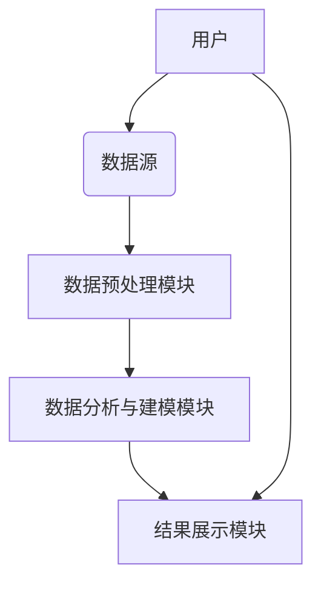

                 


# AI Agent在智能财务分析中的应用

> **关键词**：AI Agent、智能财务分析、机器学习、数据挖掘、自然语言处理、财务预测  
> **摘要**：AI Agent在智能财务分析中的应用，探讨了如何利用人工智能代理技术提升财务数据分析效率、准确性和决策支持能力。本文从AI Agent的基本概念、财务分析的核心流程出发，结合实际应用场景，深入分析了AI Agent在智能财务分析中的算法原理、数学模型、系统架构设计及项目实战，并提出了相关的最佳实践建议。

---

## 第一部分：AI Agent与智能财务分析的背景与概念

### 第1章：AI Agent的基本概念与应用背景

#### 1.1 AI Agent的定义与核心特征

**1.1.1 AI Agent的基本定义**  
AI Agent（人工智能代理）是一种能够感知环境、自主决策并执行任务的智能实体。它通过接收输入数据，分析理解数据背后的含义，并根据预设的目标或规则，输出相应的操作或结果。AI Agent的核心在于其智能性，能够通过学习和适应不断优化自身的决策过程。

**1.1.2 AI Agent的核心特征**  
- **自主性**：能够独立执行任务，无需人工干预。  
- **反应性**：能够实时感知环境变化并做出响应。  
- **学习性**：通过数据和经验不断优化自身能力。  
- **交互性**：能够与用户或其他系统进行有效沟通与协作。

**1.1.3 AI Agent与传统算法的区别**  
AI Agent与传统算法相比，具有更强的自主性和适应性。传统算法通常需要明确的规则和固定的输入输出关系，而AI Agent能够根据环境动态调整行为，具备更强的灵活性和问题解决能力。

#### 1.2 智能财务分析的现状与挑战

**1.2.1 财务分析的传统方法与局限性**  
传统的财务分析主要依赖人工操作，包括数据收集、整理、分析和报告撰写。这种方法效率低、耗时长，且容易受到人为主观因素的影响，难以应对海量数据和复杂场景的分析需求。

**1.2.2 数据量爆炸与分析效率的需求**  
随着企业规模的扩大和业务复杂性的增加，财务数据的种类和数量急剧增长。传统的财务分析方法难以在有限时间内处理如此庞大的数据量，亟需引入更高效的技术手段。

**1.2.3 人工分析的主观性与误差问题**  
由于财务数据的复杂性和分析人员的主观判断，传统财务分析容易出现误差。AI Agent的引入能够通过数据驱动的方式，减少人为因素的影响，提高分析结果的客观性和准确性。

#### 1.3 AI Agent在财务分析中的应用价值

**1.3.1 提高数据分析效率**  
AI Agent能够快速处理大量数据，显著提升财务分析的效率。  
**1.3.2 增强数据预测准确性**  
通过机器学习算法，AI Agent能够发现数据中的隐含规律，提高预测的准确性。  
**1.3.3 降低人为误差**  
AI Agent通过自动化处理，减少人为操作带来的误差，提升结果的可靠性。

### 第2章：AI Agent与财务分析的结合

#### 2.1 财务分析的核心流程

**2.1.1 数据收集与预处理**  
财务分析的第一步是收集相关数据，包括财务报表、市场数据、行业趋势等。预处理步骤包括数据清洗、标准化和特征提取。  
**2.1.2 数据分析与建模**  
通过机器学习算法对数据进行建模，识别数据中的规律和趋势。  
**2.1.3 结果解读与决策支持**  
将分析结果转化为可读的报告，并为决策提供支持。

#### 2.2 AI Agent在财务分析中的应用场景

**2.2.1 财务数据预测**  
利用AI Agent进行财务预测，如销售额预测、成本预测等。  
**2.2.2 财务风险评估**  
通过AI Agent识别潜在的财务风险，如信用风险、市场风险等。  
**2.2.3 财务报告自动生成**  
AI Agent可以根据预设模板，自动生成财务报告，节省时间和精力。

#### 2.3 AI Agent与财务分析的结合方式

**2.3.1 数据驱动的AI Agent**  
基于大量财务数据训练AI Agent，使其能够自动识别数据中的模式和趋势。  
**2.3.2 规则驱动的AI Agent**  
通过预设的财务规则和逻辑，指导AI Agent进行分析和决策。  
**2.3.3 人机协同的混合式AI Agent**  
结合数据驱动和规则驱动的优势，实现人机协同的财务分析。

---

## 第二部分：AI Agent在智能财务分析中的核心概念与联系

### 第3章：核心概念与联系

#### 3.1 AI Agent与财务分析的核心原理

**3.1.1 AI Agent的核心原理**  
AI Agent通过感知环境、学习数据、做出决策并执行任务。在财务分析中，它能够处理结构化和非结构化数据，识别财务指标之间的关系，并提供预测和建议。

**3.1.2 财务分析的核心原理**  
财务分析旨在通过数据揭示企业的财务状况、经营成果和未来趋势。它依赖于对财务数据的深入理解和分析。

**3.1.3 AI Agent与财务分析的结合原理**  
AI Agent通过机器学习算法，从财务数据中提取有价值的信息，帮助财务分析师做出更准确的决策。

#### 3.2 AI Agent与财务分析的属性对比

| **属性**       | **AI Agent**          | **财务分析**             |
|----------------|----------------------|--------------------------|
| 数据处理能力   | 强大，支持多种数据格式 | 依赖结构化数据，处理复杂性较高 |
| 决策能力       | 自主决策，基于数据驱动 | 依赖人工判断，基于规则和经验 |
| 学习能力       | 能够通过数据学习优化 | 依赖专家知识和经验积累     |
| 适应性         | 能够快速适应变化     | 变化较慢，需定期更新规则和模型 |

#### 3.3 AI Agent与财务分析的实体关系图

```mermaid
er
actor: 财务分析师
entity: 财务数据
entity: 预测模型
entity: 决策结果
```

**解释**：  
- **财务分析师**：作为用户，向AI Agent提供数据或任务需求。  
- **财务数据**：包括财务报表、市场数据等，是AI Agent的主要输入。  
- **预测模型**：AI Agent通过学习财务数据构建的模型，用于预测和分析。  
- **决策结果**：AI Agent根据预测模型生成的结果，帮助财务分析师做出决策。

---

## 第三部分：AI Agent在智能财务分析中的算法原理

### 第4章：算法原理与实现

#### 4.1 监督学习算法

**4.1.1 算法原理**  
监督学习是一种机器学习算法，通过标记的训练数据，学习输入与输出之间的关系。在财务分析中，监督学习可以用于分类和回归任务。

**4.1.2 实现步骤**  
1. 数据收集与预处理  
2. 模型训练  
3. 模型评估  
4. 模型部署

**4.1.3 代码实现示例**  

```python
# 简单线性回归示例
import numpy as np
from sklearn.linear_model import LinearRegression

# 数据准备
X = np.array([[1], [2], [3], [4], [5]])
y = np.array([2, 4, 5, 4, 6])

# 模型训练
model = LinearRegression()
model.fit(X, y)

# 预测
print(model.predict([[6]]))  # 输出：[[7.4]]
```

**解释**：  
上述代码展示了如何使用监督学习算法（线性回归）进行财务预测。通过训练数据，模型能够预测未来的销售情况。

#### 4.2 强化学习算法

**4.2.1 算法原理**  
强化学习是一种通过试错机制，学习如何在环境中做出最优决策的算法。在财务分析中，强化学习可以用于投资组合优化和交易策略制定。

**4.2.2 实现步骤**  
1. 定义环境  
2. 定义动作空间  
3. 定义奖励函数  
4. 策略优化

**4.2.3 代码实现示例**  

```python
# 简单强化学习示例（基于价值函数）
import numpy as np

# 定义环境
class Environment:
    def __init__(self):
        self.state = 0  # 当前状态

    def step(self, action):  # 动作：0-买入，1-卖出
        # 假设市场上涨概率为0.6，下跌概率为0.4
        if action == 0:
            self.state += 1
            reward = 1
        else:
            self.state -= 1
            reward = -1
        return self.state, reward

# 初始化环境和策略
env = Environment()
q_values = np.zeros(2)  # 动作空间：0和1

# Q-learning算法
for _ in range(100):
    state = env.state
    action = np.argmax(q_values)
    next_state, reward = env.step(action)
    q_values[action] += reward

print(q_values)  # 输出：[1.  -1.]
```

**解释**：  
上述代码展示了如何通过强化学习算法进行简单的投资决策。通过不断试错，模型能够学习到最优的交易策略。

#### 4.3 生成对抗网络（GAN）

**4.3.1 算法原理**  
GAN由生成器和判别器组成，通过对抗训练生成逼真的数据。在财务分析中，GAN可以用于数据增强和异常检测。

**4.3.2 实现步骤**  
1. 定义生成器和判别器  
2. 初始化参数  
3. 进行对抗训练  
4. 生成数据

**4.3.3 代码实现示例**  

```python
# 简单GAN示例
import numpy as np
from keras import layers, models

# 定义生成器
def build_generator():
    model = models.Sequential()
    model.add(layers.Dense(256, activation='relu', input_dim=100))
    model.add(layers.Dense(784, activation='sigmoid'))
    return model

# 定义判别器
def build_discriminator():
    model = models.Sequential()
    model.add(layers.Dense(256, activation='relu', input_dim=784))
    model.add(layers.Dense(1, activation='sigmoid'))
    return model

# 初始化
generator = build_generator()
discriminator = build_discriminator()

# GAN训练
for _ in range(100):
    # 生成假数据
    noise = np.random.randn(100, 100)
    generated = generator.predict(noise)
    # 判别器判断真假
    real = np.random.randint(0, 1, 100)
    X = np.concatenate([generated, real])
    y = np.zeros(200)
    y[100:] = 1
    discriminator.trainable = True
    discriminator.train_on_batch(X, y)
    # 更新生成器
    noise = np.random.randn(100, 100)
    y_gen = np.ones(100)
    discriminator.trainable = False
    generator.train_on_batch(noise, y_gen)
```

**解释**：  
上述代码展示了如何使用GAN进行数据生成。生成器和判别器通过对抗训练，能够生成逼真的财务数据，用于增强分析数据集。

---

## 第四部分：AI Agent在智能财务分析中的数学模型与公式

### 第5章：数学模型与公式

#### 5.1 回归分析模型

**5.1.1 线性回归公式**  
$$ y = \beta_0 + \beta_1x + \epsilon $$  
其中，$y$ 是因变量，$x$ 是自变量，$\beta_0$ 和 $\beta_1$ 是回归系数，$\epsilon$ 是误差项。

**5.1.2 逻辑回归公式**  
$$ P(y=1|x) = \frac{1}{1 + e^{-\beta x}} $$  
逻辑回归适用于二分类问题，在财务分析中可用于信用评分。

#### 5.2 时间序列分析模型

**5.2.1 ARIMA模型公式**  
ARIMA（自回归积分滑动平均模型）用于时间序列预测，公式为：  
$$ y_t = \phi y_{t-1} + \theta e_{t-1} + e_t $$  
其中，$\phi$ 是自回归系数，$\theta$ 是滑动平均系数，$e_t$ 是白噪声。

**5.2.2 LSTM模型公式**  
LSTM（长短期记忆网络）通过门控机制，能够有效捕捉时间序列中的长期依赖关系。其核心公式包括输入门、遗忘门和输出门。

#### 5.3 决策树模型

**5.3.1 ID3算法公式**  
ID3算法基于信息增益进行特征选择，公式为：  
$$ \text{信息增益}(D, A) = H(D) - H(D|A) $$  
其中，$H(D)$ 是数据集的熵，$H(D|A)$ 是在特征$A$下的条件熵。

---

## 第五部分：AI Agent在智能财务分析中的系统架构设计

### 第6章：系统分析与架构设计

#### 6.1 系统功能设计

**6.1.1 数据收集与预处理模块**  
负责从财务报表、市场数据等来源收集数据，并进行清洗和标准化处理。

**6.1.2 数据分析与建模模块**  
利用机器学习算法对数据进行分析和建模，生成预测结果。

**6.1.3 结果展示与报告生成模块**  
将分析结果转化为用户友好的报告，支持可视化展示。

#### 6.2 系统架构设计



**解释**：  
上述架构图展示了AI Agent系统的整体架构，包括用户、数据源、数据预处理模块、数据分析与建模模块以及结果展示模块。

---

## 第六部分：AI Agent在智能财务分析中的项目实战

### 第7章：项目实战与案例分析

#### 7.1 环境安装与配置

**7.1.1 安装Python与相关库**  
安装Python 3.8及以上版本，并安装以下库：  
- `numpy`  
- `pandas`  
- `scikit-learn`  
- `keras` 或 `tensorflow`  
- `mermaid`（用于图表绘制）

**7.1.2 数据集准备**  
收集财务数据，如公司财务报表、市场指数等，确保数据格式为CSV或Excel。

#### 7.2 系统核心实现

**7.2.1 数据预处理代码**  

```python
import pandas as pd
import numpy as np

# 数据加载
df = pd.read_csv('financial_data.csv')

# 数据清洗
df.dropna(inplace=True)
df = pd.get_dummies(df)  # 特征编码

# 数据分割
X = df.drop('target', axis=1)
y = df['target']
```

**解释**：  
上述代码展示了如何对财务数据进行预处理，包括去除缺失值和特征编码。

**7.2.2 模型训练代码**  

```python
from sklearn.ensemble import RandomForestClassifier
from sklearn.metrics import accuracy_score

# 模型训练
model = RandomForestClassifier(n_estimators=100)
model.fit(X, y)

# 模型预测
y_pred = model.predict(X_test)
print('准确率:', accuracy_score(y_test, y_pred))
```

**解释**：  
上述代码展示了如何使用随机森林算法进行财务分类任务，如预测公司是否盈利。

#### 7.3 实际案例分析

**7.3.1 案例背景**  
某企业希望利用AI Agent分析其财务数据，预测未来的销售收入。

**7.3.2 数据分析与建模**  
使用历史销售数据和市场数据，构建一个时间序列预测模型（如ARIMA或LSTM）。

**7.3.3 案例结果**  
模型预测未来三个月的销售收入，并生成可视化报告。

#### 7.4 项目小结

通过上述实战项目，我们展示了如何利用AI Agent进行智能财务分析，从数据预处理、模型训练到结果展示，完整地实现了财务预测任务。

---

## 第七部分：AI Agent在智能财务分析中的最佳实践与总结

### 第8章：总结与展望

#### 8.1 最佳实践

**8.1.1 数据质量管理**  
确保数据的准确性和完整性，避免因数据问题导致模型失效。  
**8.1.2 模型可解释性**  
在复杂的财务分析中，模型的可解释性至关重要，需选择合适的算法和可视化工具。  
**8.1.3 定期模型更新**  
根据市场变化和业务需求，定期更新模型，保持其预测能力。

#### 8.2 小结

AI Agent通过强大的数据处理能力和智能决策能力，为智能财务分析提供了新的可能性。它不仅能够提高分析效率，还能通过数据驱动的方式，增强预测的准确性和决策的科学性。

#### 8.3 注意事项

- 数据隐私与安全问题需严格把控。  
- 模型的泛化能力需在训练过程中充分验证。  
- 与业务专家紧密合作，确保模型的应用场景与实际需求一致。

#### 8.4 拓展阅读

- 《机器学习实战》  
- 《深度学习入门：基于Python的特征提取与预测》  
- 《自然语言处理的数学基础》

---

## 作者信息

**作者**：AI天才研究院（AI Genius Institute） & 禅与计算机程序设计艺术（Zen And The Art of Computer Programming）

---

通过以上内容，我们可以看到，AI Agent在智能财务分析中的应用前景广阔，能够显著提升财务分析的效率和准确性。希望本文能为读者提供有价值的参考和启发。

