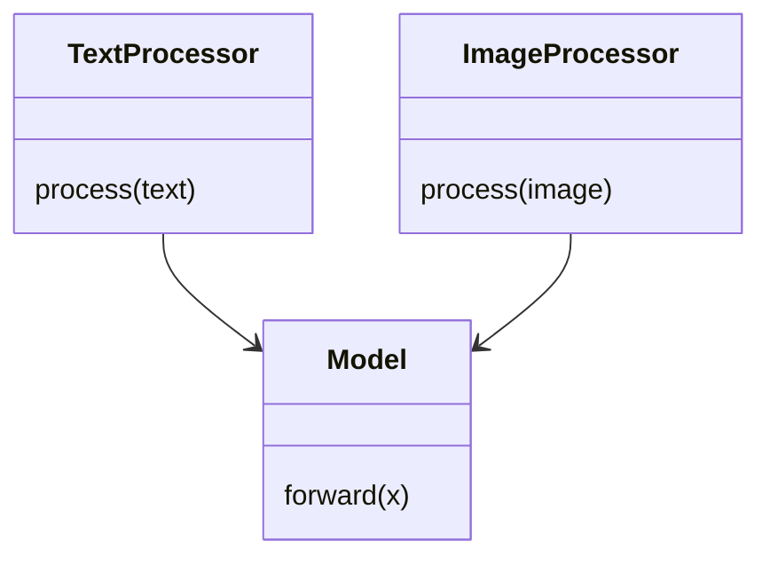
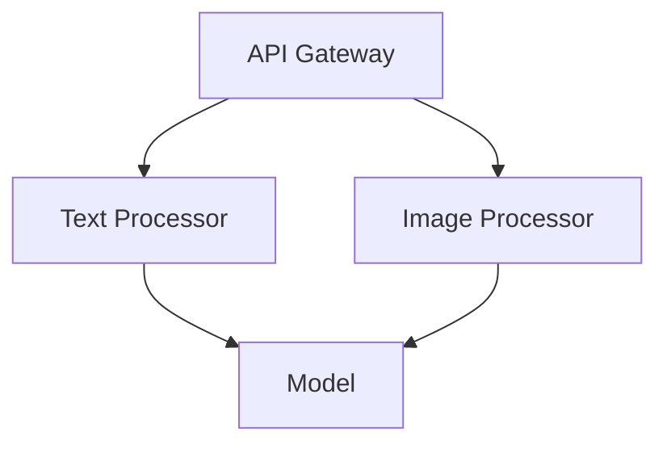
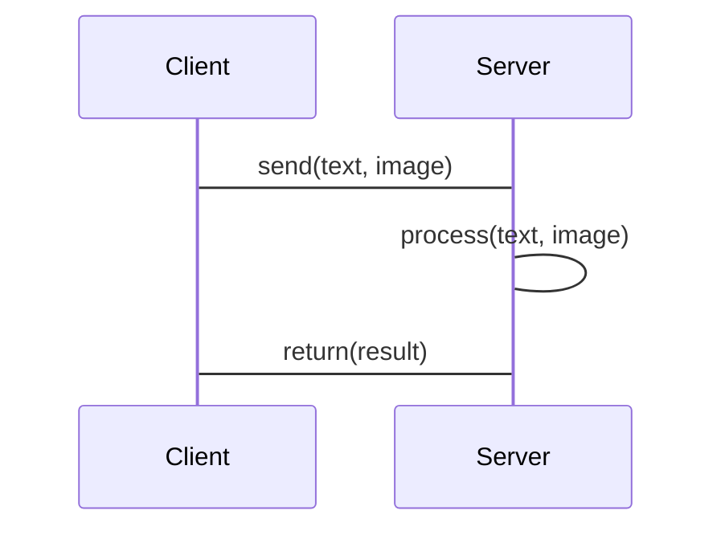

                 


# AI Agent的跨模态理解与生成

## 关键词：AI Agent, 跨模态理解, 多模态生成, 对齐模型, Transformer, 图神经网络

## 摘要：  
AI Agent的跨模态理解与生成是当前人工智能领域的前沿研究方向。随着技术的发展，AI Agent需要能够处理和理解多种模态的数据（如文本、图像、语音等），并能够生成与输入模态相匹配的输出。本文从基础概念出发，详细探讨了跨模态理解与生成的核心原理、算法实现、系统设计以及实际应用。通过案例分析和代码实现，帮助读者深入理解AI Agent在跨模态任务中的应用，并展望了未来的研究方向。

---

# 第1章: AI Agent与跨模态理解概述

## 1.1 AI Agent的基本概念

### 1.1.1 AI Agent的定义与特点
AI Agent（人工智能代理）是指能够感知环境、自主决策并执行任务的智能实体。其特点包括：
- **自主性**：能够在没有外部干预的情况下自主完成任务。
- **反应性**：能够根据环境变化动态调整行为。
- **目标导向**：以特定目标为导向，优化决策过程。
- **学习能力**：能够通过经验或数据进行学习和优化。

### 1.1.2 跨模态理解的背景与意义
随着人工智能技术的发展，单一模态的数据处理已难以满足复杂场景的需求。跨模态理解能够整合文本、图像、语音等多种信息，提升AI Agent的理解能力和应用场景的多样性。

### 1.1.3 AI Agent的应用领域与挑战

#### 应用领域
- **自然语言处理**：跨模态对话系统、智能客服。
- **计算机视觉**：图像描述生成、视频内容理解。
- **机器人技术**：多模态交互机器人、智能助手。
- **教育技术**：个性化学习推荐系统。

#### 挑战
- **模态对齐**：不同模态的数据如何有效对齐。
- **数据多样性**：多模态数据的获取和处理复杂性。
- **计算资源**：跨模态任务通常需要大量的计算资源。

---

## 1.2 跨模态理解的核心概念

### 1.2.1 跨模态数据的定义与特点
跨模态数据指的是来自不同感知渠道的数据，例如：
- **文本**：包括自然语言文本、对话记录等。
- **图像**：包括图片、视频等视觉信息。
- **语音**：包括音频、语音信号等。

跨模态数据的特点：
- **异构性**：不同模态的数据具有不同的结构和特征。
- **互补性**：不同模态的数据可以互相补充，提升理解能力。
- **复杂性**：跨模态数据的处理需要综合多种技术手段。

### 1.2.2 跨模态理解的基本原理
跨模态理解的核心是通过某种方式将不同模态的数据对齐，并提取其共同特征。常见的方法包括：
- **对齐模型**：通过对比学习或注意力机制，将不同模态的数据对齐。
- **跨模态检索**：基于某种度量标准，检索与输入模态相关的其他模态数据。

### 1.2.3 跨模态生成的定义与目标
跨模态生成是指根据输入的一种或多种模态数据，生成与之相关但属于另一种模态的输出。例如，根据图像生成描述文本，或者根据文本生成图像。

---

## 1.3 本章小结

---

# 第2章: 跨模态数据处理与模型设计

## 2.1 跨模态数据的预处理

### 2.1.1 数据清洗与标准化
数据清洗是处理脏数据（如噪声、缺失值等）的过程。标准化则是将数据转换到统一的尺度或格式，以便模型能够有效处理。

#### 示例代码
```python
import pandas as pd

# 加载数据
data = pd.read_csv('multimodal_data.csv')

# 数据清洗：处理缺失值
data.dropna(inplace=True)

# 标准化处理
from sklearn.preprocessing import StandardScaler
scaler = StandardScaler()
scaled_data = scaler.fit_transform(data[['age', 'score']])
```

### 2.1.2 数据增强技术
数据增强是一种通过增加训练数据的多样性来提升模型鲁棒性的技术。例如，在图像数据中，可以通过旋转、翻转等方式生成新的图像数据。

#### 示例代码
```python
import tensorflow as tf
import tensorflow_datasets as tfds

# 加载图像数据集
train_dataset, info = tfds.load('mnist', split='train', with_info=True)

# 数据增强
train_dataset = train_dataset.map(lambda x: {
    'image': tf.image.random_flip_left_right(x['image']),
    'label': x['label']
})
```

### 2.1.3 数据融合方法
数据融合是指将来自不同模态的数据整合到一个统一的表示空间中。例如，可以将文本和图像数据通过某种方式对齐，生成联合表示。

---

## 2.2 跨模态模型的设计原理

### 2.2.1 多模态数据的表示方法
多模态数据的表示方法需要能够将不同模态的数据转换为统一的向量形式。例如，文本可以使用词嵌入（如Word2Vec）表示，图像可以使用卷积神经网络（CNN）提取特征。

#### 示例代码
```python
# 文本嵌入
from tensorflow.keras.layers import Embedding

model = tf.keras.Sequential()
model.add(Embedding(input_dim=10000, output_dim=100, input_length=500))

# 图像特征提取
from tensorflow.keras.layers import Conv2D
model = tf.keras.Sequential()
model.add(Conv2D(32, (3,3), activation='relu', input_shape=(64,64,3)))
```

### 2.2.2 跨模态对齐的实现方式
跨模态对齐的核心是将不同模态的数据对齐到一个共同的表示空间中。常见的实现方式包括：
- **对比学习**：通过最大化相同语义的模态之间的相似性，最小化不同语义的模态之间的相似性。
- **注意力机制**：通过注意力机制，将不同模态的数据进行加权组合，生成联合表示。

#### 示例代码
```python
import tensorflow as tf

# 对比学习
anchor = tf.keras.Input(shape=(128,))
positive = tf.keras.Input(shape=(128,))
negative = tf.keras.Input(shape=(128,))

# 计算相似性
similarity = tf.keras.layers.Dense(1, activation='sigmoid')(
    tf.keras.layers.Dot((anchor, positive)) 
)
```

### 2.2.3 跨模态生成的数学模型
跨模态生成的数学模型可以基于生成对抗网络（GAN）或变分自编码器（VAE）等生成模型。例如，可以通过文本条件生成图像。

#### 数学公式
$$
\text{生成模型的目标是最小化} \mathcal{L} = \mathcal{L}_\text{GAN} + \mathcal{L}_\text{recon} 
$$

其中，$\mathcal{L}_\text{GAN}$是生成对抗网络的损失函数，$\mathcal{L}_\text{recon}$是重建损失。

---

## 2.3 跨模态模型的训练策略

### 2.3.1 联合训练方法
联合训练是指在同一个模型中同时训练多个模态的数据。例如，可以同时训练文本和图像数据，以优化模型的跨模态理解能力。

#### 示例代码
```python
# 联合训练
model = tf.keras.Model(inputs=[input_text, input_image], outputs=output)
model.compile(optimizer='adam', loss='binary_crossentropy')
model.fit([text_data, image_data], labels, epochs=10)
```

### 2.3.2 对抗训练技术
对抗训练是一种通过让模型在对抗过程中提升性能的技术。例如，可以使用生成对抗网络（GAN）进行跨模态生成。

#### 示例代码
```python
# GAN模型
generator = tf.keras.Model(inputs=noise_input, outputs=image_output)
discriminator = tf.keras.Model(inputs=image_input, outputs=valid)

# 损失函数
cross_entropy = tf.keras.losses.BinaryCrossentropy()

# 训练
discriminator_loss = cross_entropy(discriminator(real_image) , real_labels) + cross_entropy(discriminator(generator.predict(noise)), fake_labels)
generator_loss = cross_entropy(discriminator(generator.predict(noise)), real_labels)
```

### 2.3.3 预训练与微调策略
预训练是指先在大规模数据集上进行预训练，然后在特定任务上进行微调。这种方法可以利用大规模数据的优势，提升模型的跨模态理解能力。

---

## 2.4 本章小结

---

# 第3章: 跨模态对齐与生成模型

## 3.1 跨模态对齐的基本原理

### 3.1.1 对比学习的原理
对比学习是一种通过最大化相同语义的模态之间的相似性，最小化不同语义的模态之间的相似性的技术。

#### 数学公式
$$
\text{相似性损失：} \mathcal{L}_\text{contrast} = \log \frac{e^{s(x,y)}}{e^{s(x,y)} + \sum_{z \neq y} e^{s(x,z)}}
$$

其中，$s(x,y)$是模态$x$和模态$y$之间的相似性分数。

### 3.1.2 注意力机制在跨模态对齐中的应用
注意力机制可以通过对不同模态的数据进行加权组合，生成联合表示。

#### 示例代码
```python
# 注意力机制
attention_weights = tf.nn.softmax(tf.matmul(x, y, transpose_b=True), axis=-1)
```

### 3.1.3 图神经网络在跨模态对齐中的应用
图神经网络可以通过构建图结构，将不同模态的数据节点连接起来，进行跨模态对齐。

#### 示例代码
```python
import tensorflow as tf
from tensorflow.keras import layers

# 图神经网络
graph = tf.keras.Model(inputs=[u, v], outputs=embedding)
```

---

## 3.2 跨模态对齐的实现步骤

### 3.2.1 数据预处理与特征提取
数据预处理包括数据清洗、标准化等，特征提取则需要将数据转换为模型可以处理的形式。

#### 示例代码
```python
# 数据预处理
from sklearn.preprocessing import StandardScaler

scaler = StandardScaler()
scaled_data = scaler.fit_transform(data)

# 特征提取
from tensorflow.keras.layers import Dense

encoder = Dense(64, activation='relu')
encoded_data = encoder(scaled_data)
```

### 3.2.2 对齐模型的构建与训练
对齐模型的构建需要设计合适的模型架构，并选择合适的优化器和损失函数。

#### 示例代码
```python
# 对齐模型
from tensorflow.keras import Model
from tensorflow.keras.layers import Input, Dense, Concatenate

input_x = Input(shape=(64,))
input_y = Input(shape=(64,))
concat = Concatenate()([input_x, input_y])
dense = Dense(128, activation='relu')(concat)
output = Dense(1, activation='sigmoid')(dense)

model = Model(inputs=[input_x, input_y], outputs=output)
model.compile(optimizer='adam', loss='binary_crossentropy')
model.fit([x_train, y_train], labels, epochs=10)
```

### 3.2.3 对齐结果的评估与优化
对齐结果的评估可以通过计算相似性分数、精确率、召回率等指标来进行。

---

## 3.3 跨模态对齐的算法实现代码

### 3.3.1 环境配置与依赖安装
```bash
pip install tensorflow tensorflow.keras numpy pandas scikit-learn
```

### 3.3.2 数据加载与预处理
```python
import pandas as pd
from sklearn.preprocessing import StandardScaler

# 加载数据
data = pd.read_csv('multimodal_data.csv')

# 数据预处理
scaler = StandardScaler()
scaled_data = scaler.fit_transform(data)
```

### 3.3.3 模型定义与训练代码
```python
from tensorflow.keras import Model
from tensorflow.keras.layers import Input, Dense, Concatenate

# 定义模型
input_x = Input(shape=(64,))
input_y = Input(shape=(64,))
concat = Concatenate()([input_x, input_y])
dense = Dense(128, activation='relu')(concat)
output = Dense(1, activation='sigmoid')(dense)

model = Model(inputs=[input_x, input_y], outputs=output)
model.compile(optimizer='adam', loss='binary_crossentropy')
model.fit([x_train, y_train], labels, epochs=10)
```

### 3.3.4 模型评估与结果展示
```python
from sklearn.metrics import accuracy_score

# 预测
y_pred = model.predict([x_test, y_test])
y_pred = (y_pred > 0.5).astype(int)

# 评估
accuracy = accuracy_score(y_test, y_pred)
print(f'Accuracy: {accuracy}')
```

---

## 3.4 本章小结

---

# 第4章: 跨模态生成模型

## 4.1 跨模态生成模型的基本原理

### 4.1.1 生成模型的分类
生成模型主要包括以下几种：
- **生成对抗网络（GAN）**：通过生成器和判别器的对抗训练生成数据。
- **变分自编码器（VAE）**：通过编码器和解码器的组合生成数据。
- **Transformer**：通过自注意力机制生成序列数据。

### 4.1.2 跨模态生成的数学模型
跨模态生成的数学模型可以通过多种方式实现，例如：
- **条件生成对抗网络（CGAN）**：根据输入的条件生成特定的输出。
- **多模态变分自编码器（MVAE）**：同时处理多种模态的数据，生成与输入相关的输出。

#### 数学公式
$$
\text{生成模型的目标是最小化} \mathcal{L} = \mathcal{L}_\text{GAN} + \mathcal{L}_\text{recon} 
$$

---

## 4.2 跨模态生成模型的实现步骤

### 4.2.1 数据预处理与特征提取
数据预处理包括数据清洗、标准化等，特征提取则需要将数据转换为模型可以处理的形式。

#### 示例代码
```python
# 数据预处理
from sklearn.preprocessing import StandardScaler

scaler = StandardScaler()
scaled_data = scaler.fit_transform(data)
```

### 4.2.2 生成模型的构建与训练
生成模型的构建需要设计合适的模型架构，并选择合适的优化器和损失函数。

#### 示例代码
```python
# GAN模型
generator = tf.keras.Model(inputs=noise_input, outputs=image_output)
discriminator = tf.keras.Model(inputs=image_input, outputs=valid)

# 损失函数
cross_entropy = tf.keras.losses.BinaryCrossentropy()

# 训练
discriminator_loss = cross_entropy(discriminator(real_image) , real_labels) + cross_entropy(discriminator(generator.predict(noise)), fake_labels)
generator_loss = cross_entropy(discriminator(generator.predict(noise)), real_labels)
```

### 4.2.3 生成结果的评估与优化
生成结果的评估可以通过计算生成数据的质量、多样性和真实性等指标来进行。

---

## 4.3 本章小结

---

# 第5章: 跨模态理解与生成的系统架构设计

## 5.1 系统功能设计

### 5.1.1 领域模型
领域模型描述了系统的功能模块及其之间的关系。

#### 示例代码


### 5.1.2 系统架构
系统架构描述了系统的整体结构和模块划分。

#### 示例代码


### 5.1.3 接口设计
接口设计描述了系统与其他模块之间的交互接口。

#### 示例代码


---

## 5.2 系统实现

### 5.2.1 环境配置与依赖安装
```bash
pip install tensorflow tensorflow.keras numpy pandas scikit-learn
```

### 5.2.2 核心实现代码
```python
from tensorflow.keras import Model
from tensorflow.keras.layers import Input, Dense, Concatenate

# 定义模型
input_x = Input(shape=(64,))
input_y = Input(shape=(64,))
concat = Concatenate()([input_x, input_y])
dense = Dense(128, activation='relu')(concat)
output = Dense(1, activation='sigmoid')(dense)

model = Model(inputs=[input_x, input_y], outputs=output)
model.compile(optimizer='adam', loss='binary_crossentropy')
model.fit([x_train, y_train], labels, epochs=10)
```

### 5.2.3 系统部署与测试
系统部署需要将模型封装为API服务，并进行测试。

#### 示例代码
```python
from flask import Flask, request, jsonify

app = Flask(__name__)

@app.route('/api', methods=['POST'])
def predict():
    data = request.json
    x = data['x']
    y = data['y']
    result = model.predict([x, y])
    return jsonify({'result': result.tolist()})

if __name__ == '__main__':
    app.run(debug=True)
```

---

## 5.3 本章小结

---

# 第6章: 跨模态理解与生成的项目实战

## 6.1 项目背景

### 6.1.1 项目需求
本项目旨在实现一个跨模态对话系统，能够根据用户的输入生成相关的图像或文本回复。

### 6.1.2 项目目标
通过本项目，验证跨模态理解与生成模型的实际应用效果。

---

## 6.2 项目实现

### 6.2.1 环境配置与依赖安装
```bash
pip install tensorflow tensorflow.keras numpy pandas scikit-learn
```

### 6.2.2 核心实现代码
```python
from tensorflow.keras import Model
from tensorflow.keras.layers import Input, Dense, Concatenate

# 定义模型
input_x = Input(shape=(64,))
input_y = Input(shape=(64,))
concat = Concatenate()([input_x, input_y])
dense = Dense(128, activation='relu')(concat)
output = Dense(1, activation='sigmoid')(dense)

model = Model(inputs=[input_x, input_y], outputs=output)
model.compile(optimizer='adam', loss='binary_crossentropy')
model.fit([x_train, y_train], labels, epochs=10)
```

### 6.2.3 项目部署与测试
项目部署需要将模型封装为API服务，并进行测试。

#### 示例代码
```python
from flask import Flask, request, jsonify

app = Flask(__name__)

@app.route('/api', methods=['POST'])
def predict():
    data = request.json
    x = data['x']
    y = data['y']
    result = model.predict([x, y])
    return jsonify({'result': result.tolist()})

if __name__ == '__main__':
    app.run(debug=True)
```

---

## 6.3 项目小结

---

# 第7章: 跨模态理解与生成的研究热点与未来趋势

## 7.1 当前研究热点

### 7.1.1 多模态对齐的优化
当前研究热点之一是如何进一步优化跨模态对齐的效果，例如通过引入更先进的对比学习方法或注意力机制。

### 7.1.2 跨模态生成的多样性
另一个研究热点是如何提高跨模态生成的多样性和真实性，例如通过引入多模态变分自编码器或扩散模型。

---

## 7.2 未来研究方向

### 7.2.1 跨模态理解的泛化性
未来研究方向之一是提升跨模态理解的泛化能力，使其能够处理更多种类的模态数据。

### 7.2.2 跨模态生成的可控性
另一个研究方向是提高跨模态生成的可控性，例如通过引入条件生成模型，使生成结果更加可控。

---

## 7.3 本章小结

---

# 附录: 跨模态理解与生成的实用工具与库

## 附录A: 跨模态数据处理工具

### 附录A.1 数据预处理工具
- **Pandas**：用于数据清洗和处理。
- **Scikit-learn**：用于数据标准化和特征选择。

### 附录A.2 模型训练工具
- **TensorFlow**：用于构建和训练跨模态模型。
- **Keras**：用于快速构建和训练深度学习模型。

---

## 附录B: 跨模态理解与生成的参考文献

---

# 作者：AI天才研究院/AI Genius Institute & 禅与计算机程序设计艺术 /Zen And The Art of Computer Programming

