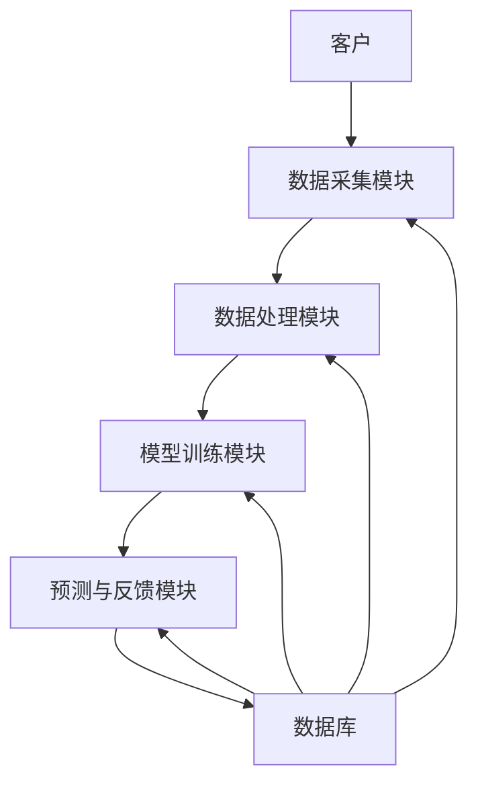

                 


# AI在保险理赔满意度预测与服务优化中的创新应用

> 关键词：AI, 保险理赔, 满意度预测, 服务优化, 机器学习, 系统架构

> 摘要：  
本文系统探讨了AI技术在保险理赔满意度预测与服务优化中的创新应用，从保险行业的数字化转型背景出发，分析了保险理赔流程中的痛点与挑战，详细阐述了AI技术在满意度预测中的核心概念、算法原理、系统设计与优化策略。通过实际案例分析，展示了如何利用机器学习、自然语言处理（NLP）和深度学习等技术，构建高效的保险理赔满意度预测模型，并优化保险服务流程。本文旨在为保险行业从业者和技术开发者提供理论支持与实践指导。

---

# 第一部分: 保险理赔满意度预测的背景与挑战

## 第1章: 保险行业的数字化转型

### 1.1 保险行业的现状与发展趋势

保险行业作为金融领域的重要组成部分，正经历着数字化转型的浪潮。传统保险模式依赖人工操作，效率低下且成本高昂。随着大数据、人工智能（AI）和云计算等技术的快速发展，保险行业逐步向智能化、数据化方向迈进。保险企业通过数字化转型，能够更高效地处理理赔流程、优化客户服务体验，并通过数据驱动的决策提高业务效率。

#### 1.1.1 保险行业的现状与发展趋势

- **现状分析**：  
  - 保险行业数据量庞大，涵盖客户信息、理赔记录、产品销售等多维度数据。  
  - 传统理赔流程依赖人工审核，存在效率低、误差大、成本高等问题。  
  - 客户需求日益多样化，对保险服务的响应速度和个性化要求不断提高。

- **发展趋势**：  
  - 数据驱动的保险产品设计与定价。  
  - AI技术在保险理赔中的广泛应用，包括理赔自动化、风险评估和客户画像构建。  
  - 智能客服与理赔助手的普及，提升客户满意度。  

---

### 1.2 保险理赔流程与痛点分析

保险理赔是保险业务的核心环节之一，其流程复杂且涉及多个部门和环节。传统理赔模式存在以下痛点：

#### 1.2.1 保险理赔的基本流程

1. **报案**：客户在发生保险事件后，向保险公司提出理赔申请。  
2. **资料审核**：保险公司需要审核客户的理赔材料，包括保单、医疗记录、事故报告等。  
3. **风险评估**：根据客户提供的资料，评估理赔案件的真伪和合理性。  
4. **理赔计算**：根据保险合同条款，计算理赔金额。  
5. **理赔支付**：确认无误后，向客户支付理赔款项。  

#### 1.2.2 现有理赔模式的痛点

- **流程繁琐**：客户需要提交大量纸质文件，审核过程耗时长。  
- **人工干预多**：理赔审核依赖人工操作，容易出现误差。  
- **客户体验差**：客户对理赔流程的透明度和响应速度不满，影响满意度。  
- **成本高**：人工审核和管理增加了保险公司的运营成本。  

#### 1.2.3 满意度预测的业务价值

保险公司的核心目标是提升客户满意度，从而增强客户忠诚度和市场竞争力。满意度预测能够帮助保险公司识别高风险客户，提前介入解决问题，从而降低客户流失率。此外，满意度预测还能为保险公司优化服务流程、设计个性化产品提供数据支持。

---

### 1.3 AI技术在保险行业的创新应用

AI技术的引入为保险行业带来了革命性的变化，尤其是在理赔流程的优化和满意度预测方面。

#### 1.3.1 AI技术的基本概念与优势

- **AI技术的基本概念**：  
  AI（Artificial Intelligence）是指模拟人类智能的计算机系统，能够执行学习、推理、感知和决策等任务。  

- **AI技术的优势**：  
  - **高效性**：AI能够快速处理大量数据，提高理赔审核效率。  
  - **准确性**：通过机器学习模型，AI能够减少人为错误，提高理赔判断的准确性。  
  - **个性化服务**：AI可以根据客户需求，提供定制化的保险产品和服务。  

#### 1.3.2 AI在保险理赔中的应用场景

- **智能报案**：通过语音识别和自然语言处理技术，客户可以通过电话或APP完成报案。  
- **自动化审核**：AI系统可以自动分析理赔材料，识别潜在风险。  
- **实时监控**：通过AI技术，保险公司可以实时监控理赔流程，确保案件处理的透明性。  

#### 1.3.3 满意度预测的创新价值

- **数据驱动的预测**：通过分析客户的历史行为和反馈，AI可以预测客户的满意度。  
- **个性化服务优化**：基于满意度预测结果，保险公司可以主动调整服务策略，提升客户体验。  

---

## 第2章: 保险理赔满意度预测的核心概念

### 2.1 保险理赔满意度预测模型

满意度预测模型是AI在保险理赔中的核心工具之一。它通过分析客户的反馈和行为数据，预测客户对理赔服务的满意度。

#### 2.1.1 模型的定义与目标

- **模型定义**：  
  保险理赔满意度预测模型是一种基于机器学习的模型，用于预测客户对保险理赔服务的满意度。  

- **目标**：  
  - 预测客户满意度，识别高风险客户。  
  - 优化理赔流程，提升客户体验。  

#### 2.1.2 模型的核心要素与属性

- **客户行为数据**：包括报案时间、理赔金额、理赔处理时间等。  
- **客户反馈数据**：包括客户对理赔服务的评价和投诉记录。  
- **历史数据**：包括客户的历史理赔记录和保险产品的购买记录。  

#### 2.1.3 模型的输入与输出

- **输入**：  
  - 客户的基本信息（如年龄、性别、职业等）。  
  - 理赔案件的相关信息（如理赔金额、理赔类型等）。  
  - 客户的历史行为数据（如投诉记录、理赔历史等）。  

- **输出**：  
  - 客户的满意度评分（如1分到5分）。  
  - 高风险客户的预警信息。  

---

### 2.2 客户画像与行为分析

客户画像是保险行业的重要工具，能够帮助保险公司更好地理解客户的需求和行为。

#### 2.2.1 客户画像的构建方法

- **数据收集**：收集客户的基本信息、历史理赔记录、投诉记录等。  
- **数据清洗**：对数据进行去重、缺失值处理和异常值剔除。  
- **特征提取**：提取客户的年龄、性别、职业、理赔金额等特征。  
- **模型训练**：通过机器学习模型，构建客户画像。  

#### 2.2.2 客户行为分析的维度

- **时间维度**：分析客户在不同时间段的行为模式。  
- **空间维度**：分析客户在不同地区的理赔行为。  
- **行为维度**：分析客户的投诉频率、理赔金额等行为特征。  

#### 2.2.3 客户画像与满意度预测的关系

客户画像是满意度预测的基础，通过分析客户的特征和行为数据，可以更准确地预测客户的满意度。

---

### 2.3 NLP技术在保险理赔中的应用

自然语言处理（NLP）技术在保险理赔中的应用越来越广泛，尤其是在客户反馈分析和投诉处理方面。

#### 2.3.1 NLP技术的基本原理

- **文本预处理**：包括分词、去停用词、词干提取等。  
- **特征提取**：通过TF-IDF或Word2Vec等方法提取文本特征。  
- **文本分类**：利用机器学习模型对客户反馈进行分类（如正面、负面、中性）。  

#### 2.3.2 NLP在保险理赔中的应用场景

- **客户反馈分析**：通过分析客户的文本反馈，识别客户的主要不满点。  
- **投诉分类**：将客户的投诉内容分类，帮助保险公司快速处理问题。  

#### 2.3.3 NLP技术对满意度预测的贡献

- **情感分析**：通过情感分析模型，识别客户对理赔服务的情感倾向。  
- **关键词提取**：提取客户反馈中的关键词，识别影响满意度的关键因素。  

---

## 第3章: 保险理赔满意度预测的算法原理

### 3.1 传统回归模型

回归模型是常用的满意度预测模型之一，适用于线性关系的场景。

#### 3.1.1 线性回归模型

- **模型原理**：  
  线性回归模型假设因变量与自变量之间存在线性关系，公式为：  
  $$ y = \beta_0 + \beta_1 x_1 + \beta_2 x_2 + \dots + \beta_n x_n + \epsilon $$  
  其中，$y$ 是因变量（满意度评分），$x_i$ 是自变量（客户特征），$\beta_i$ 是回归系数，$\epsilon$ 是误差项。  

- **优点**：  
  - 模型简单，易于解释。  
  - 计算效率高。  

- **缺点**：  
  - 无法处理非线性关系。  
  - 易受异常值影响。  

#### 3.1.2 逻辑回归模型

- **模型原理**：  
  逻辑回归模型适用于二分类问题，公式为：  
  $$ P(y=1|x) = \frac{1}{1 + e^{-(\beta_0 + \beta_1 x_1 + \dots + \beta_n x_n)}} $$  
  其中，$P(y=1|x)$ 是客户满意度为高的概率。  

- **优点**：  
  - 模型解释性强。  
  - 适合二分类问题。  

- **缺点**：  
  - 无法处理非线性关系。  
  - 易受变量之间的多重共线性影响。  

---

### 3.2 集成学习算法

集成学习算法通过组合多个模型的结果，提高预测的准确性和稳定性。

#### 3.2.1 随机森林模型

- **模型原理**：  
  随机森林是一种基于决策树的集成学习算法，通过随机采样和特征选择，构建多个决策树，并通过投票或平均的方式进行预测。  

- **优点**：  
  - 鲁棒性高，能够处理噪声数据。  
  - 对特征工程要求较低。  

- **缺点**：  
  - 计算复杂度较高。  

#### 3.2.2 XGBoost模型

- **模型原理**：  
  XGBoost是一种基于树的优化算法，通过正则化和交叉验证，提高模型的泛化能力。  

- **优点**：  
  - 训练速度快，预测精度高。  
  - 能够处理高维数据。  

- **缺点**：  
  - 对参数敏感，需要调参。  

---

### 3.3 神经网络模型

神经网络模型在处理非线性关系和复杂数据方面具有优势。

#### 3.3.1 深度学习的基本原理

- **模型原理**：  
  深度学习通过多层神经网络，自动提取数据特征，公式为：  
  $$ y = f(x) $$  
  其中，$f(x)$ 是深度神经网络模型。  

- **优点**：  
  - 能够自动提取特征，减少特征工程的工作量。  
  - 对复杂数据的拟合能力强。  

- **缺点**：  
  - 计算资源消耗大。  
  - 模型解释性较差。  

#### 3.3.2 卷积神经网络（CNN）

- **模型原理**：  
  CNN适用于图像数据的处理，通过卷积层和池化层提取图像特征。  

- **优点**：  
  - 在图像识别任务中表现优异。  

- **缺点**：  
  - 不适用于非图像数据。  

#### 3.3.3 循环神经网络（RNN）

- **模型原理**：  
  RNN适用于序列数据的处理，通过循环层捕捉序列的时序关系。  

- **优点**：  
  - 能够处理序列数据。  

- **缺点**：  
  - 存在梯度消失或爆炸问题。  

---

## 第4章: 保险理赔满意度预测的系统分析与架构设计

### 4.1 系统需求分析

满意度预测系统的建设需要明确需求，设计合理的系统架构。

#### 4.1.1 问题场景描述

- **问题场景**：  
  客户对保险理赔服务的满意度低，影响客户忠诚度和市场竞争力。  

- **项目目标**：  
  构建一个基于AI的满意度预测系统，优化理赔流程，提升客户满意度。  

- **范围界定**：  
  系统覆盖保险理赔全流程，包括报案、审核、支付和反馈。  

---

### 4.2 系统功能设计

系统功能设计需要围绕满意度预测的核心需求展开。

#### 4.2.1 系统功能模块

- **数据采集模块**：负责收集客户的理赔数据和反馈数据。  
- **数据处理模块**：对数据进行清洗、转换和特征提取。  
- **模型训练模块**：基于机器学习算法，训练满意度预测模型。  
- **预测与反馈模块**：利用模型预测客户满意度，并提供反馈信息。  

#### 4.2.2 系统功能设计的ER实体关系图

以下是系统功能设计的ER实体关系图：

```mermaid
erDiagram
    客户信息表<{
        id : int
        姓名 : string
        性别 : string
        年龄 : int
        职业 : string
        电话 : string
    }>
    理赔记录表<{
        id : int
        客户id : int
        理赔金额 : float
        理赔时间 : datetime
        理赔状态 : string
    }>
    反馈表<{
        id : int
        客户id : int
        反馈内容 : string
        反馈时间 : datetime
        情感倾向 : string
    }>
    满意度预测模型<{
        id : int
        模型名称 : string
        模型参数 : string
        模型版本 : string
    }>
    客户满意度评分表<{
        id : int
        客户id : int
        满意度评分 : float
        评分时间 : datetime
    }>
    客户信息表 --> 理赔记录表 : 1客户对应多理赔记录
    客户信息表 --> 反馈表 : 1客户对应多反馈
    满意度预测模型 --> 客户满意度评分表 : 1模型对应多评分
```

---

### 4.3 系统架构设计

系统架构设计需要考虑系统的可扩展性和可维护性。

#### 4.3.1 系统架构图

以下是系统架构图：



---

### 4.4 系统接口设计

系统接口设计需要明确各个模块之间的交互方式。

#### 4.4.1 系统接口设计

- **数据采集模块接口**：  
  - 输入：客户信息、理赔记录、反馈数据。  
  - 输出：数据存储到数据库。  

- **数据处理模块接口**：  
  - 输入：原始数据。  
  - 输出：清洗后的数据。  

- **模型训练模块接口**：  
  - 输入：处理后的数据。  
  - 输出：训练好的模型。  

- **预测与反馈模块接口**：  
  - 输入：模型和新数据。  
  - 输出：预测结果和反馈信息。  

---

## 第5章: 保险理赔满意度预测的项目实战

### 5.1 项目环境安装

项目实战需要搭建合适的开发环境。

#### 5.1.1 环境要求

- **Python版本**：3.6以上。  
- **依赖库**：Pandas、NumPy、Scikit-learn、XGBoost、Keras、TensorFlow。  

#### 5.1.2 安装依赖库

```bash
pip install pandas numpy scikit-learn xgboost keras tensorflow
```

---

### 5.2 系统核心实现源代码

以下是系统核心实现的源代码：

```python
import pandas as pd
import numpy as np
from sklearn.model_selection import train_test_split
from sklearn.ensemble import RandomForestClassifier
from sklearn.metrics import accuracy_score
from xgboost import XGBClassifier
from tensorflow.keras.models import Sequential
from tensorflow.keras.layers import Dense

# 数据加载
data = pd.read_csv('insurance_claims.csv')

# 数据预处理
X = data.drop('satisfaction_score', axis=1)
y = data['satisfaction_score']

# 数据分割
X_train, X_test, y_train, y_test = train_test_split(X, y, test_size=0.2, random_state=42)

# 随机森林模型
rf_model = RandomForestClassifier()
rf_model.fit(X_train, y_train)
rf_pred = rf_model.predict(X_test)
rf_accuracy = accuracy_score(y_test, rf_pred)
print(f"Random Forest Accuracy: {rf_accuracy}")

# XGBoost模型
xgb_model = XGBClassifier()
xgb_model.fit(X_train, y_train)
xgb_pred = xgb_model.predict(X_test)
xgb_accuracy = accuracy_score(y_test, xgb_pred)
print(f"XGBoost Accuracy: {xgb_accuracy}")

# 神经网络模型
nn_model = Sequential()
nn_model.add(Dense(64, activation='relu', input_dim=X_train.shape[1]))
nn_model.add(Dense(1, activation='sigmoid'))
nn_model.compile(optimizer='adam', loss='binary_crossentropy', metrics=['accuracy'])
nn_model.fit(X_train, y_train, epochs=10, batch_size=32)
nn_pred = nn_model.predict(X_test)
nn_accuracy = accuracy_score(y_test, nn_pred.round())
print(f"Neural Network Accuracy: {nn_accuracy}")
```

---

### 5.3 项目小结

通过项目实战，我们可以看到不同算法在保险理赔满意度预测中的表现。随机森林和XGBoost等集成学习算法在处理分类问题时表现优异，而神经网络模型则在处理复杂数据时具有优势。选择合适的算法需要根据具体场景和数据特征进行实验验证。

---

## 第6章: 总结与展望

### 6.1 总结

本文系统探讨了AI技术在保险理赔满意度预测与服务优化中的创新应用，从保险行业的数字化转型背景出发，分析了保险理赔流程中的痛点与挑战，详细阐述了AI技术在满意度预测中的核心概念、算法原理、系统设计与优化策略。通过实际案例分析，展示了如何利用机器学习、自然语言处理（NLP）和深度学习等技术，构建高效的保险理赔满意度预测模型，并优化保险服务流程。

---

### 6.2 未来展望

随着AI技术的不断发展，保险行业将更加智能化和数据化。未来，AI技术将在以下几个方面进一步创新：

- **多模态数据融合**：结合文本、图像、语音等多种数据源，提升模型的预测精度。  
- **实时预测与反馈**：通过流数据处理技术，实现实时满意度预测和动态优化。  
- **个性化服务优化**：基于客户画像和行为分析，提供更加个性化的保险服务。  

---

## 作者信息

**作者**：AI天才研究院/AI Genius Institute  
**联系**：https://www.aiguru.org  
**简介**：我们专注于人工智能领域的研究与实践，致力于推动AI技术在各个行业的创新应用。

---

感谢您的阅读！如需进一步探讨或获取代码示例，请访问我们的官方网站：https://www.aiguru.org

