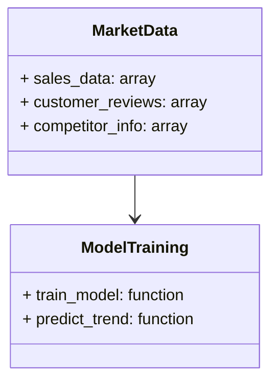
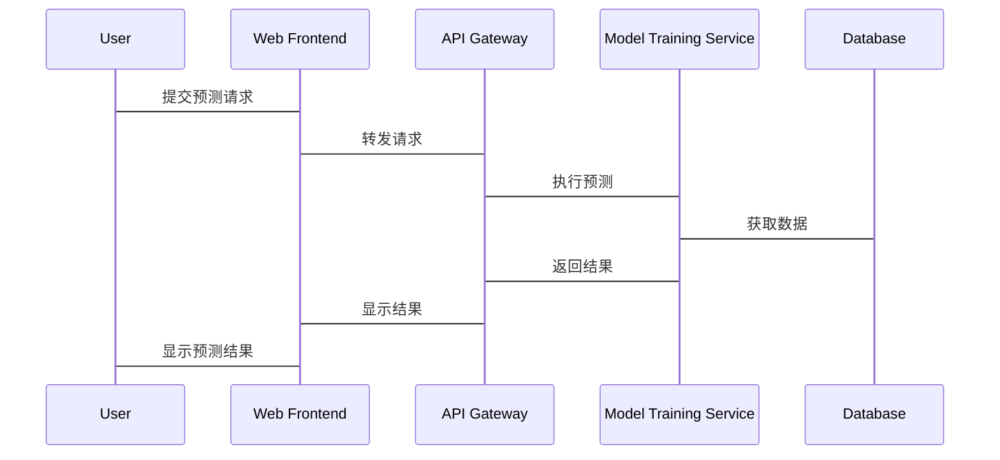

                 


# AI辅助企业战略规划：市场趋势分析与预测

> **关键词**：AI、企业战略规划、市场趋势分析、预测模型、机器学习、时间序列分析、自然语言处理

> **摘要**：  
> 随着人工智能技术的快速发展，企业战略规划的制定和优化越来越依赖于AI技术的支持。本文从AI技术的基本概念出发，深入探讨其在企业战略规划中的应用，特别是市场趋势分析与预测方面。通过结合实际案例，详细讲解了AI驱动的市场趋势分析方法、常见算法原理、系统架构设计以及项目实战，为企业提供了一套完整的AI辅助战略规划解决方案。本文还总结了最佳实践和注意事项，帮助企业在实际应用中更好地发挥AI技术的优势。

---

# 第一部分: AI辅助企业战略规划的背景与概述

## 第1章: AI与企业战略规划的结合

### 1.1 AI技术的定义与发展

AI（人工智能）是指模拟人类智能的计算机系统，能够执行如学习、推理、问题解决和自然语言处理等任务。AI技术的发展经历了多个阶段，从早期的专家系统到现代的深度学习，AI技术在算法、计算能力和数据处理能力方面都有了质的飞跃。

**AI技术的核心特点：**
- **数据驱动**：AI依赖大量数据进行训练和推理。
- **算法复杂性**：现代AI算法（如深度学习）需要复杂的数学模型。
- **应用场景广泛**：从图像识别到自然语言处理，AI技术在多个领域都有广泛应用。

**AI在企业管理中的应用前景**：
AI技术能够帮助企业优化决策、提高效率、降低成本。特别是在企业战略规划中，AI可以通过分析历史数据和市场动态，提供精准的预测和洞察，帮助企业制定更具前瞻性的战略。

---

### 1.2 企业战略规划的核心要素

**企业战略规划的定义**：
企业战略规划是指企业在一定时期内，为实现长期发展目标而制定的总体计划和策略。它通常包括市场分析、竞争策略、资源分配和风险管理等方面。

**市场趋势分析的重要性**：
市场趋势分析是企业战略规划的核心部分。通过对市场数据的分析，企业可以预测未来的市场走向，制定更具竞争力的策略。然而，传统的市场分析方法依赖于人工经验，效率低且容易受到主观因素的影响。AI技术的引入，为企业提供了更高效、更精准的市场分析工具。

**AI在战略规划中的作用**：
- **数据处理能力**：AI能够快速处理海量数据，提取有价值的信息。
- **预测能力**：通过机器学习算法，AI可以预测市场趋势和客户需求。
- **决策支持**：AI为企业提供数据驱动的决策支持，帮助制定更科学的战略规划。

---

### 1.3 本章小结

本章介绍了AI技术的基本概念及其在企业管理中的应用前景，重点强调了AI在企业战略规划中的重要性。通过分析市场趋势，AI技术能够帮助企业制定更具前瞻性的战略，提高决策的科学性和效率。

---

# 第二部分: AI辅助市场趋势分析的核心概念

## 第2章: 市场趋势分析的AI驱动方法

### 2.1 数据驱动的市场分析

**数据收集与处理**：
市场分析的第一步是数据收集。企业需要收集包括销售数据、市场趋势、竞争对手信息和客户反馈等多方面的数据。数据处理包括数据清洗、转换和预处理，确保数据的准确性和一致性。

**数据分析的基本方法**：
- **描述性分析**：通过统计方法分析数据的基本特征，如均值、中位数和标准差。
- **诊断性分析**：分析数据分布的异常点和潜在问题。
- **预测性分析**：利用机器学习算法预测未来的市场趋势。

**数据可视化在市场分析中的应用**：
数据可视化是将数据转化为图表（如折线图、柱状图和散点图）的过程，能够直观地展示数据的变化趋势和分布情况。常用工具包括Python的Matplotlib和Tableau。

---

### 2.2 AI算法在市场预测中的应用

**机器学习算法的基本原理**：
机器学习是一种通过数据训练模型的技术，分为监督学习、无监督学习和强化学习。监督学习适用于预测任务，如回归和分类；无监督学习适用于聚类和降维；强化学习适用于策略优化。

**常见的市场预测模型**：
- **线性回归**：用于预测连续型变量，如销售额。
- **决策树**：适用于分类问题，如客户行为分析。
- **随机森林**：基于决策树的集成学习算法，具有较高的准确性和鲁棒性。

**AI在市场趋势预测中的优势**：
- **高效性**：AI能够快速处理大量数据，提高预测效率。
- **准确性**：通过复杂的算法，AI能够捕捉到数据中的潜在规律，提高预测的准确性。
- **实时性**：AI系统可以实时更新数据，提供最新的市场趋势预测。

---

### 2.3 市场趋势分析的AI工具与平台

**常见的AI工具简介**：
- **Python**：编程语言，广泛应用于数据科学领域。
- **TensorFlow**：Google开发的深度学习框架。
- **Scikit-learn**：Python的机器学习库，适合简单的预测任务。
- **Keras**：用户友好的深度学习框架，适合快速原型设计。

**AI平台的选择与使用**：
选择AI平台时，需要考虑企业的技术栈、数据规模和应用场景。例如，TensorFlow适合复杂的深度学习任务，而Scikit-learn适合简单的预测任务。

**工具在市场分析中的实际应用**：
企业可以利用AI工具进行市场预测、客户分群和竞争对手分析。例如，利用自然语言处理技术分析社交媒体上的客户反馈，提取情感信息，帮助企业了解市场趋势。

---

### 2.4 本章小结

本章详细介绍了AI驱动的市场趋势分析方法，包括数据处理、算法选择和工具使用。通过AI技术，企业能够更高效、更准确地进行市场分析，为战略规划提供有力支持。

---

# 第三部分: AI驱动的市场趋势预测算法原理

## 第3章: 时间序列分析与预测算法

### 3.1 时间序列分析的基本概念

**时间序列的定义与特点**：
时间序列是指按照时间顺序排列的数据，如股票价格、销售数据和天气数据。时间序列分析的目标是通过历史数据预测未来的趋势。

**时间序列分析的常见方法**：
- **移动平均法**：通过计算过去若干期的平均值，预测未来值。
- **指数平滑法**：利用加权平均的方法，预测未来值。
- **ARIMA模型**：一种经典的统计模型，适用于线性时间序列数据。

---

### 3.2 常见的时间序列预测模型

**ARIMA模型**：
ARIMA（自回归积分滑动平均模型）是一种广泛应用于时间序列预测的模型。其基本原理是通过自回归和滑动平均的方式，捕捉数据的自相关性。

**LSTM模型**：
LSTM（长短期记忆网络）是一种特殊的RNN（循环神经网络），能够有效捕捉时间序列中的长期依赖关系。LSTM特别适用于处理复杂的非线性时间序列数据。

**Prophet模型**：
Prophet是由Facebook开发的开源时间序列预测工具，适合非专业的用户使用。它结合了ARIMA和隐马尔可夫模型的特点，能够快速生成预测结果。

---

### 3.3 算法实现与代码示例

**ARIMA模型的实现**：
```python
from statsmodels.tsa.arima_model import ARIMA
import pandas as pd
import numpy as np

# 数据准备
data = pd.read_csv('sales.csv')
data = data['sales'].values

# 模型训练
model = ARIMA(data, order=(5, 1, 0))
model_fit = model.fit()

# 预测未来值
future_predictions = model_fit.forecast(steps=10)
print(future_predictions)
```

**LSTM模型的实现**：
```python
from keras.models import Sequential
from keras.layers import LSTM, Dense
import numpy as np

# 数据准备
data = np.random.randn(100, 1)
train_data = data[:80]
test_data = data[80:]

# 模型构建
model = Sequential()
model.add(LSTM(4, input_shape=(1, 1)))
model.add(Dense(1))
model.compile(loss='mean_squared_error', optimizer='adam')

# 模型训练
model.fit(train_data, train_data, epochs=50, batch_size=1)

# 预测未来值
testPredict = model.predict(test_data)
print(testPredict)
```

---

## 第4章: 基于NLP的市场趋势分析

### 4.1 自然语言处理的基本原理

**NLP的核心概念**：
自然语言处理是指计算机对人类语言的理解和生成。NLP技术包括分词、句法分析、情感分析和文本生成等。

**常见的NLP技术**：
- **分词**：将文本分割成词语或短语。
- **情感分析**：判断文本中的情感倾向（正面、负面或中性）。
- **文本挖掘**：从大量文本数据中提取有价值的信息。

---

### 4.2 市场趋势分析中的NLP应用

**情感分析在市场预测中的应用**：
情感分析可以帮助企业了解客户对产品的看法。例如，通过分析社交媒体上的评论，企业可以预测产品的市场表现。

**文本挖掘在市场分析中的应用**：
文本挖掘可以从大量的非结构化数据（如新闻报道和市场报告）中提取关键词和主题，帮助企业识别市场趋势。

---

### 4.3 本章小结

本章介绍了NLP技术的基本原理及其在市场趋势分析中的应用。通过情感分析和文本挖掘，企业能够从非结构化数据中提取有价值的信息，提高市场预测的准确性。

---

# 第四部分: 系统分析与架构设计方案

## 第5章: 系统架构设计

### 5.1 问题场景介绍

**项目背景**：
假设我们正在开发一个AI辅助企业战略规划的系统，目标是通过分析市场数据，帮助企业制定市场进入策略。

**项目介绍**：
系统将集成多种AI算法，包括时间序列分析和NLP技术，为企业提供全面的市场趋势分析。

---

### 5.2 系统功能设计

**领域模型设计**：


**系统架构设计**：
```mermaid
containerDiagram
    container Web Frontend {
        HTTP Server
        Web Application
    }
    container Backend Service {
        API Gateway
        Model Training Service
        Database
    }
    Web Frontend --> API Gateway
    API Gateway --> Model Training Service
    Model Training Service --> Database
```

---

### 5.3 系统接口设计

**API接口设计**：
- **GET /market_data**：获取市场数据。
- **POST /predict_trend**：提交预测请求。
- **GET /result**：获取预测结果。

**系统交互设计**：


---

### 5.4 本章小结

本章通过系统架构设计，详细说明了AI辅助企业战略规划系统的实现方案。通过功能设计、架构设计和接口设计，确保系统的高效性和可扩展性。

---

# 第五部分: 项目实战

## 第6章: 项目实战与案例分析

### 6.1 环境安装

**安装Python和相关库**：
```bash
pip install numpy pandas matplotlib scikit-learn tensorflow keras
```

---

### 6.2 核心实现

**数据预处理**：
```python
import pandas as pd
import numpy as np

data = pd.read_csv('market_data.csv')
data = data.dropna()
data = (data - data.mean()) / data.std()  # 标准化
```

**模型训练**：
```python
from keras.models import Sequential
from keras.layers import LSTM, Dense

model = Sequential()
model.add(LSTM(50, input_shape=(1, 10)))
model.add(Dense(1))
model.compile(loss='mean_squared_error', optimizer='adam')
model.fit(X_train, y_train, epochs=100, batch_size=32)
```

---

### 6.3 实例分析与结果解读

**案例分析**：
假设我们正在分析某公司的销售额数据，利用LSTM模型进行预测。训练好的模型能够准确预测未来3个月的销售额。

**结果解读**：
通过模型预测，企业可以提前制定库存管理和销售策略，降低经营风险。

---

### 6.4 本章小结

本章通过一个完整的案例分析，展示了AI技术在市场趋势分析中的实际应用。通过项目实战，读者可以更好地理解AI技术的核心原理和实际价值。

---

# 第六部分: 最佳实践与总结

## 第7章: 最佳实践与总结

### 7.1 最佳实践

**数据质量管理**：
确保数据的准确性和完整性，是AI模型发挥效用的基础。

**模型调优**：
通过参数优化和模型选择，提高预测的准确性和稳定性。

**实时监控**：
对模型的预测结果进行实时监控，及时调整和优化。

---

### 7.2 总结

本文详细探讨了AI技术在企业战略规划中的应用，特别是市场趋势分析与预测方面。通过结合实际案例，深入讲解了AI驱动的市场分析方法、算法原理和系统架构设计。未来，随着AI技术的不断发展，企业战略规划将更加依赖于AI技术的支持。

---

## 第8章: 注意事项与未来展望

### 8.1 注意事项

**数据隐私**：
在实际应用中，企业需要关注数据隐私问题，确保符合相关法律法规。

**模型解释性**：
复杂的AI模型往往缺乏解释性，企业需要选择适合自身需求的模型。

**技术更新**：
AI技术发展迅速，企业需要持续关注技术动态，及时更新和优化模型。

---

### 8.2 未来展望

**多模态分析**：
未来的市场趋势分析将结合文本、图像和视频等多种数据源，提供更全面的分析结果。

**自适应模型**：
随着技术的进步，AI模型将具备更强的自适应能力，能够实时调整预测策略。

**边缘计算**：
边缘计算的普及将使市场趋势分析更加实时和高效。

---

## 第9章: 拓展阅读与学习资源

### 9.1 拓展阅读

- **《机器学习实战》**：深入讲解机器学习算法的实现和应用。
- **《Python机器学习》**：系统介绍Python在机器学习中的应用。
- **《时间序列分析》**：详细讲解时间序列分析的方法和技巧。

---

## 第10章: 结语

AI技术正在深刻改变企业的战略规划方式。通过本文的介绍，希望能够为企业提供一套完整的AI辅助战略规划解决方案。未来，随着技术的不断发展，AI将在企业战略规划中发挥更大的作用，帮助企业应对复杂多变的市场环境。

---

**作者：AI天才研究院/AI Genius Institute & 禅与计算机程序设计艺术 /Zen And The Art of Computer Programming**

