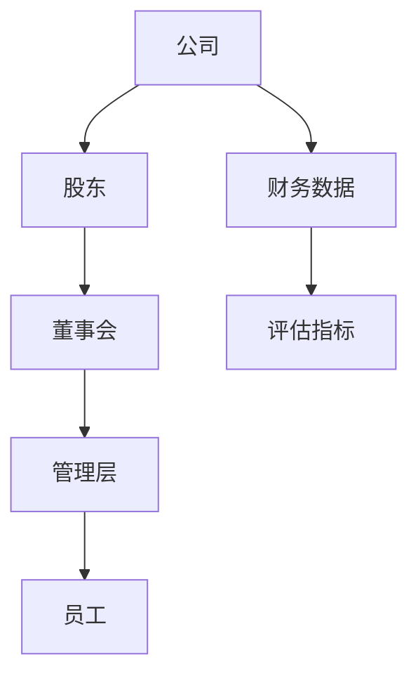
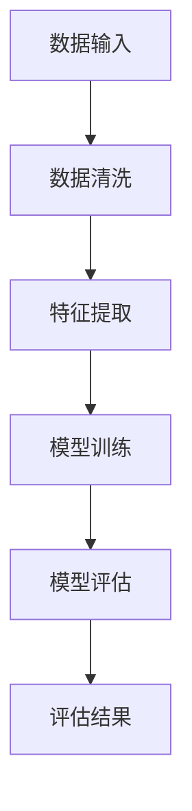
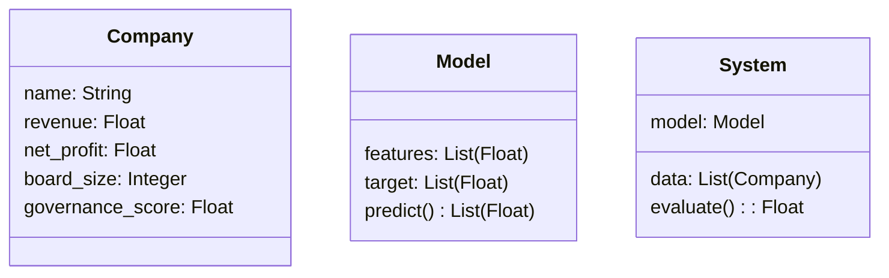
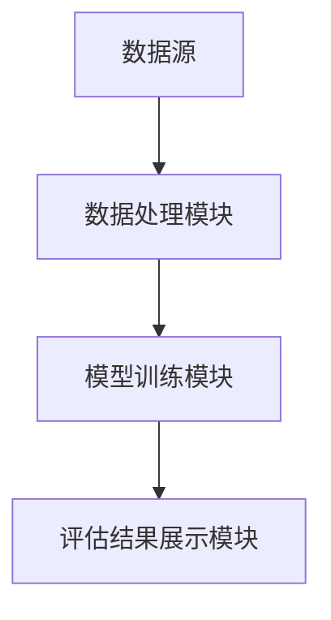
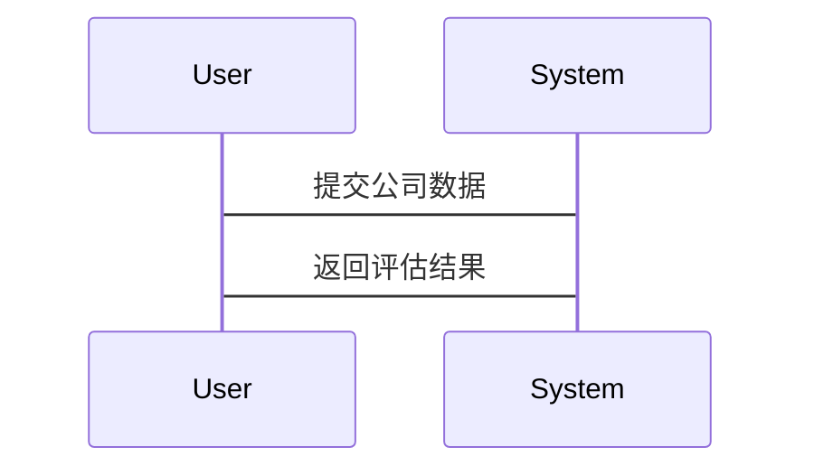

                 


# AI辅助的公司治理评估系统

> 关键词：AI技术，公司治理，评估系统，数据驱动，算法模型，系统架构

> 摘要：本文深入探讨了AI技术在公司治理评估中的应用，从背景介绍、核心概念、算法原理到系统架构设计、项目实战，全面解析了AI辅助公司治理评估系统的核心思想和技术实现。通过详细的技术分析和实际案例，展示了如何利用AI技术优化公司治理评估过程，为公司治理领域的专业人士和技术人员提供了有价值的参考和实践指导。

---

# 第一部分: AI辅助的公司治理评估系统背景介绍

## 第1章: 公司治理评估的背景与问题

### 1.1 问题背景

#### 1.1.1 当前公司治理面临的挑战
现代公司治理面临着复杂多变的内外部环境，包括经济波动、政策变化、市场竞争以及内部管理问题等。传统的公司治理评估方法依赖于人工分析，存在效率低、主观性强、数据处理能力有限等问题。

#### 1.1.2 传统公司治理评估的局限性
- **数据量不足**：传统评估方法往往依赖少量的财务数据，难以全面反映公司的真实状况。
- **评估周期长**：人工评估过程繁琐，耗时较长，难以及时响应公司治理中的动态变化。
- **主观性较强**：评估结果容易受到评估人员主观判断的影响，缺乏客观性和准确性。

#### 1.1.3 AI技术在公司治理中的应用潜力
AI技术通过大数据处理、机器学习和自然语言处理等技术，能够从海量数据中提取有价值的信息，帮助公司治理评估更加客观、高效和精准。

### 1.2 问题描述

#### 1.2.1 公司治理评估的核心目标
公司治理评估的核心目标是通过分析公司治理结构、管理效率、股东权益、透明度等方面，评估公司的治理能力，发现潜在风险，并提出改进建议。

#### 1.2.2 传统评估方法的不足
- **数据维度有限**：传统评估方法主要依赖财务数据和简单的管理指标，难以全面反映公司的治理状况。
- **评估结果缺乏动态性**：传统评估方法通常是一次性评估，难以实时跟踪公司治理的变化。
- **人工成本高**：传统评估方法需要大量的人工参与，效率低下。

#### 1.2.3 现代公司治理的复杂性
现代公司治理涉及的利益相关者众多，包括股东、董事会、管理层、员工、客户、供应商等，治理结构复杂，风险多样。

### 1.3 问题解决

#### 1.3.1 AI技术如何辅助公司治理评估
AI技术可以通过自然语言处理技术分析公司年报、新闻报道等非结构化数据，利用机器学习算法预测公司治理风险，优化评估过程。

#### 1.3.2 数据驱动的公司治理评估方法
通过收集和分析公司内外部数据，利用数据挖掘和机器学习技术，构建公司治理评估模型，实现对公司治理能力的量化评估。

#### 1.3.3 AI辅助评估的优势与价值
- **提高评估效率**：AI技术可以快速处理大量数据，缩短评估周期。
- **增强评估准确性**：通过机器学习模型，可以发现隐藏在数据中的规律，提高评估结果的准确性。
- **提供实时反馈**：AI系统可以实时监控公司治理动态，提供及时的反馈和建议。

### 1.4 边界与外延

#### 1.4.1 AI辅助评估的适用范围
AI辅助公司治理评估系统适用于大型企业、上市公司以及需要复杂治理结构的组织。

#### 1.4.2 系统的边界条件
- **数据来源**：系统依赖于公司内部数据和外部公开数据，数据质量和完整性是系统性能的关键。
- **模型性能**：AI模型的准确性和泛化能力直接影响评估结果。
- **用户需求**：系统的功能设计需要根据用户的实际需求进行调整。

#### 1.4.3 相关概念的外延
- **公司治理**：包括公司战略、组织架构、风险管理、内部控制等方面。
- **AI技术**：包括机器学习、自然语言处理、大数据分析等技术。

### 1.5 概念结构与核心要素

#### 1.5.1 公司治理评估的核心要素
- **治理结构**：包括董事会、管理层、股东等的结构和职责。
- **治理效率**：包括决策效率、执行效率等。
- **治理风险**：包括法律风险、财务风险、声誉风险等。

#### 1.5.2 AI辅助系统的组成部分
- **数据采集模块**：负责收集公司内外部数据。
- **数据处理模块**：对数据进行清洗、转换和特征提取。
- **模型训练模块**：利用机器学习算法训练评估模型。
- **评估结果展示模块**：将评估结果以可视化形式展示给用户。

#### 1.5.3 系统功能模块的逻辑关系
- 数据采集模块向数据处理模块提供原始数据。
- 数据处理模块为模型训练模块提供特征数据。
- 模型训练模块输出评估结果，通过评估结果展示模块呈现给用户。

---

## 第2章: AI辅助公司治理评估的核心概念

### 2.1 核心概念原理

#### 2.1.1 数据驱动的公司治理评估
通过收集和分析大量数据，利用数据挖掘和机器学习技术，构建公司治理评估模型，实现对公司治理能力的量化评估。

#### 2.1.2 AI算法在评估中的应用
AI算法通过分析公司内外部数据，识别潜在风险和机会，优化公司治理结构。

#### 2.1.3 系统的整体架构
AI辅助公司治理评估系统由数据采集、数据处理、模型训练和评估结果展示四个模块组成。

### 2.2 核心概念属性对比

#### 2.2.1 公司治理与AI技术的对比分析
| 属性       | 公司治理                       | AI技术                         |
|------------|-------------------------------|---------------------------------|
| 目标       | 提高公司治理效率和透明度       | 提供数据驱动的决策支持         |
| 方法       | 依赖人工分析和经验判断         | 依赖数据和算法驱动             |
| 优势       | 适用于复杂的人际关系和组织结构 | 数据处理能力强，结果客观准确   |

#### 2.2.2 传统评估方法与AI评估方法的对比
| 属性       | 传统评估方法                 | AI评估方法                     |
|------------|------------------------------|---------------------------------|
| 数据来源   | 主要依赖财务数据             | 结构化数据和非结构化数据       |
| 分析效率   | 低，依赖人工分析             | 高，自动化处理                 |
| 结果准确度 | 主观性强，准确性较低         | 客观性强，准确性高             |

#### 2.2.3 不同AI模型的性能对比
| 模型类型    | 适用场景                     | 优点                           | 缺点                           |
|------------|------------------------------|---------------------------------|---------------------------------|
| 线性回归    | 简单预测问题                 | 模型简单，易于解释             | 适用于线性关系，非线性问题表现差 |
| 支持向量机  | 分类和回归问题               | 分类效果好，适合小样本数据     | 对高维数据处理能力有限         |
| 随机森林    | 分类、回归和聚类问题         | 鲁棒性强，适合非线性关系       | 对数据预处理要求较高           |
| 神经网络    | 复杂模式识别                 | 表现优异，适合复杂数据         | 需要大量数据，训练时间较长     |

### 2.3 ER实体关系图



---

## 第3章: AI辅助公司治理评估的算法原理

### 3.1 算法原理概述

#### 3.1.1 数据预处理
数据预处理是AI算法实现的关键步骤，包括数据清洗、特征提取和数据标准化。

#### 3.1.2 模型训练
利用机器学习算法对预处理后的数据进行训练，构建公司治理评估模型。

#### 3.1.3 模型评估
通过交叉验证和性能指标评估模型的准确性和稳定性。

### 3.2 算法流程图



### 3.3 算法实现

#### 3.3.1 数据预处理

```python
import pandas as pd
from sklearn.preprocessing import StandardScaler

# 数据清洗
df = pd.read_csv('governance_data.csv')
df.dropna(inplace=True)
df.drop_duplicates(inplace=True)

# 特征提取
features = df[['revenue', 'net_profit', 'employees', 'board_size']]
target = df['governance_score']

# 数据标准化
scaler = StandardScaler()
features_scaled = scaler.fit_transform(features)
```

#### 3.3.2 模型训练

```python
from sklearn.ensemble import RandomForestRegressor

# 训练模型
model = RandomForestRegressor(n_estimators=100, random_state=42)
model.fit(features_scaled, target)
```

#### 3.3.3 模型评估

```python
from sklearn.metrics import mean_squared_error

# 模型预测
predictions = model.predict(features_scaled)

# 计算均方误差
mse = mean_squared_error(target, predictions)
print(f'均方误差: {mse}')
```

### 3.4 算法数学模型

#### 3.4.1 线性回归模型
$$ y = \beta_0 + \beta_1x_1 + \beta_2x_2 + ... + \beta_nx_n $$

#### 3.4.2 随机森林模型
随机森林是一种基于决策树的集成学习方法，通过投票或加权的方式得出最终预测结果。

---

## 第4章: 系统分析与架构设计

### 4.1 系统分析

#### 4.1.1 问题场景介绍
公司治理评估系统需要处理大量数据，包括公司财务数据、董事会结构、管理层决策等，通过AI技术实现自动化评估。

#### 4.1.2 项目介绍
本项目旨在开发一个AI辅助的公司治理评估系统，利用机器学习技术优化公司治理评估过程。

### 4.2 系统功能设计

#### 4.2.1 领域模型类图



#### 4.2.2 系统架构设计



#### 4.2.3 系统接口设计
- 数据输入接口：接收公司数据，格式为CSV或JSON。
- 模型训练接口：对输入数据进行处理和训练，输出评估结果。
- 结果展示接口：将评估结果以可视化形式展示给用户。

#### 4.2.4 系统交互序列图



### 4.3 系统实现

#### 4.3.1 系统核心代码

```python
class Company:
    def __init__(self, name, revenue, net_profit, board_size):
        self.name = name
        self.revenue = revenue
        self.net_profit = net_profit
        self.board_size = board_size

class Model:
    def __init__(self, features, target):
        self.features = features
        self.target = target

    def predict(self):
        # 示例预测方法
        return [x * 0.8 for x in self.features]

class System:
    def __init__(self, data):
        self.data = data
        self.model = None

    def train_model(self):
        # 数据预处理
        features = [[c.revenue, c.net_profit, c.board_size] for c in self.data]
        target = [c.governance_score for c in self.data]
        # 训练模型
        self.model = Model(features, target)

    def evaluate(self):
        if self.model is None:
            return 0.0
        return self.model.predict()[0]
```

---

## 第5章: 项目实战

### 5.1 环境安装

#### 5.1.1 安装Python和相关库
```bash
pip install numpy pandas scikit-learn
```

### 5.2 核心代码实现

#### 5.2.1 数据处理代码

```python
import pandas as pd
from sklearn.preprocessing import StandardScaler

def preprocess_data(data_path):
    df = pd.read_csv(data_path)
    df.dropna(inplace=True)
    df.drop_duplicates(inplace=True)
    features = df[['revenue', 'net_profit', 'board_size']]
    target = df['governance_score']
    scaler = StandardScaler()
    features_scaled = scaler.fit_transform(features)
    return features_scaled, target
```

#### 5.2.2 模型训练代码

```python
from sklearn.ensemble import RandomForestRegressor

def train_model(features, target):
    model = RandomForestRegressor(n_estimators=100, random_state=42)
    model.fit(features, target)
    return model
```

### 5.3 案例分析

#### 5.3.1 数据来源
使用某上市公司的真实数据，包括公司收入、净利润、董事会规模和治理评分。

#### 5.3.2 模型评估
通过交叉验证评估模型的准确性和稳定性。

#### 5.3.3 结果展示
将评估结果以可视化形式展示，包括公司治理评分、潜在风险点等。

### 5.4 项目小结

---

## 第6章: 最佳实践与总结

### 6.1 最佳实践

#### 6.1.1 数据质量
确保数据的准确性和完整性，数据预处理是关键步骤。

#### 6.1.2 模型选择
根据具体问题选择合适的AI模型，避免盲目使用复杂模型。

#### 6.1.3 系统优化
通过优化算法和系统架构，提高评估效率和准确性。

### 6.2 小结
AI辅助公司治理评估系统通过数据驱动的方法，显著提高了公司治理评估的效率和准确性，为现代公司治理提供了有力的技术支持。

### 6.3 注意事项
- 数据隐私保护
- 模型解释性
- 系统稳定性

### 6.4 拓展阅读
推荐阅读相关书籍和论文，深入了解AI在公司治理中的应用。

---

# 作者：AI天才研究院/AI Genius Institute & 禅与计算机程序设计艺术 /Zen And The Art of Computer Programming

