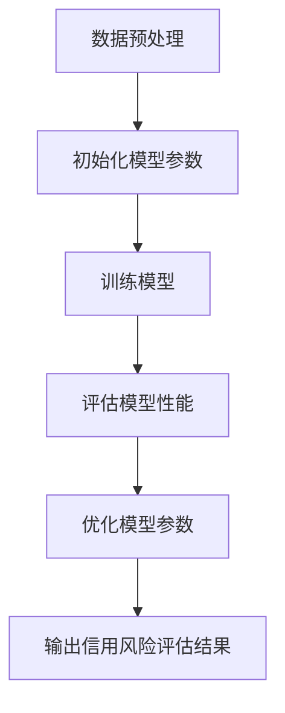
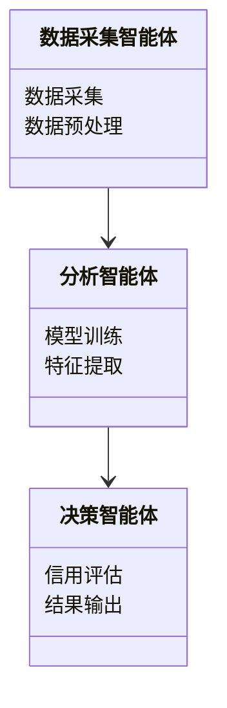
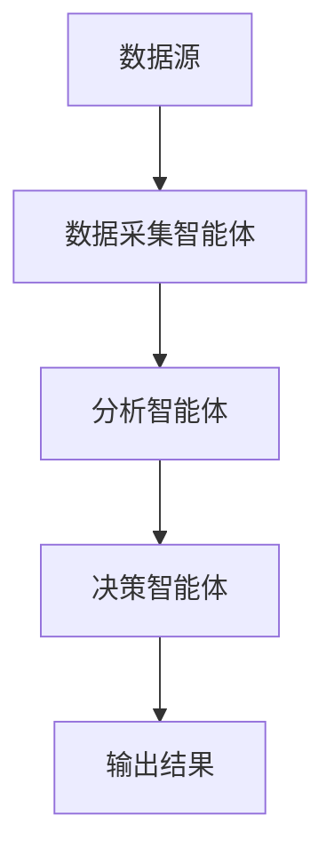
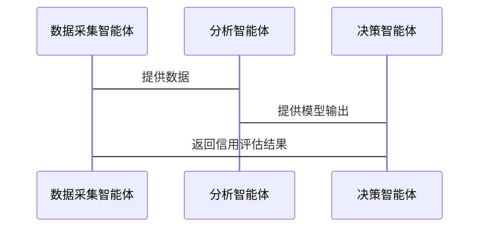

                 


# 利用多智能体系统进行全面的公司信用风险分析

> 关键词：多智能体系统，信用风险分析，协同学习，金融风险管理，人工智能，系统架构

> 摘要：本文将探讨如何利用多智能体系统进行全面的公司信用风险分析。通过分析多智能体系统的核心概念、算法原理、系统架构设计以及实际项目实现，本文旨在展示多智能体系统在信用风险评估中的强大能力。我们从背景介绍入手，逐步深入，结合理论与实践，为读者提供一个全面的视角。

---

## 第一部分：背景介绍

### 第1章：多智能体系统概述

#### 1.1 多智能体系统的基本概念

- **1.1.1 多智能体系统的定义**  
  多智能体系统（Multi-Agent System, MAS）是由多个智能体（Agent）组成的分布式系统，这些智能体能够通过通信和协作完成复杂任务。智能体是指能够感知环境、自主决策并采取行动的实体。

- **1.1.2 多智能体系统的特征**  
  - **自主性**：智能体能够自主决策，无需外部干预。  
  - **反应性**：智能体能够实时感知环境并做出反应。  
  - **协作性**：多个智能体通过协作完成复杂任务。  
  - **分布性**：智能体分布在不同的空间或计算节点上。

- **1.1.3 多智能体系统与传统单智能体系统的区别**  
  - 单智能体系统依赖于中心化的决策机制，而多智能体系统通过分布式协作完成任务。  
  - 多智能体系统能够处理更复杂的任务，但需要解决通信、协调和冲突问题。

#### 1.2 多智能体系统的组成与结构

- **1.2.1 智能体的定义与分类**  
  - **智能体**：能够感知环境、做出决策并采取行动的实体。  
  - **分类**：根据智能体的智能水平，可分为反应式智能体和认知式智能体；根据功能，可分为执行器智能体和协调器智能体。

- **1.2.2 多智能体系统的层次结构**  
  - **感知层**：智能体通过传感器或数据源获取环境信息。  
  - **决策层**：智能体基于感知信息做出决策。  
  - **执行层**：智能体根据决策采取行动。

- **1.2.3 多智能体系统的通信机制**  
  - 智能体之间通过消息传递进行通信。  
  - 通信协议需要确保信息的准确性和实时性。

#### 1.3 多智能体系统的应用领域

- **1.3.1 金融领域的应用**  
  - 信用风险评估、投资决策、市场预测等。  
  - 多智能体系统能够处理金融市场的复杂性和不确定性。

- **1.3.2 其他领域的应用**  
  - 交通管理、机器人协作、分布式计算等。  
  - 多智能体系统在多个领域展现出了强大的应用潜力。

- **1.3.3 多智能体系统的优势与挑战**  
  - **优势**：能够处理复杂任务，提高系统效率。  
  - **挑战**：通信延迟、协同决策复杂性、系统安全性等。

#### 1.4 本章小结

本章介绍了多智能体系统的基本概念、组成结构以及应用领域，为后续章节奠定了基础。多智能体系统在信用风险分析中的应用潜力巨大，但也需要克服一些技术挑战。

---

## 第2章：信用风险分析基础

### 2.1 信用风险的基本概念

#### 2.1.1 信用风险的定义

信用风险是指债务人或交易对手未能履行其 contractual obligations 的可能性。在金融领域，信用风险是衡量一个公司或个人信用状况的重要指标。

#### 2.1.2 信用风险的分类

- **单个风险**：单一借款人违约的可能性。  
- **组合风险**：多个借款人违约的可能性。  
- **系统性风险**：整个金融系统中广泛存在的信用风险。

#### 2.1.3 信用风险的影响因素

- **经济环境**：经济周期、利率水平、通货膨胀等。  
- **公司状况**：财务状况、管理水平、行业竞争等。  
- **市场因素**：市场波动、流动性风险等。

### 2.2 信用风险评估的方法

#### 2.2.1 传统信用风险评估方法

- **信用评分模型**：如 FICO 评分，基于历史数据对借款人进行评分。  
- **违约概率模型**：如 KMV 模型，基于市场数据计算违约概率。

#### 2.2.2 基于机器学习的信用风险评估方法

- **监督学习**：如逻辑回归、支持向量机（SVM）等。  
- **无监督学习**：如聚类分析。  
- **深度学习**：如神经网络模型。

#### 2.2.3 多智能体系统在信用风险评估中的应用

- 多智能体系统可以通过协作学习的方式，整合多个数据源的信息，提高信用风险评估的准确性。

### 2.3 信用风险分析的挑战

#### 2.3.1 数据的复杂性

- 数据来源多样，包括结构化数据和非结构化数据。  
- 数据量大，处理难度高。

#### 2.3.2 模型的局限性

- 传统模型难以处理复杂场景。  
- 深度学习模型需要大量数据支持，且解释性较差。

#### 2.3.3 系统的实时性要求

- 信用风险评估需要实时性，对系统的响应速度提出了高要求。

### 2.4 本章小结

本章介绍了信用风险的基本概念、评估方法及面临的挑战。传统方法在信用风险评估中发挥了重要作用，但多智能体系统通过协作学习的方式，为信用风险评估提供了新的可能性。

---

## 第3章：多智能体系统在信用风险分析中的核心概念

### 3.1 多智能体系统与信用风险分析的结合

#### 3.1.1 多智能体系统如何辅助信用风险分析

- 通过协同学习，整合多个数据源的信息，提高信用风险评估的准确性。  
- 多智能体系统可以实时监控市场变化，及时调整信用评估策略。

#### 3.1.2 多智能体系统在信用风险分析中的角色

- **数据采集智能体**：负责从多个数据源采集信息。  
- **分析智能体**：对数据进行分析和建模。  
- **决策智能体**：基于分析结果做出信用评估决策。

### 3.2 多智能体系统的协同机制

#### 3.2.1 协同学习的基本原理

- 协同学习是指多个智能体通过协作完成共同目标的学习过程。  
- 通过分布式计算和数据共享，提高模型的泛化能力。

#### 3.2.2 协同决策的实现方法

- **分布式决策**：每个智能体独立做出决策，然后通过通信机制整合决策结果。  
- **集中式决策**：多个智能体将数据汇总到一个中心节点，由中心节点做出决策。

#### 3.2.3 协同优化的应用场景

- 优化信用风险评估模型的参数，提高模型的准确性。  
- 优化多智能体系统的通信效率，降低系统延迟。

### 3.3 多智能体系统的信用风险分析模型

#### 3.3.1 模型的构建过程

- 数据预处理：清洗和标准化数据。  
- 模型训练：基于多智能体协同学习的方法训练模型。  
- 模型验证：通过测试数据验证模型的准确性。

#### 3.3.2 模型的输入与输出

- **输入**：多源异构数据，包括财务数据、市场数据、文本数据等。  
- **输出**：信用风险评估结果，包括违约概率、信用等级等。

#### 3.3.3 模型的评估与优化

- **评估指标**：准确率、召回率、F1 分值等。  
- **优化方法**：通过调整模型参数和优化算法，提高模型性能。

### 3.4 本章小结

本章介绍了多智能体系统在信用风险分析中的核心概念，包括协同学习、协同决策和信用风险分析模型的构建。多智能体系统通过协作机制，显著提高了信用风险评估的准确性和实时性。

---

## 第4章：多智能体系统信用风险分析的算法原理

### 4.1 协同学习算法

#### 4.1.1 协同学习的基本概念

- 协同学习（Collaborative Learning）是指多个智能体通过协作完成共同目标的学习过程。  
- 通过分布式计算和数据共享，提高模型的泛化能力。

#### 4.1.2 协同学习的实现步骤

1. 初始化：每个智能体分配初始参数。  
2. 数据共享：智能体之间共享数据或特征。  
3. 模型训练：每个智能体基于共享数据训练模型。  
4. 参数更新：智能体更新参数并共享给其他智能体。  
5. 模型优化：通过迭代优化模型参数，提高模型性能。

#### 4.1.3 协同学习的优缺点

- **优点**：能够利用多源数据，提高模型的准确性。  
- **缺点**：通信成本高，模型收敛速度慢。

### 4.2 基于多智能体的信用风险评估算法

#### 4.2.1 算法的流程图



#### 4.2.2 算法的数学模型

- **输入**：多源数据，包括财务数据、市场数据等。  
- **输出**：信用风险评估结果。  
- **模型**：基于协同学习的信用风险评估模型，具体数学表达如下：

$$
\text{违约概率} = f(\text{财务数据}, \text{市场数据}, \text{其他因素})
$$

其中，$f$ 是基于协同学习的模型。

#### 4.2.3 算法的实现步骤

1. 数据预处理：清洗和标准化数据。  
2. 初始化模型参数：设置初始参数值。  
3. 训练模型：基于多智能体协同学习的方法训练模型。  
4. 评估模型性能：计算准确率、召回率等指标。  
5. 优化模型参数：通过调整参数优化模型性能。  
6. 输出信用风险评估结果。

### 4.3 多智能体系统的优化算法

#### 4.3.1 优化算法的基本原理

- 优化算法用于提高多智能体系统的性能，包括计算效率和模型准确性。  
- 常见的优化算法包括梯度下降、Adam 等。

#### 4.3.2 优化算法的实现方法

- **梯度下降**：通过计算损失函数的梯度，更新模型参数。  
- **Adam**：结合动量和自适应学习率的优化算法。

#### 4.3.3 优化算法的应用案例

- 优化多智能体系统的通信效率，降低系统延迟。  
- 优化信用风险评估模型的参数，提高模型准确性。

### 4.4 本章小结

本章介绍了多智能体系统信用风险分析的算法原理，包括协同学习算法、信用风险评估模型的数学表达以及优化算法的实现方法。通过优化算法，可以显著提高多智能体系统的性能。

---

## 第5章：多智能体系统信用风险分析的数学模型

### 5.1 基于多智能体的信用风险评估模型

#### 5.1.1 模型的数学表达

$$
\text{违约概率} = \sum_{i=1}^{n} w_i x_i
$$

其中，$w_i$ 是第 $i$ 个特征的权重，$x_i$ 是第 $i$ 个特征的值。

#### 5.1.2 模型的参数设置

- **权重参数**：通过训练数据优化得到。  
- **特征选择**：选择与信用风险相关的特征，如财务比率、市场指标等。

#### 5.1.3 模型的验证与优化

- **验证方法**：交叉验证、ROC 曲线等。  
- **优化方法**：调整模型参数，提高模型的准确性和召回率。

### 5.2 协同优化的数学模型

#### 5.2.1 协同优化的数学表达

$$
\min_{w} \frac{1}{2} \|y - Xw\|^2 + \lambda \|w\|^2
$$

其中，$y$ 是目标变量，$X$ 是特征矩阵，$w$ 是模型参数，$\lambda$ 是正则化参数。

#### 5.2.2 协同优化的实现步骤

1. 初始化模型参数。  
2. 计算损失函数。  
3. 计算梯度并更新参数。  
4. 重复步骤 2 和 3，直到收敛。

### 5.3 本章小结

本章介绍了多智能体系统信用风险分析的数学模型，包括违约概率的计算公式和协同优化的数学表达。通过数学模型的优化，可以显著提高信用风险评估的准确性。

---

## 第6章：多智能体系统信用风险分析的系统分析与架构设计

### 6.1 系统分析

#### 6.1.1 问题场景介绍

- **场景描述**：公司需要对多个客户的信用风险进行实时评估。  
- **目标**：利用多智能体系统，提高信用风险评估的准确性和效率。

#### 6.1.2 项目介绍

- **项目目标**：构建一个基于多智能体系统的信用风险评估系统。  
- **项目范围**：包括数据采集、模型训练、结果输出等模块。

### 6.2 系统功能设计

#### 6.2.1 领域模型



#### 6.2.2 系统架构设计



#### 6.2.3 系统接口设计

- **数据接口**：与数据源对接，获取客户数据。  
- **模型接口**：与分析智能体对接，获取模型输出。  
- **结果接口**：与用户界面对接，输出信用评估结果。

#### 6.2.4 系统交互设计



### 6.3 本章小结

本章介绍了多智能体系统信用风险分析的系统分析与架构设计，包括系统功能模块的设计和系统架构的实现。通过合理的系统设计，可以提高信用风险评估的效率和准确性。

---

## 第7章：多智能体系统信用风险分析的项目实战

### 7.1 项目环境安装

- **安装 Python**：确保安装 Python 3.8 或更高版本。  
- **安装依赖库**：包括 TensorFlow、Keras、scikit-learn 等。

### 7.2 系统核心实现源代码

#### 7.2.1 数据采集智能体的实现

```python
import requests

class DataCollector:
    def __init__(self, api_key):
        self.api_key = api_key

    def fetch_data(self, company_id):
        # 模拟数据接口
        response = requests.get(f"https://api.example.com/company/{company_id}", params={"api_key": self.api_key})
        return response.json()
```

#### 7.2.2 分析智能体的实现

```python
from tensorflow.keras import models, layers

class Analyzer:
    def __init__(self):
        self.model = self.build_model()

    def build_model(self):
        model = models.Sequential()
        model.add(layers.Dense(64, activation='relu', input_dim=64))
        model.add(layers.Dense(32, activation='relu'))
        model.add(layers.Dense(1, activation='sigmoid'))
        model.compile(optimizer='adam', loss='binary_crossentropy', metrics=['accuracy'])
        return model

    def train(self, x, y):
        self.model.fit(x, y, epochs=10, batch_size=32)
```

#### 7.2.3 决策智能体的实现

```python
class DecisionMaker:
    def __init__(self):
        pass

    def assess_credit(self, prediction):
        if prediction >= 0.7:
            return "高风险"
        elif prediction >= 0.4:
            return "中风险"
        else:
            return "低风险"
```

### 7.3 代码应用解读与分析

- **数据采集智能体**：负责从数据源获取客户数据。  
- **分析智能体**：基于神经网络模型进行信用风险评估。  
- **决策智能体**：根据模型预测结果，输出信用评估等级。

### 7.4 实际案例分析

#### 7.4.1 案例描述

假设我们有一个客户数据集，包括财务数据和市场数据。我们需要利用多智能体系统对其进行信用风险评估。

#### 7.4.2 数据预处理

- **数据清洗**：处理缺失值和异常值。  
- **数据标准化**：将数据归一化到相同范围。

#### 7.4.3 模型训练

- 使用训练数据训练分析智能体的神经网络模型。  
- 调整模型参数，提高模型的准确率。

#### 7.4.4 模型评估

- 使用测试数据评估模型的准确率和召回率。  
- 通过 ROC 曲线评估模型的性能。

#### 7.4.5 模型优化

- 优化模型参数，提高模型的准确率和效率。  
- 通过交叉验证评估模型的泛化能力。

### 7.5 项目小结

本章通过实际案例分析，展示了多智能体系统在信用风险评估中的应用。通过数据采集、模型训练和结果输出，可以实现高效的信用风险评估。

---

## 第8章：最佳实践与注意事项

### 8.1 小结

多智能体系统在信用风险分析中的应用具有显著的优势，能够通过协作学习和协同决策提高信用风险评估的准确性和效率。

### 8.2 注意事项

- **数据隐私**：确保数据的安全性和隐私性。  
- **系统稳定性**：确保系统的稳定运行，避免因通信延迟导致的错误。  
- **模型解释性**：提高模型的解释性，便于业务人员理解和使用。

### 8.3 拓展阅读

- 推荐阅读《Multi-Agent Systems》（Lecture Notes on Multi-Agent Systems）。  
- 推荐学习 TensorFlow 和 Keras 的多智能体系统实现方法。

---

## 作者：AI天才研究院/AI Genius Institute & 禅与计算机程序设计艺术 /Zen And The Art of Computer Programming

---

以上是《利用多智能体系统进行全面的公司信用风险分析》的技术博客文章的完整目录和内容概述。希望这篇文章能够为读者提供关于多智能体系统在信用风险分析中的深入理解，并激发更多的思考和应用。

