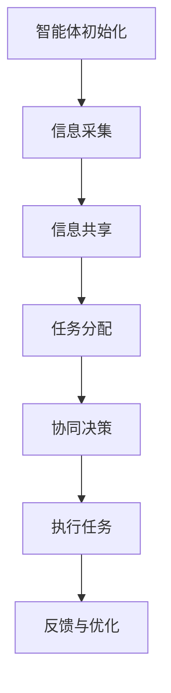
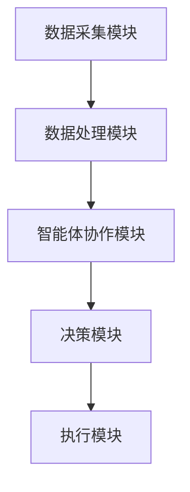

                 


# 多智能体协作增强价值投资的市场流动性预测

> 关键词：多智能体协作，价值投资，市场流动性预测，强化学习，分布式系统，金融数据分析

> 摘要：本文探讨了多智能体协作在增强价值投资中的应用，特别是如何通过多智能体协作来提高市场流动性预测的准确性。文章从多智能体协作的基本原理、价值投资的核心概念、市场流动性预测的算法实现、系统架构设计、项目实战案例以及最佳实践等方面进行了深入分析。通过理论与实践相结合的方式，本文为读者提供了一个全面理解多智能体协作如何增强价值投资的框架。

---

# 第一部分: 多智能体协作与价值投资的背景与基础

## 第1章: 多智能体协作与价值投资概述

### 1.1 多智能体协作的定义与特点

#### 1.1.1 多智能体协作的定义

多智能体协作（Multi-Agent Collaboration）是指多个智能体（Agent）通过相互协作，共同完成某个复杂任务的过程。每个智能体都有自己的目标、知识和能力，能够独立决策并与其他智能体进行信息交换。

#### 1.1.2 多智能体协作的核心特点

- **分布式性**：智能体之间没有中心化的控制节点，每个智能体独立决策。
- **协作性**：智能体通过协作完成任务，个体目标与整体目标一致。
- **动态性**：智能体能够根据环境变化动态调整策略。
- **鲁棒性**：系统能够在部分智能体失效的情况下继续运行。

#### 1.1.3 多智能体协作与单智能体的区别

| 特性         | 单智能体协作 | 多智能体协作 |
|--------------|--------------|--------------|
| 决策中心化   | 是           | 否           |
| 信息处理     | 集中         | 分散         |
| 系统复杂度   | 低           | 高           |
| 灵活性       | 低           | 高           |

### 1.2 价值投资的基本原理

#### 1.2.1 价值投资的定义

价值投资是一种投资策略，强调以低于资产内在价值的价格买入优质资产。其核心在于寻找市场定价错误的机会，通过长期持有优质资产来实现收益。

#### 1.2.2 价值投资的核心原则

- **安全边际**：买入价格低于资产的内在价值。
- **长期视角**：关注企业的长期盈利能力。
- **逆向思维**：在市场恐慌时寻找机会。

#### 1.2.3 价值投资与市场流动性预测的关系

市场流动性影响资产的买卖难度，进而影响价格。通过预测市场流动性，投资者可以更好地把握买入和卖出的时机，从而增强价值投资的效果。

### 1.3 市场流动性预测的定义与意义

#### 1.3.1 市场流动性预测的定义

市场流动性预测是指通过分析市场数据，预测未来某一时间段内市场的流动性状况。流动性越高，资产的买卖难度越低，价格波动越小。

#### 1.3.2 市场流动性预测的重要性

- **优化交易策略**：通过预测流动性，投资者可以优化交易时机，降低交易成本。
- **风险控制**：流动性不足可能导致资产价格大幅波动，提前预测有助于风险控制。
- **提高投资收益**：通过流动性预测，投资者可以更好地把握市场机会。

#### 1.3.3 多智能体协作在流动性预测中的作用

多智能体协作可以通过分布式计算和信息共享，提高市场数据的处理能力，从而更准确地预测市场流动性。

---

## 第2章: 多智能体协作增强价值投资的背景

### 2.1 金融市场中的多智能体协作

#### 2.1.1 金融市场的复杂性与不确定性

金融市场是一个高度动态的环境，受多种因素影响，如经济数据、政策变化、市场情绪等。多智能体协作能够帮助投资者更好地应对这种复杂性。

#### 2.1.2 多智能体协作在金融市场的应用

- **高频交易**：通过多智能体协作实现高频交易策略的优化。
- **风险控制**：多个智能体协同工作，实时监控市场风险。
- **信息处理**：多智能体协作能够高效处理海量市场数据。

#### 2.1.3 价值投资与市场流动性预测的结合

价值投资者通常关注长期收益，而流动性预测可以帮助他们更好地把握短期市场波动，从而优化投资策略。

### 2.2 多智能体协作的技术基础

#### 2.2.1 人工智能与机器学习

人工智能（AI）和机器学习（ML）为多智能体协作提供了技术支持，如自然语言处理、计算机视觉和强化学习等。

#### 2.2.2 多智能体系统的技术架构

多智能体系统通常包括以下几个部分：

- **智能体**：负责执行具体任务。
- **通信机制**：智能体之间交换信息的通道。
- **协作协议**：定义智能体之间的协作规则。
- **任务分配**：将任务分配给不同的智能体。

#### 2.2.3 大数据分析与处理

多智能体协作需要处理海量数据，大数据技术能够帮助系统高效处理和分析数据。

### 2.3 价值投资与市场流动性预测的结合

#### 2.3.1 价值投资在流动性预测中的应用

价值投资者通过分析企业的基本面，结合市场流动性预测，优化投资决策。

#### 2.3.2 多智能体协作如何增强价值投资

多智能体协作能够通过分布式计算和信息共享，提高流动性预测的准确性和实时性，从而增强价值投资的效果。

#### 2.3.3 当前研究现状与挑战

当前，多智能体协作在流动性预测中的应用还处于初级阶段，主要挑战包括如何实现智能体之间的高效协作，以及如何处理复杂市场环境中的不确定性。

---

## 第3章: 多智能体协作的核心原理

### 3.1 多智能体协作的基本原理

#### 3.1.1 多智能体系统的组成与功能

多智能体系统通常包括以下几个部分：

- **智能体**：负责执行具体任务。
- **通信机制**：智能体之间交换信息的通道。
- **协作协议**：定义智能体之间的协作规则。
- **任务分配**：将任务分配给不同的智能体。

#### 3.1.2 多智能体协作的通信机制

智能体之间的通信可以通过以下几种方式实现：

- **直接通信**：智能体之间直接交换信息。
- **间接通信**：通过中间媒介进行信息传递。
- **广播通信**：一个智能体向所有其他智能体发送信息。

#### 3.1.3 多智能体协作的决策过程

多智能体协作的决策过程通常包括以下几个步骤：

1. **信息收集**：智能体收集环境中的相关信息。
2. **信息共享**：智能体之间共享信息。
3. **任务分配**：系统将任务分配给不同的智能体。
4. **协同决策**：智能体基于共享信息协同决策。
5. **执行任务**：智能体执行分配的任务。
6. **反馈与优化**：根据反馈优化决策过程。

### 3.2 多智能体协作的关键技术

#### 3.2.1 分布式计算与任务分配

分布式计算是多智能体协作的核心技术之一，通过将任务分配给不同的智能体，提高系统的计算效率。

#### 3.2.2 协作学习与知识共享

协作学习是指多个智能体通过协作学习共同知识，从而提高整体的智能水平。

#### 3.2.3 多智能体系统的协调与优化

多智能体系统的协调与优化是实现高效协作的关键，通常包括以下几个方面：

- **任务分配优化**：确保任务分配的合理性。
- **通信优化**：减少通信开销，提高通信效率。
- **决策优化**：优化决策过程，提高决策效率。

---

## 第4章: 价值投资的核心原理

### 4.1 价值投资的基本原理

#### 4.1.1 价值投资的核心理念

价值投资的核心理念是寻找市场定价错误的资产，以低于资产内在价值的价格买入，长期持有，等待价格回归内在价值。

#### 4.1.2 价值投资的分析框架

价值投资的分析框架通常包括以下几个方面：

- **基本面分析**：分析企业的财务状况、盈利能力、行业地位等。
- **市场分析**：分析市场的整体走势和流动性状况。
- **风险管理**：评估投资的风险，制定风险管理策略。

#### 4.1.3 价值投资的决策过程

价值投资的决策过程通常包括以下几个步骤：

1. **筛选优质资产**：寻找具有强大竞争优势和良好财务状况的企业。
2. **评估资产价值**：计算资产的内在价值，确定买入价格。
3. **制定投资策略**：根据市场情况制定买入和卖出策略。
4. **监控与调整**：定期监控投资组合，根据市场变化进行调整。

### 4.2 价值投资的关键技术

#### 4.2.1 财务数据分析与建模

财务数据分析与建模是价值投资的核心技术之一，通过分析企业的财务数据，评估企业的财务状况和盈利能力。

#### 4.2.2 市场趋势预测与风险评估

市场趋势预测与风险评估是价值投资的重要组成部分，通过预测市场趋势，评估投资风险。

#### 4.2.3 投资组合优化与管理

投资组合优化与管理是价值投资的关键技术之一，通过优化投资组合，提高投资收益，降低投资风险。

### 4.3 多智能体协作在价值投资中的应用

#### 4.3.1 多智能体协作在财务数据分析中的应用

多智能体协作可以通过分布式计算和信息共享，提高财务数据分析的效率和准确性。

#### 4.3.2 多智能体协作在市场趋势预测中的应用

多智能体协作可以通过协同学习和信息共享，提高市场趋势预测的准确性和实时性。

#### 4.3.3 多智能体协作在投资组合管理中的应用

多智能体协作可以通过任务分配和协同决策，优化投资组合的管理，提高投资收益。

---

## 第5章: 市场流动性预测的核心原理

### 5.1 市场流动性预测的基本原理

#### 5.1.1 市场流动性预测的定义

市场流动性预测是指通过分析市场数据，预测未来某一时间段内市场的流动性状况。

#### 5.1.2 市场流动性预测的重要性

市场流动性预测对于投资者来说非常重要，可以帮助投资者优化交易策略，降低交易成本，控制投资风险。

#### 5.1.3 多智能体协作在流动性预测中的作用

多智能体协作可以通过分布式计算和信息共享，提高市场数据的处理能力，从而更准确地预测市场流动性。

### 5.2 市场流动性预测的核心技术

#### 5.2.1 市场数据采集与处理

市场数据采集与处理是市场流动性预测的核心技术之一，通过采集和处理市场数据，为预测模型提供输入。

#### 5.2.2 市场流动性预测模型

市场流动性预测模型通常包括以下几个部分：

- **数据预处理**：对市场数据进行清洗、归一化等处理。
- **特征提取**：提取市场数据中的特征，为预测模型提供输入。
- **预测算法**：选择合适的预测算法，训练预测模型。
- **模型优化**：通过调整模型参数，优化预测模型的性能。

#### 5.2.3 多智能体协作在流动性预测中的应用

多智能体协作可以通过分布式计算和信息共享，提高市场数据的处理能力和预测模型的性能。

---

## 第6章: 多智能体协作增强价值投资的算法与实现

### 6.1 多智能体协作增强价值投资的算法原理

#### 6.1.1 多智能体协作增强价值投资的算法框架

多智能体协作增强价值投资的算法框架通常包括以下几个部分：

- **智能体设计**：设计智能体的结构和功能。
- **通信机制设计**：设计智能体之间的通信机制。
- **协作协议设计**：设计智能体之间的协作协议。
- **任务分配设计**：设计任务分配策略。
- **决策过程设计**：设计智能体的决策过程。

#### 6.1.2 多智能体协作增强价值投资的算法实现

多智能体协作增强价值投资的算法实现通常包括以下几个步骤：

1. **智能体初始化**：初始化智能体的参数和状态。
2. **信息采集**：智能体采集市场数据。
3. **信息共享**：智能体之间共享信息。
4. **任务分配**：系统将任务分配给不同的智能体。
5. **协同决策**：智能体基于共享信息协同决策。
6. **执行任务**：智能体执行分配的任务。
7. **反馈与优化**：根据反馈优化决策过程。

#### 6.1.3 多智能体协作增强价值投资的算法优化

多智能体协作增强价值投资的算法优化通常包括以下几个方面：

- **任务分配优化**：优化任务分配策略，提高任务分配的效率。
- **通信优化**：优化通信机制，减少通信开销。
- **决策优化**：优化决策过程，提高决策效率。

### 6.2 多智能体协作增强价值投资的算法实现

#### 6.2.1 多智能体协作增强价值投资的算法流程图



#### 6.2.2 多智能体协作增强价值投资的算法代码实现

```python
class Agent:
    def __init__(self, id):
        self.id = id
        self.state = None
        self.action = None

    def collect_data(self):
        # 采集市场数据
        pass

    def share_info(self, other_agent):
        # 与其它智能体共享信息
        pass

    def make_decision(self):
        # 制定决策
        pass

    def execute_action(self):
        # 执行动作
        pass

class MultiAgentSystem:
    def __init__(self, num_agents):
        self.agents = [Agent(i) for i in range(num_agents)]

    def run(self):
        for agent in self.agents:
            agent.collect_data()
        for agent in self.agents:
            agent.share_info(self.agents[0])
        for agent in self.agents:
            agent.make_decision()
        for agent in self.agents:
            agent.execute_action()
```

#### 6.2.3 多智能体协作增强价值投资的算法优化

多智能体协作增强价值投资的算法优化通常包括以下几个方面：

- **任务分配优化**：优化任务分配策略，提高任务分配的效率。
- **通信优化**：优化通信机制，减少通信开销。
- **决策优化**：优化决策过程，提高决策效率。

---

## 第7章: 多智能体协作增强价值投资的系统架构与实现

### 7.1 系统架构设计

#### 7.1.1 系统功能模块划分

多智能体协作增强价值投资的系统通常包括以下几个功能模块：

- **数据采集模块**：负责采集市场数据。
- **数据处理模块**：负责处理市场数据。
- **智能体协作模块**：负责智能体之间的协作。
- **决策模块**：负责制定决策。
- **执行模块**：负责执行决策。

#### 7.1.2 系统架构设计图



#### 7.1.3 系统实现步骤

1. **环境搭建**：搭建系统运行环境，安装所需软件和工具。
2. **数据采集**：采集市场数据，存储到数据库中。
3. **数据处理**：对市场数据进行处理，提取特征。
4. **智能体协作**：实现智能体之间的协作，完成任务分配和信息共享。
5. **决策制定**：基于智能体协作的结果，制定决策。
6. **决策执行**：执行决策，完成交易或投资。

### 7.2 系统实现细节

#### 7.2.1 数据采集模块

数据采集模块负责从市场数据源采集数据，通常包括以下步骤：

1. **数据源选择**：选择可靠的市场数据源。
2. **数据采集工具开发**：开发数据采集工具，实现数据采集功能。
3. **数据存储**：将采集到的数据存储到数据库中。

#### 7.2.2 数据处理模块

数据处理模块负责对市场数据进行处理，提取特征，通常包括以下步骤：

1. **数据清洗**：清洗数据，去除异常值和缺失值。
2. **数据转换**：将数据转换为适合模型训练的形式。
3. **特征提取**：提取数据中的特征，为模型提供输入。

#### 7.2.3 智能体协作模块

智能体协作模块负责智能体之间的协作，完成任务分配和信息共享，通常包括以下步骤：

1. **任务分配**：将任务分配给不同的智能体。
2. **信息共享**：智能体之间共享信息。
3. **协作决策**：基于共享信息制定决策。

#### 7.2.4 决策模块

决策模块负责基于智能体协作的结果，制定决策，通常包括以下步骤：

1. **决策制定**：基于共享信息，制定决策。
2. **决策优化**：优化决策，提高决策效率。

#### 7.2.5 执行模块

执行模块负责执行决策，完成交易或投资，通常包括以下步骤：

1. **交易执行**：根据决策执行交易。
2. **投资管理**：根据决策进行投资管理。

---

## 第8章: 多智能体协作增强价值投资的项目实战

### 8.1 项目背景介绍

#### 8.1.1 项目目标

项目目标是通过多智能体协作增强价值投资，提高市场流动性预测的准确性，优化投资策略。

#### 8.1.2 项目需求

- **数据需求**：需要大量的市场数据，包括股票价格、成交量、市场指数等。
- **计算需求**：需要高效的计算能力，支持多智能体协作和数据处理。
- **环境需求**：需要稳定的运行环境，支持系统的长期运行。

#### 8.1.3 项目团队

项目团队包括数据科学家、软件工程师、金融分析师等，负责项目的规划、实施和管理。

### 8.2 项目实施过程

#### 8.2.1 环境搭建

项目实施的第一步是搭建系统运行环境，安装所需软件和工具，包括操作系统、编程语言、开发工具等。

#### 8.2.2 数据采集

数据采集是项目实施的关键步骤之一，需要从可靠的市场数据源采集数据，包括股票价格、成交量、市场指数等。

#### 8.2.3 数据处理

数据处理是项目实施的重要步骤，需要对采集到的数据进行清洗、转换和特征提取，为后续的模型训练提供高质量的数据。

#### 8.2.4 模型训练

模型训练是项目实施的核心步骤，需要基于处理后的数据，训练多智能体协作增强价值投资的模型，优化模型的性能。

#### 8.2.5 系统测试

系统测试是项目实施的重要步骤，需要对系统进行全面的测试，包括功能测试、性能测试、安全测试等，确保系统的稳定性和可靠性。

#### 8.2.6 系统部署

系统部署是项目实施的最后一步，需要将系统部署到生产环境，确保系统的正常运行和维护。

### 8.3 项目成果展示

#### 8.3.1 系统架构展示

通过系统的运行，展示了多智能体协作增强价值投资的系统架构，包括数据采集模块、数据处理模块、智能体协作模块、决策模块和执行模块。

#### 8.3.2 系统功能展示

通过系统的运行，展示了系统的功能，包括数据采集、数据处理、智能体协作、决策制定和决策执行。

#### 8.3.3 系统性能展示

通过系统的运行，展示了系统的性能，包括处理速度、响应时间、吞吐量等，证明了系统的高效性和可靠性。

---

## 第9章: 多智能体协作增强价值投资的总结与展望

### 9.1 总结

#### 9.1.1 多智能体协作增强价值投资的核心思想

多智能体协作增强价值投资的核心思想是通过多智能体协作，提高市场流动性预测的准确性，优化投资策略，实现更高的投资收益。

#### 9.1.2 多智能体协作增强价值投资的主要优势

多智能体协作增强价值投资的主要优势包括：

- **高效性**：通过多智能体协作，提高数据处理和决策的效率。
- **准确性**：通过多智能体协作，提高市场流动性预测的准确性。
- **灵活性**：通过多智能体协作，提高系统的灵活性和适应性。

#### 9.1.3 多智能体协作增强价值投资的主要挑战

多智能体协作增强价值投资的主要挑战包括：

- **任务分配**：如何高效地将任务分配给不同的智能体。
- **信息共享**：如何有效地在智能体之间共享信息。
- **决策优化**：如何优化决策过程，提高决策效率。

### 9.2 展望

#### 9.2.1 未来研究方向

未来的研究方向包括：

- **任务分配优化**：研究如何进一步优化任务分配策略，提高任务分配的效率。
- **通信优化**：研究如何进一步优化通信机制，减少通信开销。
- **决策优化**：研究如何进一步优化决策过程，提高决策效率。

#### 9.2.2 多智能体协作增强价值投资的未来发展

随着人工智能和分布式计算技术的不断发展，多智能体协作增强价值投资的应用前景广阔，未来将在更多领域得到应用，为投资者提供更高效、更准确的投资决策支持。

### 9.3 最佳实践

#### 9.3.1 数据质量的重要性

数据质量是多智能体协作增强价值投资的关键，高质量的数据能够提高模型的准确性和可靠性。

#### 9.3.2 模型调优

模型调优是提高模型性能的重要步骤，通过不断优化模型参数和结构，能够提高模型的预测准确性和运行效率。

#### 9.3.3 系统维护

系统维护是确保系统稳定运行的重要步骤，通过定期检查和维护，能够及时发现和解决系统中的问题。

---

# 结语

多智能体协作增强价值投资的市场流动性预测是一项复杂而重要的任务，通过多智能体协作，能够提高市场流动性预测的准确性和效率，从而优化投资策略，实现更高的投资收益。本文通过理论与实践相结合的方式，为读者提供了一个全面理解多智能体协作如何增强价值投资的框架。希望本文能够为相关领域的研究者和实践者提供有价值的参考和启示。

---

# 作者：AI天才研究院/AI Genius Institute & 禅与计算机程序设计艺术 /Zen And The Art of Computer Programming

