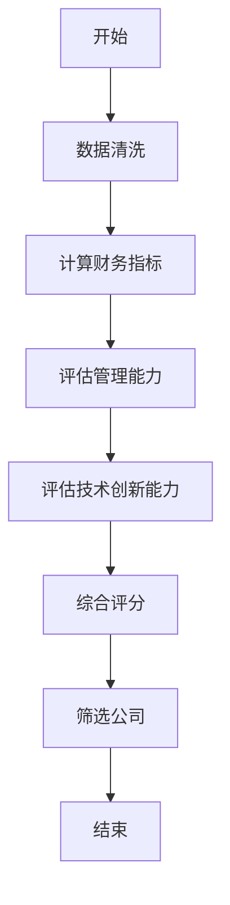
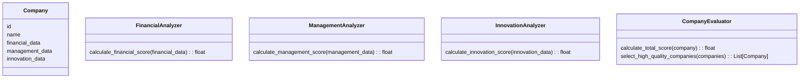
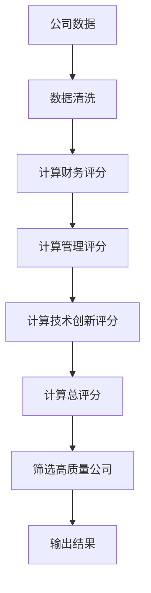
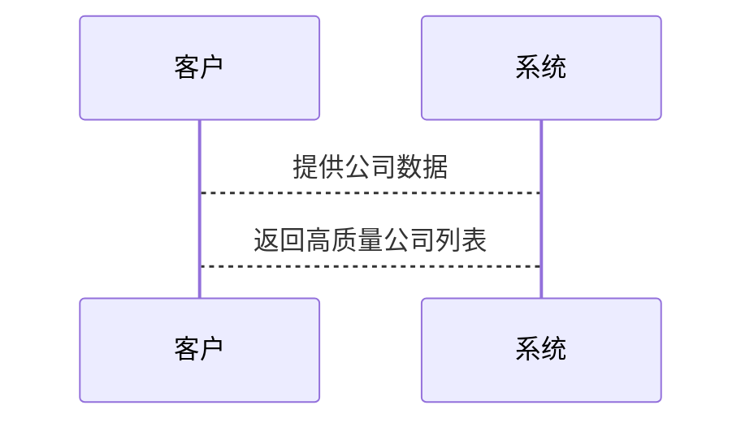

                 


# 彼得林奇的"质量优先"在高科技行业的应用

---

## 关键词：
- 彼得林奇
- 质量优先
- 高科技行业
- 投资策略
- 算法实现
- 系统架构

---

## 摘要：
本文深入探讨了彼得林奇的“质量优先”投资策略在高科技行业的应用。通过分析该策略的核心原理、算法实现、系统架构以及实际案例，本文为投资者和科技从业者提供了在高科技领域运用质量优先策略的实用指南。文章结合理论与实践，详细阐述了该策略在高科技行业的适用性、优势以及实施方法，帮助读者更好地理解并应用这一策略。

---

# 第一部分：背景介绍

## 第1章：彼得林奇与质量优先策略

### 1.1 彼得林奇的背景与投资理念
彼得·林奇（Peter Lynch）是美国著名的职业基金经理人，被誉为“股神”巴菲特之后最成功的基金经理之一。他在投资领域的主要成就是管理富达麦哲伦基金（Fidelity Magellan Fund）期间，基金年平均收益率高达13.4%，远超同期市场表现。彼得林奇的投资理念以“质量优先”为核心，强调选择具有强大基本面、良好管理团队和持续创新能力的公司。

#### 1.1.1 彼得林奇的生平简介
- 1942年出生，美国波士顿人。
- 曾任富达麦哲伦基金的基金经理，管理资产规模超过1000亿美元。
- 以其独特的选股方法闻名，强调对公司基本面的深入研究和长期持有。

#### 1.1.2 质量优先策略的核心理念
- 选择具有强大竞争优势的公司。
- 注重公司的财务健康状况、管理团队和创新能力。
- 长期投资，避免频繁交易。

#### 1.1.3 彼得林奇的投资哲学与方法
- “买股票不是买公司，是买管理团队。”
- 强调对公司管理层的信任和公司治理结构的关注。
- 通过深入研究公司基本面，寻找具有长期增长潜力的公司。

### 1.2 高科技行业的特点与投资环境
高科技行业是21世纪经济增长的核心驱动力。随着技术的进步，高科技行业涵盖的领域越来越广泛，从人工智能、大数据到生物技术、区块链等，都展现出巨大的发展潜力。然而，高科技行业的投资环境也具有一定的复杂性：

#### 1.2.1 高科技行业的定义与范围
- 高科技行业是指那些以技术创新为核心驱动力，具有高附加值的行业。
- 包括IT、通信、半导体、生物技术、人工智能等领域。

#### 1.2.2 高科技行业的投资机会与挑战
- 投资机会：高科技行业的技术创新往往带来超额收益。
- 投资挑战：技术更新换代快，市场波动大，风险较高。

#### 1.2.3 质量优先策略在高科技行业的适用性
- 质量优先策略可以帮助投资者在高科技行业中筛选出具有强大技术优势和管理能力的公司。
- 通过长期投资，分享高科技行业的增长红利。

---

# 第二部分：核心概念与联系

## 第2章：质量优先策略的核心要素

### 2.1 质量优先策略的原理
质量优先策略的核心在于通过深入分析公司的基本面，选择那些具有强大竞争优势、良好财务状况和优秀管理团队的公司。在高科技行业中，这一策略尤其重要，因为技术创新和管理能力是决定公司长期发展的关键因素。

#### 2.1.1 质量优先策略的定义与目标
- 定义：通过分析公司的财务状况、管理能力、技术创新能力等，选择具有长期增长潜力的公司。
- 目标：实现长期稳定的超额收益。

#### 2.1.2 质量优先策略的核心要素分析
- 财务健康状况：包括盈利能力、资产负债率、现金流等。
- 管理团队：包括管理者的背景、经验和战略眼光。
- 技术创新能力：包括研发投入、专利数量、技术领先性等。

#### 2.1.3 质量优先策略与其他投资策略的对比
- 与价值投资的对比：价值投资注重低估值，而质量优先策略注重公司质量。
- 与成长投资的对比：成长投资注重高增长潜力，而质量优先策略注重公司质量。
- 与股息投资的对比：股息投资注重股息收益率，而质量优先策略注重公司质量。

### 2.2 核心要素对比表格
以下是一个对比表格，展示了质量优先策略与其他投资策略的核心要素对比：

| 投资策略 | 核心要素               | 投资目标                     | 适用场景                     |
|----------|-----------------------|-----------------------------|----------------------------|
| 质量优先 | 财务健康、管理能力、技术创新 | 选择高质量公司，实现长期收益 | 高科技行业                   |
| 价值投资 | 低估值                 | 买入低估资产，等待价值回归 | 市场低估周期                 |
| 成长投资 | 高增长潜力             | 投资高增长公司               | 高速增长行业                 |
| 股息投资 | 高股息收益率           | 稳定收益                     | 稳定增长行业                 |

### 2.3 ER实体关系图
以下是质量优先策略的核心要素的ER实体关系图：

```mermaid
erd
  图标: entity(Person) {
    id
    name
  }
  图标: entity(Company) {
    id
    name
  }
  图标: entity(Management) {
    id
    capability
  }
  图标: entity(FinancialHealth) {
    id
    metrics
  }
  图标: entity(TechnologicalInnovation) {
    id
    indicators
  }
  关系: Person --> Management
  关系: Company --> Management
  关系: Company --> FinancialHealth
  关系: Company --> TechnologicalInnovation
```

---

# 第三部分：算法原理讲解

## 第3章：质量优先策略的算法实现

### 3.1 算法原理概述
质量优先策略可以通过算法实现，以下是一个简化的算法框架：

#### 3.1.1 算法的目标与输入
- 目标：筛选出具有高质量的公司。
- 输入：公司财务数据、管理团队信息、技术创新能力指标。

#### 3.1.2 算法的核心步骤
1. 数据清洗：去除无效数据，确保数据的完整性和准确性。
2. 财务指标计算：计算盈利能力、资产负债率、现金流等财务指标。
3. 管理能力评估：评估管理团队的能力和经验。
4. 技术创新能力评估：评估公司的研发投入和专利数量。
5. 综合评分：根据各项指标的权重，计算公司的综合评分。
6. 筛选公司：根据评分，筛选出符合质量优先标准的公司。

#### 3.1.3 算法的输出与结果分析
- 输出：综合评分和公司排名。
- 结果分析：根据评分结果，选择高质量公司进行投资。

### 3.2 算法流程图
以下是质量优先策略算法的流程图：



### 3.3 算法实现代码
以下是Python代码实现质量优先策略的评估模型：

```python
import pandas as pd

# 定义财务指标权重
financial_weights = {
    'profitability': 0.3,
    'debt_to_equity': 0.2,
    'cash_flow': 0.5
}

# 定义管理能力评分标准
management_score = {
    'high': 0.9,
    'medium': 0.6,
    'low': 0.3
}

# 定义技术创新能力评分标准
innovation_score = {
    'high': 0.8,
    'medium': 0.5,
    'low': 0.2
}

# 加载公司数据
companies = pd.read_csv('companies.csv')

# 计算综合评分
companies['financial_score'] = companies['profitability'] * financial_weights['profitability'] + \
                               companies['debt_to_equity'] * financial_weights['debt_to_equity'] + \
                               companies['cash_flow'] * financial_weights['cash_flow']

companies['management_score'] = companies['management'].apply(lambda x: management_score[x])
companies['innovation_score'] = companies['innovation'].apply(lambda x: innovation_score[x])

companies['total_score'] = companies['financial_score'] + companies['management_score'] + companies['innovation_score']

# 筛选高质量公司
high_quality_companies = companies[companies['total_score'] > 0.7]

print(high_quality_companies)
```

### 3.4 数学模型与公式
以下是质量优先策略中使用的数学模型：

$$
\text{总评分} = \text{财务评分} \times \text{财务权重} + \text{管理评分} \times \text{管理权重} + \text{技术创新评分} \times \text{技术创新权重}
$$

例如，假设某公司的财务评分为0.8，管理评分为0.7，技术创新评分为0.6，财务权重为0.3，管理权重为0.3，技术创新权重为0.4，则：

$$
\text{总评分} = 0.8 \times 0.3 + 0.7 \times 0.3 + 0.6 \times 0.4 = 0.24 + 0.21 + 0.24 = 0.69
$$

---

# 第四部分：系统分析与架构设计方案

## 第4章：系统分析与架构设计

### 4.1 问题场景介绍
在高科技行业中，投资者需要通过质量优先策略筛选出具有高质量的公司。为此，我们需要设计一个系统，实现以下功能：

- 数据采集：采集公司的财务数据、管理团队信息和技术创新能力指标。
- 数据分析：计算财务评分、管理评分和技术创新评分。
- 筛选公司：根据综合评分筛选出高质量公司。

### 4.2 系统功能设计
以下是系统功能模块的类图：



### 4.3 系统架构设计
以下是系统的整体架构图：



### 4.4 系统接口设计
以下是系统的接口设计：



---

# 第五部分：项目实战

## 第5章：项目实战与案例分析

### 5.1 环境安装与配置
- 安装Python和相关库（如Pandas、NumPy）。
- 数据来源：从公开的财务报告、专利数据库和公司公告中获取公司数据。

### 5.2 核心代码实现
以下是Python代码实现质量优先策略的评估模型：

```python
import pandas as pd

# 加载公司数据
companies = pd.read_csv('companies.csv')

# 计算财务评分
companies['financial_score'] = companies['profitability'] * 0.3 + \
                               companies['debt_to_equity'] * 0.2 + \
                               companies['cash_flow'] * 0.5

# 计算管理评分
companies['management_score'] = companies['management'].apply(lambda x: 0.9 if x == 'high' else (0.6 if x == 'medium' else 0.3))

# 计算技术创新评分
companies['innovation_score'] = companies['innovation'].apply(lambda x: 0.8 if x == 'high' else (0.5 if x == 'medium' else 0.2))

# 计算总评分
companies['total_score'] = companies['financial_score'] + companies['management_score'] + companies['innovation_score']

# 筛选高质量公司
high_quality_companies = companies[companies['total_score'] > 0.7]

print(high_quality_companies)
```

### 5.3 实际案例分析
假设我们有以下公司数据：

| 公司名称 | 盈利能力 | 负债率 | 现金流 | 管理能力 | 技术创新能力 |
|---------|----------|--------|--------|----------|--------------|
| 公司A   | 0.8      | 0.2    | 0.7    | 高       | 高           |
| 公司B   | 0.6      | 0.3    | 0.8    | 中       | 中           |
| 公司C   | 0.7      | 0.4    | 0.6    | 低       | 低           |

根据质量优先策略，计算各公司的总评分：

- 公司A：0.8 * 0.3 + 0.2 * 0.2 + 0.7 * 0.5 + 0.9 + 0.8 = 0.24 + 0.04 + 0.35 + 0.9 + 0.8 = 2.33
- 公司B：0.6 * 0.3 + 0.3 * 0.2 + 0.8 * 0.5 + 0.6 + 0.5 = 0.18 + 0.06 + 0.4 + 0.6 + 0.5 = 1.74
- 公司C：0.7 * 0.3 + 0.4 * 0.2 + 0.6 * 0.5 + 0.3 + 0.2 = 0.21 + 0.08 + 0.3 + 0.3 + 0.2 = 1.09

根据总评分，公司A是高质量公司，公司B和公司C不符合质量优先标准。

---

# 第六部分：最佳实践与小结

## 第6章：最佳实践与注意事项

### 6.1 投资策略的注意事项
- 定期重新评估公司的质量，及时调整投资组合。
- 保持对高科技行业的关注，及时了解技术趋势和市场变化。
- 避免过度集中投资，分散风险。

### 6.2 小结
彼得林奇的“质量优先”策略在高科技行业的应用具有重要的现实意义。通过本文的分析，我们可以看到，质量优先策略不仅能够帮助投资者筛选出具有高质量的公司，还能够通过算法实现和系统设计，提高投资决策的效率和准确性。

### 6.3 注意事项
- 高科技行业具有高风险和高回报的特点，投资者需要具备一定的风险承受能力。
- 投资者需要不断学习和更新知识，以适应行业的快速变化。
- 投资决策需要结合市场环境和公司实际情况，避免盲目跟风。

### 6.4 拓展阅读
- 《彼得林奇的投资哲学》
- 《高科技行业的投资策略》
- 《算法在投资中的应用》

---

## 作者：AI天才研究院/AI Genius Institute & 禅与计算机程序设计艺术/Zen And The Art of Computer Programming

