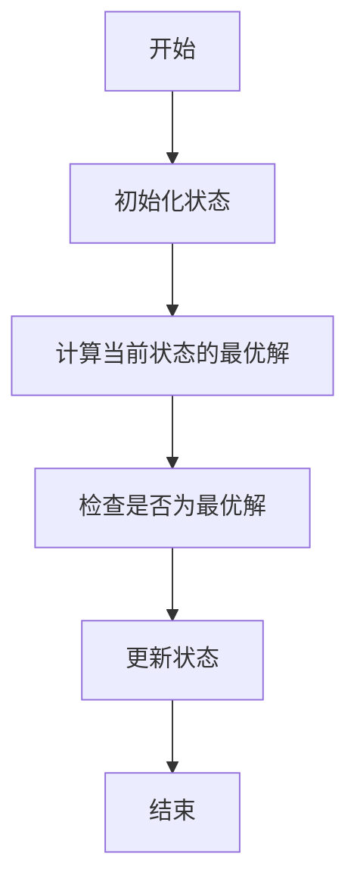
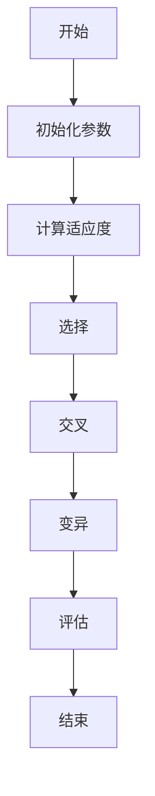
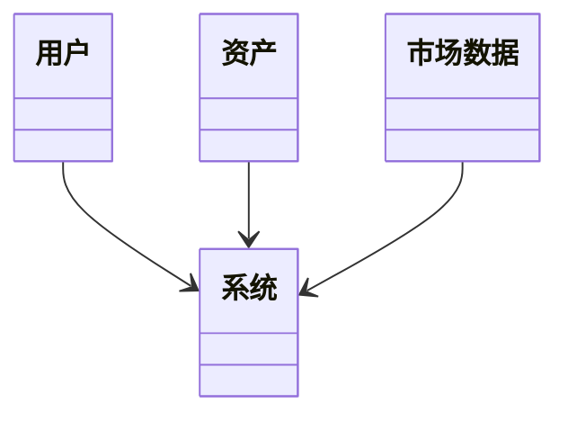
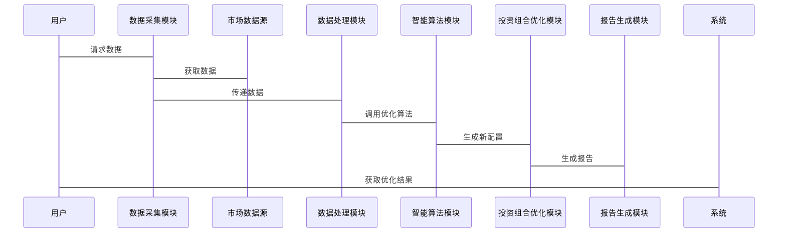

                 


# 智能资产配置动态调整系统

> 关键词：智能资产配置、动态调整、量化投资、算法优化、系统架构

> 摘要：本文详细探讨了智能资产配置动态调整系统的设计与实现，从背景概述、核心概念到算法原理、系统架构，再到项目实战和优化建议，全面解析了如何利用人工智能技术优化资产配置策略。

---

# 第1章：智能资产配置动态调整系统背景与概述

## 1.1 智能资产配置的核心概念

### 1.1.1 资产配置的基本定义
资产配置是指根据投资者的风险承受能力、投资目标和市场环境，将资金分配到不同资产类别（如股票、债券、黄金等）中的过程。传统资产配置方法依赖于历史数据分析和经验判断，而智能资产配置则通过算法优化和实时数据处理，实现更精准的配置策略。

### 1.1.2 动态调整的必要性
市场环境不断变化，传统的静态资产配置难以适应波动的市场。动态调整通过实时跟踪市场趋势和投资者需求变化，及时优化资产配置比例，从而提高投资收益并降低风险。

### 1.1.3 智能化配置的优势
智能化配置利用机器学习和大数据分析，能够快速捕捉市场信号，预测潜在风险，并自动调整投资组合，实现个性化、自动化和高效的资产管理和优化。

## 1.2 智能资产配置动态调整系统的应用场景

### 1.2.1 个人投资者的资产配置需求
个人投资者通常缺乏专业的市场分析能力，智能系统能够根据个人风险偏好和财务目标，提供个性化的资产配置建议，并实时动态调整。

### 1.2.2 机构投资者的动态调整策略
机构投资者需要在复杂多变的市场中快速反应，智能资产配置系统能够帮助机构优化投资组合，降低市场波动带来的风险。

### 1.2.3 量化投资中的智能配置
量化投资依赖于数学模型和算法，智能资产配置系统通过实时数据分析和算法优化，为量化投资提供高效的支持。

## 1.3 系统的核心目标与功能

### 1.3.1 核心目标
- 实现资产配置的智能化和自动化。
- 提供实时市场数据跟踪和分析。
- 优化投资组合，最大化收益并最小化风险。

### 1.3.2 主要功能模块
- 数据采集与处理模块。
- 智能算法优化模块。
- 投资组合优化模块。
- 用户交互与报告生成模块。

### 1.3.3 系统边界与外延
系统专注于资产配置和动态调整的核心功能，与外部数据源（如金融数据API）和用户界面（如网页或移动应用）进行交互。

## 1.4 本章小结
本章介绍了智能资产配置动态调整系统的背景、核心概念和应用场景，明确了系统的目标和功能模块，为后续章节的深入分析奠定了基础。

---

# 第2章：智能资产配置与动态调整的核心概念

## 2.1 资产配置的基本原理

### 2.1.1 资产配置的分类
- 股票、债券、现金等资产类别。
- 不同资产类别在投资组合中的权重分配。

### 2.1.2 不同资产类别的特性对比
| 资产类别 | 风险水平 | 收益潜力 | 流动性 |
|----------|----------|----------|--------|
| 股票     | 高       | 高       | 中     |
| 债券     | 中       | 中       | 高     |
| 黄金     | 低       | 稳定     | 中     |

### 2.1.3 资产配置的数学模型
$$ w_1 \cdot r_1 + w_2 \cdot r_2 + ... + w_n \cdot r_n $$
其中，$w_i$是资产i的权重，$r_i$是资产i的预期收益。

## 2.2 动态调整的原理与机制

### 2.2.1 动态调整的驱动因素
- 市场波动：如股票价格、债券收益率的变化。
- 经济指标：如GDP增长率、通货膨胀率。
- 投资者风险偏好变化。

### 2.2.2 市场变化对资产配置的影响
市场环境的变化会影响不同资产类别的表现，动态调整通过重新分配资产权重来应对这些变化。

### 2.2.3 动态调整的算法基础
常用算法包括动态规划、遗传算法等。以下是动态规划算法的流程图：



## 2.3 智能化配置的核心要素

### 2.3.1 数据采集与处理
- 数据源：金融市场数据、经济指标、投资者行为数据。
- 数据处理：清洗、转换、特征提取。

### 2.3.2 智能算法的应用
- 使用机器学习模型（如神经网络）进行预测和优化。

### 2.3.3 系统的实时性与稳定性
- 系统需要实时处理数据，确保快速响应市场变化。
- 系统架构设计需具备高可用性和容错能力。

## 2.4 核心概念的联系与对比

### 2.4.1 资产配置与动态调整的关系
资产配置是静态的，而动态调整是对配置的持续优化。

### 2.4.2 智能化配置与传统配置的对比
| 方面     | 智能化配置 | 传统配置       |
|----------|------------|----------------|
| 数据依赖 | 高         | 低             |
| 优化速度 | 实时       | 低频           |
| 精准度   | 高         | 中             |

### 2.4.3 核心概念的ER实体关系图
```mermaid
erd
    系统
    ----> 用户
    系统
    ----> 资产
    资产
    ----> 市场数据
    用户
    ----> 风险偏好
```

## 2.5 本章小结
本章详细阐述了资产配置和动态调整的核心概念，分析了智能化配置的优势和实现要素，为后续章节的算法实现和系统设计提供了理论基础。

---

# 第3章：智能资产配置动态调整的数学模型与算法原理

## 3.1 动态资产配置的数学模型

### 3.1.1 基本的资产配置模型
$$ \text{收益} = \sum_{i=1}^{n} w_i \cdot r_i $$
$$ \text{风险} = \sum_{i=1}^{n} w_i^2 \cdot \sigma_i^2 $$

### 3.1.2 动态调整的数学表达式
$$ w_t = \text{优化算法}(r_t, \sigma_t) $$
其中，$w_t$是第t时刻的权重向量，$r_t$是收益向量，$\sigma_t$是风险向量。

### 3.1.3 模型的优化与改进
结合市场预测和投资者目标，优化模型的目标函数。

## 3.2 常用算法及其流程图

### 3.2.1 常用算法概述
- 动态规划：适用于多阶段决策问题。
- 遗传算法：适用于复杂的优化问题。

### 3.2.2 算法的流程图展示


### 3.2.3 算法的优缺点分析
- 动态规划：优点是全局优化，缺点是计算复杂度高。
- 遗传算法：优点是适应性强，缺点是收敛速度慢。

## 3.3 算法实现的Python代码示例

### 3.3.1 算法实现的代码框架
```python
def dynamic_adjustment(w, r, sigma):
    # 输入：权重向量w，收益向量r，风险向量sigma
    # 输出：优化后的权重向量w_opt
    pass
```

### 3.3.2 代码的功能解读
- 输入当前权重、收益和风险数据。
- 使用优化算法计算新的权重向量，以最大化收益或最小化风险。

## 3.4 算法的数学推导与公式

### 3.4.1 算法的数学基础
优化问题可以表示为：
$$ \min_w \sum_{i=1}^{n} w_i \cdot \sigma_i^2 $$
$$ \text{subject to} \sum_{i=1}^{n} w_i = 1 $$

### 3.4.2 公式的详细推导
使用拉格朗日乘数法求解上述优化问题。

### 3.4.3 公式的实际应用案例
假设市场有两只资产，权重分别为$w_1$和$w_2$，优化目标是最大化收益，得到$w_1 = 0.6$，$w_2 = 0.4$。

## 3.5 本章小结
本章通过数学模型和算法分析，详细解释了智能资产配置动态调整的实现原理，为后续的系统设计提供了理论支持。

---

# 第4章：智能资产配置动态调整系统的架构设计

## 4.1 系统功能设计

### 4.1.1 领域模型（Mermaid类图）


### 4.1.2 系统功能模块
- 数据采集与处理模块。
- 智能算法优化模块。
- 投资组合优化模块。
- 用户交互与报告生成模块。

## 4.2 系统架构设计

### 4.2.1 系统架构（Mermaid架构图）


### 4.2.2 系统接口设计
- 数据接口：与金融数据源对接。
- 用户接口：提供配置和调整功能。

### 4.2.3 系统交互（Mermaid序列图）


## 4.3 本章小结
本章通过系统架构设计，详细描述了智能资产配置动态调整系统的功能模块和交互流程，为系统实现提供了清晰的指导。

---

# 第5章：智能资产配置动态调整系统的项目实战

## 5.1 项目环境安装与配置

### 5.1.1 系统环境要求
- 操作系统：Linux/Windows/MacOS
- 开发工具：Python、Jupyter Notebook
- 依赖库：pandas、numpy、scipy、matplotlib

### 5.1.2 安装步骤
```bash
pip install pandas numpy scipy matplotlib
```

## 5.2 系统核心实现源代码

### 5.2.1 数据采集与处理模块
```python
import pandas as pd

def fetch_market_data(tickers):
    # 数据获取逻辑
    pass
```

### 5.2.2 智能算法优化模块
```python
import numpy as np

def optimize_weights(r, sigma):
    # 优化算法实现
    pass
```

### 5.2.3 投资组合优化模块
```python
import scipy.optimize

def portfolio_optimization(r, sigma):
    # 使用scipy.optimize进行优化
    pass
```

### 5.2.4 用户交互与报告生成模块
```python
import matplotlib.pyplot as plt

def generate_report(weights, returns):
    # 可视化报告生成
    pass
```

## 5.3 代码应用解读与分析

### 5.3.1 代码的功能解读
- 数据采集：从API获取实时市场数据。
- 算法优化：使用动态规划或遗传算法优化权重。
- 投资组合优化：基于优化后的权重生成投资组合。
- 报告生成：生成包含收益和风险的可视化报告。

### 5.3.2 代码的优化建议
- 使用更高效的算法，如量子计算优化。
- 引入更多的市场数据特征，如情绪分析。

## 5.4 实际案例分析和详细讲解剖析

### 5.4.1 案例背景
假设市场有三只资产，用户风险偏好中等。

### 5.4.2 数据处理
获取过去一年的市场数据，计算每只资产的收益和风险。

### 5.4.3 算法优化
使用动态规划优化权重，得到最优配置。

### 5.4.4 投资组合优化
基于优化后的权重，生成投资组合。

### 5.4.5 报告生成
生成包含优化结果的可视化报告，展示收益、风险和资产分配情况。

## 5.5 本章小结
本章通过实际案例分析，详细讲解了系统的核心实现过程，展示了如何利用智能算法优化资产配置。

---

# 第6章：智能资产配置动态调整系统的优化与扩展

## 6.1 系统优化方法

### 6.1.1 算法优化
- 使用更高效的优化算法，如粒子群优化。
- 引入机器学习模型，如深度学习，进行市场预测。

### 6.1.2 系统架构优化
- 使用分布式架构处理大量数据。
- 引入缓存机制，提高系统响应速度。

## 6.2 系统扩展方向

### 6.2.1 引入更多资产类别
- 包括房地产、 commodities等更多资产。

### 6.2.2 支持多币种配置
- 全球资产配置，支持多种货币。

### 6.2.3 实时监控与预警
- 实时跟踪市场变化，及时预警风险。

## 6.3 本章小结
本章讨论了系统的优化方法和扩展方向，为系统的进一步发展提供了思路。

---

# 第7章：智能资产配置动态调整系统的最佳实践、小结与展望

## 7.1 最佳实践

### 7.1.1 数据质量管理
确保数据的准确性和及时性。

### 7.1.2 算法选择与调优
根据具体情况选择合适的算法，并进行参数调优。

### 7.1.3 系统稳定性与安全性
确保系统的高可用性和数据安全。

## 7.2 小结
本文全面探讨了智能资产配置动态调整系统的设计与实现，从理论到实践，详细分析了系统的各个组成部分，并通过实际案例展示了系统的应用价值。

## 7.3 展望
未来，随着人工智能技术的进步，智能资产配置动态调整系统将更加智能化和自动化，为投资者提供更高效的服务。

---

# 作者：AI天才研究院/AI Genius Institute & 禅与计算机程序设计艺术 /Zen And The Art of Computer Programming

