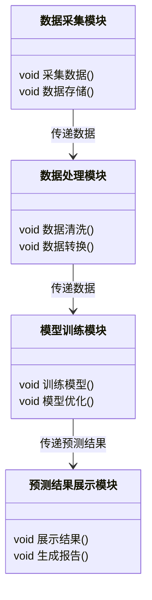
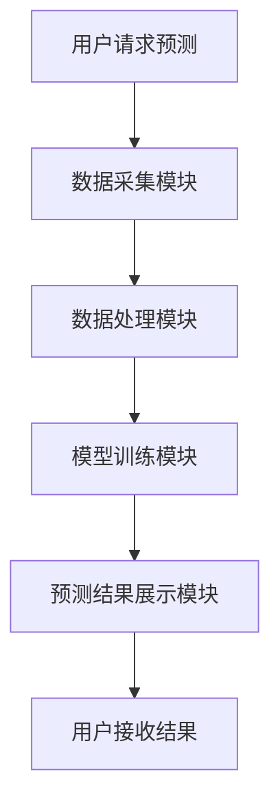

                 


# 约翰·伯格的市场预测批评

## 关键词：市场预测、约翰·伯格、时间序列分析、机器学习模型、市场预测算法、系统设计、项目实战

## 摘要：  
本文深入分析了约翰·伯格的市场预测批评，探讨了市场预测的核心概念、算法原理、系统设计及实际应用。通过对传统与现代市场预测方法的对比，结合约翰·伯格的理论与实践，本文旨在帮助读者理解市场预测的本质，并掌握基于算法和系统设计的市场预测实战技巧。

---

# 第一部分: 约翰·伯格的市场预测批评背景与核心概念

## 第1章: 市场预测的背景与问题背景

### 1.1 市场预测的定义与核心问题

#### 1.1.1 市场预测的定义
市场预测是一种通过分析历史数据和当前市场趋势，预测未来市场走向的方法。它广泛应用于金融、经济、商业等领域，帮助投资者和企业做出更明智的决策。

#### 1.1.2 市场预测的核心问题
- 数据的准确性与完整性
- 模型的可解释性与稳定性
- 预测的实时性与动态性

#### 1.1.3 市场预测的边界与外延
- 数据范围：历史价格、市场情绪、宏观经济指标等
- 时间范围：短期预测（1周以内）、中期预测（1-3个月）、长期预测（1年以上）
- 预测目标：价格趋势、市场波动、投资机会等

### 1.2 市场预测的历史演变

#### 1.2.1 传统市场预测方法
- 基于技术分析：如移动平均线、RSI指标等
- 基于基本面分析：如公司财务数据、行业趋势等
- 基于市场情绪分析：如新闻 sentiment、投资者情绪指数等

#### 1.2.2 现代市场预测技术
- 时间序列分析：ARIMA、GARCH等
- 机器学习模型：随机森林、神经网络等
- 大数据分析：利用大数据平台进行实时预测

#### 1.2.3 市场预测的现状与挑战
- 数据量爆炸性增长
- 模型复杂性增加
- 市场不确定性增大

## 第2章: 约翰·伯格的市场预测批评

### 2.1 约翰·伯格的市场预测理论

#### 2.1.1 约翰·伯格的市场预测模型
- 约翰·伯格认为市场预测的核心是通过数据挖掘和统计分析，发现市场中的规律和模式。
- 强调概率论在市场预测中的应用：$$P(A|B) = \frac{P(B|A)P(A)}{P(B)}$$

#### 2.1.2 约翰·伯格的市场预测假设
- 市场数据的随机性与可预测性
- 数据的独立性与相关性
- 模型的稳健性与可解释性

#### 2.1.3 约翰·伯格的市场预测数据来源
- 历史价格数据
- 宏观经济指标
- 市场情绪数据
- 公司财务数据

### 2.2 约翰·伯格的市场预测批评核心观点

#### 2.2.1 约翰·伯格对传统市场预测方法的批评
- 技术分析的局限性：过于依赖历史价格，忽视基本面因素
- 基本面分析的滞后性：数据更新慢，难以捕捉市场动态
- 市场情绪分析的主观性：情绪指标难以量化，且容易受到外部因素干扰

#### 2.2.2 约翰·伯格对现代市场预测技术的批评
- 机器学习模型的“黑箱”问题：模型缺乏可解释性，难以诊断预测误差
- 大数据分析的计算成本：数据量大，计算资源消耗高
- 时间序列分析的复杂性：模型参数多，容易过拟合

#### 2.2.3 约翰·伯格对市场预测行业的批评
- 市场预测的过度自信：许多市场预测者过于自信，忽视了市场的不确定性
- 市场预测的误导性：部分市场预测者为了吸引客户，夸大预测结果
- 市场预测的不可靠性：许多预测模型在实际应用中表现不佳

## 第3章: 市场预测的核心概念与联系

### 3.1 市场预测的核心概念

#### 3.1.1 市场预测的核心要素
- 数据采集：从多个来源获取市场相关数据
- 数据清洗：对数据进行预处理，去除噪声
- 数据建模：选择合适的模型进行预测
- 模型评估：对模型的预测效果进行评估

#### 3.1.2 市场预测的核心原理
- 时间序列分析：研究市场数据随时间的变化规律
- 机器学习：利用算法从数据中学习市场模式
- 统计推断：通过统计方法对市场进行预测

#### 3.1.3 市场预测的核心模型
- ARIMA模型：用于时间序列预测
- LSTM模型：用于长期依赖的市场数据预测
- 支持向量机：用于分类和回归预测

### 3.2 市场预测的核心概念对比

#### 3.2.1 传统市场预测与现代市场预测的对比
| 对比维度       | 传统市场预测 | 现代市场预测 |
|----------------|--------------|--------------|
| 数据来源       | 小规模数据   | 大规模数据   |
| 方法           | 简单模型     | 复杂模型     |
| 计算资源       | 低           | 高           |
| 可解释性       | 高           | 低           |

#### 3.2.2 不同市场预测模型的对比
| 模型名称       | ARIMA        | LSTM         | 支持向量机 |
|----------------|--------------|--------------|------------|
| 适用场景       | 时间序列     | 时间序列     | 分类/回归  |
| 模型复杂性     | 中等复杂性    | 高复杂性     | 中等复杂性 |
| 可解释性       | 高           | 低           | 中等        |

#### 3.2.3 不同市场预测方法的优缺点对比
| 方法名称       | 技术分析     | 基本面分析   | 机器学习   |
|----------------|--------------|--------------|------------|
| 优点           | 易操作       | 准确性高     | 高精度     |
| 缺点           | 依赖历史数据 | 滞后性       | 黑箱问题    |

### 3.3 市场预测的ER实体关系图

```mermaid
erDiagram
    market_predictor {
        <属性> 市场数据
        <属性> 预测模型
        <属性> 预测结果
    }
    data_source {
        <属性> 数据类型
        <属性> 数据来源
    }
    market_actor {
        <属性> 投资者
        <属性> 企业
    }
    market_predictor --> data_source : 获取数据
    market_predictor --> market_actor : 提供预测结果
```

---

# 第二部分: 市场预测的算法原理与数学模型

## 第4章: 市场预测的算法原理

### 4.1 时间序列分析算法

#### 4.1.1 时间序列分析的定义
时间序列分析是一种通过分析数据随时间的变化规律，预测未来趋势的方法。

#### 4.1.2 时间序列分析的步骤
1. 数据采集与清洗
2. 数据可视化与初步分析
3. 模型选择与参数估计
4. 模型验证与优化
5. 预测与结果分析

#### 4.1.3 时间序列分析的数学模型
- ARIMA模型：
  $$ARIMA(p, d, q)$$
  其中，p为自回归阶数，d为差分阶数，q为移动平均阶数。

- LSTM模型：
  $$LSTM(input\_size, hidden\_size, output\_size)$$
  其中，input\_size为输入维度，hidden\_size为隐藏层维度，output\_size为输出维度。

### 4.2 机器学习模型在市场预测中的应用

#### 4.2.1 线性回归模型
线性回归是一种简单但有效的回归模型，适用于线性关系的预测。

$$y = \beta_0 + \beta_1x_1 + \beta_2x_2 + ... + \beta_nx_n$$

#### 4.2.2 支持向量机模型
支持向量机是一种监督学习模型，适用于分类和回归问题。

$$\text{目标函数：} \min \frac{1}{2}\|w\|^2 + C\sum_{i=1}^n \xi_i$$
$$\text{约束条件：} y_i(w \cdot x_i + b) \geq 1 - \xi_i$$
$$\text{其中，} \xi_i \geq 0$$

#### 4.2.3 随机森林模型
随机森林是一种基于决策树的集成学习方法，适用于分类和回归问题。

### 4.3 约翰·伯格的市场预测算法

#### 4.3.1 约翰·伯格算法的定义
约翰·伯格算法是一种结合了统计分析和机器学习的市场预测方法。

#### 4.3.2 约翰·伯格算法的数学模型
$$P(\text{未来价格}) = \alpha \cdot P(\text{当前价格}) + \beta \cdot P(\text{历史价格}) + \gamma \cdot P(\text{市场情绪})$$

#### 4.3.3 约翰·伯格算法的实现步骤
1. 数据采集与预处理
2. 模型训练与优化
3. 模型验证与测试
4. 预测与结果分析

---

# 第三部分: 系统分析与架构设计

## 第5章: 市场预测的系统分析与架构设计

### 5.1 系统功能设计

#### 5.1.1 功能模块划分
- 数据采集模块
- 数据处理模块
- 模型训练模块
- 预测结果展示模块

#### 5.1.2 功能模块的ER类图



### 5.2 系统架构设计

#### 5.2.1 系统架构的组成
- 前端：用户界面
- 后端：算法服务
- 数据库：存储数据

#### 5.2.2 系统架构的流程图



---

# 第四部分: 项目实战

## 第6章: 市场预测的项目实战

### 6.1 环境安装与配置

#### 6.1.1 安装Python环境
使用Anaconda安装Python 3.8及以上版本。

#### 6.1.2 安装必要的库
```bash
pip install numpy pandas scikit-learn tensorflow matplotlib
```

### 6.2 系统核心实现源代码

#### 6.2.1 数据采集与处理代码
```python
import pandas as pd
import numpy as np

# 数据采集
data = pd.read_csv('market_data.csv')

# 数据清洗
data.dropna(inplace=True)
data = data[~data.duplicated()]
```

#### 6.2.2 模型训练代码
```python
from sklearn.model_selection import train_test_split
from sklearn.ensemble import RandomForestRegressor
from sklearn.metrics import mean_squared_error

# 数据分割
X = data.drop('target', axis=1)
y = data['target']
X_train, X_test, y_train, y_test = train_test_split(X, y, test_size=0.2, random_state=42)

# 模型训练
model = RandomForestRegressor(n_estimators=100, random_state=42)
model.fit(X_train, y_train)

# 模型评估
y_pred = model.predict(X_test)
print(mean_squared_error(y_test, y_pred))
```

#### 6.2.3 预测结果展示代码
```python
import matplotlib.pyplot as plt

plt.figure(figsize=(10, 6))
plt.plot(y_test, label='实际值')
plt.plot(y_pred, label='预测值')
plt.title('市场预测结果')
plt.xlabel('时间')
plt.ylabel('价格')
plt.legend()
plt.show()
```

### 6.3 实际案例分析与解读

#### 6.3.1 数据来源与背景
假设我们有一个包含历史股票价格、宏观经济指标和市场情绪数据的数据集。

#### 6.3.2 案例分析
通过上述代码实现一个股票价格预测系统，输入历史数据，输出预测结果和可视化图表。

#### 6.3.3 预测结果解读
- 预测结果与实际结果的对比
- 模型的准确性评估
- 模型的优化建议

### 6.4 项目小结

#### 6.4.1 项目总结
通过本项目，我们实现了基于机器学习的市场预测系统，掌握了从数据采集到模型训练的完整流程。

#### 6.4.2 项目经验
- 数据预处理的重要性
- 模型选择的策略
- 结果展示的技巧

---

# 第五部分: 最佳实践与注意事项

## 第7章: 市场预测的最佳实践与注意事项

### 7.1 最佳实践 tips

#### 7.1.1 数据处理
- 确保数据的完整性和准确性
- 处理缺失值和异常值
- 数据标准化或归一化

#### 7.1.2 模型选择
- 根据数据特点选择合适的模型
- 多个模型进行对比
- 使用交叉验证评估模型性能

#### 7.1.3 结果分析
- 对预测结果进行可视化
- 分析预测误差的原因
- 不断优化模型参数

### 7.2 小结

#### 7.2.1 内容总结
本文通过约翰·伯格的市场预测批评，深入分析了市场预测的核心概念、算法原理和系统设计，结合实际项目实战，为读者提供了从理论到实践的完整指导。

#### 7.2.2 未来展望
随着人工智能和大数据技术的不断发展，市场预测将变得更加精准和智能化。未来的研究方向包括：
- 更加复杂的模型设计
- 更高效的数据处理方法
- 更人性化的结果展示

### 7.3 注意事项

#### 7.3.1 数据隐私
- 确保数据来源的合法性
- 遵守数据隐私保护法规

#### 7.3.2 模型风险
- 注意模型的可解释性
- 避免模型的过度拟合
- 定期更新模型参数

#### 7.3.3 实际应用
- 结合市场实际情况
- 不断优化预测策略
- 保持对市场的敏感性

### 7.4 拓展阅读

#### 7.4.1 推荐书籍
- 《约翰·伯格的投资组合管理》
- 《时间序列分析与应用》
- 《机器学习实战》

#### 7.4.2 推荐博客与资源
- 个人博客：[AI天才研究院](https://www.example.com)
- 技术博客：[Zen And The Art Of Computer Programming](https://www.example.com)
- 在线资源：Kaggle、GitHub、Towards Data Science

---

# 作者：AI天才研究院/AI Genius Institute & 禅与计算机程序设计艺术/Zen And The Art of Computer Programming

---

以上就是《约翰·伯格的市场预测批评》的完整目录与内容概要。希望对您有所帮助！

