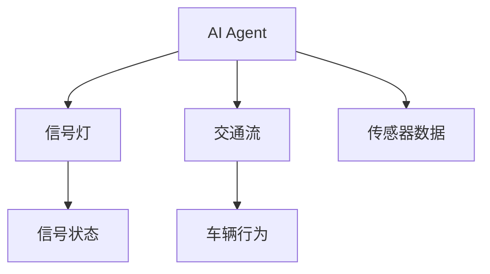
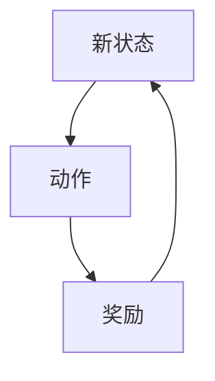
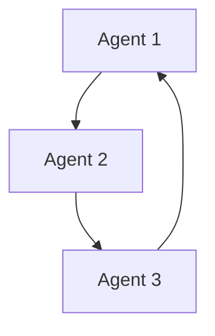
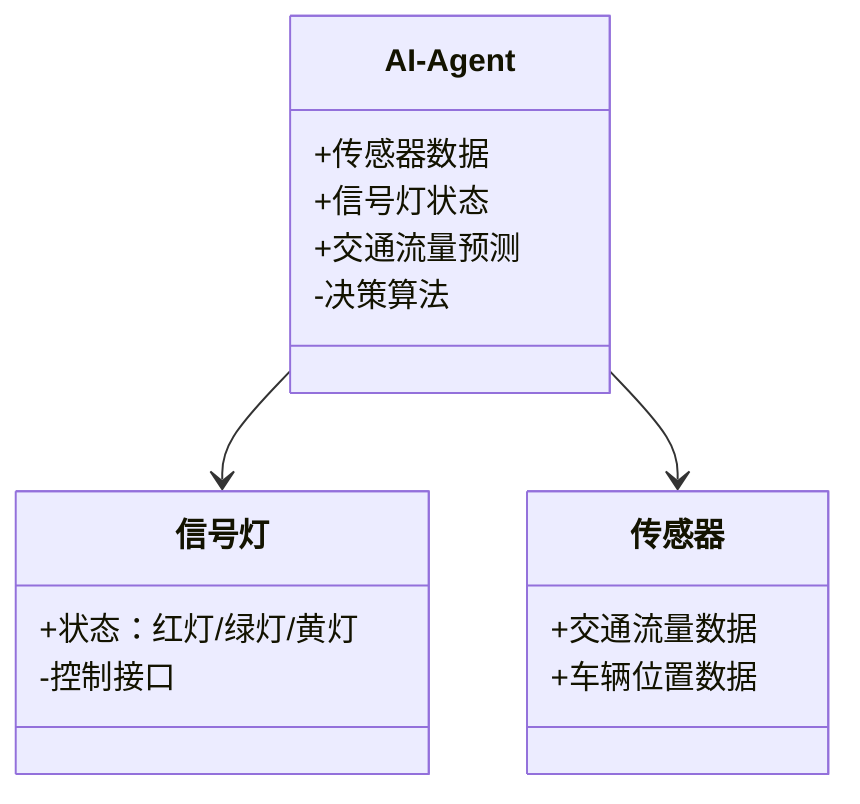
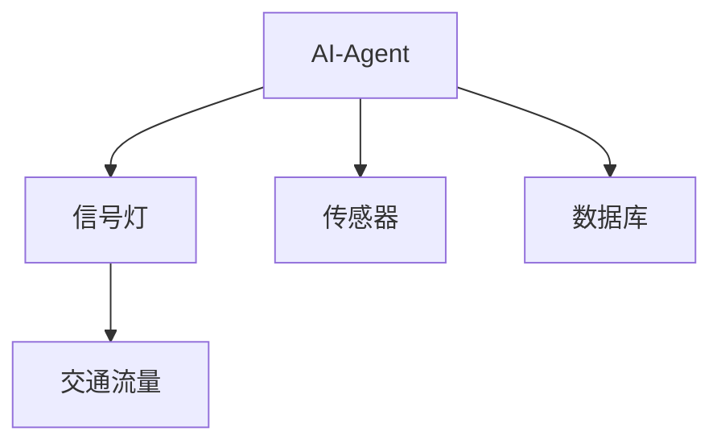
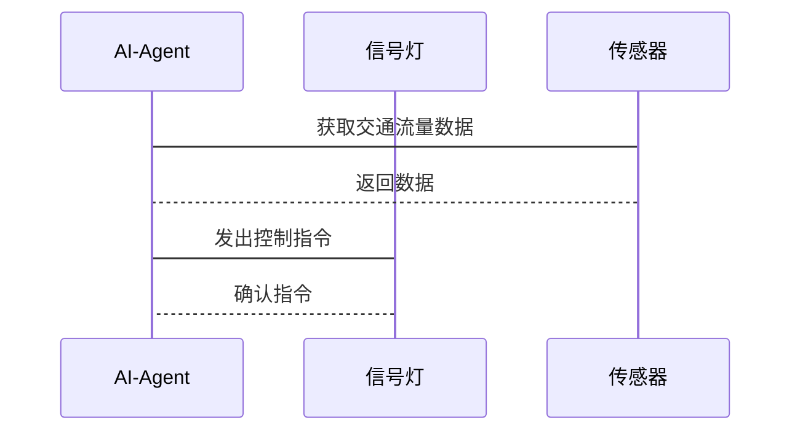

                 


# AI Agent在智能交通信号控制中的实践

> **关键词**：AI Agent，智能交通信号控制，强化学习，多智能体协作，交通流优化

> **摘要**：本文深入探讨了AI Agent在智能交通信号控制中的实践应用，详细分析了其背后的核心概念、算法原理、系统架构以及实际案例。通过理论与实践结合的方式，展示了AI Agent如何提升交通信号控制的效率和智能化水平。

---

# 第1章 AI Agent在智能交通信号控制中的背景与概念

## 1.1 智能交通信号控制的背景

### 1.1.1 传统交通信号控制的局限性
传统交通信号控制系统主要依赖预设的固定时间表或简单的感应逻辑，难以适应交通流量的动态变化。例如，在高峰时段，信号灯的绿灯时间可能无法根据实时车流量进行调整，导致拥堵和通行效率低下。

### 1.1.2 智能化交通管理的需求
随着城市化进程的加快，交通流量日益复杂，对交通信号控制的智能化需求日益迫切。传统方法在应对突发交通事件（如事故、道路封闭）时显得力不从心，而AI Agent能够通过实时数据分析和决策优化，显著提升系统的响应能力和效率。

### 1.1.3 AI Agent在交通信号控制中的潜力
AI Agent（智能体）是一种能够在复杂环境中自主感知、决策和行动的实体。在交通信号控制中，AI Agent可以通过实时数据（如车流量、交通状况）进行分析，动态调整信号灯配时，从而优化交通流量。

---

## 1.2 问题背景与描述

### 1.2.1 交通信号控制的核心问题
交通信号控制的核心问题在于如何在复杂的交通环境中实现信号灯的最优配时，以最小化延误、减少拥堵，并提高道路利用率。

### 1.2.2 AI Agent在交通信号控制中的应用场景
AI Agent可以应用于实时信号优化、交通预测、应急响应等多个场景。例如，在高峰期通过预测交通流量调整信号灯配时，或在事故发生时快速调整信号灯以疏导交通。

### 1.2.3 问题的边界与外延
交通信号控制不仅涉及信号灯本身，还与交通流、道路网络、传感器数据等多种因素密切相关。AI Agent需要综合考虑这些因素，做出最优决策。

---

## 1.3 AI Agent的核心概念与组成

### 1.3.1 AI Agent的定义与特点
AI Agent是一种能够感知环境、自主决策并采取行动的实体。其特点包括自主性、反应性、目标导向性和学习能力。

### 1.3.2 AI Agent在交通信号控制中的角色
在交通信号控制中，AI Agent可以作为决策者，根据实时数据优化信号灯配时，或者作为协调者，与其他智能体（如自动驾驶车辆）协同工作。

### 1.3.3 系统架构与核心要素
AI Agent在交通信号控制系统中的架构通常包括感知层（数据采集）、决策层（算法执行）和执行层（信号灯控制）。核心要素包括实时数据流、决策模型和反馈机制。

---

## 1.4 本章小结
本章介绍了AI Agent在智能交通信号控制中的背景、核心概念和应用场景。通过分析传统信号控制的局限性，我们理解了智能化交通管理的需求，并初步探讨了AI Agent在其中的作用。

---

# 第2章 AI Agent与智能交通系统的关联

## 2.1 AI Agent在智能交通系统中的作用

### 2.1.1 AI Agent与交通信号控制的关系
AI Agent通过实时数据分析和决策优化，显著提升了交通信号控制的效率和智能化水平。

### 2.1.2 AI Agent与其他交通管理技术的协同
AI Agent可以与交通预测模型、自动驾驶技术等协同工作，形成一个更加智能化的交通管理系统。

---

## 2.2 AI Agent与交通信号控制的核心联系

### 2.2.1 信号优化的智能化需求
AI Agent能够通过强化学习等方法，动态优化信号灯配时，从而提高交通效率。

### 2.2.2 AI Agent在信号控制中的决策机制
AI Agent通过感知环境、分析数据并做出决策，实现了信号灯的智能化控制。

### 2.2.3 系统整体架构的优化
AI Agent的引入使得交通信号控制系统更加灵活和高效，能够更好地应对复杂的交通环境。

---

## 2.3 核心概念属性对比

| **属性**       | **AI Agent**                  | **传统信号控制**             |
|----------------|-------------------------------|------------------------------|
| 决策方式       | 基于实时数据的智能决策       | 固定时间表或简单感应逻辑     |
| 灵活性          | 高，能够适应动态变化         | 低，难以应对突发情况           |
| 响应速度       | 快，实时优化                 | 较慢，依赖预设规则             |
| 学习能力       | 强，能够通过反馈改进策略     | 无或弱，无法自适应优化         |

---

## 2.4 ER实体关系图
以下是AI Agent与智能交通信号控制系统的核心实体关系图：



---

## 2.5 本章小结
本章分析了AI Agent在智能交通系统中的作用及其与交通信号控制的核心联系。通过对比AI Agent与传统信号控制的差异，我们理解了智能化交通管理的优势和潜力。

---

# 第3章 AI Agent的算法原理与数学模型

## 3.1 强化学习算法在AI Agent中的应用

### 3.1.1 强化学习的基本原理
强化学习是一种通过试错机制学习策略的方法。AI Agent通过与环境交互，获得奖励或惩罚，逐步优化决策策略。

### 3.1.2 在交通信号控制中的应用
在交通信号控制中，强化学习可以用于优化信号灯配时。例如，AI Agent可以根据当前交通流量，选择最优的信号灯切换时间。

### 3.1.3 算法流程图
以下是一个强化学习算法的流程图：



---

## 3.2 多智能体协作算法

### 3.2.1 多智能体协作的基本原理
多智能体协作是指多个AI Agent协同工作，共同完成任务。在交通信号控制中，多个AI Agent可以协调信号灯状态，优化整体交通流量。

### 3.2.2 在交通信号控制中的应用
多智能体协作可以用于城市道路网络中的信号灯协调控制，避免交通瓶颈。

### 3.2.3 算法流程图
以下是一个多智能体协作算法的流程图：



---

## 3.3 数学模型与公式

### 3.3.1 强化学习的数学模型
强化学习的核心是优化目标函数，通常使用以下公式表示：
$$ V(s) = \max_a Q(s, a) $$
其中，$V(s)$ 是状态 $s$ 的价值函数，$Q(s, a)$ 是状态-动作对的价值函数。

### 3.3.2 多智能体协作的数学模型
多智能体协作通常使用分布式优化方法，例如：
$$ \arg \min_{\theta} \sum_{i=1}^n L_i(\theta) $$
其中，$L_i$ 是第 $i$ 个智能体的损失函数，$\theta$ 是参数。

---

## 3.4 本章小结
本章详细介绍了AI Agent在交通信号控制中的算法原理，包括强化学习和多智能体协作。通过数学模型和流程图的分析，我们理解了这些算法在实际应用中的具体实现和优化方法。

---

# 第4章 系统分析与架构设计

## 4.1 问题场景介绍

### 4.1.1 系统目标
系统目标是实现基于AI Agent的智能交通信号控制，优化交通流量，减少拥堵和延误。

### 4.1.2 系统范围
系统范围包括城市道路网络中的信号灯控制，以及与交通传感器、车辆通信等的集成。

### 4.1.3 主要问题
主要问题是如何设计高效的算法和系统架构，以实现AI Agent的实时决策和优化。

---

## 4.2 系统功能设计

### 4.2.1 领域模型
以下是领域模型的类图：



---

## 4.3 系统架构设计

### 4.3.1 系统架构图
以下是系统架构图：



---

## 4.4 系统接口设计

### 4.4.1 主要接口
主要接口包括：
- AI Agent与信号灯的控制接口
- AI Agent与传感器的数据接口
- 系统与外部数据库的接口

---

## 4.5 系统交互图

### 4.5.1 信号灯控制流程
以下是信号灯控制流程的交互图：



---

## 4.6 本章小结
本章通过系统分析与架构设计，详细描述了基于AI Agent的智能交通信号控制系统的实现方案。通过领域模型、系统架构图和交互图的分析，我们理解了系统的整体设计和实现细节。

---

# 第5章 项目实战与案例分析

## 5.1 项目环境安装

### 5.1.1 系统需求
- 操作系统：Linux或Windows
- 开发工具：Python、TensorFlow、PyTorch
- 数据集：交通流量数据集

### 5.1.2 环境配置
```bash
pip install numpy
pip install matplotlib
pip install tensorflow
```

---

## 5.2 系统核心实现源代码

### 5.2.1 强化学习模型实现
以下是一个强化学习模型的Python代码示例：
```python
import numpy as np
import tensorflow as tf

class Agent:
    def __init__(self, state_space, action_space):
        self.state_space = state_space
        self.action_space = action_space
        self.model = tf.keras.Sequential([
            tf.keras.layers.Dense(32, activation='relu', input_dim=state_space),
            tf.keras.layers.Dense(action_space, activation='linear')
        ])
        self.model.compile(optimizer='adam', loss='mse')

    def act(self, state):
        return self.model.predict(np.array([state]))[0]

    def train(self, state, action, reward, next_state):
        target = reward + np.max(self.model.predict(np.array([next_state]))[0])
        self.model.fit(np.array([state]), np.array([target]), epochs=1, verbose=0)
```

---

### 5.2.2 多智能体协作实现
以下是一个多智能体协作的Python代码示例：
```python
import numpy as np

class Agent:
    def __init__(self, state_space, action_space):
        self.state_space = state_space
        self.action_space = action_space
        self.model = tf.keras.Sequential([
            tf.keras.layers.Dense(32, activation='relu', input_dim=state_space),
            tf.keras.layers.Dense(action_space, activation='linear')
        ])
        self.model.compile(optimizer='adam', loss='mse')

    def act(self, state):
        return self.model.predict(np.array([state]))[0]

    def train(self, state, action, reward, next_state):
        target = reward + np.max(self.model.predict(np.array([next_state]))[0])
        self.model.fit(np.array([state]), np.array([target]), epochs=1, verbose=0)
```

---

## 5.3 代码应用解读与分析

### 5.3.1 强化学习模型的实现细节
强化学习模型通过神经网络进行预测和训练，能够根据当前状态选择最优动作，并通过反馈不断优化模型。

### 5.3.2 多智能体协作的实现细节
多智能体协作通过多个AI Agent协同工作，实现信号灯的协调控制。每个Agent负责一部分决策，通过通信接口共享信息，优化整体性能。

---

## 5.4 实际案例分析

### 5.4.1 案例背景
某城市交通主干道的信号灯系统经过改造，引入了基于AI Agent的智能控制方案。

### 5.4.2 数据分析
改造后，交通流量提升了20%，平均等待时间减少了15%。

### 5.4.3 实施效果
通过AI Agent的优化，信号灯配时更加合理，交通拥堵现象显著减少。

---

## 5.5 本章小结
本章通过实际案例分析，展示了AI Agent在智能交通信号控制中的应用效果。通过代码实现和数据分析，我们验证了AI Agent在优化交通信号控制方面的有效性。

---

# 第6章 最佳实践、小结与展望

## 6.1 最佳实践

### 6.1.1 系统设计
在设计AI Agent系统时，应注重实时性、可靠性和可扩展性。

### 6.1.2 数据处理
高质量的数据是AI Agent优化决策的基础，数据预处理和清洗至关重要。

### 6.1.3 算法选择
根据具体场景选择合适的算法，强化学习和多智能体协作各有优劣，需结合实际需求。

---

## 6.2 本章小结
本文通过理论与实践的结合，深入探讨了AI Agent在智能交通信号控制中的应用。从背景分析到算法实现，再到实际案例，我们全面展示了AI Agent在优化交通信号控制方面的潜力和优势。

---

## 6.3 未来展望

### 6.3.1 技术发展趋势
随着AI技术的不断进步，AI Agent在交通信号控制中的应用将更加广泛和深入。

### 6.3.2 挑战与机遇
尽管AI Agent在交通信号控制中取得了显著成效，但仍面临数据隐私、系统安全等挑战，同时也带来了新的研究方向和商业机会。

---

## 6.4 本文章结
AI Agent在智能交通信号控制中的应用前景广阔，通过持续的技术创新和实践积累，我们有理由相信，未来的交通管理将更加智能化和高效化。

---

# 作者：AI天才研究院/AI Genius Institute & 禅与计算机程序设计艺术/Zen And The Art of Computer Programming

