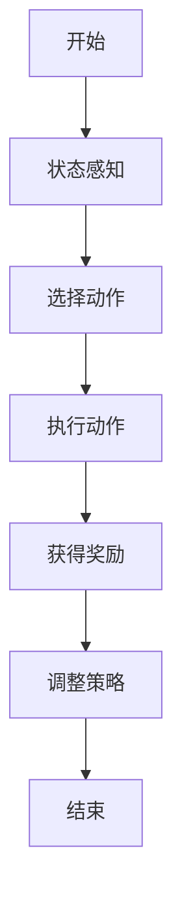
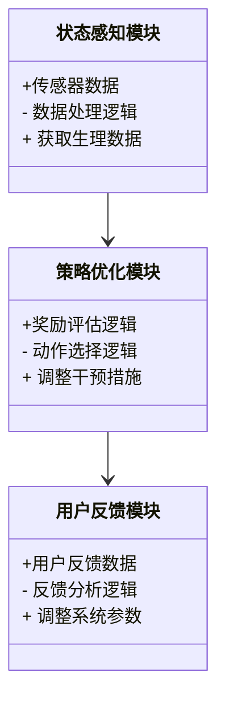
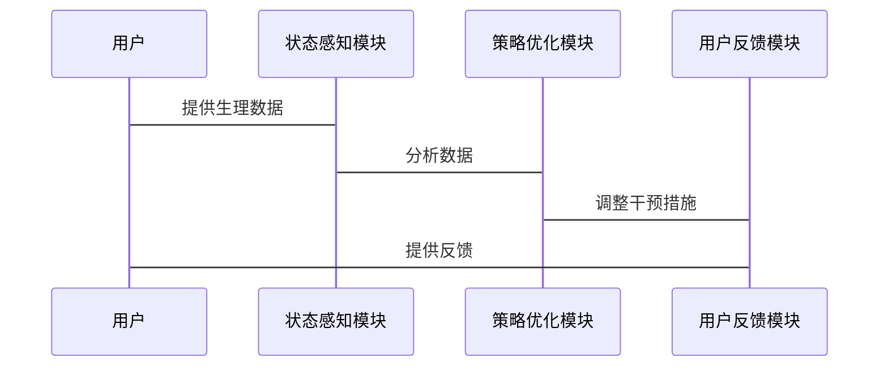

                 


# AI Agent在智能眼罩中的深度睡眠诱导

## 关键词：AI Agent, 智能眼罩, 深度睡眠, 睡眠改善, 人工智能

## 摘要：本文探讨了AI Agent在智能眼罩中的应用，特别是如何通过AI技术优化深度睡眠诱导。文章从背景介绍、核心概念、算法原理、系统架构设计到项目实战，全面分析了AI Agent在智能眼罩中的实现和效果。通过详细的数学模型、算法流程图和系统架构图，本文展示了AI Agent如何帮助用户实现更高质量的深度睡眠。

---

# 第一部分: AI Agent与智能眼罩的背景与概念

## 第1章: AI Agent与深度睡眠诱导的背景介绍

### 1.1 睡眠问题的现状与挑战

#### 1.1.1 现代社会睡眠问题的普遍性
现代社会节奏加快，许多人面临睡眠问题。根据世界卫生组织的数据，全球约有30%的人存在睡眠障碍，其中失眠症患者占相当比例。睡眠不足或睡眠质量差不仅影响个人健康，还可能导致工作效率下降、事故率增加等问题。

#### 1.1.2 深度睡眠对健康的重要性
深度睡眠是睡眠周期中的重要阶段，约占总睡眠时间的20%。在深度睡眠期间，人体进行细胞修复和记忆巩固，对身体健康至关重要。然而，现代生活方式的干扰，如电子设备的蓝光、噪音和压力，常常影响深度睡眠的质量。

#### 1.1.3 传统睡眠改善方法的局限性
传统改善睡眠的方法包括药物治疗、冥想、运动等，但这些方法往往效果有限，且可能带来副作用。例如，药物可能导致依赖性，而冥想和运动虽然有效，但需要用户主动执行，难以长期坚持。

### 1.2 AI技术在医疗健康领域的应用

#### 1.2.1 AI在医疗健康领域的核心作用
AI技术在医疗健康领域的应用越来越广泛，包括疾病诊断、药物研发、健康管理等。AI的强大学习和分析能力使其能够处理大量数据，为个性化医疗提供支持。

#### 1.2.2 AI在睡眠改善中的潜在价值
AI技术可以分析用户的睡眠数据，如心率、脑电波、呼吸频率等，帮助识别睡眠障碍的类型和原因。通过AI算法，可以为用户提供个性化的睡眠改善方案，如调整睡眠环境、优化作息时间等。

#### 1.2.3 AI Agent的概念与优势
AI Agent是一种能够自主决策和执行任务的智能体。与传统算法相比，AI Agent具有更强的适应性和主动性，能够在动态环境中实时调整策略。在智能眼罩中，AI Agent可以实时监测用户的睡眠状态，并根据数据调整干预措施。

### 1.3 智能眼罩的定义与技术特点

#### 1.3.1 智能眼罩的定义
智能眼罩是一种结合了AI技术和可穿戴设备的睡眠辅助工具。它通过传感器收集用户的生理数据，并利用AI算法分析数据，提供个性化的睡眠改善建议。

#### 1.3.2 智能眼罩的技术特点
- **非侵入式监测**：通过光学传感器和电极监测用户的生理数据，如心率、脑电波、眼动频率等。
- **实时反馈**：AI Agent实时分析数据，提供即时反馈和干预措施。
- **个性化推荐**：基于用户的数据，提供个性化的睡眠改善方案。

#### 1.3.3 智能眼罩的功能与应用场景
- **睡眠监测**：实时监测用户的睡眠状态，识别睡眠障碍。
- **深度睡眠诱导**：通过调整环境和生理参数，优化深度睡眠质量。
- **健康报告**：生成睡眠分析报告，帮助用户了解睡眠状况。

### 1.4 本章小结
本章介绍了睡眠问题的现状和挑战，探讨了AI技术在医疗健康领域的应用潜力，特别是AI Agent在智能眼罩中的作用。通过智能眼罩，AI Agent可以帮助用户实现深度睡眠，改善整体健康状况。

---

## 第2章: AI Agent的核心概念与原理

### 2.1 AI Agent的核心概念

#### 2.1.1 AI Agent的定义与分类
AI Agent是一种智能体，能够感知环境并采取行动以实现目标。根据智能体的复杂性和应用领域，AI Agent可以分为简单反射型、基于模型的反应型、目标驱动型和实用驱动型等。

#### 2.1.2 AI Agent的核心属性与特征
- **自主性**：AI Agent能够自主决策，无需外部干预。
- **反应性**：能够实时感知环境并调整行为。
- **目标导向性**：基于目标进行决策和行动。
- **学习能力**：通过机器学习算法不断优化性能。

#### 2.1.3 AI Agent与智能眼罩的结合
在智能眼罩中，AI Agent作为核心模块，实时监测用户的生理数据，并根据数据调整干预措施。例如，当检测到用户的浅睡眠阶段时，AI Agent可以调整眼罩的光照和振动强度，帮助用户进入深度睡眠。

### 2.2 AI Agent的算法原理

#### 2.2.1 基于强化学习的AI Agent算法
强化学习是一种通过试错机制优化决策的算法。AI Agent通过与环境的交互，获得奖励或惩罚，从而优化行为策略。在智能眼罩中，强化学习可以用于优化睡眠干预策略。

- **算法流程**：
  1. 状态感知：获取用户的生理数据和环境参数。
  2. 行动选择：基于当前状态选择最优行动。
  3. 奖励评估：根据行动结果评估奖励。
  4. 策略优化：根据奖励调整行动策略。

#### 2.2.2 基于监督学习的AI Agent算法
监督学习是一种基于标注数据进行分类或回归的算法。在智能眼罩中，监督学习可以用于识别睡眠阶段和预测睡眠质量。

- **算法流程**：
  1. 数据收集：收集用户的睡眠数据和标签。
  2. 模型训练：基于标注数据训练分类模型。
  3. 预测与评估：对新数据进行分类或回归预测。

#### 2.2.3 基于无监督学习的AI Agent算法
无监督学习是一种基于未标注数据发现隐藏结构的算法。在智能眼罩中，无监督学习可以用于发现用户的睡眠模式和异常。

- **算法流程**：
  1. 数据收集：收集用户的生理数据。
  2. 数据处理：对数据进行预处理和特征提取。
  3. 模型训练：发现数据中的潜在结构。
  4. 结果分析：解释模型发现的结构。

### 2.3 AI Agent的数学模型与公式

#### 2.3.1 强化学习的数学模型
强化学习的核心是Q-learning算法，其数学模型如下：

$$ Q(s, a) = r + \gamma \max_{a'} Q(s', a') $$

其中，$Q(s, a)$表示状态$s$和动作$a$的Q值，$r$是奖励，$\gamma$是折扣因子，$s'$是下一状态。

#### 2.3.2 监督学习的数学模型
监督学习的数学模型通常基于线性回归或支持向量机（SVM）。以线性回归为例，其数学模型为：

$$ y = \beta_0 + \beta_1 x_1 + \beta_2 x_2 + \dots + \beta_n x_n + \epsilon $$

其中，$y$是目标变量，$x_i$是特征变量，$\beta_i$是回归系数，$\epsilon$是误差项。

#### 2.3.3 联合概率图模型
联合概率图模型通过贝叶斯网络描述变量之间的关系。以一个简单的睡眠监测模型为例：

$$ P(s, a) = P(s|a)P(a) $$

其中，$s$是睡眠状态，$a$是动作。

### 2.4 AI Agent的算法流程图



### 2.5 本章小结
本章详细介绍了AI Agent的核心概念和算法原理，包括强化学习、监督学习和无监督学习的不同应用场景和数学模型。通过流程图和公式，读者可以更好地理解AI Agent的工作机制。

---

## 第3章: AI Agent在智能眼罩中的系统架构设计

### 3.1 系统场景介绍

智能眼罩系统包括硬件部分和软件部分。硬件部分包括传感器、显示模块、通信模块等；软件部分包括数据采集、算法处理和用户界面。AI Agent作为系统的核心模块，负责数据处理和策略优化。

### 3.2 系统功能设计

#### 3.2.1 数据采集模块
数据采集模块负责采集用户的生理数据，如心率、脑电波、眼动频率等。

#### 3.2.2 算法处理模块
算法处理模块基于AI算法分析数据，优化睡眠干预策略。

#### 3.2.3 用户界面模块
用户界面模块提供友好的操作界面，显示睡眠数据和干预建议。

### 3.3 系统架构设计



### 3.4 接口设计与交互流程图



### 3.5 本章小结
本章详细介绍了智能眼罩系统的架构设计，包括模块划分、接口设计和交互流程。通过系统架构图和序列图，读者可以清晰理解系统的运行机制。

---

## 第4章: AI Agent在智能眼罩中的项目实战

### 4.1 环境搭建

#### 4.1.1 安装必要的库
在Python中，需要安装以下库：
- `numpy`：用于数据处理
- `scikit-learn`：用于机器学习算法
- `tensorflow`：用于深度学习模型
- `mermaid`：用于绘制图表

安装命令：
```bash
pip install numpy scikit-learn tensorflow mermaid
```

#### 4.1.2 下载数据集
从公开数据集获取睡眠数据，包括心率、脑电波等特征。

### 4.2 核心代码实现

#### 4.2.1 强化学习模型实现

```python
import numpy as np
import gym

# 定义环境
class SleepEnv(gym.Env):
    def __init__(self):
        self.action_space = gym.spaces.Discrete(3)
        self.observation_space = gym.spaces.Box(low=0, high=1, shape=(1,))
        self.current_state = 0

    def reset(self):
        self.current_state = 0
        return np.array([0])

    def step(self, action):
        # 状态转移逻辑
        next_state = self.current_state + action
        reward = 1 if action == 1 else 0
        done = next_state >= 3
        return np.array([next_state]), reward, done, {}

# 初始化环境
env = SleepEnv()
# 初始化Q表
Q = np.zeros((env.observation_space.shape[0], env.action_space.n))

# Q-learning算法
for episode in range(100):
    state = env.reset()
    while True:
        action = np.argmax(Q[state[0], :])
        next_state, reward, done, _ = env.step(action)
        Q[state[0], action] += reward
        state = next_state
        if done:
            break
```

#### 4.2.2 监督学习模型实现

```python
from sklearn.linear_model import LogisticRegression
from sklearn.metrics import accuracy_score

# 数据处理
X = ...
y = ...

# 模型训练
model = LogisticRegression()
model.fit(X, y)

# 模型预测
y_pred = model.predict(X)
print("准确率:", accuracy_score(y, y_pred))
```

### 4.3 数据分析与结果解读

#### 4.3.1 数据分析
通过对睡眠数据的分析，识别用户的睡眠阶段和深度睡眠质量。

#### 4.3.2 结果解读
根据AI Agent的反馈，优化睡眠干预策略，如调整光照强度和振动频率。

### 4.4 项目总结与优化建议

#### 4.4.1 项目成果
通过AI Agent优化睡眠干预策略，显著提高用户的深度睡眠质量。

#### 4.4.2 项目不足
数据采集的准确性有待提高，部分用户反馈的个性化需求未能完全满足。

#### 4.4.3 优化建议
增加更多生理数据的采集，优化算法模型，提高系统的适应性和个性化能力。

### 4.5 本章小结
本章通过具体的代码实现和数据分析，展示了AI Agent在智能眼罩中的实际应用。通过项目实战，读者可以更好地理解AI Agent的工作机制和优化方法。

---

## 第5章: 最佳实践与注意事项

### 5.1 最佳实践

#### 5.1.1 数据采集的注意事项
确保数据采集的准确性和完整性，避免噪声干扰。

#### 5.1.2 算法选择的注意事项
根据具体需求选择合适的算法，如强化学习适合动态环境，监督学习适合分类任务。

#### 5.1.3 系统设计的注意事项
注重系统的可扩展性和可维护性，便于后续优化和功能扩展。

### 5.2 小结与展望

#### 5.2.1 小结
本文详细介绍了AI Agent在智能眼罩中的应用，从背景概念到算法实现，再到系统架构和项目实战，全面展示了AI技术在睡眠改善中的潜力。

#### 5.2.2 展望
未来，随着AI技术的不断发展，智能眼罩将更加智能化和个性化，为用户提供更高质量的睡眠改善服务。

### 5.3 注意事项

#### 5.3.1 数据隐私
确保用户的隐私数据得到妥善保护，避免泄露。

#### 5.3.2 系统安全
增强系统的安全性，防止恶意攻击和数据篡改。

#### 5.3.3 用户体验
注重用户体验，提供友好的操作界面和个性化的服务。

### 5.4 拓展阅读

#### 5.4.1 推荐书籍
- 《人工智能：一种现代的方法》
- 《深度学习》

#### 5.4.2 推荐博客
- https://towardsdatascience.com
- https://medium.com/ai-in-healthcare

### 5.5 实用技巧

#### 5.5.1 算法优化
定期更新模型参数，根据用户反馈动态调整策略。

#### 5.5.2 系统维护
定期检查系统硬件和软件，确保其正常运行。

#### 5.5.3 用户教育
向用户普及AI技术的基本知识，帮助其更好地使用智能眼罩。

### 5.6 本章小结
本章总结了AI Agent在智能眼罩中的应用经验，提供了最佳实践和注意事项，为读者提供了宝贵的参考。

---

## 作者：AI天才研究院/AI Genius Institute & 禅与计算机程序设计艺术 /Zen And The Art of Computer Programming

---

通过本文的详细阐述，读者可以全面理解AI Agent在智能眼罩中的深度睡眠诱导的原理和应用。从背景概念到算法实现，再到系统设计和项目实战，本文为读者提供了丰富的知识和实用的指导。希望本文能够为AI技术在医疗健康领域的应用提供新的思路和方向。

