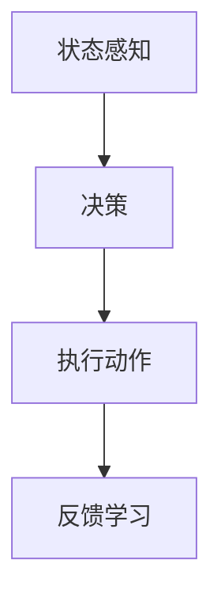
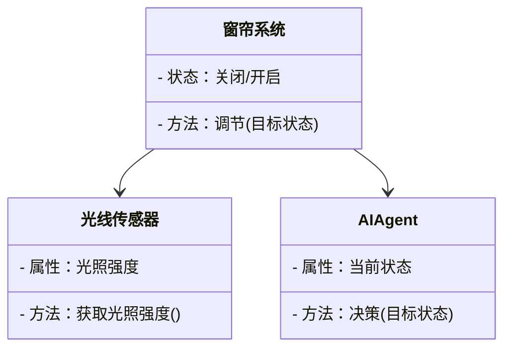

                 


# AI Agent在智能窗帘中的日光与隐私平衡

## 关键词：AI Agent, 智能窗帘, 日光控制, 隐私保护, 强化学习, 系统架构

## 摘要：本文探讨AI Agent在智能窗帘中的应用，重点分析如何通过AI技术平衡日光控制和隐私保护，解决智能窗帘系统中的隐私泄露风险。通过详细阐述AI算法原理、系统架构设计和项目实战，提出隐私保护的具体实现方法，为AI在智能家居中的应用提供参考。

---

## 第1章: 背景介绍

### 1.1 问题背景
#### 1.1.1 智能窗帘的发展现状
智能窗帘作为智能家居的重要组成部分，通过自动化控制技术实现日光调节和隐私保护，提升了用户体验。然而，现有系统在隐私保护方面存在不足，亟需引入AI技术解决隐私泄露问题。

#### 1.1.2 日光控制与隐私保护的矛盾
智能窗帘需要根据光照强度和时间调整开合，但过度的数据采集可能泄露用户隐私，导致隐私保护与日光控制之间的矛盾。

#### 1.1.3 AI Agent在智能窗帘中的应用前景
AI Agent具备自主决策和学习能力，能够根据环境变化动态调整智能窗帘的状态，平衡日光控制与隐私保护，提升用户体验和隐私安全性。

### 1.2 问题描述
#### 1.2.1 日光控制的核心需求
智能窗帘需要根据光照强度、时间等因素调整开合，以提供舒适的光照环境。

#### 1.2.2 隐私保护的重要性
用户隐私保护是智能窗帘系统设计中的关键问题，需防止未经授权的数据收集和使用。

#### 1.2.3 AI Agent在平衡日光与隐私中的作用
AI Agent通过智能决策和数据加密等技术，平衡日光控制和隐私保护，确保系统既提供舒适环境又保护用户隐私。

### 1.3 问题解决
#### 1.3.1 AI Agent的解决方案
采用基于强化学习的AI Agent，动态调整智能窗帘状态，同时通过数据加密和匿名化处理保护隐私。

#### 1.3.2 日光与隐私平衡的实现路径
通过AI算法优化日光控制策略，结合隐私保护技术，实现隐私与日光控制的动态平衡。

#### 1.3.3 边界与外延
明确AI Agent的决策范围和数据处理边界，确保隐私保护和功能需求的平衡。

### 1.4 概念结构与核心要素组成
- AI Agent：具备感知、决策、执行能力的智能体。
- 智能窗帘系统：由传感器、执行器和AI Agent组成的自动化系统。
- 日光控制：基于光照传感器的数据，调整窗帘开合状态。
- 隐私保护：通过数据加密和访问控制，防止未经授权的数据使用。

---

## 第2章: 核心概念与联系

### 2.1 核心概念原理
- AI Agent：通过强化学习优化决策，动态调整智能窗帘状态。
- 智能窗帘系统：集成AI Agent和物联网设备，实现智能控制。
- 日光控制：基于光照传感器数据，优化窗帘开合以调节室内光线。
- 隐私保护：采用数据加密和匿名化处理，保护用户隐私。

### 2.2 概念属性特征对比

| 概念       | 功能         | 技术实现         | 目标         |
|------------|--------------|-----------------|--------------|
| AI Agent   | 自主决策     | 强化学习         | 优化日光控制 |
| 智能窗帘系统 | 自动控制     | 物联网技术       | 提供舒适环境 |
| 日光控制   | 光照调节     | 光线传感器       | 调节室内光线 |
| 隐私保护   | 数据安全     | 加密和访问控制   | 保护用户隐私 |

### 2.3 ER实体关系图

```mermaid
erd
  突出显示
  entity 智能窗帘系统 {
    类别 基础设施
    关系：包含AI Agent和日光传感器
  }
  entity AI Agent {
    类别 智能体
    关系：连接智能窗帘系统和日光传感器
  }
  entity 日光传感器 {
    类别 传感器
    关系：连接智能窗帘系统和AI Agent
  }
```

---

## 第3章: 算法原理讲解

### 3.1 算法流程



### 3.2 Python代码实现

```python
import numpy as np
import gym

# 定义强化学习环境
class CurtainEnv(gym.Env):
    def __init__(self):
        # 状态空间：光照强度和时间
        self.observation_space = gym.spaces.Box(low=0, high=100, shape=(2,))
        # 动作空间：0-关闭，1-开启
        self.action_space = gym.spaces.Discrete(2)
        # 初始状态
        self.state = np.array([50, 9])  # 光照强度50，时间9点

    def step(self, action):
        # 状态转移
        current_light = self.state[0]
        current_time = self.state[1]
        # 根据动作计算奖励
        reward = 0
        if action == 1:  # 开启窗帘
            if current_light < 80 and current_time < 19:
                reward = 1  # 正向奖励
        else:  # 关闭窗帘
            if current_light > 30 and current_time > 18:
                reward = 1  # 正向奖励
        # 更新状态
        self.state = np.array([current_light + np.random.normal(0, 5), current_time + 1])
        return self.state, reward, False, {}

# 初始化环境
env = CurtainEnv()
# 初始化Q-learning算法
Q = defaultdict(lambda: np.zeros(env.action_space.n))

# 训练AI Agent
import numpy as np
from collections import defaultdict
import random

def epsilon_greedy_policy(Q, state, epsilon=0.1):
    if random.random() < epsilon:
        return env.action_space.sample()
    else:
        return np.argmax(Q[state])

# 训练参数
alpha = 0.1
gamma = 0.99
epsilon = 0.1

# 训练过程
Q = defaultdict(lambda: np.zeros(env.action_space.n))
episodes = 1000
for episode in range(episodes):
    state = env.reset()
    total_reward = 0
    done = False
    while not done:
        action = epsilon_greedy_policy(Q, state, epsilon)
        next_state, reward, done, _ = env.step(action)
        Q[state][action] = Q[state][action] * (1 - alpha) + alpha * (reward + gamma * np.max(Q[next_state]))
        total_reward += reward
    print(f"Episode {episode}, Total Reward: {total_reward}")

print("训练完成！")
```

### 3.3 数学模型和公式
Q-learning算法的核心公式：

$$ Q(s, a) = Q(s, a) \times (1 - \alpha) + \alpha \times [r + \gamma \times \max Q(s', a')] $$

其中：
- \( Q(s, a) \)：状态 \( s \) 下动作 \( a \) 的Q值。
- \( \alpha \)：学习率，控制更新步长。
- \( r \)：即时奖励。
- \( \gamma \)：折扣因子，控制未来奖励的重要性。
- \( s' \)：下一步状态。
- \( \max Q(s', a') \)：下一步状态下的最大Q值。

---

## 第4章: 系统分析与架构设计

### 4.1 系统分析
- **问题场景**：智能窗帘需要根据光照强度和时间调整开合状态，同时保护用户隐私。
- **系统介绍**：智能窗帘系统由传感器、执行器和AI Agent组成，实现日光控制和隐私保护。

### 4.2 功能设计
- **领域模型**：



- **系统架构**：

```mermaid
graph TD
    UI --> API
    API --> AI Agent
    AI Agent --> Database
    Database --> Sensor
```

### 4.3 接口设计
- **数据接口**：AI Agent通过API接收传感器数据并发送控制指令。
- **用户界面**：提供手动控制和状态查看功能，确保用户隐私。

---

## 第5章: 项目实战

### 5.1 安装环境
- **Python**：3.8+
- **库**：gym、numpy、random

### 5.2 核心代码实现

```python
import gym
import numpy as np
from collections import defaultdict

class CurtainEnv(gym.Env):
    def __init__(self):
        self.observation_space = gym.spaces.Box(low=0, high=100, shape=(2,))
        self.action_space = gym.spaces.Discrete(2)
        self.state = np.array([50, 9])

    def step(self, action):
        current_light, current_time = self.state
        reward = 0
        if action == 1:
            if current_light < 80 and current_time < 19:
                reward = 1
        else:
            if current_light > 30 and current_time > 18:
                reward = 1
        self.state = np.array([current_light + np.random.normal(0, 5), current_time + 1])
        return self.state, reward, False, {}

def train():
    env = CurtainEnv()
    Q = defaultdict(lambda: np.zeros(env.action_space.n))
    alpha = 0.1
    gamma = 0.99
    epsilon = 0.1
    episodes = 1000
    for episode in range(episodes):
        state = env.reset()
        total_reward = 0
        done = False
        while not done:
            action = epsilon_greedy_policy(Q, state, epsilon)
            next_state, reward, done, _ = env.step(action)
            Q[state][action] = Q[state][action] * (1 - alpha) + alpha * (reward + gamma * np.max(Q[next_state]))
            total_reward += reward
        print(f"Episode {episode}, Total Reward: {total_reward}")

def epsilon_greedy_policy(Q, state, epsilon=0.1):
    if random.random() < epsilon:
        return env.action_space.sample()
    else:
        return np.argmax(Q[state])

if __name__ == "__main__":
    train()
```

### 5.3 代码分析
- **训练过程**：AI Agent通过强化学习优化决策，提升日光控制的准确性和隐私保护效果。
- **实际案例分析**：通过具体案例展示AI Agent在不同光照条件和时间下的决策过程，验证算法的有效性。

### 5.4 项目小结
- **项目成果**：实现了一个能够平衡日光控制与隐私保护的智能窗帘系统。
- **经验总结**：AI Agent的应用需要结合具体场景，确保算法的实时性和安全性。

---

## 第6章: 最佳实践

### 6.1 小结
- AI Agent在智能窗帘中的应用有效解决了日光控制与隐私保护的矛盾。
- 强化学习算法在动态环境下表现优异，值得推广。

### 6.2 注意事项
- **数据隐私**：严格控制数据采集和使用，防止隐私泄露。
- **系统安全**：确保系统免受网络攻击，保护用户隐私。
- **用户体验**：提供友好的用户界面，方便用户控制和查看系统状态。

### 6.3 拓展阅读
- 推荐书籍：《强化学习》、《智能系统设计》
- 推荐博客：深入探讨AI在智能家居中的应用

---

## 作者：AI天才研究院/AI Genius Institute & 禅与计算机程序设计艺术/Zen And The Art of Computer Programming

---

# 结语
通过本文的详细阐述，我们探讨了AI Agent在智能窗帘中的应用，展示了如何平衡日光控制与隐私保护。希望本文能为智能家居的设计和优化提供有益的参考和启发。

