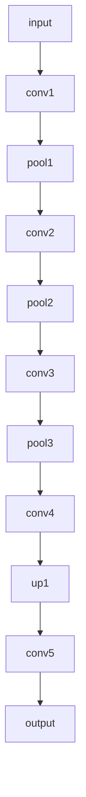
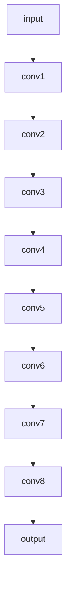
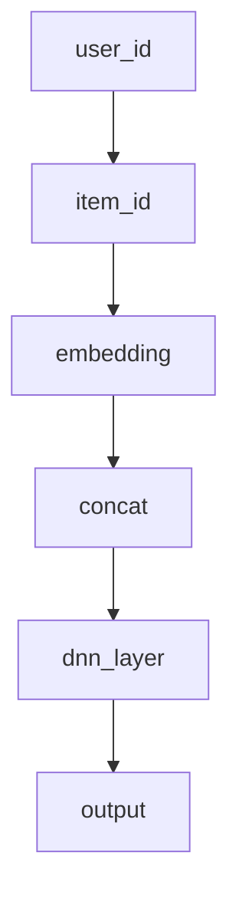
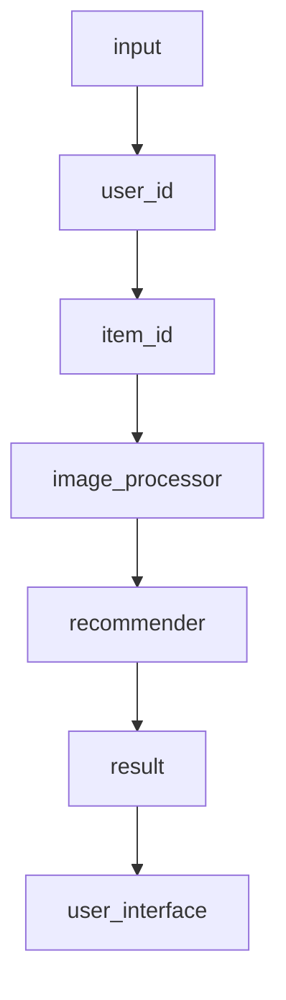
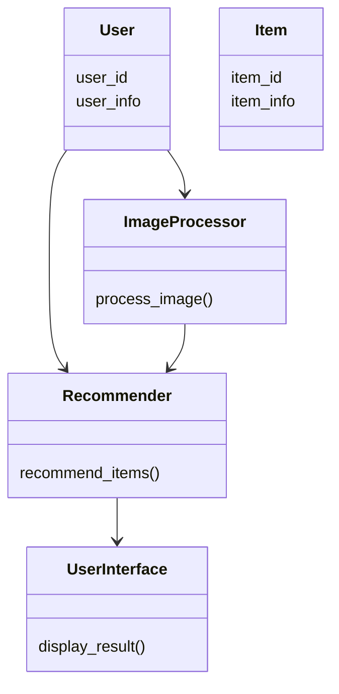
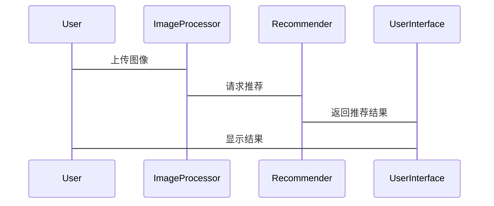

                 


# AI Agent在虚拟试衣中的图像处理

---

## 关键词：
AI Agent, 虚拟试衣, 图像处理, 深度学习, 图像分割, 人体姿态估计, 虚拟试衣系统

---

## 摘要：
本文探讨AI Agent在虚拟试衣中的图像处理技术，重点分析图像分割、目标检测和人体姿态估计等核心算法，结合深度学习模型（如U-Net网络），详细阐述其在虚拟试衣系统中的应用。通过系统设计与架构分析，结合项目实战案例，展示AI Agent如何提升虚拟试衣的交互体验与个性化推荐能力。

---

# 第1章: AI Agent与虚拟试衣概述

## 1.1 AI Agent的基本概念

### 1.1.1 AI Agent的定义与特点
AI Agent（人工智能代理）是一种能够感知环境、自主决策并执行任务的智能体。其特点包括：
- **自主性**：无需外部干预，自主完成任务。
- **反应性**：实时感知环境变化并做出反应。
- **学习性**：通过数据学习优化行为。
- **协作性**：与其他系统或用户协同工作。

### 1.1.2 AI Agent的核心功能与分类
AI Agent的核心功能包括：
- 数据采集与处理
- 自然语言理解与生成
- 视觉感知与图像处理
- 个性化推荐与决策

AI Agent的分类：
1. **反应式AI Agent**：实时响应环境输入。
2. **认知式AI Agent**：具备复杂推理与决策能力。
3. **协作式AI Agent**：与人类或其他系统协作完成任务。

### 1.1.3 AI Agent在虚拟试衣中的应用价值
虚拟试衣通过AI Agent实现：
- **虚拟试衣体验**：用户在线试穿衣物，实时呈现效果。
- **个性化推荐**：基于用户体型、偏好推荐衣物。
- **交互优化**：通过AI Agent提升用户体验。

---

## 1.2 虚拟试衣的发展背景

### 1.2.1 传统试衣的痛点与局限性
传统试衣面临以下痛点：
- **时间和空间限制**：用户需亲自到店试衣。
- **成本高昂**：试衣过程耗时耗力。
- **库存管理复杂**：难以快速匹配用户需求。

### 1.2.2 虚拟试衣的技术基础与优势
虚拟试衣的技术基础：
- **图像处理技术**：实现衣物虚拟试穿效果。
- **深度学习算法**：提升试衣体验的智能化水平。
- **增强现实（AR）技术**：增强试衣的真实感。

虚拟试衣的优势：
- **提高效率**：用户可以在线快速试衣。
- **降低成本**：减少实体库存需求。
- **提升用户体验**：个性化试衣体验。

### 1.2.3 虚拟试衣的市场应用前景
虚拟试衣在服装电商、定制服装、虚拟试衣APP等领域具有广阔的应用前景。

---

## 1.3 AI Agent在虚拟试衣中的作用

### 1.3.1 AI Agent在虚拟试衣中的核心任务
AI Agent在虚拟试衣中的核心任务包括：
1. **图像处理**：实现衣物虚拟试穿效果。
2. **人体姿态检测**：识别人体姿势，优化试穿效果。
3. **个性化推荐**：基于用户数据推荐衣物。

### 1.3.2 AI Agent与虚拟试衣的结合方式
AI Agent与虚拟试衣的结合方式：
- **前端交互**：通过网页或APP与用户交互。
- **后端处理**：利用AI算法处理图像和数据。
- **实时反馈**：实时呈现试穿效果并提供建议。

### 1.3.3 AI Agent在虚拟试衣中的创新应用
AI Agent在虚拟试衣中的创新应用：
- **虚拟试衣个性化推荐**
- **实时试衣效果优化**
- **多维度数据融合**

---

## 1.4 本章小结
本章介绍了AI Agent的基本概念及其在虚拟试衣中的应用价值，分析了虚拟试衣的发展背景和AI Agent的核心任务，为后续章节的深入分析奠定了基础。

---

# 第2章: AI Agent的核心技术

## 2.1 图像处理技术

### 2.1.1 图像分割技术

#### 2.1.1.1 图像分割的原理与方法
图像分割是将图像分成多个区域，每个区域具有相似的特征。常用方法包括：
1. **基于阈值的方法**：通过设定阈值分割图像。
2. **基于边缘检测的方法**：通过检测图像边缘分割区域。
3. **基于区域的方法**：通过合并相似区域分割图像。

#### 2.1.1.2 图像分割在虚拟试衣中的应用
图像分割在虚拟试衣中的应用：
- **识别人体区域**：识别人体轮廓，便于虚拟试穿。
- **分割衣物区域**：分割衣物区域，优化试穿效果。

#### 2.1.1.3 使用U-Net网络实现图像分割
U-Net网络是一种常用的图像分割模型，其网络结构如下：



代码实现：

```python
import tensorflow as tf
from tensorflow import keras

def unet_model(input_shape):
    inputs = keras.Input(input_shape)
    conv1 = keras.layers.Conv2D(64, 3, padding='same', activation='relu')(inputs)
    pool1 = keras.layers.MaxPooling2D(pool_size=(2, 2))(conv1)
    conv2 = keras.layers.Conv2D(128, 3, padding='same', activation='relu')(pool1)
    pool2 = keras.layers.MaxPooling2D(pool_size=(2, 2))(conv2)
    conv3 = keras.layers.Conv2D(256, 3, padding='same', activation='relu')(pool2)
    pool3 = keras.layers.MaxPooling2D(pool_size=(2, 2))(conv3)
    conv4 = keras.layers.Conv2D(512, 3, padding='same', activation='relu')(pool3)
    up1 = keras.layers.UpSampling2D(size=(2, 2))(conv4)
    conv5 = keras.layers.Conv2D(256, 3, padding='same', activation='relu')(up1)
    up2 = keras.layers.UpSampling2D(size=(2, 2))(conv5)
    conv6 = keras.layers.Conv2D(128, 3, padding='same', activation='relu')(up2)
    up3 = keras.layers.UpSampling2D(size=(2, 2))(conv6)
    conv7 = keras.layers.Conv2D(64, 3, padding='same', activation='relu')(up3)
    output = keras.layers.Conv2D(1, 1, activation='sigmoid')(conv7)
    return keras.Model(inputs=inputs, outputs=output)
```

数学公式：
分割损失函数：
$$ L = -\frac{1}{H}\sum_{i=1}^{H} y_i \log(p_i) + (1 - y_i)\log(1 - p_i) $$

---

## 2.2 目标检测与跟踪

### 2.2.1 目标检测算法
目标检测算法用于检测图像中的目标（如人体或衣物），常用算法包括YOLO、Faster R-CNN等。

#### 2.2.1.1 YOLO目标检测网络
YOLO网络结构如下：



代码实现：

```python
import tensorflow as tf
from tensorflow import keras

def yolo_model(input_shape):
    inputs = keras.Input(input_shape)
    conv1 = keras.layers.Conv2D(32, 3, padding='same', activation='relu')(inputs)
    conv2 = keras.layers.Conv2D(64, 3, padding='same', activation='relu')(conv1)
    conv3 = keras.layers.Conv2D(128, 3, padding='same', activation='relu')(conv2)
    conv4 = keras.layers.Conv2D(256, 3, padding='same', activation='relu')(conv3)
    conv5 = keras.layers.Conv2D(512, 3, padding='same', activation='relu')(conv4)
    conv6 = keras.layers.Conv2D(1024, 3, padding='same', activation='relu')(conv5)
    conv7 = keras.layers.Conv2D(2048, 1, activation='relu')(conv6)
    output = keras.layers.Conv2D(20, 1, activation='sigmoid')(conv7)
    return keras.Model(inputs=inputs, outputs=output)
```

数学公式：
目标检测损失函数：
$$ L = \lambda_1 L_{\text{conf}} + \lambda_2 L_{\text{loc}} $$
其中，$L_{\text{conf}}$是分类损失，$L_{\text{loc}}$是定位损失。

---

## 2.3 数据驱动的推荐系统

### 2.3.1 基于深度学习的推荐算法
深度学习推荐算法包括协同过滤、神经协同过滤（Neural Collaborative Filtering, NCF）等。

#### 2.3.1.1 NCF推荐模型
NCF模型结构如下：



代码实现：

```python
import tensorflow as tf
from tensorflow import keras

def ncf_model(user_count, item_count):
    user_input = keras.Input(shape=(1,))
    item_input = keras.Input(shape=(1,))
    user_emb = keras.layers.Embedding(user_count, 64)(user_input)
    item_emb = keras.layers.Embedding(item_count, 64)(item_input)
    concat = keras.layers.Concatenate()([user_emb, item_emb])
    dense = keras.layers.Dense(64, activation='relu')(concat)
    output = keras.layers.Dense(1, activation='sigmoid')(dense)
    return keras.Model(inputs=[user_input, item_input], outputs=output)
```

数学公式：
NCF模型的损失函数：
$$ L = -\sum_{i=1}^{N} y_i \log(p_i) + (1 - y_i)\log(1 - p_i) $$

---

## 2.4 本章小结
本章介绍了AI Agent在虚拟试衣中的核心技术，包括图像分割、目标检测和数据驱动的推荐系统，并通过具体的算法和代码示例进行了详细讲解。

---

# 第3章: 图像分割算法与数学模型

## 3.1 图像分割的原理与方法

### 3.1.1 基于阈值的分割方法
基于阈值的分割方法通过设定阈值将图像分成不同的区域。

数学公式：
$$ I_{\text{segmented}}(i,j) = \begin{cases} 
1 & \text{if } I(i,j) > T \\
0 & \text{otherwise}
\end{cases} $$

### 3.1.2 基于边缘检测的分割方法
基于边缘检测的分割方法通过检测图像边缘来分割区域。

---

## 3.2 U-Net网络模型

### 3.2.1 U-Net的网络结构
U-Net网络结构如下：


代码实现：

```python
import tensorflow as tf
from tensorflow import keras

def unet_model(input_shape):
    inputs = keras.Input(input_shape)
    conv1 = keras.layers.Conv2D(64, 3, padding='same', activation='relu')(inputs)
    pool1 = keras.layers.MaxPooling2D(pool_size=(2, 2))(conv1)
    conv2 = keras.layers.Conv2D(128, 3, padding='same', activation='relu')(pool1)
    pool2 = keras.layers.MaxPooling2D(pool_size=(2, 2))(conv2)
    conv3 = keras.layers.Conv2D(256, 3, padding='same', activation='relu')(pool2)
    pool3 = keras.layers.MaxPooling2D(pool_size=(2, 2))(conv3)
    conv4 = keras.layers.Conv2D(512, 3, padding='same', activation='relu')(pool3)
    up1 = keras.layers.UpSampling2D(size=(2, 2))(conv4)
    conv5 = keras.layers.Conv2D(256, 3, padding='same', activation='relu')(up1)
    up2 = keras.layers.UpSampling2D(size=(2, 2))(conv5)
    conv6 = keras.layers.Conv2D(128, 3, padding='same', activation='relu')(up2)
    up3 = keras.layers.UpSampling2D(size=(2, 2))(conv6)
    conv7 = keras.layers.Conv2D(64, 3, padding='same', activation='relu')(up3)
    output = keras.layers.Conv2D(1, 1, activation='sigmoid')(conv7)
    return keras.Model(inputs=inputs, outputs=output)
```

数学公式：
U-Net的损失函数：
$$ L = -\frac{1}{H}\sum_{i=1}^{H} y_i \log(p_i) + (1 - y_i)\log(1 - p_i) $$

---

## 3.3 图像分割的数学模型

### 3.3.1 分割损失函数
分割损失函数：
$$ L = \sum_{i=1}^{N} (y_i - p_i)^2 $$

### 3.3.2 模型训练过程
模型训练过程包括前向传播、损失计算和反向传播。

---

## 3.4 本章小结
本章详细介绍了图像分割的原理与方法，并通过U-Net网络模型展示了其在虚拟试衣中的应用。

---

# 第4章: 系统分析与架构设计

## 4.1 虚拟试衣系统概述

### 4.1.1 系统功能模块
虚拟试衣系统功能模块包括：
1. **用户输入模块**：接收用户输入。
2. **图像处理模块**：实现图像分割和目标检测。
3. **推荐系统模块**：基于用户数据推荐衣物。
4. **结果显示模块**：呈现试穿效果。

### 4.1.2 系统架构设计
系统架构设计如下：



---

## 4.2 系统功能设计

### 4.2.1 领域模型
领域模型如下：



---

## 4.3 系统架构设计

### 4.3.1 系统架构图
系统架构图如下：


### 4.3.2 系统接口设计
系统接口设计包括：
- 用户输入接口
- 图像处理接口
- 推荐系统接口
- 结果显示接口

### 4.3.3 系统交互流程
系统交互流程如下：



---

## 4.4 本章小结
本章分析了虚拟试衣系统的功能模块与架构设计，并通过Mermaid图展示了系统的交互流程。

---

# 第5章: 项目实战

## 5.1 环境搭建

### 5.1.1 安装依赖库
安装依赖库：
```bash
pip install tensorflow keras matplotlib numpy
```

### 5.1.2 配置开发环境
配置开发环境：
- 安装Python 3.8+
- 安装TensorFlow 2.0+
- 安装Keras 2.4+

---

## 5.2 系统核心实现

### 5.2.1 图像分割实现
图像分割实现代码：

```python
import tensorflow as tf
from tensorflow import keras

def unet_model(input_shape):
    inputs = keras.Input(input_shape)
    conv1 = keras.layers.Conv2D(64, 3, padding='same', activation='relu')(inputs)
    pool1 = keras.layers.MaxPooling2D(pool_size=(2, 2))(conv1)
    conv2 = keras.layers.Conv2D(128, 3, padding='same', activation='relu')(pool1)
    pool2 = keras.layers.MaxPooling2D(pool_size=(2, 2))(conv2)
    conv3 = keras.layers.Conv2D(256, 3, padding='same', activation='relu')(pool2)
    pool3 = keras.layers.MaxPooling2D(pool_size=(2, 2))(conv3)
    conv4 = keras.layers.Conv2D(512, 3, padding='same', activation='relu')(pool3)
    up1 = keras.layers.UpSampling2D(size=(2, 2))(conv4)
    conv5 = keras.layers.Conv2D(256, 3, padding='same', activation='relu')(up1)
    up2 = keras.layers.UpSampling2D(size=(2, 2))(conv5)
    conv6 = keras.layers.Conv2D(128, 3, padding='same', activation='relu')(up2)
    up3 = keras.layers.UpSampling2D(size=(2, 2))(conv6)
    conv7 = keras.layers.Conv2D(64, 3, padding='same', activation='relu')(up3)
    output = keras.layers.Conv2D(1, 1, activation='sigmoid')(conv7)
    return keras.Model(inputs=inputs, outputs=output)
```

---

## 5.3 代码实现与解读

### 5.3.1 图像分割代码实现
图像分割代码实现：

```python
model = unet_model((256, 256, 3))
model.compile(optimizer='adam', loss='binary_crossentropy', metrics=['accuracy'])
model.fit(X_train, y_train, epochs=10, batch_size=32)
```

---

## 5.4 实际案例分析

### 5.4.1 案例背景
案例背景：
- 数据集：虚拟试衣图像数据集。
- 任务：实现衣物虚拟试穿效果。

### 5.4.2 案例分析
案例分析：
- 数据预处理：归一化、分割、标注。
- 模型训练：使用U-Net网络实现图像分割。
- 模型评估：准确率、召回率、F1分数。

---

## 5.5 项目小结
本章通过实际案例展示了AI Agent在虚拟试衣中的应用，详细讲解了项目的实现过程和代码实现。

---

# 第6章: 总结与展望

## 6.1 本章总结
本章总结了AI Agent在虚拟试衣中的图像处理技术，包括图像分割、目标检测和数据驱动的推荐系统，并通过具体的算法和代码示例进行了详细讲解。

## 6.2 未来展望
未来展望：
- 更高的图像处理精度。
- 更强的实时性。
- 更多与AR/MR技术的结合。

---

# 作者信息

作者：AI天才研究院/AI Genius Institute & 禅与计算机程序设计艺术 /Zen And The Art of Computer Programming

