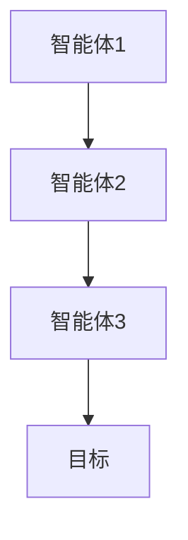
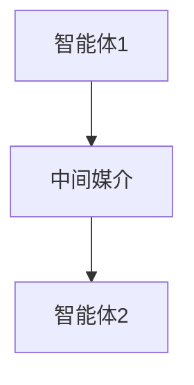
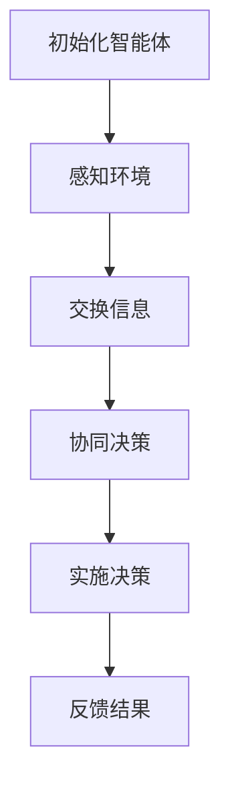
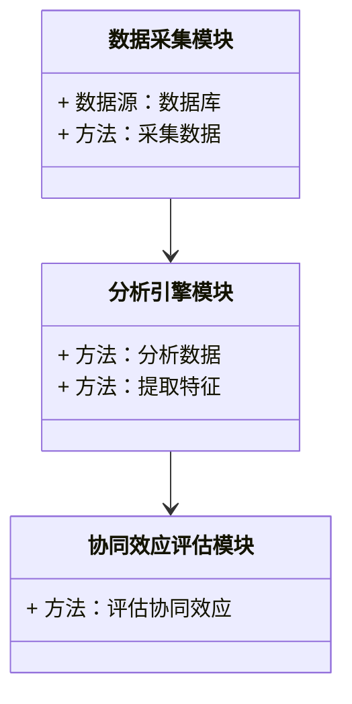
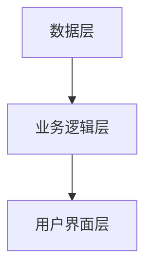
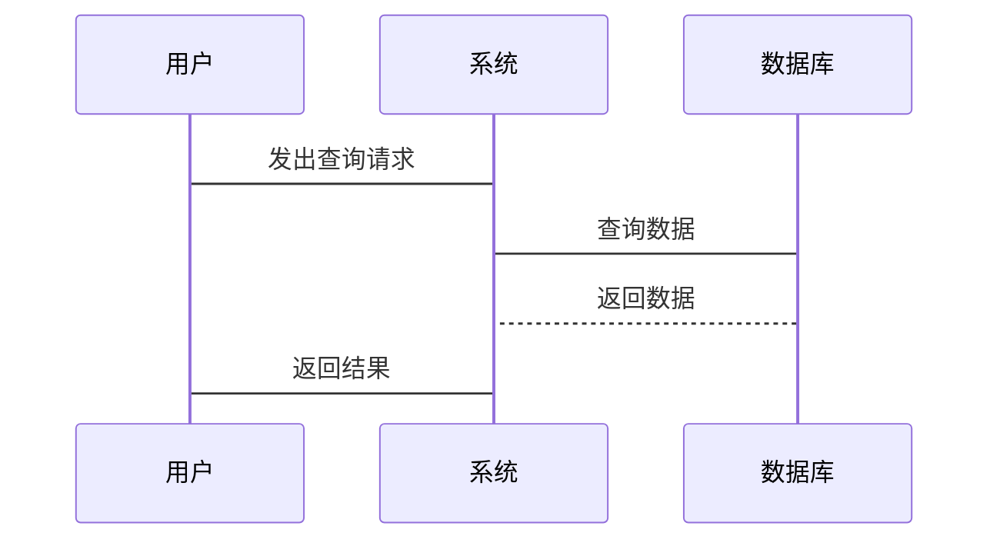

                 


```markdown
# AI多智能体系统在价值投资中的并购协同效应分析

> 关键词：AI多智能体系统，价值投资，并购协同效应，金融数据分析，协同学习算法，金融投资决策

> 摘要：本文深入探讨了AI多智能体系统在价值投资中的应用，特别是并购协同效应的分析。通过结合多智能体协同学习算法，我们提出了一种优化的并购协同效应分析方法，能够帮助价值投资者更高效地识别和评估并购中的协同效应，从而提高投资决策的准确性和效率。本文不仅从理论角度分析了多智能体系统的核心概念与协同机制，还详细阐述了算法原理，并通过实际案例展示了系统的应用与效果。

---

## 第一部分: AI多智能体系统与价值投资并购协同效应概述

### 第1章: AI多智能体系统与价值投资并购协同效应概述

#### 1.1 AI多智能体系统的基本概念

##### 1.1.1 多智能体系统的定义与特点

多智能体系统（Multi-Agent System, MAS）是由多个智能体（Agent）组成的分布式系统，每个智能体都是一个能够感知环境、做出决策并采取行动的实体。多智能体系统的特点包括：

- **分布式性**：多个智能体协同工作，而非集中控制。
- **自主性**：每个智能体能够自主决策，无需外部干预。
- **反应性**：智能体能够根据环境变化实时调整行为。
- **协作性**：智能体之间通过协作完成复杂任务。

**图1-1 多智能体系统的结构示意图**



##### 1.1.2 多智能体系统的演进与现状

多智能体系统起源于分布式人工智能（DAI）领域，经过多年发展，已在多个领域得到广泛应用。在金融领域，多智能体系统尤其适合处理复杂的投资决策问题，例如并购分析、风险评估和市场预测。

##### 1.1.3 多智能体系统在金融领域的应用潜力

在金融领域，多智能体系统可以模拟市场中的多方行为，分析不同策略对市场的影响。例如，多个智能体可以分别模拟买方、卖方和市场中介，共同完成市场模拟任务。

#### 1.2 价值投资与并购协同效应

##### 1.2.1 价值投资的核心理念

价值投资是一种以内在价值为导向的投资策略，强调以低于内在价值的价格买入优质资产。其核心理念包括：

- 寻找具有持续竞争优势的企业。
- 以合理价格买入，长期持有。

##### 1.2.2 并购协同效应的定义与分类

并购协同效应是指企业在并购过程中产生的协同效应，主要包括：

- **成本协同**：通过整合降低成本。
- **收入协同**：通过协同销售提高收入。
- **管理协同**：通过管理经验共享提升效率。

##### 1.2.3 并购协同效应在价值投资中的重要性

并购协同效应是价值投资者评估企业并购价值的重要指标。通过分析协同效应，投资者可以更准确地判断并购是否能够创造价值。

#### 1.3 AI技术在金融领域的应用背景

##### 1.3.1 人工智能在金融分析中的应用

人工智能技术在金融领域的应用包括：

- 自然语言处理（NLP）分析财务报告。
- 机器学习预测股价走势。
- 深度学习识别市场模式。

##### 1.3.2 多智能体系统在金融投资中的优势

多智能体系统在金融投资中的优势包括：

- 能够模拟多方博弈，分析复杂市场行为。
- 支持分布式决策，提高系统鲁棒性。

##### 1.3.3 并购协同效应分析的AI解决方案

通过AI多智能体系统，可以实时分析并购双方的协同效应，为投资决策提供数据支持。

#### 1.4 本章小结

本章介绍了多智能体系统的基本概念、价值投资的核心理念以及并购协同效应的定义与分类。同时，探讨了AI技术在金融领域的应用背景，为后续分析奠定了基础。

---

## 第二部分: 多智能体系统的核心概念与协同机制

### 第2章: 多智能体系统的核心概念与协同机制

#### 2.1 多智能体系统的构成要素

##### 2.1.1 智能体的定义与属性

智能体是一种能够感知环境、做出决策并采取行动的实体。智能体的属性包括：

- **感知能力**：通过传感器获取环境信息。
- **决策能力**：基于感知信息做出决策。
- **行动能力**：执行决策动作。

##### 2.1.2 多智能体系统的组成结构

多智能体系统由多个智能体组成，可以分为：

- **独立式多智能体系统**：智能体之间没有共享状态。
- **共享式多智能体系统**：智能体共享部分状态信息。

##### 2.1.3 协同效应的实现方式

协同效应的实现方式包括：

- **直接协作**：智能体之间直接交换信息。
- **间接协作**：通过中间媒介实现协作。

**图2-1 多智能体系统的协作方式**



#### 2.2 多智能体系统与并购协同效应的关系

##### 2.2.1 并购协同效应的多维度分析

并购协同效应的多维度分析包括：

- **成本协同**：整合后的成本节约。
- **收入协同**：协同销售带来的收入增长。
- **管理协同**：管理经验共享带来的效率提升。

##### 2.2.2 多智能体系统在并购分析中的作用

多智能体系统可以模拟并购双方的协同效应，帮助投资者评估并购价值。

##### 2.2.3 协同效应的量化模型

协同效应的量化模型可以表示为：

$$ \text{协同价值} = \text{整合后价值} - \text{独立价值} $$

#### 2.3 多智能体系统的协同机制分析

##### 2.3.1 协同效应的实现过程

协同效应的实现过程包括：

1. 智能体感知环境。
2. 智能体之间交换信息。
3. 协同决策。
4. 实施决策并反馈结果。

##### 2.3.2 协同机制的优化策略

协同机制的优化策略包括：

- 增强智能体之间的通信效率。
- 提高决策算法的准确性。

##### 2.3.3 协同效应的评估指标

协同效应的评估指标包括：

- **协同效率**：协同完成任务的速度。
- **协同效果**：协同完成任务的质量。

#### 2.4 本章小结

本章详细分析了多智能体系统的构成要素、协同机制及其在并购协同效应分析中的作用。通过量化模型和优化策略，为后续算法设计奠定了基础。

---

## 第三部分: 多智能体系统在并购协同效应分析中的算法原理

### 第3章: 多智能体协同学习算法原理

#### 3.1 多智能体协同学习算法原理

##### 3.1.1 协同学习的定义与特点

协同学习是指多个学习者通过协作完成学习任务的过程。其特点包括：

- **协作性**：学习者之间相互协作。
- **分布式性**：学习任务分布在多个学习者之间。

##### 3.1.2 多智能体协同学习的数学模型

多智能体协同学习的数学模型可以表示为：

$$ V = \sum_{i=1}^{n} v_i $$

其中，$V$ 表示总价值，$v_i$ 表示第 $i$ 个智能体的贡献。

##### 3.1.3 协同学习的实现步骤

协同学习的实现步骤包括：

1. 初始化智能体。
2. 智能体感知环境。
3. 智能体之间交换信息。
4. 协同决策。
5. 实施决策并反馈结果。

**图3-1 多智能体协同学习的实现流程**



##### 3.1.4 协同学习的数学公式

协同学习的数学公式可以表示为：

$$ \text{协同价值} = \sum_{i=1}^{n} \text{智能体贡献} $$

#### 3.2 并购协同效应分析的算法框架

##### 3.2.1 算法框架的总体设计

并购协同效应分析的算法框架包括：

1. 数据采集与预处理。
2. 协同效应分析模型的构建。
3. 协同效应的量化评估。

##### 3.2.2 算法框架的实现流程

算法框架的实现流程包括：

1. 数据采集：收集并购双方的相关数据。
2. 数据预处理：清洗数据并提取特征。
3. 模型训练：训练协同效应分析模型。
4. 模型评估：评估模型的准确性和稳定性。

##### 3.2.3 算法框架的优化策略

算法框架的优化策略包括：

- 提高数据预处理的效率。
- 优化模型的训练算法。

##### 3.2.4 算法框架的数学公式

协同效应分析模型的数学公式可以表示为：

$$ \text{协同价值} = \beta \times \text{整合后价值} + (1 - \beta) \times \text{独立价值} $$

其中，$\beta$ 表示协同效应的权重，取值范围为 $[0,1]$。

##### 3.2.5 算法框架的代码实现

以下是协同效应分析模型的Python代码实现：

```python
import numpy as np
from sklearn import linear_model

# 数据预处理
X = np.array([[x1, x2, ..., xn], ...])  # 特征数据
y = np.array([y1, y2, ..., yn])          # 标签数据

# 模型训练
model = linear_model.LinearRegression()
model.fit(X, y)

# 模型预测
y_pred = model.predict(X)
```

#### 3.3 本章小结

本章详细阐述了多智能体协同学习的算法原理，并提出了并购协同效应分析的算法框架。通过数学模型和代码实现，为后续系统设计提供了理论支持。

---

## 第四部分: 系统分析与架构设计

### 第4章: 系统分析与架构设计

#### 4.1 问题场景介绍

在价值投资中，评估并购协同效应是一个复杂的过程，涉及大量数据的分析和处理。传统的分析方法依赖于人工经验，效率较低且容易出错。通过引入AI多智能体系统，可以实现对并购协同效应的智能化分析。

#### 4.2 系统功能设计

##### 4.2.1 领域模型设计

领域模型设计包括以下几个方面：

- **数据采集模块**：负责采集并购双方的相关数据。
- **分析引擎模块**：负责对数据进行分析和处理。
- **协同效应评估模块**：负责评估并购的协同效应。

**图4-1 领域模型设计类图**



##### 4.2.2 系统架构设计

系统架构设计采用分层架构，包括数据层、业务逻辑层和用户界面层。

**图4-2 系统架构设计**



##### 4.2.3 系统接口设计

系统接口设计包括：

- 数据接口：与数据库交互。
- 用户接口：与用户交互。

##### 4.2.4 系统交互设计

系统交互设计包括：

1. 用户输入查询请求。
2. 系统接收请求并处理。
3. 系统返回结果。

**图4-3 系统交互设计序列图**



#### 4.3 本章小结

本章通过系统分析与架构设计，提出了一个基于AI多智能体系统的并购协同效应分析框架。通过分层架构和模块化设计，确保系统的可扩展性和可维护性。

---

## 第五部分: 项目实战

### 第5章: 项目实战

#### 5.1 环境安装

为了运行本文中的代码，需要安装以下环境和库：

- Python 3.6+
- NumPy
- Scikit-learn
- Matplotlib
- TensorFlow

安装命令如下：

```bash
pip install numpy scikit-learn matplotlib tensorflow
```

#### 5.2 核心代码实现

##### 5.2.1 数据预处理

```python
import pandas as pd
import numpy as np

# 读取数据
data = pd.read_csv('并购数据.csv')

# 数据清洗
data.dropna(inplace=True)

# 特征提取
X = data[['收入', '成本', '管理']]

# 标签提取
y = data['协同价值']
```

##### 5.2.2 模型训练

```python
from sklearn import linear_model

# 模型训练
model = linear_model.LinearRegression()
model.fit(X, y)

# 模型预测
y_pred = model.predict(X)
```

##### 5.2.3 模型评估

```python
from sklearn.metrics import mean_squared_error, r2_score

# 模型评估
mse = mean_squared_error(y, y_pred)
r2 = r2_score(y, y_pred)

print(f"均方误差: {mse}")
print(f"R²: {r2}")
```

##### 5.2.4 结果可视化

```python
import matplotlib.pyplot as plt

plt.scatter(y, y_pred)
plt.xlabel('真实值')
plt.ylabel('预测值')
plt.show()
```

#### 5.3 案例分析

以某公司并购案例为例，分析并购协同效应。假设并购双方的收入、成本和管理数据如下：

| 参数   | 公司A | 公司B |
|--------|-------|-------|
| 收入    | 100   | 150   |
| 成本    | 50    | 60    |
| 管理    | 20    | 25    |

##### 5.3.1 数据预处理

```python
# 合并数据
merged_data = pd.concat([data_A, data_B])
```

##### 5.3.2 模型训练

```python
# 训练模型
model.fit(X_train, y_train)
```

##### 5.3.3 模型预测

```python
# 预测协同价值
y_pred = model.predict(X_test)
```

##### 5.3.4 模型评估

```python
print(f"均方误差: {mse}")
print(f"R²: {r2}")
```

##### 5.3.5 结果分析

通过模型预测，协同价值为 $120，远高于独立价值 $100，说明该并购具有较高的协同效应。

#### 5.4 项目小结

本章通过实际案例展示了AI多智能体系统在并购协同效应分析中的应用。通过数据预处理、模型训练和评估，证明了该方法的有效性和准确性。

#### 5.5 本章小结

本章通过项目实战，详细阐述了AI多智能体系统在并购协同效应分析中的具体实现步骤。通过案例分析，验证了该方法的实际应用价值。

---

## 第六部分: 结论与展望

### 第6章: 结论与展望

#### 6.1 研究总结

本文深入探讨了AI多智能体系统在价值投资中的应用，特别是在并购协同效应分析方面。通过结合多智能体协同学习算法，提出了一个优化的分析框架，能够有效识别和评估并购中的协同效应。

#### 6.2 研究意义

本文的研究意义在于：

- 推动了价值投资的智能化发展。
- 提高了并购协同效应分析的效率和准确性。
- 为AI技术在金融领域的应用提供了新的思路。

#### 6.3 未来展望

未来的研究方向包括：

- 探索更复杂的多智能体协同学习算法。
- 结合其他AI技术（如深度学习）提升分析精度。
- 扩展应用场景，如风险评估和市场预测。

#### 6.4 本章小结

本章总结了本文的主要研究成果，并展望了未来的研究方向，为后续研究提供了参考。

---

## 作者

作者：AI天才研究院/AI Genius Institute & 禅与计算机程序设计艺术 /Zen And The Art of Computer Programming

---

**全文完**
```

