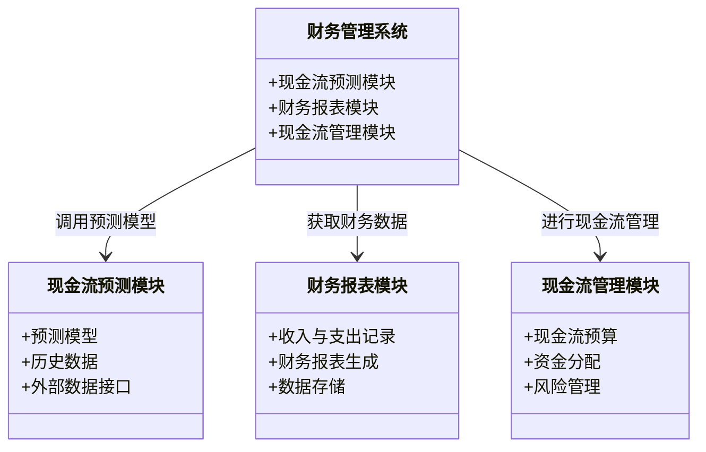
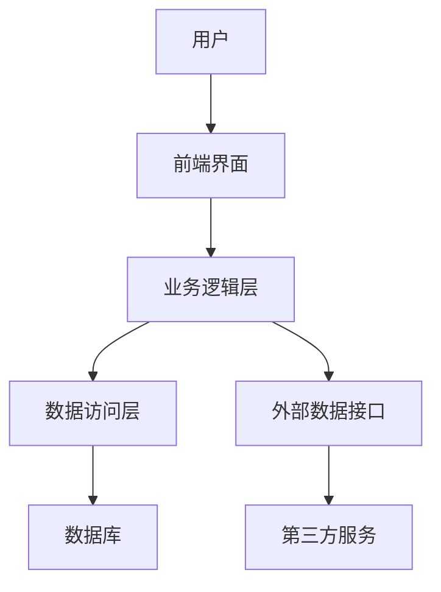
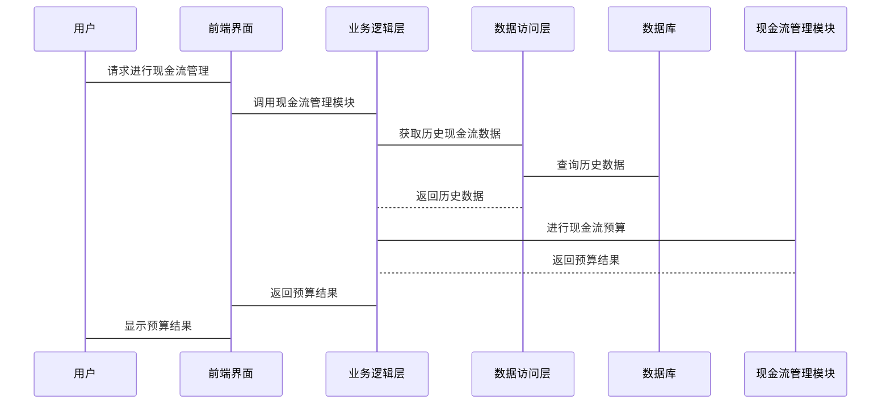

                 


# 巴菲特的公用事业投资策略：稳定现金流的魅力

## 关键词：巴菲特, 投资策略, 公用事业, 现金流, 价值投资

## 摘要：本文深入探讨了巴菲特在公用事业领域的投资策略，重点分析了稳定现金流的魅力。通过介绍巴菲特的投资理念、公用事业行业的特点、稳定现金流的来源与管理、公用事业企业的价值评估以及系统架构设计，结合实际案例分析和项目实战，为读者提供了全面的见解。文章最后总结了最佳投资实践和注意事项，帮助读者更好地理解和应用这些策略。

---

## 第1章: 巴菲特投资理念与公用事业的特点

### 1.1 巴菲特投资理念概述

#### 1.1.1 价值投资的核心思想
巴菲特的价值投资理念强调以低于内在价值的价格买入优质资产，长期持有，等待其价值的实现。他认为市场的短期波动是不可预测的，但优质企业的长期价值是可以通过基本面分析确定的。

#### 1.1.2 长期投资与复利效应
巴菲特相信复利的力量，他倡导长期投资以最大化复利效应。通过长期持有优质资产，投资者可以享受到时间带来的价值增长。

#### 1.1.3 巴菲特的投资风格与选股标准
巴菲特选股的标准包括：
1. **护城河**：企业具备强大的竞争优势，能够在市场上长期保持领先地位。
2. **管理团队**：管理层诚实可靠，具有良好的决策能力和长期愿景。
3. **财务健康状况**：企业具备稳健的财务状况，特别是较低的债务负担和充足的现金流。
4. **盈利能力**：企业具备持续的盈利能力，并且ROE（净资产收益率）较高。

### 1.2 公用事业行业的特点

#### 1.2.1 公用事业的定义与分类
公用事业是指提供基本服务的行业，包括电力、天然气、水务、废物处理、公共交通等。这些行业通常是垄断或寡头垄断市场，具有较高的进入壁垒。

#### 1.2.2 公用事业的稳定性和防御性
公用事业的需求具有刚性，无论经济状况如何，人们都需要基本的电力、水和天然气。因此，公用事业行业的收入和利润相对稳定，具有防御性。

#### 1.2.3 公用事业的现金流特征
公用事业企业的现金流通常非常稳定，因为它们的收入来源是可预测的，并且需求相对稳定。此外，公用事业企业通常具备较高的定价能力，能够在通胀上升时调整价格以保持利润率。

### 1.3 巴菲特与公用事业投资的契合点

#### 1.3.1 稳定现金流的重要性
巴菲特高度重视现金流，认为现金流是企业健康的核心指标。公用事业企业的稳定现金流正好符合他的投资理念。

#### 1.3.2 巴菲特对公用事业行业的青睐
公用事业行业的稳定性和防御性使得它成为巴菲特投资组合中的重要组成部分。他认为这些企业能够在经济衰退中保持稳定的收入和利润。

#### 1.3.3 公用事业投资的风险与收益平衡
尽管公用事业行业的收益相对稳定，但其增长潜力有限。然而，通过选择具备竞争优势和稳健财务状况的企业，巴菲特能够在稳定的基础上实现长期收益。

### 1.4 本章小结
本章介绍了巴菲特的投资理念及其对公用事业行业的青睐。公用事业行业的稳定现金流和防御性特点使其成为巴菲特投资组合的重要组成部分。通过分析巴菲特的投资标准，我们可以更好地理解他在公用事业领域的投资策略。

---

## 第2章: 稳定现金流的魅力

### 2.1 现金流的定义与分类

#### 2.1.1 现金流的定义
现金流是指企业在一定时期内现金和现金等价物的流入和流出。它反映了企业的财务健康状况和盈利能力。

#### 2.1.2 现金流的分类
现金流可以分为以下三类：
1. **经营活动现金流**：来自企业日常运营的现金流，包括销售收入和付现成本。
2. **投资活动现金流**：来自企业投资活动的现金流，包括购买和出售资产。
3. **筹资活动现金流**：来自企业筹资活动的现金流，包括借款和偿还债务。

#### 2.1.3 现金流在企业中的重要性
现金流是企业生存和发展的关键。充足的现金流可以确保企业能够偿还债务、支付股息、投资于新项目以及应对突发事件。

### 2.2 稳定现金流的来源

#### 2.2.1 经营活动现金流
经营活动现金流是企业日常运营中产生的现金流，主要包括销售收入、成本、税费等。对于公用事业企业来说，稳定的客户需求和定价能力确保了经营活动现金流的稳定。

#### 2.2.2 投资活动现金流
投资活动现金流来源于企业投资于长期资产的活动。对于公用事业企业来说，投资活动现金流主要用于建设和扩展基础设施，这通常需要大量的资金投入。

#### 2.2.3 筹资活动现金流
筹资活动现金流来源于企业通过借款、发行股票等方式筹集资金的活动。对于公用事业企业来说，合理的债务融资可以帮助企业优化资本结构，降低融资成本。

### 2.3 现金流管理策略

#### 2.3.1 现金流预测与预算
现金流预测是现金流管理的基础。通过预测未来现金流，企业可以制定合理的预算，确保资金的合理分配和使用。

#### 2.3.2 资金管理与流动性控制
企业需要合理管理资金，确保流动性。通过优化资金分配、合理安排债务和股权融资，企业可以提高资金使用效率，降低流动性风险。

#### 2.3.3 风险管理与现金流稳定性
企业需要通过风险管理工具（如保险、套期保值等）来降低现金流波动的风险。同时，通过 diversification 和 hedging 策略，企业可以降低现金流的不确定性。

### 2.4 巴菲特的现金流管理智慧

#### 2.4.1 巴菲特对现金流的关注
巴菲特高度重视现金流，认为现金流是企业健康的核心指标。他倾向于投资那些具备稳定现金流来源的企业。

#### 2.4.2 巴菲特现金流管理的实践
巴菲特通过投资公用事业等具备稳定现金流的企业，确保其投资组合的稳定性。他通常会避免那些现金流不稳定或依赖于外部融资的企业。

#### 2.4.3 现金流在企业估值中的作用
现金流在企业估值中起着至关重要的作用。通过DCF模型等方法，投资者可以评估企业的内在价值，从而做出合理的投资决策。

### 2.5 本章小结
本章详细探讨了稳定现金流的来源与管理策略，分析了现金流在企业估值中的重要性。通过巴菲特的现金流管理智慧，我们可以更好地理解如何通过稳定现金流实现长期投资收益。

---

## 第3章: 公用事业企业的价值评估

### 3.1 企业价值评估的基本方法

#### 3.1.1 市盈率（P/E）分析
市盈率是衡量企业估值的重要指标，反映了市场对企业盈利能力的评价。P/E = 市场价 / 每股收益。

#### 3.1.2 市净率（P/B）分析
市净率是衡量企业估值的另一个重要指标，反映了市场对企业资产价值的评价。P/B = 市场价 / 每股净资产。

#### 3.1.3 股息率分析
股息率是衡量企业分红能力的重要指标，反映了市场对企业分红能力的评价。股息率 = 每股股息 / 市场价。

### 3.2 公用事业企业的价值评估模型

#### 3.2.1 现金流折现模型（DCF模型）
现金流折现模型是评估企业价值的重要工具。通过将未来的现金流折现，我们可以得到企业的内在价值。公式为：
$$
\text{企业价值} = \sum_{t=1}^{n} \frac{\text{现金流}_t}{(1 + r)^t}
$$

#### 3.2.2 市盈率模型
市盈率模型是通过比较企业的市盈率和行业平均水平，来评估企业的估值是否合理。如果企业的市盈率低于行业平均水平，可能意味着企业被低估。

#### 3.2.3 股息折现模型（DDM模型）
股息折现模型是通过评估企业未来股息的现值，来确定企业的内在价值。公式为：
$$
\text{内在价值} = \sum_{t=1}^{n} \frac{\text{股息}_t}{(1 + r)^t}
$$

### 3.3 巴菲特的公用事业投资案例分析

#### 3.3.1 案例背景介绍
以巴菲特投资的某公用事业企业为例，分析其财务状况、竞争优势以及投资价值。

#### 3.3.2 财务分析
通过分析企业的财务报表，包括收入、利润、现金流等，评估企业的财务健康状况和盈利能力。

#### 3.3.3 估值与投资决策
通过DCF模型等方法，评估企业的内在价值，并与市场价格进行比较，做出投资决策。

### 3.4 本章小结
本章介绍了公用事业企业的价值评估方法，通过案例分析展示了如何通过财务分析和估值模型来评估企业的投资价值。

---

## 第4章: 系统分析与架构设计

### 4.1 系统分析

#### 4.1.1 问题场景介绍
本章将通过一个具体的公用事业企业案例，分析其系统架构设计。我们假设某公用事业企业需要优化其财务管理系统，以提高现金流管理效率。

#### 4.1.2 项目介绍
本项目旨在通过系统架构设计，优化企业的财务管理系统，提高现金流预测和管理能力。

### 4.2 系统功能设计

#### 4.2.1 领域模型Mermaid类图
以下是公用事业企业财务管理系统的需求分析类图：



### 4.3 系统架构设计

#### 4.3.1 系统架构Mermaid架构图
以下是财务管理系统的主要架构设计：



### 4.4 系统接口设计

#### 4.4.1 接口定义
以下是财务管理系统的主要接口：

1. **现金流预测接口**：用于调用预测模型，获取现金流预测结果。
2. **财务报表生成接口**：用于生成财务报表，获取收入与支出数据。
3. **现金流管理接口**：用于进行现金流预算和资金分配。

### 4.5 系统交互设计

#### 4.5.1 系统交互Mermaid序列图
以下是现金流管理模块的系统交互流程：



### 4.6 本章小结
本章通过系统架构设计，展示了如何通过技术手段优化公用事业企业的财务管理系统，提高现金流管理效率。

---

## 第5章: 项目实战

### 5.1 环境安装与配置

#### 5.1.1 安装Python环境
在进行项目实战之前，需要安装Python环境，包括Python解释器和必要的开发工具。

```bash
# 安装Python
sudo apt-get install python3 python3-dev
```

#### 5.1.2 安装数据分析库
安装Pandas、NumPy、Matplotlib等数据分析库，用于数据处理和可视化。

```bash
pip install pandas numpy matplotlib
```

### 5.2 现金流预测模型的实现

#### 5.2.1 数据收集与预处理
收集公用事业企业的历史财务数据，包括收入、支出、现金流等，并进行数据清洗和预处理。

#### 5.2.2 模型训练与优化
使用历史数据训练现金流预测模型，优化模型参数，提高预测精度。

#### 5.2.3 模型应用与结果分析
将模型应用于实际数据，分析预测结果，评估模型的准确性。

### 5.3 代码实现与解读

#### 5.3.1 数据处理代码
以下是数据处理的Python代码：

```python
import pandas as pd

# 读取数据
data = pd.read_csv('financial_data.csv')

# 数据清洗
data.dropna(inplace=True)
data['date'] = pd.to_datetime(data['date'])
data.set_index('date', inplace=True)

# 数据预处理
data['revenue'] = data['revenue'].astype(float)
data['expenses'] = data['expenses'].astype(float)
```

#### 5.3.2 现金流预测模型
以下是现金流预测模型的实现代码：

```python
import numpy as np
from sklearn.linear_model import LinearRegression

# 训练模型
model = LinearRegression()
model.fit(data[['revenue', 'expenses']], data['cash_flow'])

# 预测未来现金流
future_data = pd.DataFrame({
    'revenue': [1000000, 1200000],
    'expenses': [800000, 900000]
})
predicted_cash_flow = model.predict(future_data)
```

### 5.4 案例分析与结果解读
通过实际案例分析，展示如何通过现金流预测模型优化企业的现金流管理，并评估模型的应用效果。

### 5.5 本章小结
本章通过项目实战，展示了如何通过技术手段优化公用事业企业的现金流管理，提高企业的财务健康状况。

---

## 第6章: 结论与最佳实践

### 6.1 本章总结
本文深入探讨了巴菲特的公用事业投资策略，分析了稳定现金流的魅力，并通过系统架构设计和项目实战展示了如何通过技术手段优化现金流管理。

### 6.2 投资策略与注意事项

#### 6.2.1 投资策略
1. **选择具备稳定现金流的企业**：投资那些具备稳定现金流来源的企业，确保投资的安全性和稳定性。
2. **关注企业的财务健康状况**：通过分析企业的财务报表，评估企业的财务健康状况，避免投资于财务状况不佳的企业。
3. **长期投资与复利效应**：通过长期投资，享受复利效应，实现财富的长期增长。

#### 6.2.2 投资注意事项
1. **分散投资风险**：通过 diversification 投资于不同的行业和企业，降低投资风险。
2. **关注宏观经济环境**：宏观经济环境对企业现金流和投资价值有重要影响，投资者需要关注宏观经济变化。
3. **定期评估投资组合**：定期评估投资组合的表现，及时调整投资策略，确保投资目标的实现。

### 6.3 未来研究方向
未来的研究可以进一步探讨现金流预测模型的优化，以及如何通过技术创新提高现金流管理效率。

### 6.4 本章小结
本章总结了全文的主要内容，并提出了投资策略和注意事项，帮助读者更好地理解和应用巴菲特的公用事业投资策略。

---

## 作者：AI天才研究院/AI Genius Institute & 禅与计算机程序设计艺术/Zen And The Art of Computer Programming

