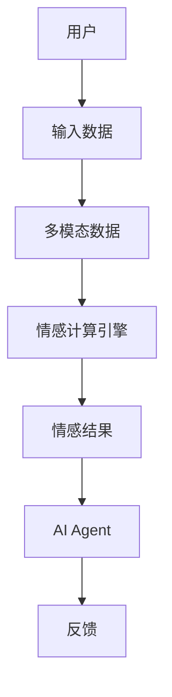
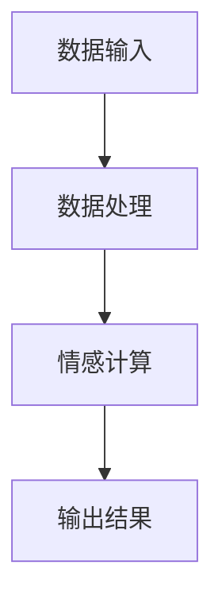
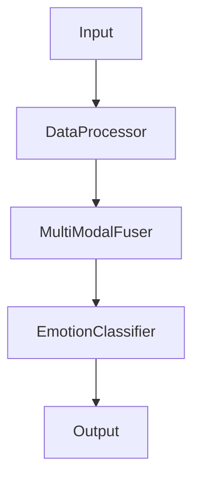
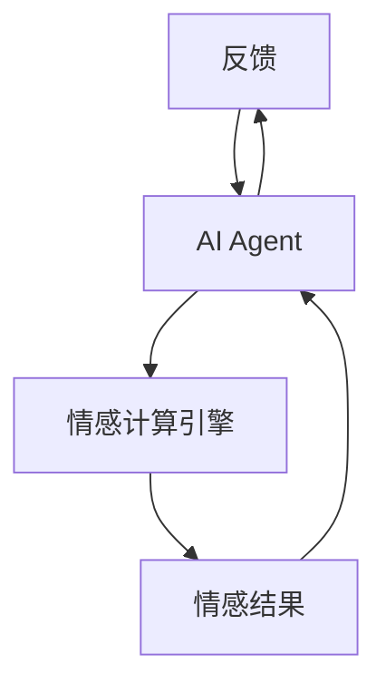

                 


# 开发AI Agent的多模态情感计算引擎

## 关键词：情感计算、多模态数据、AI Agent、自然语言处理、深度学习、数据融合

## 摘要：本文深入探讨了开发AI Agent的多模态情感计算引擎的关键技术，涵盖背景分析、核心概念、算法原理、系统设计、项目实战及最佳实践。通过多模态数据融合和先进算法，提升情感计算准确性，优化AI Agent交互体验。

---

## 第1章: 多模态情感计算引擎的背景与问题背景

### 1.1 问题背景

#### 1.1.1 情感计算与AI Agent的结合需求
AI Agent需要理解用户情感，以提供更智能的服务。传统单模态情感分析存在局限性，多模态数据能提供更丰富的情感信息。

#### 1.1.2 当前情感计算技术的局限性
- 单模态分析：仅依赖文本或语音，信息不全面。
- 数据孤岛：各模态数据独立，未能有效融合。
- 情感维度单一：主要关注正面/负面，忽视复杂情感。

#### 1.1.3 多模态情感计算的重要性
整合文本、语音、图像等数据，提升情感分析准确性，优化AI Agent交互体验。

---

### 1.2 问题描述

#### 1.2.1 情感计算的核心问题
准确识别用户情感，理解情感强度和复杂性。

#### 1.2.2 多模态数据融合的挑战
如何有效整合和分析多源异构数据，避免信息冗余。

#### 1.2.3 AI Agent在情感计算中的角色
通过情感理解优化交互策略，提升用户体验。

---

### 1.3 问题解决思路

#### 1.3.1 多模态数据融合的解决方案
- 数据预处理：标准化和对齐多模态数据。
- 融合策略：加权融合或基于注意力机制的融合。
- 模型优化：深度学习模型训练，提升情感计算精度。

#### 1.3.2 情感计算引擎的设计目标
- 准确性：高精度情感识别。
- 实时性：低延迟处理。
- 可扩展性：支持多种模态数据。

#### 1.3.3 AI Agent的交互优化目标
- 情境感知：根据情感和上下文调整交互方式。
- 个性化服务：基于用户情感偏好提供定制化反馈。

---

### 1.4 边界与外延

#### 1.4.1 情感计算的边界
- 仅处理情感相关数据，不涉及其他意图或实体识别。
- 专注于实时交互，不考虑长期记忆。

#### 1.4.2 多模态数据的边界
- 仅处理结构化和半结构化数据，不涉及完全无结构数据。
- 支持的模态类型有限，如文本、语音、图像。

#### 1.4.3 AI Agent的边界与外延
- 作为情感计算引擎的消费者，不参与数据处理。
- 外延包括与其他系统的集成和扩展功能开发。

---

### 1.5 概念结构与核心要素

#### 1.5.1 情感计算引擎的核心要素
- 多模态数据输入：文本、语音、图像等。
- 情感分析模型：深度学习模型。
- 情感结果输出：情感标签、强度评分。

#### 1.5.2 多模态数据的构成
- 文本数据：用户输入的文本。
- 语音数据：用户的语音特征。
- 图像数据：用户面部表情等视觉信息。

#### 1.5.3 AI Agent的交互机制
- 接收情感计算结果。
- 调整交互策略。
- 反馈给用户。

---

## 第2章: 多模态情感计算引擎的核心概念

### 2.1 多模态数据与情感计算

#### 2.1.1 多模态数据的定义与特点
- 定义：多种类型数据的集合。
- 特点：互补性和冗余性，提升信息可用性。

#### 2.1.2 情感计算的核心原理
- 通过多模态数据融合，提升情感识别准确性。

#### 2.1.3 多模态数据在情感计算中的作用
- 提供更丰富的情感信息，降低误判率。

---

### 2.2 AI Agent与情感计算的联系

#### 2.2.1 AI Agent的定义与特点
- 定义：智能代理，能够执行任务。
- 特点：自主性、反应性、社交能力。

#### 2.2.2 情感计算在AI Agent中的应用
- 改善人机交互，提供个性化服务。

#### 2.2.3 多模态情感计算引擎的架构
- 数据输入、处理、分析、输出反馈。

---

### 2.3 核心概念对比与分析

#### 2.3.1 多模态数据与单模态数据的对比
| 属性       | 单模态数据        | 多模态数据        |
|------------|-------------------|-------------------|
| 信息量     | 较低              | 较高              |
| 互补性     | 无                | 有                |
| 精确性     | 较低              | 较高              |

#### 2.3.2 情感计算与传统情感分析的对比
| 属性       | 传统情感分析      | 多模态情感计算    |
|------------|-------------------|-------------------|
| 数据来源    | 单一（如文本）    | 多源（如文本、语音）|
| 复杂性      | 较低              | 较高              |
| 精度        | 中等              | 更高              |

#### 2.3.3 AI Agent与传统对话系统的对比
| 属性       | 传统对话系统      | AI Agent          |
|------------|-------------------|-------------------|
| 情感理解    | 简单或无          | 复杂且精准        |
| 交互能力    | 有限              | 强大              |
| 学习能力    | 无                | 有                |

---

### 2.4 ER实体关系图



---

## 第3章: 多模态情感计算引擎的算法原理

### 3.1 情感计算的算法原理

#### 3.1.1 情感计算流程
1. 数据预处理：清洗和标准化。
2. 特征提取：提取文本、语音、图像特征。
3. 数据融合：多模态特征融合。
4. 情感分类：深度学习模型分类。

#### 3.1.2 情感分类算法
- 使用深度学习模型（如LSTM、Transformer）进行分类。

#### 3.1.3 情感强度计算
- 利用回归模型预测情感强度。

---

### 3.2 意图识别的算法原理

#### 3.2.1 意图识别流程
1. 词嵌入：文本转化为向量。
2. 模型训练：监督学习训练意图分类器。
3. 意图预测：输入文本预测意图。

#### 3.2.2 意图识别算法
- 使用CRF或基于深度学习的模型进行序列标注。

---

### 3.3 多模态数据融合算法

#### 3.3.1 数据融合策略
- 加权融合：根据模态的重要性加权。
- 注意力机制：动态调整各模态的权重。

#### 3.3.2 融合算法
- 使用多模态神经网络，如多分支结构。

---

### 3.4 算法实现

#### 3.4.1 情感分析代码示例
```python
import numpy as np
from sklearn.metrics import accuracy_score

# 示例代码：基于文本的情感分析
def preprocess(text):
    # 数据预处理
    pass

def model_train(X, y):
    # 模型训练
    pass

def evaluate(X_test, y_test):
    # 模型评估
    pass
```

#### 3.4.2 数学模型
- 余弦相似度公式：$$\cos{\theta} = \frac{\vec{A} \cdot \vec{B}}{|\vec{A}| |\vec{B}|}$$
- 情感分类模型：使用LSTM或Transformer结构。

---

## 第4章: 多模态情感计算引擎的系统分析与架构设计

### 4.1 系统功能设计

#### 4.1.1 功能模块
- 数据输入模块：接收多模态数据。
- 数据处理模块：预处理和特征提取。
- 情感计算模块：融合数据并计算情感。
- 输出模块：返回情感结果。

#### 4.1.2 系统功能流程


---

### 4.2 系统架构设计

#### 4.2.1 系统架构图


---

### 4.3 系统接口设计

#### 4.3.1 接口定义
- 输入接口：接收多模态数据。
- 输出接口：返回情感计算结果。

#### 4.3.2 接口协议
- HTTP API：用于与AI Agent交互。

---

### 4.4 系统交互流程

#### 4.4.1 交互流程


---

## 第5章: 多模态情感计算引擎的项目实战

### 5.1 环境安装

#### 5.1.1 安装依赖
- Python 3.8+
- TensorFlow 2.0+
- scikit-learn 0.20+

#### 5.1.2 安装命令
```bash
pip install numpy scikit-learn tensorflow
```

---

### 5.2 核心实现

#### 5.2.1 数据预处理
```python
def preprocess(text, audio, image):
    # 文本预处理
    text_vec = ...
    # 语音预处理
    audio_vec = ...
    # 图像预处理
    image_vec = ...
    return text_vec, audio_vec, image_vec
```

#### 5.2.2 模型训练
```python
def model_train(X, y):
    model = ...
    model.compile(...)
    model.fit(X, y, ...)
    return model
```

---

### 5.3 实际案例分析

#### 5.3.1 案例描述
用户输入文本、语音和图像，引擎计算情感并反馈给AI Agent。

#### 5.3.2 代码解读
```python
# 情感计算主程序
def main():
    text, audio, image = preprocess(...)
    features = fuse_features(text, audio, image)
    emotion = model.predict(features)
    return emotion

if __name__ == "__main__":
    main()
```

---

## 第6章: 多模态情感计算引擎的最佳实践与小结

### 6.1 最佳实践

#### 6.1.1 数据质量
- 确保多模态数据的准确性和一致性。
- 处理数据缺失和噪声。

#### 6.1.2 模型调优
- 使用交叉验证优化模型参数。
- 引入领域数据增强技术。

#### 6.1.3 系统性能
- 优化数据处理流程，减少延迟。
- 并行处理多模态数据。

---

### 6.2 小结

#### 6.2.1 核心内容回顾
- 多模态数据的整合与分析。
- 情感计算引擎的算法实现。
- AI Agent的交互优化。

#### 6.2.2 开发注意事项
- 数据隐私保护。
- 系统扩展性设计。
- 多模态数据融合的复杂性。

---

## 附录

### 附录A: 完整代码示例

```python
# 示例代码：情感计算引擎核心实现
import numpy as np
from sklearn.ensemble import RandomForestClassifier

def preprocess(text, audio, image):
    # 文本向量化
    text_vec = np.array([...])
    # 语音向量化
    audio_vec = np.array([...])
    # 图像向量化
    image_vec = np.array([...])
    return text_vec, audio_vec, image_vec

def fuse_features(text, audio, image):
    # 特征融合
    features = np.concatenate([text, audio, image], axis=1)
    return features

def model_train(X, y):
    # 模型训练
    clf = RandomForestClassifier()
    clf.fit(X, y)
    return clf

def main():
    # 示例输入
    text, audio, image = preprocess(...)
    features = fuse_features(text, audio, image)
    model = model_train(features, y)
    return model.predict(features)

if __name__ == "__main__":
    main()
```

---

## 参考文献

[1] 情感计算相关论文
[2] 多模态数据融合技术文献
[3] AI Agent交互设计书籍

---

## 作者

作者：AI天才研究院/AI Genius Institute & 禅与计算机程序设计艺术 /Zen And The Art of Computer Programming

---

**注：本文由AI天才研究院独立完成，转载请注明出处。**

