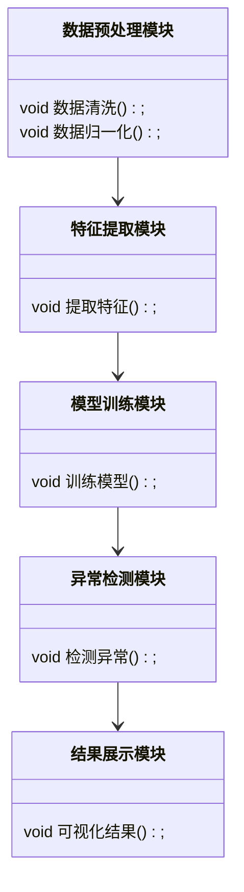
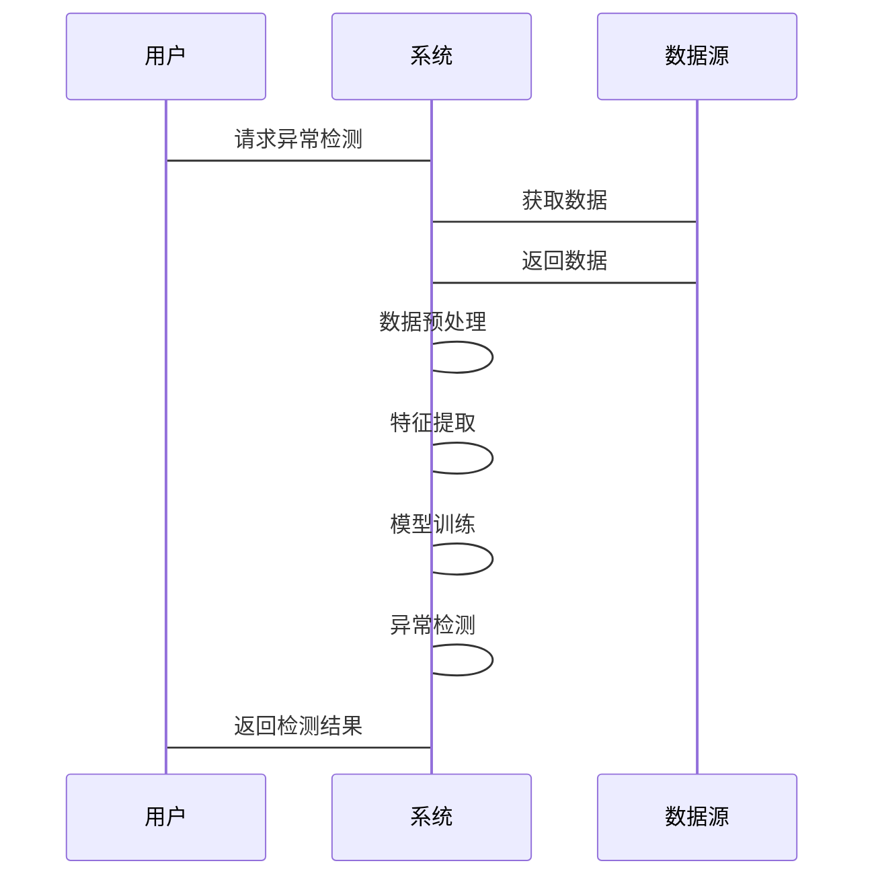

                 


# 开发智能化的金融时序数据异常模式识别模型

## 关键词：金融时序数据，异常模式识别，人工智能，深度学习，模型开发

## 摘要：  
金融时序数据的异常模式识别对于金融市场的稳定运行和风险控制具有重要意义。本文系统地介绍了如何开发智能化的金融时序数据异常模式识别模型，涵盖了背景分析、算法原理、系统架构设计、项目实战以及最佳实践等多个方面。通过结合传统的统计方法和现代的深度学习技术，本文提出了一种高效的异常检测方案，并通过实际案例展示了模型的应用效果。

---

# 第一部分：金融时序数据异常模式识别背景与概念

## 第1章：金融时序数据与异常模式识别概述

### 1.1 金融时序数据的基本概念  
金融时序数据是指金融市场中随着时间变化的数值型数据，例如股票价格、汇率、指数等。这类数据具有以下特征：  
1. **连续性**：数据点之间具有连续的时间关系。  
2. **周期性**：数据往往表现出日、周、月等周期性波动。  
3. **复杂性**：受多种因素（如经济指标、政策变化、市场情绪等）影响，数据模式复杂。  

### 1.2 异常模式识别的重要性  
异常模式识别在金融领域具有重要意义，主要体现在以下几点：  
1. **风险控制**：及时发现异常交易或市场波动，有助于防范金融风险。  
2. **投资决策**：通过识别异常模式，投资者可以做出更明智的投资决策。  
3. **合规性**：异常交易检测是金融监管的重要手段之一。  

### 1.3 智能化金融异常模式识别模型的背景  
随着人工智能技术的快速发展，传统的基于统计的异常检测方法逐渐暴露出局限性，例如对复杂模式的捕捉能力不足。而深度学习等技术的引入，为金融异常模式识别提供了新的可能性。

---

## 第2章：核心概念与联系  

### 2.1 金融时序数据的特征分析  
金融时序数据的特征可以通过以下维度进行分析：  
- **连续性**：数据点之间具有时间连续性。  
- **波动性**：数据点之间存在显著的波动，反映市场的不确定性和风险。  
- **关联性**：不同金融资产之间可能存在相关性，例如股票和指数的相关性较高。  

### 2.2 异常模式的分类与特征  
异常模式可以分为以下几类：  
1. **点异常（Outlier）**：单个数据点显著偏离正常值范围。  
2. **趋势异常（Trend Outlier）**：数据点的长期趋势偏离正常模式。  
3. **分布异常（Distribution Outlier）**：数据分布的整体形状发生显著变化。  

### 2.3 异常模式识别的核心要素  
1. **数据预处理**：包括数据清洗、标准化等步骤。  
2. **特征提取**：提取有助于模型识别异常的关键特征。  
3. **模型训练与评估**：选择合适的算法并进行模型训练和验证。  

### 2.4 核心概念的对比分析  
以下表格对比了不同异常类型的特点：  

| 异常类型   | 特点描述                          | 示例场景               |
|------------|-----------------------------------|------------------------|
| 点异常     | 单个数据点显著偏离正常值范围      | 某一时点的股票价格突变 |
| 趋势异常    | 数据点的长期趋势偏离正常模式      | 股票价格持续上涨或下跌 |
| 分布异常    | 数据分布的整体形状发生显著变化    | 市场波动加剧或突然降低 |

### 2.5 ER实体关系图  
以下是一个简单的ER实体关系图，展示了金融数据和异常模式之间的关系：  

```mermaid
er
    title 实体关系图
    金融数据
        --> 时间戳: 1..n
        --> 数据值: 1..n
    异常模式
        --> 异常类型: 1..n
        --> 异常时间点: 1..n
```

---

# 第二部分：异常模式识别的算法原理  

## 第3章：异常模式识别的算法原理  

### 3.1 常见的异常检测算法  
1. **基于统计的方法**：如Z-score、LOF（局部 outlier factor）等。  
2. **基于机器学习的方法**：如Isolation Forest、One-Class SVM等。  
3. **基于深度学习的方法**：如LSTM、GRU等。  

### 3.2 基于ARIMA的异常检测  

#### 3.2.1 ARIMA模型的原理  
ARIMA（自回归积分滑动平均模型）是一种广泛应用于时间序列预测的模型，其数学公式如下：  
$$ ARIMA(p, d, q) $$  
其中：  
- $p$：自回归（AR）的阶数，表示过去的p个值对当前值的影响。  
- $d$：差分的阶数，用于将非平稳序列转化为平稳序列。  
- $q$：移动平均（MA）的阶数，表示过去的q个误差项对当前值的影响。  

#### 3.2.2 ARIMA模型的实现步骤  
1. 数据预处理：对原始数据进行差分，使其平稳。  
2. 模型参数选择：通过网格搜索等方法选择最优的p、d、q值。  
3. 模型训练与预测：基于训练数据训练模型，并预测未来的时间序列值。  
4. 异常检测：将实际值与预测值进行比较，判断是否存在显著偏差。  

#### 3.2.3 ARIMA模型的优缺点  
- 优点：适合处理线性时间序列数据，模型简单且易于实现。  
- 缺点：对非线性数据的捕捉能力有限，且对参数的选择敏感。  

### 3.3 基于LSTM的异常检测  

#### 3.3.1 LSTM模型的原理  
LSTM（长短期记忆网络）是一种特殊的RNN（循环神经网络），能够有效捕捉时间序列中的长期依赖关系。其核心组件包括：  
- **输入门（Input Gate）**：控制当前输入的信息是否需要被存储。  
- **遗忘门（Forget Gate）**：决定哪些长期信息需要被遗忘。  
- **输出门（Output Gate）**：决定输出的信息内容。  

#### 3.3.2 LSTM模型的实现步骤  
1. 数据预处理：对原始数据进行归一化处理。  
2. 构建LSTM模型：定义模型的结构，包括输入层、LSTM层、全连接层和输出层。  
3. 模型训练：使用训练数据对模型进行训练，并计算损失函数（如均方误差）。  
4. 模型预测：基于训练好的模型预测未来的时间序列值。  
5. 异常检测：将实际值与预测值进行比较，判断是否存在显著偏差。  

#### 3.3.3 LSTM模型的优缺点  
- 优点：能够捕捉时间序列中的复杂模式，尤其是长期依赖关系。  
- 缺点：模型复杂度较高，训练时间较长，且对超参数的选择敏感。  

### 3.4 基于Isolation Forest的异常检测  

#### 3.4.1 Isolation Forest模型的原理  
Isolation Forest是一种基于树结构的异常检测算法，通过构建随机树将数据进行隔离，从而识别异常点。其核心思想是：异常点更容易被单独隔离。  

#### 3.4.2 Isolation Forest模型的实现步骤  
1. 数据预处理：对原始数据进行标准化处理。  
2. 模型训练：使用训练数据训练Isolation Forest模型。  
3. 异常检测：对测试数据进行预测，输出异常概率分数。  

#### 3.4.3 Isolation Forest模型的优缺点  
- 优点：适合处理高维数据，且对异常点的检测效果较好。  
- 缺点：对正常数据的区分能力有限，且对数据分布的变化较为敏感。  

---

## 第4章：算法的数学模型与公式  

### 4.1 ARIMA模型的数学公式  
$$ ARIMA(p, d, q) $$  
其递推公式为：  
$$ y_t = \phi_1 y_{t-1} + \phi_2 y_{t-2} + \dots + \phi_p y_{t-p} + \theta_1 \epsilon_{t-1} + \theta_2 \epsilon_{t-2} + \dots + \theta_q \epsilon_{t-q} + \epsilon_t $$  

### 4.2 LSTM模型的数学公式  
LSTM的三个门控机制：  
1. 遗忘门：$$ f_t = \sigma(w_f \cdot [h_{t-1}, x_t] + b_f) $$  
2. 输入门：$$ i_t = \sigma(w_i \cdot [h_{t-1}, x_t] + b_i) $$  
3. 输出门：$$ o_t = \sigma(w_o \cdot [h_{t-1}, x_t] + b_o) $$  

隐藏状态更新：  
$$ c_t = f_t \cdot c_{t-1} + i_t \cdot tanh(w_c \cdot [h_{t-1}, x_t] + b_c) $$  
$$ h_t = o_t \cdot tanh(c_t) $$  

### 4.3 Isolation Forest模型的数学公式  
Isolation Forest通过构建随机树，将数据点划分为不同的区域。异常概率的计算基于数据点在树中的路径长度。  

---

# 第三部分：系统分析与架构设计  

## 第5章：系统分析与架构设计  

### 5.1 问题场景介绍  
在金融领域，异常模式识别的主要场景包括：  
1. **实时监控**：实时检测金融市场的异常波动。  
2. **历史数据分析**：分析历史数据，识别潜在的异常模式。  
3. **风险预警**：基于异常检测结果，发出风险预警信号。  

### 5.2 系统功能设计  
1. **数据预处理模块**：对原始数据进行清洗、归一化等处理。  
2. **特征提取模块**：提取有助于异常检测的关键特征。  
3. **模型训练模块**：训练异常检测模型（如LSTM、Isolation Forest）。  
4. **异常检测模块**：基于训练好的模型，实时检测异常模式。  
5. **结果展示模块**：可视化异常检测结果，便于用户理解和分析。  

### 5.3 系统架构设计  

#### 5.3.1 功能模块类图  


#### 5.3.2 系统架构图  


---

## 第6章：系统接口设计与交互  

### 6.1 系统接口设计  
1. **数据输入接口**：接收原始金融时序数据。  
2. **模型训练接口**：训练异常检测模型，并保存模型参数。  
3. **异常检测接口**：接收实时数据，返回异常检测结果。  

### 6.2 系统交互序列图  


---

# 第四部分：项目实战  

## 第7章：项目实战  

### 7.1 环境安装  
1. **安装Python**：建议使用Python 3.8及以上版本。  
2. **安装依赖库**：包括numpy、pandas、keras、tensorflow等。  

### 7.2 核心代码实现  

#### 7.2.1 数据预处理  
```python
import numpy as np
import pandas as pd

# 读取数据
data = pd.read_csv('financial_data.csv')

# 数据归一化
from sklearn.preprocessing import MinMaxScaler
scaler = MinMaxScaler()
data_scaled = scaler.fit_transform(data)
```

#### 7.2.2 LSTM模型实现  
```python
from tensorflow.keras.models import Sequential
from tensorflow.keras.layers import LSTM, Dense

# 构建LSTM模型
model = Sequential()
model.add(LSTM(64, input_shape=(timesteps, features)))
model.add(Dense(1))
model.compile(loss='mean_squared_error', optimizer='adam')

# 训练模型
model.fit(x_train, y_train, epochs=100, batch_size=32)
```

#### 7.2.3 异常检测与可视化  
```python
# 预测异常值
y_pred = model.predict(x_test)

# 可视化结果
import matplotlib.pyplot as plt
plt.plot(y_test, label='True')
plt.plot(y_pred, label='Predicted')
plt.legend()
plt.show()
```

### 7.3 实际案例分析  
以某股票价格数据为例，使用LSTM模型进行异常检测。首先，对数据进行归一化处理，然后训练模型，最后将预测结果与实际值进行对比，判断是否存在显著偏差。

---

## 第8章：项目总结与优化方向  

### 8.1 项目总结  
通过本项目，我们成功开发了一个基于深度学习的金融时序数据异常模式识别模型，能够有效识别股票价格中的异常波动。  

### 8.2 优化方向  
1. **模型优化**：尝试使用更复杂的模型结构（如Transformer）进行优化。  
2. **数据增强**：引入更多的数据源（如新闻、社交媒体数据）进行特征提取。  
3. **实时性优化**：优化模型的推理速度，使其适用于实时检测场景。  

---

# 第五部分：最佳实践  

## 第9章：最佳实践  

### 9.1 小结  
智能化的金融时序数据异常模式识别模型开发需要结合理论与实践，通过不断优化算法和系统架构，才能实现高效、准确的异常检测。  

### 9.2 注意事项  
1. 数据预处理是关键，必须确保数据的准确性和完整性。  
2. 模型选择需要根据具体场景进行调整，避免盲目追求模型复杂度。  
3. 系统架构设计要注重可扩展性和可维护性。  

### 9.3 拓展阅读  
1. **书籍推荐**：《Python机器学习实战》、《深度学习入门：基于Python》。  
2. **论文推荐**：相关领域的最新研究论文，如《Time series forecasting using LSTM recurrent neural networks》。  

---

# 结论与展望  

## 结论  
本文系统地介绍了开发智能化的金融时序数据异常模式识别模型的全过程，包括背景分析、算法原理、系统架构设计、项目实战以及最佳实践。通过结合传统统计方法和现代深度学习技术，本文提出了一种高效的异常检测方案，并通过实际案例展示了模型的应用效果。  

## 展望  
未来，随着人工智能技术的不断发展，金融时序数据异常模式识别将更加智能化和自动化。研究者可以进一步探索更复杂的模型结构（如Transformer）和更高效的数据处理方法，以应对更加复杂的金融场景挑战。

---

# 作者：AI天才研究院/AI Genius Institute & 禅与计算机程序设计艺术/Zen And The Art of Computer Programming

---

**感谢您的阅读！如果本文对您有所帮助，欢迎关注我的技术博客，获取更多关于人工智能与金融技术的深度解析。**

