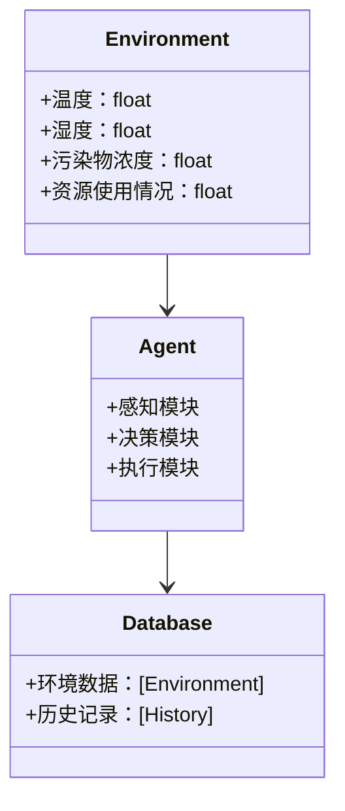
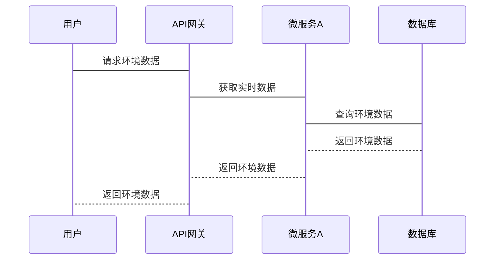

                 


# 构建AI Agent驱动的智能环境保护系统

## 关键词：AI Agent, 智能环境保护, 人工智能, 机器学习, 环境监测

## 摘要：本文详细探讨了如何利用AI Agent构建智能环境保护系统。从AI Agent的基本概念到其在环境保护中的应用，分析了系统架构、算法原理和项目实战，展示了如何通过智能化手段解决环境问题。

---

# 第一部分: AI Agent与环境保护概述

## 第1章: AI Agent驱动的智能环境保护系统概述

### 1.1 AI Agent的基本概念与特点

#### 1.1.1 AI Agent的定义
AI Agent（人工智能代理）是一种能够感知环境、自主决策并执行任务的智能实体。它能够通过传感器获取信息，利用算法处理数据，并通过执行器与环境交互。

#### 1.1.2 AI Agent的核心特点
- **自主性**：能够在没有外部干预的情况下运行。
- **反应性**：能够实时感知环境变化并做出反应。
- **学习能力**：能够通过经验改进性能。
- **协作性**：能够与其他Agent或系统协同工作。

#### 1.1.3 AI Agent与传统自动化的区别
传统自动化基于固定的规则和程序，而AI Agent具备学习和适应能力，能够处理复杂和动态的环境。

### 1.2 环境保护的智能化需求

#### 1.2.1 环境保护面临的挑战
- **气候变化**：全球变暖导致极端天气频发。
- **污染问题**：空气、水和土壤污染严重。
- **资源枯竭**：不可再生资源的过度使用。

#### 1.2.2 智能化环境保护的必要性
传统的环境保护方法效率低下，难以应对复杂的环境问题。AI Agent能够通过实时监测和智能决策，提高环境保护的效率和效果。

#### 1.2.3 AI Agent在环境保护中的应用前景
AI Agent可以在环境监测、污染控制、资源管理等领域发挥重要作用，帮助实现环境保护的智能化和高效化。

### 1.3 本章小结
本章介绍了AI Agent的基本概念和特点，分析了环境保护面临的挑战和智能化需求，探讨了AI Agent在环境保护中的应用前景。

---

# 第二部分: AI Agent的核心技术基础

## 第2章: 人工智能与机器学习基础

### 2.1 人工智能的基本概念

#### 2.1.1 人工智能的定义与特点
人工智能是模拟人类智能的理论、方法、技术和应用的总称，具备学习、推理、规划等能力。

#### 2.1.2 人工智能的核心技术
- **机器学习**：通过数据训练模型。
- **自然语言处理**：处理人类语言。
- **计算机视觉**：处理图像和视频。

### 2.2 机器学习基础

#### 2.2.1 机器学习的定义与分类
机器学习是通过数据训练模型，使其能够进行预测或分类。主要分类包括监督学习、无监督学习和强化学习。

#### 2.2.2 监督学习、无监督学习与强化学习

- **监督学习**：基于标记数据进行训练。
- **无监督学习**：基于未标记数据进行聚类。
- **强化学习**：通过试错学习，优化决策策略。

#### 2.2.3 常见机器学习算法简介
- **线性回归**：用于预测连续值。
- **支持向量机**：用于分类和回归。
- **随机森林**：用于分类和回归。

### 2.3 自然语言处理与计算机视觉

#### 2.3.1 自然语言处理的基本概念
NLP用于处理和理解人类语言，常见任务包括文本分类、实体识别和机器翻译。

#### 2.3.2 计算机视觉的基本概念
CV用于处理和理解图像和视频，常见任务包括图像识别和目标检测。

#### 2.3.3 NLP与CV在环境保护中的应用
- **环境文本分析**：分析环境报告和文献。
- **图像识别**：识别环境中的污染源和生态问题。

---

## 第3章: AI Agent的核心原理

### 3.1 AI Agent的感知机制

#### 3.1.1 感知的定义与作用
感知是AI Agent获取环境信息的能力，包括数据采集和特征提取。

#### 3.1.2 常见的感知技术
- **传感器**：获取环境数据。
- **摄像头**：获取图像和视频数据。

#### 3.1.3 感知在环境保护中的应用
- **环境监测**：实时监测空气质量、水质等。

### 3.2 AI Agent的决策机制

#### 3.2.1 决策的定义与作用
决策是AI Agent根据感知信息做出的选择，包括策略选择和风险评估。

#### 3.2.2 常见的决策算法
- **基于规则的决策**：根据预定义规则做出决策。
- **基于机器学习的决策**：利用模型预测最优决策。

#### 3.2.3 决策在环境保护中的应用
- **污染控制**：优化污染治理策略。
- **资源管理**：优化能源和资源分配。

### 3.3 AI Agent的执行机制

#### 3.3.1 执行的定义与作用
执行是AI Agent将决策转化为实际行动的过程，包括动作执行和反馈收集。

#### 3.3.2 常见的执行方式
- **执行器**：执行物理动作。
- **接口**：与外部系统交互。

#### 3.3.3 执行在环境保护中的应用
- **环境修复**：执行污染治理任务。
- **资源优化**：优化能源使用。

---

## 第4章: AI Agent的算法原理

### 4.1 强化学习算法

#### 4.1.1 强化学习的基本概念
强化学习是一种通过试错学习，优化决策策略的方法，常用于复杂环境中的决策问题。

#### 4.1.2 Q-learning算法
Q-learning是一种经典的强化学习算法，通过更新Q值表来学习最优策略。

#### 4.1.3 Deep Q-Network算法
Deep Q-Network结合深度学习和强化学习，利用神经网络近似Q值函数。

#### 4.1.4 强化学习在环境保护中的应用
- **环境监测**：优化传感器部署策略。
- **污染控制**：优化污染治理方案。

### 4.2 图神经网络算法

#### 4.2.1 图神经网络的基本概念
图神经网络是一种处理图结构数据的深度学习方法，常用于复杂关系的建模。

#### 4.2.2 图卷积网络（GCN）算法
GCN通过聚合节点及其邻居的信息，进行特征传播和卷积操作。

#### 4.2.3 图注意力网络（GAT）算法
GAT通过注意力机制，关注重要的邻居节点，提高模型性能。

#### 4.2.5 图神经网络在环境保护中的应用
- **生态网络分析**：分析生态系统的结构和功能。
- **污染扩散预测**：预测污染物的扩散路径。

### 4.3 算法原理的数学模型与公式

#### 4.3.1 强化学习的数学模型
$$ Q(s, a) = r + \gamma \max_{a'} Q(s', a') $$
其中，$Q(s, a)$表示状态s和动作a的Q值，$r$是奖励，$\gamma$是折扣因子。

#### 4.3.2 图神经网络的数学模型
$$ Z = \sigma(W_Z X + B_Z) $$
$$ G(Z) = \text{softmax}(W_G Z + B_G) $$
其中，$X$是输入特征，$W_Z$和$B_Z$是参数，$\sigma$是激活函数，$W_G$和$B_G$是参数，$\text{softmax}$是 softmax 函数。

---

## 第5章: 系统分析与架构设计方案

### 5.1 问题场景介绍

#### 5.1.1 问题背景
环境保护问题复杂，涉及多个领域和动态变化的环境条件。

#### 5.1.2 问题描述
构建一个智能化的环境保护系统，能够实时监测环境数据，优化治理策略。

#### 5.1.3 问题解决
通过AI Agent技术，实现环境监测、污染控制和资源优化。

### 5.2 系统功能设计

#### 5.2.1 领域模型设计
使用Mermaid绘制领域模型类图，展示系统的功能模块和实体关系。



### 5.3 系统架构设计

#### 5.3.1 系统架构图
使用Mermaid绘制系统架构图，展示系统的各个组件及其关系。


### 5.4 系统接口设计

#### 5.4.1 接口描述
系统提供RESTful API，用于数据获取、任务提交和结果反馈。

### 5.5 系统交互设计

#### 5.5.1 交互流程图
使用Mermaid绘制系统交互序列图，展示用户与系统之间的交互流程。



---

## 第6章: 项目实战

### 6.1 环境安装

#### 6.1.1 安装Python
安装Python 3.8以上版本。

#### 6.1.2 安装依赖
安装必要的库，如TensorFlow、Keras、Scikit-learn等。

#### 6.1.3 安装框架
安装强化学习框架，如OpenAI Gym。

### 6.2 系统核心实现源代码

#### 6.2.1 强化学习实现

```python
import gym
from gym import spaces
from gym.utils import seeding

class Env(gym.Env):
    def __init__(self):
        self.action_space = spaces.Discrete(2)
        self.observation_space = spaces.Box(low=0, high=1, shape=(1,))
        self.reset()

    def reset(self):
        self.state = 0.5
        return self.state

    def step(self, action):
        if action == 0:
            self.state += 0.1
        else:
            self.state -= 0.1
        reward = 1.0 if self.state < 0.6 else -1.0
        done = self.state <= 0.4 or self.state >= 0.6
        return self.state, reward, done, {}

    def render(self, mode='human'):
        pass
```

#### 6.2.2 图神经网络实现

```python
import torch
import torch.nn as nn
import torch.nn.functional as F

class GCN(nn.Module):
    def __init__(self, input_dim, hidden_dim, output_dim):
        super(GCN, self).__init__()
        self.conv1 = nn.Conv2d(input_dim, hidden_dim, kernel_size=1)
        self.conv2 = nn.Conv2d(hidden_dim, output_dim, kernel_size=1)

    def forward(self, x, adj):
        x = F.relu(self.conv1(x))
        x = x.view(-1, x.size(-1))
        x = torch.mm(adj, x)
        x = F.relu(self.conv2(x))
        return x
```

### 6.3 代码应用解读与分析

#### 6.3.1 强化学习代码解读
上述代码定义了一个强化学习环境，包括状态空间、动作空间和奖励机制。环境状态为一个连续值，动作空间为两个离散动作，奖励根据状态变化计算。

#### 6.3.2 图神经网络代码解读
上述代码定义了一个图卷积网络，包括两个卷积层，用于处理图结构数据。第一个卷积层提取特征，第二个卷积层生成输出。

### 6.4 实际案例分析

#### 6.4.1 案例背景
假设需要优化一个城市的空气质量监测系统，通过AI Agent实时调整监测点位置和频率。

#### 6.4.2 案例分析
通过强化学习算法，优化监测点的部署策略，提高监测精度和效率。

### 6.5 项目小结
本章通过实际案例展示了AI Agent在环境保护中的应用，详细讲解了系统的实现和代码，帮助读者理解如何将理论应用于实践。

---

## 第7章: 最佳实践与小结

### 7.1 最佳实践

#### 7.1.1 模型可解释性
确保模型的决策过程透明，便于分析和优化。

#### 7.1.2 数据隐私
保护环境数据的隐私和安全，避免数据泄露。

#### 7.1.3 多Agent协作
在复杂的环境中，多Agent协作能够提高系统的整体性能。

#### 7.1.4 系统实时性
确保系统的实时响应能力，适应动态变化的环境。

#### 7.1.5 模型更新
定期更新模型，适应环境的变化和新的数据。

### 7.2 小结
本文详细探讨了AI Agent在智能环境保护系统中的应用，从理论基础到实际实现，展示了如何通过智能化手段解决复杂的环境问题。

### 7.3 注意事项

#### 7.3.1 数据质量
确保环境数据的准确性和完整性，避免数据偏差。

#### 7.3.2 系统稳定性
确保系统的稳定运行，避免因故障导致环境监测中断。

#### 7.3.3 伦理问题
在应用AI Agent时，需考虑伦理问题，确保技术应用符合社会规范。

### 7.4 拓展阅读
建议读者进一步阅读相关领域的书籍和论文，深入理解AI Agent和环境保护的结合应用。

---

## 作者

**作者：AI天才研究院/AI Genius Institute & 禅与计算机程序设计艺术 /Zen And The Art of Computer Programming**

---

通过以上结构化和详细的内容，您可以逐步构建出一篇关于《构建AI Agent驱动的智能环境保护系统》的专业技术博客文章。

