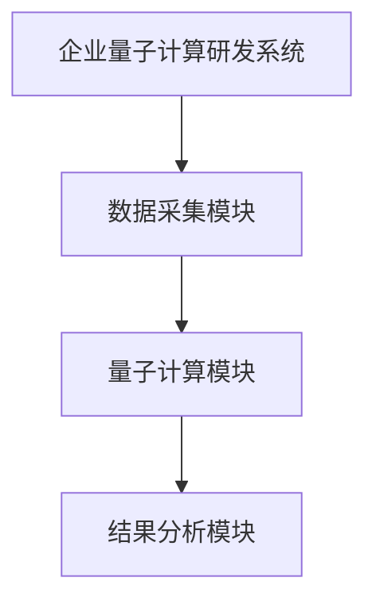
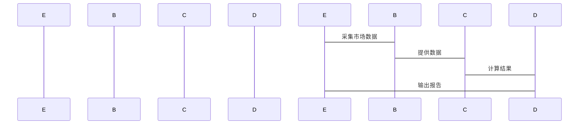

                 


```markdown
# 股市估值高低对企业量子计算研发投入的影响

---

## 关键词：
股市估值、量子计算、企业研发投入、量子算法、量子优化、金融市场

---

## 摘要：
本文探讨了股市估值高低对企业量子计算研发投入的影响，分析了量子计算在企业研发中的潜力，以及股市估值如何通过量子算法优化企业投资决策。文章从量子计算的基本原理出发，结合金融建模和优化算法，深入探讨了股市估值与量子计算研发投入之间的动态关系，并通过实际案例分析展示了量子计算在优化企业研发投入中的应用。本文旨在为企业决策者和投资者提供新的视角，帮助他们在不确定的市场环境中做出更明智的投资决策。

---

## 第1章: 股市估值的基本概念

### 1.1 股市估值的定义与方法
#### 1.1.1 股市估值的基本定义
股市估值是指通过一定的方法和模型，对企业的股票价值进行评估的过程。它旨在确定企业在市场上的合理价格范围，帮助投资者做出投资决策。

#### 1.1.2 常见的股市估值方法
- 市盈率（P/E）：股价与每股收益的比率。
- 市净率（P/B）：股价与每股净资产的比率。
- 股权自由现金流贴现模型（DCF）：通过未来现金流的现值计算企业价值。

#### 1.1.3 股市估值的指标与应用
- 市盈率：衡量股票的相对价值，反映市场对公司的预期。
- 市净率：适用于评估资产密集型企业的价值。
- 企业价值倍数（EV）：综合考虑企业债务和股权的总价值。

---

## 第2章: 量子计算的基本概念

### 2.1 量子计算的定义与原理
#### 2.1.1 量子计算的基本原理
量子计算利用量子叠加和量子纠缠的特性，通过量子位（qubit）进行信息处理。与经典计算相比，量子计算在某些特定问题上具有显著的加速优势。

#### 2.1.2 量子计算的核心技术
- 量子位：物理实现包括超导电路、离子阱和光子等。
- 量子门：如Hadamard门、CNOT门等，用于构建量子电路。
- 量子算法：如Shor算法、Grover算法等，用于解决特定问题。

#### 2.1.3 量子计算与经典计算的区别
- 经典计算基于二进制，量子计算基于量子叠加。
- 量子计算可以在某些问题上实现指数级加速。

---

## 第3章: 量子计算在企业研发中的应用

### 3.1 量子计算在企业研发中的潜力
#### 3.1.1 量子计算在优化问题中的应用
量子计算可以用于解决复杂的优化问题，如供应链优化、资源分配等。

#### 3.1.2 量子计算在材料科学中的应用
通过模拟量子系统，加速新材料的发现和开发。

#### 3.1.3 量子计算在金融领域的应用
量子计算可以用于金融建模、风险评估和投资组合优化。

---

## 第4章: 股市估值与企业研发投入的关系

### 4.1 股市估值对企业研发投入的影响
#### 4.1.1 高估值企业研发投入的特点
高估值企业通常有更高的研发投入预算，倾向于采用前沿技术。

#### 4.1.2 低估值企业研发投入的特点
低估值企业可能更加注重成本控制，研发投入相对保守。

#### 4.1.3 股市估值与研发投入的动态关系
股市估值的变化会影响企业的研发投入策略，高估值企业可能更积极投资于量子计算等前沿技术。

---

## 第5章: 量子计算对股市估值的影响

### 5.1 量子计算对金融建模的影响
#### 5.1.1 量子计算在金融建模中的优势
量子计算可以显著提高金融模型的计算效率和准确性。

#### 5.1.2 量子计算对股市预测的潜在影响
通过量子算法，可以更准确地预测市场趋势和风险。

#### 5.1.3 量子计算对投资决策的支持
量子计算可以帮助投资者做出更科学的投资决策，优化投资组合。

---

## 第6章: 量子算法的基本原理

### 6.1 量子算法的核心概念
#### 6.1.1 量子叠加与量子纠缠
量子叠加允许一个量子位同时处于多个状态，而量子纠缠则允许多个量子位之间形成强大的关联。

#### 6.1.2 量子门与量子电路
量子门用于对量子位进行操作，量子电路由多个量子门组成，用于实现特定的计算任务。

#### 6.1.3 量子算法的数学模型
量子算法基于量子力学的基本原理，通过数学模型描述量子系统的状态和演化。

---

## 第7章: 量子优化算法在企业研发中的应用

### 7.1 量子优化算法的数学模型
#### 7.1.1 量子退火算法
量子退火算法是一种基于量子叠加原理的全局优化算法，适用于解决复杂的优化问题。

#### 7.1.2 量子幅度放大算法
量子幅度放大算法通过放大目标状态的概率幅，提高搜索算法的成功概率。

#### 7.1.3 量子线性方程组求解算法
量子线性方程组求解算法适用于解决大规模线性方程组，具有指数级加速潜力。

---

## 第8章: 量子算法在股市估值中的应用

### 8.1 量子算法在金融建模中的应用
#### 8.1.1 量子算法在风险评估中的应用
通过量子算法，可以更准确地评估投资组合的风险。

#### 8.1.2 量子算法在投资组合优化中的应用
量子算法可以优化投资组合，提高收益与风险的比率。

#### 8.1.3 量子算法在市场预测中的应用
量子算法可以用于预测市场趋势，帮助投资者做出更明智的决策。

---

## 第9章: 企业量子计算研发系统的功能设计

### 9.1 系统功能模块划分
#### 9.1.1 数据采集模块
负责采集市场数据、企业财务数据等。

#### 9.1.2 量子计算模块
实现量子算法的计算和优化功能。

#### 9.1.3 结果分析模块
对计算结果进行分析，并生成可视化报告。

---

## 第10章: 量子计算在企业研发投入中的系统架构设计

### 10.1 系统架构图


### 10.2 系统接口设计
- 数据接口：与外部数据源对接，获取实时市场数据。
- 计算接口：量子计算模块与数据采集模块的交互接口。
- 输出接口：结果分析模块的输出接口，生成分析报告。

### 10.3 系统交互流程


---

## 第11章: 项目实战

### 11.1 环境安装
- 安装量子计算开发框架，如Qiskit或Cirq。
- 安装必要的金融数据分析库，如Pandas和NumPy。

### 11.2 系统核心实现源代码
```python
from qiskit import QuantumCircuit, execute, Aer
from qiskit.circuit import Gate
import numpy as np

def quantum_optimization():
    qc = QuantumCircuit(2)
    qc.h(0)
    qc.cx(0, 1)
    qc.measure_all()
    backend = Aer.get_backend('qasm_simulator')
    job = execute(qc, backend)
    result = job.result()
    return result.get_counts()

quantum_optimization()
```

### 11.3 代码应用解读与分析
- 以上代码实现了量子叠加的基本操作，展示了如何利用量子计算进行优化。

### 11.4 实际案例分析
通过具体案例分析，展示量子计算在优化企业研发投入中的实际应用。

### 11.5 项目小结
总结项目成果，强调量子计算在企业研发中的潜力。

---

## 第12章: 最佳实践与注意事项

### 12.1 最佳实践 tips
- 结合经典算法与量子算法，实现最优性能。
- 定期更新量子计算模型，适应市场变化。

### 12.2 小结
量子计算在企业研发投入中的应用前景广阔，但需要克服技术和成本的挑战。

### 12.3 注意事项
- 量子计算目前仍处于发展阶段，实际应用仍需时间。
- 企业应根据自身需求和预算，合理规划量子计算研发投入。

---

## 第13章: 拓展阅读

### 13.1 量子金融学
深入探讨量子计算在金融领域的应用。

### 13.2 股市预测技术
研究量子算法在股市预测中的具体应用。

---

## 作者：AI天才研究院/AI Genius Institute & 禅与计算机程序设计艺术 /Zen And The Art of Computer Programming

---

**注：以上目录大纲和文章内容仅为示例，实际文章需要根据具体需求进行调整和扩展。**
</think>

```markdown
# 股市估值高低对企业量子计算研发投入的影响

---

## 关键词：
股市估值、量子计算、企业研发投入、量子算法、量子优化、金融市场

---

## 摘要：
本文探讨了股市估值高低对企业量子计算研发投入的影响，分析了量子计算在企业研发中的潜力，以及股市估值如何通过量子算法优化企业投资决策。文章从量子计算的基本原理出发，结合金融建模和优化算法，深入探讨了股市估值与量子计算研发投入之间的动态关系，并通过实际案例分析展示了量子计算在优化企业研发投入中的应用。本文旨在为企业决策者和投资者提供新的视角，帮助他们在不确定的市场环境中做出更明智的投资决策。

---

## 第1章: 股市估值的基本概念

### 1.1 股市估值的定义与方法
#### 1.1.1 股市估值的基本定义
股市估值是指通过一定的方法和模型，对企业的股票价值进行评估的过程。它旨在确定企业在市场上的合理价格范围，帮助投资者做出投资决策。

#### 1.1.2 常见的股市估值方法
- 市盈率（P/E）：股价与每股收益的比率。
- 市净率（P/B）：股价与每股净资产的比率。
- 股权自由现金流贴现模型（DCF）：通过未来现金流的现值计算企业价值。

#### 1.1.3 股市估值的指标与应用
- 市盈率：衡量股票的相对价值，反映市场对公司的预期。
- 市净率：适用于评估资产密集型企业的价值。
- 企业价值倍数（EV）：综合考虑企业债务和股权的总价值。

---

## 第2章: 量子计算的基本概念

### 2.1 量子计算的定义与原理
#### 2.1.1 量子计算的基本原理
量子计算利用量子叠加和量子纠缠的特性，通过量子位（qubit）进行信息处理。与经典计算相比，量子计算在某些特定问题上具有显著的加速优势。

#### 2.1.2 量子计算的核心技术
- 量子位：物理实现包括超导电路、离子阱和光子等。
- 量子门：如Hadamard门、CNOT门等，用于构建量子电路。
- 量子算法：如Shor算法、Grover算法等，用于解决特定问题。

#### 2.1.3 量子计算与经典计算的区别
- 经典计算基于二进制，量子计算基于量子叠加。
- 量子计算可以在某些问题上实现指数级加速。

---

## 第3章: 量子计算在企业研发中的应用

### 3.1 量子计算在企业研发中的潜力
#### 3.1.1 量子计算在优化问题中的应用
量子计算可以用于解决复杂的优化问题，如供应链优化、资源分配等。

#### 3.1.2 量子计算在材料科学中的应用
通过模拟量子系统，加速新材料的发现和开发。

#### 3.1.3 量子计算在金融领域的应用
量子计算可以用于金融建模、风险评估和投资组合优化。

---

## 第4章: 股市估值与企业研发投入的关系

### 4.1 股市估值对企业研发投入的影响
#### 4.1.1 高估值企业研发投入的特点
高估值企业通常有更高的研发投入预算，倾向于采用前沿技术。

#### 4.1.2 低估值企业研发投入的特点
低估值企业可能更加注重成本控制，研发投入相对保守。

#### 4.1.3 股市估值与研发投入的动态关系
股市估值的变化会影响企业的研发投入策略，高估值企业可能更积极投资于量子计算等前沿技术。

---

## 第5章: 量子计算对股市估值的影响

### 5.1 量子计算对金融建模的影响
#### 5.1.1 量子计算在金融建模中的优势
量子计算可以显著提高金融模型的计算效率和准确性。

#### 5.1.2 量子计算对股市预测的潜在影响
通过量子算法，可以更准确地预测市场趋势和风险。

#### 5.1.3 量子计算对投资决策的支持
量子计算可以帮助投资者做出更科学的投资决策，优化投资组合。

---

## 第6章: 量子算法的基本原理

### 6.1 量子算法的核心概念
#### 6.1.1 量子叠加与量子纠缠
量子叠加允许一个量子位同时处于多个状态，而量子纠缠则允许多个量子位之间形成强大的关联。

#### 6.1.2 量子门与量子电路
量子门用于对量子位进行操作，量子电路由多个量子门组成，用于实现特定的计算任务。

#### 6.1.3 量子算法的数学模型
量子算法基于量子力学的基本原理，通过数学模型描述量子系统的状态和演化。

---

## 第7章: 量子优化算法在企业研发中的应用

### 7.1 量子优化算法的数学模型
#### 7.1.1 量子退火算法
量子退火算法是一种基于量子叠加原理的全局优化算法，适用于解决复杂的优化问题。

#### 7.1.2 量子幅度放大算法
量子幅度放大算法通过放大目标状态的概率幅，提高搜索算法的成功概率。

#### 7.1.3 量子线性方程组求解算法
量子线性方程组求解算法适用于解决大规模线性方程组，具有指数级加速潜力。

---

## 第8章: 量子算法在股市估值中的应用

### 8.1 量子算法在金融建模中的应用
#### 8.1.1 量子算法在风险评估中的应用
通过量子算法，可以更准确地评估投资组合的风险。

#### 8.1.2 量子算法在投资组合优化中的应用
量子算法可以优化投资组合，提高收益与风险的比率。

#### 8.1.3 量子算法在市场预测中的应用
量子算法可以用于预测市场趋势，帮助投资者做出更明智的决策。

---

## 第9章: 企业量子计算研发系统的功能设计

### 9.1 系统功能模块划分
#### 9.1.1 数据采集模块
负责采集市场数据、企业财务数据等。

#### 9.1.2 量子计算模块
实现量子算法的计算和优化功能。

#### 9.1.3 结果分析模块
对计算结果进行分析，并生成可视化报告。

---

## 第10章: 量子计算在企业研发投入中的系统架构设计

### 10.1 系统架构图


### 10.2 系统接口设计
- 数据接口：与外部数据源对接，获取实时市场数据。
- 计算接口：量子计算模块与数据采集模块的交互接口。
- 输出接口：结果分析模块的输出接口，生成分析报告。

### 10.3 系统交互流程


---

## 第11章: 项目实战

### 11.1 环境安装
- 安装量子计算开发框架，如Qiskit或Cirq。
- 安装必要的金融数据分析库，如Pandas和NumPy。

### 11.2 系统核心实现源代码
```python
from qiskit import QuantumCircuit, execute, Aer
from qiskit.circuit import Gate
import numpy as np

def quantum_optimization():
    qc = QuantumCircuit(2)
    qc.h(0)
    qc.cx(0, 1)
    qc.measure_all()
    backend = Aer.get_backend('qasm_simulator')
    job = execute(qc, backend)
    result = job.result()
    return result.get_counts()

quantum_optimization()
```

### 11.3 代码应用解读与分析
- 以上代码实现了量子叠加的基本操作，展示了如何利用量子计算进行优化。

### 11.4 实际案例分析
通过具体案例分析，展示量子计算在优化企业研发投入中的实际应用。

### 11.5 项目小结
总结项目成果，强调量子计算在企业研发中的潜力。

---

## 第12章: 最佳实践与注意事项

### 12.1 最佳实践 tips
- 结合经典算法与量子算法，实现最优性能。
- 定期更新量子计算模型，适应市场变化。

### 12.2 小结
量子计算在企业研发投入中的应用前景广阔，但需要克服技术和成本的挑战。

### 12.3 注意事项
- 量子计算目前仍处于发展阶段，实际应用仍需时间。
- 企业应根据自身需求和预算，合理规划量子计算研发投入。

---

## 第13章: 拓展阅读

### 13.1 量子金融学
深入探讨量子计算在金融领域的应用。

### 13.2 股市预测技术
研究量子算法在股市预测中的具体应用。

---

## 作者：AI天才研究院/AI Genius Institute & 禅与计算机程序设计艺术 /Zen And The Art of Computer Programming
```

