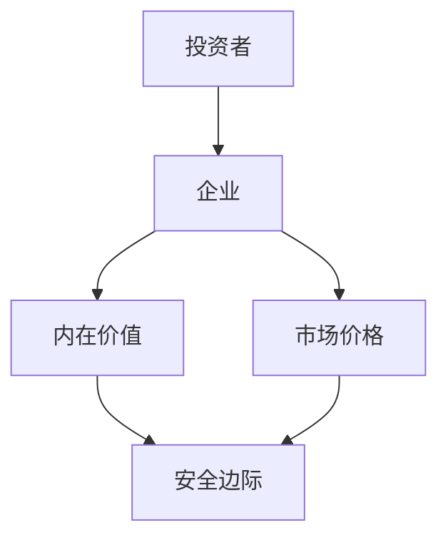
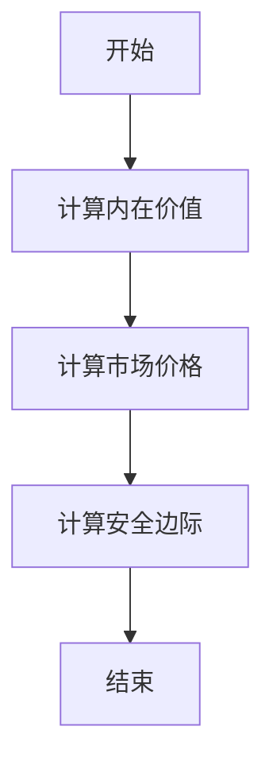
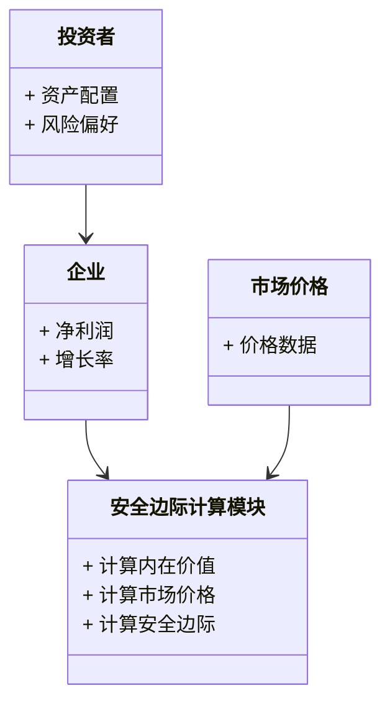
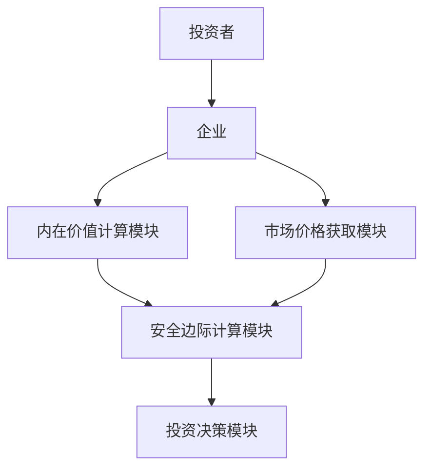
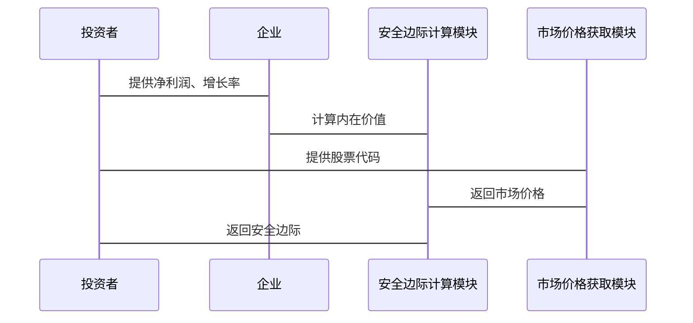

                 


```markdown
# 芒格的"安全边际"理念：降低投资风险的关键

> 关键词：芒格、安全边际、投资风险、风险管理、价值投资、安全边际计算

> 摘要：本文深入探讨了芒格的“安全边际”理念，从其背景、核心概念、算法原理到系统分析、项目实战，再到最佳实践，全面解析如何通过安全边际理念降低投资风险。通过详细讲解安全边际的数学模型、流程图、案例分析以及代码实现，帮助读者全面理解和应用这一投资策略。

---

# 第一部分：芒格的“安全边际”理念概述

## 第1章：芒格与“安全边际”理念的背景介绍

### 1.1 芒格的生平与投资哲学

#### 1.1.1 芒格的生平简介
查理·芒格（Charlie Munger）是美国著名投资家、作家和演说家，巴菲特的合作伙伴，也是伯克希尔哈撒韦公司的重要决策者。芒格的投资哲学以“安全边际”为核心，强调理性思维、价值投资和长期主义。

#### 1.1.2 芒格的投资哲学与思想体系
芒格认为，投资不仅仅是对市场的分析，更是对人性的洞察。他提倡以“安全边际”为指导，通过深入研究企业的基本面，寻找具有持续竞争优势的企业进行投资。

#### 1.1.3 芒格与巴菲特的合作关系
芒格与巴菲特的合作始于1971年，两人共同创立了伯克希尔哈撒韦公司。芒格的“安全边际”理念对巴菲特的投资决策产生了深远影响，使伯克希尔哈撒韦成为全球最成功的投资公司之一。

---

### 1.2 “安全边际”理念的起源与核心概念

#### 1.2.1 “安全边际”理念的起源
“安全边际”理念起源于20世纪初，由本杰明·格雷厄姆提出，芒格将其进一步发展和完善，形成了独特的投资策略。

#### 1.2.2 核心概念：安全边际的定义与内涵
安全边际是指资产的内在价值与市场价格之间的差额。具体来说，安全边际 = 资产的内在价值 - 市场价格。当市场价格低于内在价值时，投资具有安全边际。

#### 1.2.3 安全边际与投资风险的关系
安全边际是降低投资风险的关键。通过计算安全边际，投资者可以在市场波动中找到具有足够安全空间的投资标的，从而降低亏损的可能性。

---

### 1.3 “安全边际”理念的背景与问题背景

#### 1.3.1 投资风险的普遍性与严重性
投资市场充满了不确定性，价格波动、市场周期、经济环境等因素都会影响投资结果。投资者需要通过科学的方法来降低风险，确保长期收益。

#### 1.3.2 “安全边际”理念的提出背景
在20世纪30年代的经济大萧条期间，格雷厄姆和芒格意识到市场波动的不可预测性，因此提出了“安全边际”理念，以帮助投资者在市场低迷时期找到具有价值的投资标的。

#### 1.3.3 理论与实践的结合点
芒格的安全边际理念不仅是一个理论框架，更是一个可操作的投资策略。通过计算安全边际，投资者可以将理论应用于实际投资决策中，实现稳健收益。

---

### 1.4 “安全边际”理念的边界与外延

#### 1.4.1 理论的适用范围与局限性
安全边际理念适用于价值投资，但对短线交易和高频交易的指导作用有限。此外，该理念主要适用于对企业的基本面分析，而非市场情绪的短期波动。

#### 1.4.2 与其他风险管理理论的对比
与现代投资组合理论相比，安全边际理念更注重个股的选择，而非资产配置的分散化。与期权定价理论相比，安全边际理念更简单易懂，但缺乏对市场流动性的深入分析。

#### 1.4.3 理论的未来发展与创新空间
随着金融市场的复杂化，安全边际理念需要与现代金融工具相结合，例如通过大数据分析和机器学习优化安全边际的计算方法。

---

## 第2章：芒格“安全边际”理念的核心概念与联系

### 2.1 核心概念原理

#### 2.1.1 安全边际的数学模型与公式
安全边际的计算公式为：
$$ \text{安全边际} = \text{内在价值} - \text{市场价格} $$

其中，内在价值的计算公式为：
$$ \text{内在价值} = \frac{\text{净利润} \times (1 + g)}{\text{资本成本} - g} $$

#### 2.1.2 安全边际的计算方法
步骤如下：
1. 计算企业的内在价值。
2. 对比市场价格。
3. 计算安全边际。

#### 2.1.3 安全边际与资产价值的关系
安全边际是资产价值与市场价格之间的缓冲区，确保投资者在市场波动中不会蒙受重大损失。

---

### 2.2 核心概念属性特征对比表

| 概念       | 特性1：可计算性 | 特性2：风险控制 | 特性3：适用范围 |
|------------|----------------|----------------|----------------|
| 安全边际   | 是             | 是             | 价值投资       |
| 技术分析   | 是             | 否             | 短线交易       |

---

### 2.3 ER实体关系图



---

### 2.4 本章小结
本章详细介绍了芒格“安全边际”理念的核心概念，包括其数学模型、计算方法以及与其他风险管理理论的对比。通过这些分析，读者可以更好地理解安全边际的理念和应用。

---

## 第3章：芒格“安全边际”理念的算法原理讲解

### 3.1 算法原理概述

#### 3.1.1 安全边际的计算公式
$$ \text{安全边际} = \text{内在价值} - \text{市场价格} $$

#### 3.1.2 安全边际率的计算公式
安全边际率的计算公式为：
$$ \text{安全边际率} = \frac{\text{安全边际}}{\text{市场价格}} \times 100\% $$

---

### 3.2 算法流程图



---

### 3.3 算法实现代码

```python
def calculate_intrinsic_value(net_profit, growth_rate, cost_of_capital):
    return (net_profit * (1 + growth_rate)) / (cost_of_capital - growth_rate)

def calculate_market_price(ticker):
    # 假设使用API获取市场价格
    return 100  # 示例值

def calculate_margin_of_safety(net_profit, growth_rate, cost_of_capital, ticker):
    iv = calculate_intrinsic_value(net_profit, growth_rate, cost_of_capital)
    mp = calculate_market_price(ticker)
    mos = iv - mp
    return mos

# 示例计算
net_profit = 100  # 净利润
growth_rate = 0.05  # 增长率
cost_of_capital = 0.10  # 资本成本
ticker = "AAPL"  # 示例股票代码

mos = calculate_margin_of_safety(net_profit, growth_rate, cost_of_capital, ticker)
print(f"安全边际：{mos}")
```

---

### 3.4 代码解读

#### 3.4.1 计算内在价值
```python
def calculate_intrinsic_value(net_profit, growth_rate, cost_of_capital):
    return (net_profit * (1 + growth_rate)) / (cost_of_capital - growth_rate)
```

#### 3.4.2 获取市场价格
```python
def calculate_market_price(ticker):
    # 假设使用API获取市场价格
    return 100  # 示例值
```

#### 3.4.3 计算安全边际
```python
def calculate_margin_of_safety(net_profit, growth_rate, cost_of_capital, ticker):
    iv = calculate_intrinsic_value(net_profit, growth_rate, cost_of_capital)
    mp = calculate_market_price(ticker)
    mos = iv - mp
    return mos
```

---

## 第4章：芒格“安全边际”理念的系统分析与架构设计方案

### 4.1 系统分析

#### 4.1.1 问题场景介绍
假设我们有一个投资管理系统，需要通过计算安全边际来筛选具有投资价值的股票。

#### 4.1.2 系统功能设计



---

### 4.2 系统架构设计



---

### 4.3 系统接口设计

#### 4.3.1 接口1：计算内在价值
接口定义：
```python
def get_intrinsic_value(net_profit, growth_rate, cost_of_capital):
    return (net_profit * (1 + growth_rate)) / (cost_of_capital - growth_rate)
```

#### 4.3.2 接口2：获取市场价格
接口定义：
```python
def get_market_price(ticker):
    # 假设使用API获取市场价格
    return 100  # 示例值
```

#### 4.3.3 接口3：计算安全边际
接口定义：
```python
def calculate_margin_of_safety(net_profit, growth_rate, cost_of_capital, ticker):
    iv = get_intrinsic_value(net_profit, growth_rate, cost_of_capital)
    mp = get_market_price(ticker)
    return iv - mp
```

---

### 4.4 系统交互流程图



---

## 第5章：芒格“安全边际”理念的项目实战

### 5.1 项目介绍
本项目旨在开发一个基于“安全边际”理念的投资管理系统，帮助投资者筛选具有投资价值的股票。

---

### 5.2 项目环境安装

#### 5.2.1 安装Python
```bash
python --version
```

#### 5.2.2 安装依赖库
```bash
pip install requests pandas numpy
```

---

### 5.3 项目核心代码实现

#### 5.3.1 安全边际计算模块

```python
import requests

def get_intrinsic_value(net_profit, growth_rate, cost_of_capital):
    return (net_profit * (1 + growth_rate)) / (cost_of_capital - growth_rate)

def get_market_price(ticker):
    # 示例API调用
    url = f"https://api.example.com/stock_price/{ticker}"
    response = requests.get(url)
    if response.status_code == 200:
        return response.json()['price']
    else:
        return None

def calculate_margin_of_safety(net_profit, growth_rate, cost_of_capital, ticker):
    iv = get_intrinsic_value(net_profit, growth_rate, cost_of_capital)
    mp = get_market_price(ticker)
    if mp is None:
        return None
    return iv - mp
```

---

#### 5.3.2 投资决策模块

```python
def make_investment_decision(margin_of_safety):
    if margin_of_safety > 0:
        return "买入"
    elif margin_of_safety == 0:
        return "观望"
    else:
        return "卖出"
```

---

### 5.4 项目应用解读与分析

#### 5.4.1 应用场景
假设我们有一个股票AAPL，其净利润为100，增长率为5%，资本成本为10%，市场价格为100。计算安全边际：

```python
margin_of_safety = calculate_margin_of_safety(100, 0.05, 0.10, "AAPL")
print(margin_of_safety)  # 输出：0
```

根据计算结果，安全边际为0，投资决策为“观望”。

---

### 5.5 项目小结
通过本项目，我们展示了如何将芒格的“安全边际”理念应用于实际投资决策中。通过编写代码，我们可以自动化计算安全边际，帮助投资者做出科学的投资决策。

---

## 第6章：芒格“安全边际”理念的最佳实践

### 6.1 小结

通过本文的深入分析，我们了解了芒格“安全边际”理念的核心概念、算法原理、系统架构设计以及项目实战。安全边际理念是降低投资风险的关键，通过科学的计算和分析，投资者可以在复杂多变的市场中找到具有安全空间的投资标的。

---

### 6.2 注意事项

1. **数据准确性**：安全边际的计算依赖于准确的企业数据和市场价格数据，数据误差会影响结果。
2. **市场假设**：安全边际计算基于对企业未来盈利能力和增长率的假设，实际情况可能有所不同。
3. **动态调整**：市场环境不断变化，投资者需要定期重新评估安全边际。

---

### 6.3 拓展阅读

1. **《芒格桥：连接投资与智慧》**：深入探讨芒格智慧在投资中的应用。
2. **《安全边际：风险管理的艺术》**：从风险管理的角度重新解读安全边际理念。
3. **《价值投资实战手册》**：结合实际案例，详细讲解价值投资策略。

---

## 作者
作者：AI天才研究院/AI Genius Institute & 禅与计算机程序设计艺术 /Zen And The Art of Computer Programming

---

感谢您的阅读！希望本文对您理解芒格的“安全边际”理念有所帮助。
```

