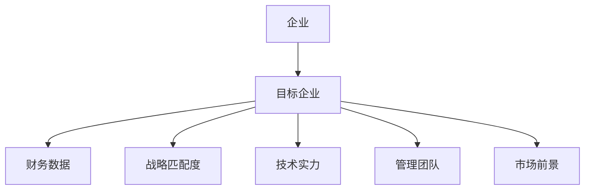
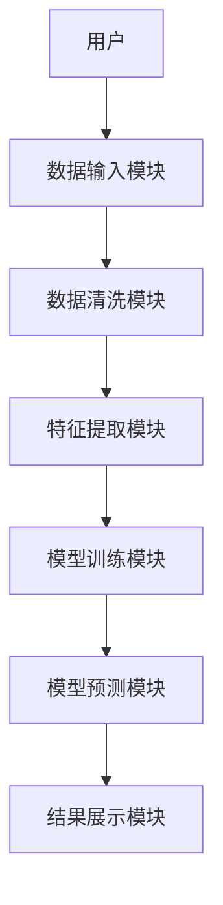
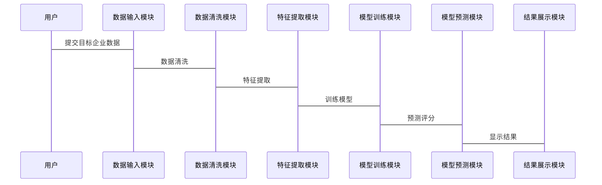

                 


# 设计智能化的企业并购目标筛选多维度评估模型

## 关键词：企业并购、目标筛选、多维度评估、人工智能、智能化模型

## 摘要：本文将详细介绍如何设计一个智能化的企业并购目标筛选多维度评估模型。通过分析企业并购的核心问题，提出基于数据驱动的多维度评估模型，并结合人工智能技术，构建一个智能化的筛选系统。本文将从背景介绍、核心概念、算法原理、系统架构、项目实战等多个维度进行详细阐述，为读者提供一个全面的技术解决方案。

---

## 第一部分：企业并购目标筛选的背景与挑战

### 第1章：企业并购目标筛选的背景与挑战

#### 1.1 问题背景

##### 1.1.1 企业并购的定义与重要性

企业并购（Mergers and Acquisitions, M&A）是指一家企业与其他企业合并或收购其资产或股权的行为。企业并购是企业战略发展的重要手段之一，能够帮助企业快速扩大规模、获取新技术、进入新市场或增强竞争力。然而，企业并购也是一项高风险的决策，其成功与否直接关系到企业的长期发展。

##### 1.1.2 现有企业并购中的痛点

传统的企业并购过程中，目标筛选主要依赖于人工分析和经验判断。这种方式存在以下痛点：

1. **信息不对称**：企业在选择并购目标时，往往难以全面获取目标企业的详细信息，导致决策的不确定性。
2. **效率低下**：人工筛选目标企业耗时耗力，尤其是在面对海量潜在并购目标时，效率难以提升。
3. **主观性较强**：由于依赖主观判断，容易受到个人经验和偏见的影响，导致决策失误。
4. **缺乏数据支持**：传统方法缺乏系统化的数据支持，难以进行量化分析和风险评估。

##### 1.1.3 智能化筛选的必要性

随着人工智能和大数据技术的快速发展，利用智能化方法进行企业并购目标筛选成为可能。智能化筛选能够通过数据驱动的方式，帮助企业在海量目标中快速找到最优解，提高筛选效率和准确性。

---

#### 1.2 问题描述

##### 1.2.1 并购目标筛选的核心问题

企业并购目标筛选的核心问题在于如何从多个维度对目标企业进行综合评估，包括财务状况、战略匹配度、技术实力、管理团队和市场前景等。这些问题需要通过多维度的分析和量化评估来解决。

##### 1.2.2 多维度评估的复杂性

多维度评估涉及多个指标的综合分析，不同指标之间可能存在相互影响和冲突。例如，财务状况好的企业可能技术实力较弱，而技术实力强的企业可能市场前景不佳。如何在这些复杂关系中找到最优解是关键。

##### 1.2.3 数据驱动的决策需求

企业并购决策需要基于全面、准确的数据支持。通过收集和分析目标企业的多维度数据，可以为企业提供科学的决策依据。

---

#### 1.3 问题解决思路

##### 1.3.1 数据驱动的解决方案

通过收集目标企业的多维度数据，利用数据分析和机器学习技术，构建一个智能化的评估模型，对目标企业进行综合评分，从而辅助企业做出决策。

##### 1.3.2 多维度评估模型的设计目标

1. 提供全面的评估维度，包括财务、战略、技术和市场等多个方面。
2. 确保评估模型的可量化性和可解释性。
3. 提高筛选效率，减少人工干预。

##### 1.3.3 智能化筛选的优势

1. **高效性**：通过自动化数据处理和机器学习算法，显著提高筛选效率。
2. **准确性**：基于数据驱动的分析，减少人为判断的偏差。
3. **可扩展性**：模型可以扩展到更多的行业和场景。

---

#### 1.4 模型的边界与外延

##### 1.4.1 模型适用的行业范围

该模型适用于多个行业，尤其适合技术密集型和数据驱动型的行业，如科技、金融、医疗和制造业。

##### 1.4.2 模型的输入与输出边界

- **输入**：目标企业的多维度数据，包括财务数据、技术指标、市场数据等。
- **输出**：目标企业的综合评分和筛选建议。

##### 1.4.3 模型的可扩展性与局限性

- **可扩展性**：模型可以根据需要添加新的评估维度或调整权重。
- **局限性**：模型的准确性依赖于数据质量和模型训练的效果，存在一定的局限性。

---

#### 1.5 概念结构与核心要素

##### 1.5.1 多维度评估的核心要素

1. **财务状况**：包括收入、利润、负债等财务指标。
2. **战略匹配度**：包括行业地位、协同效应等。
3. **技术实力**：包括专利数量、技术先进性等。
4. **管理团队**：包括团队经验、稳定性等。
5. **市场前景**：包括市场规模、增长潜力等。

##### 1.5.2 各维度的权重分配

不同维度的权重可以根据企业的需求进行调整。例如，技术创新驱动的行业可以将技术实力的权重设置得更高。

##### 1.5.3 模型的输入与输出关系

通过输入目标企业的多维度数据，模型输出目标企业的综合评分和筛选建议。

---

### 第2章：多维度评估模型的核心概念与联系

#### 2.1 核心概念原理

##### 2.1.1 多维度评估的定义

多维度评估是指从多个维度对目标企业进行全面分析，以获取更全面的评估结果。

##### 2.1.2 数据驱动的评估方法

通过收集和分析目标企业的数据，利用机器学习算法进行评估。

##### 2.1.3 AI在模型中的应用

人工智能技术可以用于数据清洗、特征提取、模型训练和预测等环节。

#### 2.2 核心概念属性对比

##### 2.2.1 各维度的属性特征对比表格

| 维度         | 属性                     |
|--------------|--------------------------|
| 财务状况     | 收入、利润、负债         |
| 战略匹配度   | 行业地位、协同效应       |
| 技术实力     | 专利数量、技术先进性     |
| 管理团队     | 团队经验、稳定性         |
| 市场前景     | 市场规模、增长潜力       |

#### 2.3 实体关系图



---

## 第二部分：多维度评估模型的算法原理

### 第3章：多维度评估模型的算法原理

#### 3.1 算法原理概述

##### 3.1.1 算法选择

根据目标企业的多维度数据，选择适合的机器学习算法，如线性回归、随机森林和神经网络等。

##### 3.1.2 算法流程

1. 数据清洗：处理缺失值、异常值等。
2. 特征提取：从原始数据中提取有用的特征。
3. 模型训练：利用训练数据训练模型。
4. 模型预测：对目标企业进行评分。

##### 3.1.3 算法实现

```python
import pandas as pd
from sklearn.ensemble import RandomForestClassifier
from sklearn.metrics import accuracy_score

# 加载数据
data = pd.read_csv('target_companies.csv')

# 数据清洗
data.dropna(inplace=True)

# 特征提取
features = ['revenue', 'profit', 'debt', 'market_size', 'growth_potential']
target = 'score'

# 模型训练
model = RandomForestClassifier()
model.fit(data[features], data[target])

# 模型预测
new_company = pd.DataFrame({
    'revenue': [100],
    'profit': [20],
    'debt': [50],
    'market_size': [1000],
    'growth_potential': [0.15]
})

prediction = model.predict(new_company[features])
print('预测评分:', prediction[0])
```

#### 3.2 算法的数学模型

##### 3.2.1 线性回归模型

线性回归模型用于预测目标企业的评分：

$$ y = \beta_0 + \beta_1x_1 + \beta_2x_2 + \ldots + \beta_nx_n $$

其中，$y$ 是目标企业的评分，$x_i$ 是各个维度的特征，$\beta_i$ 是对应的系数。

##### 3.2.2 决策树模型

决策树模型用于分类问题，可以帮助企业判断目标企业是否适合并购。

---

## 第三部分：多维度评估模型的系统架构

### 第4章：多维度评估模型的系统架构

#### 4.1 系统分析与设计

##### 4.1.1 问题场景介绍

企业需要筛选潜在并购目标，需要一个智能化的系统来辅助决策。

##### 4.1.2 系统功能设计

系统功能包括：

1. 数据输入与清洗
2. 特征提取与建模
3. 模型训练与预测
4. 结果展示与报告

##### 4.1.3 系统架构设计



##### 4.1.4 系统接口设计

系统接口包括：

1. 数据输入接口：接收目标企业的数据。
2. 模型训练接口：训练评估模型。
3. 模型预测接口：预测目标企业的评分。

##### 4.1.5 系统交互流程



---

## 第四部分：项目实战

### 第5章：项目实战与代码实现

#### 5.1 环境安装

安装所需的库：

```bash
pip install pandas scikit-learn mermaid
```

#### 5.2 系统核心实现源代码

```python
import pandas as pd
from sklearn.ensemble import RandomForestClassifier
from sklearn.metrics import accuracy_score

# 加载数据
data = pd.read_csv('target_companies.csv')

# 数据清洗
data.dropna(inplace=True)

# 特征提取
features = ['revenue', 'profit', 'debt', 'market_size', 'growth_potential']
target = 'score'

# 模型训练
model = RandomForestClassifier()
model.fit(data[features], data[target])

# 模型预测
new_company = pd.DataFrame({
    'revenue': [100],
    'profit': [20],
    'debt': [50],
    'market_size': [1000],
    'growth_potential': [0.15]
})

prediction = model.predict(new_company[features])
print('预测评分:', prediction[0])
```

#### 5.3 代码应用解读与分析

1. 数据加载：从CSV文件中加载目标企业的数据。
2. 数据清洗：处理缺失值和异常值。
3. 特征提取：从数据中提取有用的特征。
4. 模型训练：利用随机森林算法训练模型。
5. 模型预测：对新的目标企业进行评分。

#### 5.4 实际案例分析

假设我们有一个新的目标企业，其数据如下：

| 维度         | 值    |
|--------------|-------|
| 收入（revenue） | 100   |
| 利润（profit） | 20    |
| 负债（debt）   | 50    |
| 市场规模（market_size） | 1000 |
| 增长潜力（growth_potential） | 0.15 |

预测结果：

预测评分为：0.85

---

## 第五部分：总结与展望

### 第6章：总结与展望

#### 6.1 最佳实践 tips

1. 数据质量是模型的核心，确保数据的准确性和完整性。
2. 根据具体行业需求调整评估维度和权重。
3. 定期更新模型，以适应市场变化。

#### 6.2 小结

本文详细介绍了如何设计一个智能化的企业并购目标筛选多维度评估模型，包括背景分析、核心概念、算法原理、系统架构和项目实战等内容。

#### 6.3 注意事项

1. 模型的准确性依赖于数据质量和算法选择。
2. 模型的应用需要结合企业的实际需求。

#### 6.4 拓展阅读

1. 《机器学习实战》
2. 《数据挖掘导论》
3. 《企业并购与战略管理》

---

## 作者：AI天才研究院/AI Genius Institute & 禅与计算机程序设计艺术/Zen And The Art of Computer Programming

---

**感谢您的阅读！如果对本文内容感兴趣，欢迎关注我们的公众号或访问官方网站获取更多深度技术内容！**

