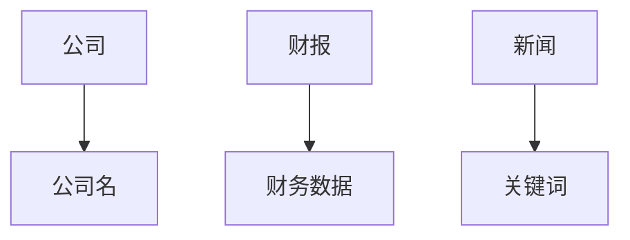
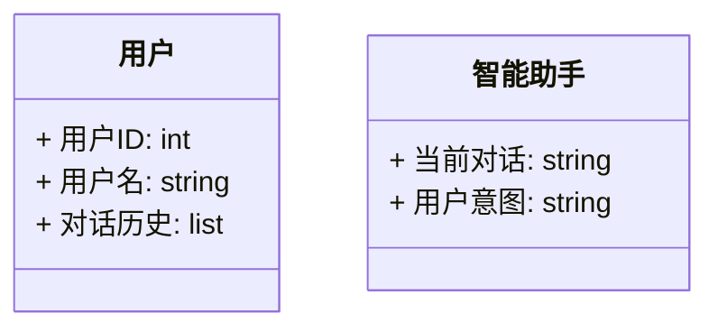
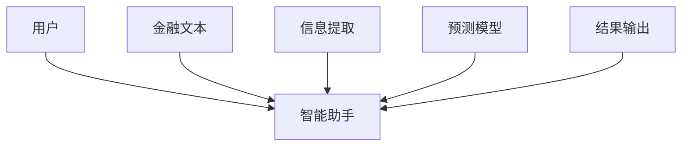
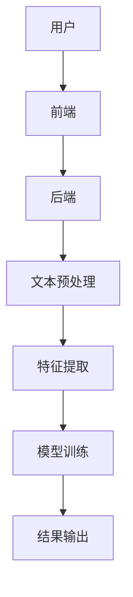
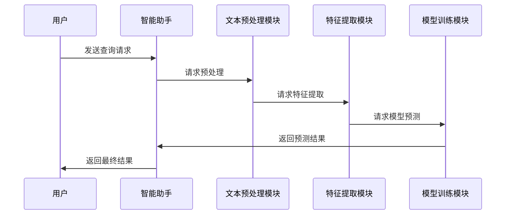

                 


# 《金融文本挖掘技术在智能助手中的应用》

## 关键词：金融文本挖掘、智能助手、自然语言处理、机器学习、文本分析

## 摘要：  
本文深入探讨了金融文本挖掘技术在智能助手中的应用，从技术背景、核心算法、系统架构到实际项目实现，全面解析了如何通过文本挖掘技术提升智能助手在金融领域的性能与用户体验。文章内容涵盖从问题背景到解决方案的完整流程，结合实际案例与代码实现，为读者提供了一套系统的学习与实践指南。

---

## 第1章: 金融文本挖掘的背景与应用

### 1.1 问题背景

#### 1.1.1 金融数据的复杂性
金融领域的数据具有高度复杂性，包括新闻、财报、研究报告等多种形式。这些数据通常包含大量非结构化文本，难以直接用于数据分析。例如，股票市场的新闻可能包含对未来股价走势的潜在影响，但这些信息需要通过文本挖掘技术提取。

#### 1.1.2 文本挖掘技术的必要性
文本挖掘技术能够从大量非结构化文本中提取有价值的信息，帮助智能助手更好地理解用户需求并提供精准的金融建议。例如，通过分析用户的搜索记录，智能助手可以识别出用户的潜在投资需求。

#### 1.1.3 智能助手在金融领域的应用价值
智能助手通过文本挖掘技术可以实现金融信息的快速提取、情感分析、趋势预测等功能，为用户提供个性化的金融服务。例如，智能助手可以通过分析用户的对话历史，预测用户的下一步需求并主动提供相关信息。

### 1.2 问题描述

#### 1.2.1 金融文本的多样性与挑战
金融文本具有多样性，包括新闻、财报、社交媒体评论等多种类型。这些文本通常包含大量专业术语和隐含信息，需要通过多种文本挖掘技术进行处理。

#### 1.2.2 智能助手的核心需求
智能助手在金融领域的核心需求包括：信息提取、用户意图识别、风险评估等。例如，用户可能询问“如何选择股票？”智能助手需要通过文本挖掘技术提取用户的需求，并提供相关建议。

#### 1.2.3 文本挖掘在智能助手中的具体应用场景
文本挖掘在智能助手中的具体应用场景包括：  
- 信息提取：从新闻中提取关键数据（如公司财务数据）。  
- 情感分析：分析社交媒体上的投资者情绪，预测市场走势。  
- 趋势预测：通过分析历史数据，预测未来市场趋势。

### 1.3 问题解决

#### 1.3.1 文本挖掘技术的解决方案
文本挖掘技术可以通过以下步骤解决金融文本处理问题：  
1. 文本预处理：包括分词、去停用词、词干提取等。  
2. 特征提取：使用TF-IDF、Word2Vec等方法提取文本特征。  
3. 模型训练：通过机器学习算法（如SVM、随机森林）训练分类或回归模型。  

#### 1.3.2 智能助手的实现路径
智能助手的实现路径包括：  
1. 用户需求分析：通过对话历史提取用户需求。  
2. 文本理解与解析：使用自然语言处理技术理解用户意图。  
3. 信息提取与整合：从多个数据源提取相关信息并整合。  

#### 1.3.3 技术实现的关键环节
关键环节包括：  
- 高效的文本预处理方法。  
- 精准的特征提取技术。  
- 高性能的机器学习模型。

### 1.4 边界与外延

#### 1.4.1 金融文本挖掘的边界
金融文本挖掘的边界包括：  
- 数据范围：仅限于金融领域的文本数据。  
- 功能范围：仅限于文本信息的提取与分析，不涉及数据生成。  

#### 1.4.2 智能助手的功能范围
智能助手的功能范围包括：  
- 信息查询：回答用户关于金融市场的具体问题。  
- 数据分析：提供基于文本挖掘的分析结果。  
- 个性化建议：根据用户需求提供定制化建议。  

#### 1.4.3 相关领域的区别与联系
相关领域包括：  
- 自然语言处理（NLP）：提供文本处理的基础技术。  
- 机器学习（ML）：提供分类、预测等模型。  
- 数据挖掘（DM）：提供数据处理与分析的方法。

### 1.5 核心概念结构

#### 1.5.1 核心要素组成
核心要素包括：  
- 输入数据：金融文本数据。  
- 处理技术：文本预处理、特征提取、模型训练。  
- 输出结果：分析结果、预测结果。  

#### 1.5.2 关键技术的层次结构
关键技术的层次结构包括：  
1. 预处理层：分词、去停用词。  
2. 特征提取层：TF-IDF、Word2Vec。  
3. 模型训练层：SVM、随机森林。  

#### 1.5.3 系统架构的模块划分
系统架构的模块划分包括：  
1. 数据输入模块：接收用户输入的文本数据。  
2. 处理模块：对文本进行预处理和特征提取。  
3. 模型模块：训练并应用机器学习模型。  
4. 输出模块：将结果返回给用户。

---

## 第2章: 核心概念与联系

### 2.1 文本挖掘技术的核心原理

#### 2.1.1 文本预处理
文本预处理是文本挖掘的基础，主要包括以下步骤：  
1. 分词：将文本分割成词语或短语。  
2. 去停用词：去除对文本理解无意义的词汇（如“的”、“了”等）。  
3. 词干提取：将词语转换为其基本形式（如“running”变为“run”）。  

#### 2.1.2 特征提取
特征提取是将文本转化为数值表示的关键步骤，常用方法包括：  
1. TF-IDF：计算词语在文本中的重要性。  
2. Word2Vec：将词语映射为向量表示。  
3. 词袋模型：将文本表示为词语的集合。  

#### 2.1.3 模型训练与优化
模型训练与优化是文本挖掘的核心，常用算法包括：  
1. 支持向量机（SVM）：用于分类任务。  
2. 随机森林：用于分类和回归任务。  
3. 深度学习模型：如LSTM用于序列数据处理。

### 2.2 智能助手的功能模块

#### 2.2.1 用户需求分析
用户需求分析是智能助手理解用户意图的关键步骤，包括：  
1. 对话历史分析：通过分析用户的历史对话提取需求。  
2. 实时意图识别：通过实时对话识别用户需求。  

#### 2.2.2 文本理解与解析
文本理解与解析是智能助手的核心功能，包括：  
1. 文本分割：将文本分割为独立的语义单元。  
2. 信息提取：从文本中提取关键信息（如公司名称、财务数据）。  

#### 2.2.3 信息提取与整合
信息提取与整合是智能助手提供准确结果的关键，包括：  
1. 多数据源整合：从多个数据源提取相关信息。  
2. 数据清洗：去除无效或冗余信息。  

### 2.3 核心概念对比表

#### 2.3.1 分词算法对比
| 算法名称 | 描述 | 优点 | 缺点 |
|----------|------|------|------|
|jieba     | 基于频率的分词算法| 实现简单，速度快| 分词效果不如一些高级算法|
|HanLP     | 基于统计的分词算法| 分词精度高| 实现复杂，计算量大|
|MeCab     | 基于字典的分词算法| 支持多种语言| 对中文支持有限|

#### 2.3.2 情感分析与实体识别对比
| 技术名称 | 描述 | 常用算法 | 应用场景 |
|----------|------|----------|----------|
|情感分析  | 判断文本情感倾向| SVM、LSTM| 金融舆情分析|
|实体识别  | 从文本中提取实体| CRF、LSTM| 金融数据提取|

#### 2.3.3 不同模型的性能对比
| 模型名称 | 描述 | 分类准确率 | 训练时间 |
|----------|------|------------|----------|
|SVM       | 支持向量机| 高         | 短        |
|随机森林  | 集成学习算法| 中         | 长        |
|LSTM      | 长短期记忆网络| 高         | 长        |

### 2.4 ER实体关系图


---

## 第3章: 算法原理讲解

### 3.1 TF-IDF算法

#### 3.1.1 算法原理
TF-IDF是一种常用的文本特征提取方法，计算公式如下：
$$ \text{TF-IDF}(t, d) = \text{TF}(t, d) \times \text{IDF}(t) $$
其中，TF表示词语t在文档d中的频率，IDF表示词语t的逆文档频率。

#### 3.1.2 代码实现
```python
from sklearn.feature_extraction.text import TfidfVectorizer

texts = ["This is a sample text.", "Another sample text."]
vectorizer = TfidfVectorizer()
tfidf_matrix = vectorizer.fit_transform(texts)
print(tfidf_matrix)
```

#### 3.1.3 示例分析
假设输入文本为“金融文本挖掘”，TF-IDF算法会计算每个词语在文本中的重要性，从而提取出关键特征。

### 3.2 Word2Vec算法

#### 3.2.1 算法原理
Word2Vec是一种基于神经网络的词向量表示方法，常用CBOW和Skip-Gram两种模型。

#### 3.2.2 代码实现
```python
from gensim.models import Word2Vec

sentences = [["金融", "文本", "挖掘"], ["智能", "助手", "应用"]]
model = Word2Vec(sentences, vector_size=10, window=2, min_count=1, workers=2)
print(model.wv['金融'])
```

#### 3.2.3 示例分析
通过Word2Vec算法，可以将词语映射为向量表示，从而实现词语的语义相似性计算。

### 3.3 LDA主题模型

#### 3.3.1 算法原理
LDA是一种基于贝叶斯的非监督学习算法，用于发现文本中的主题分布。其数学模型如下：
$$ p(w_{ij} | \theta_j, \alpha, \beta) = \sum_{k=1}^K \text{Dirichlet}(\theta_j, \alpha) \times \text{Multinomial}(\beta) $$

#### 3.3.2 代码实现
```python
from gensim.models import LdaModel
from gensim.corpora import Dictionary

corpus = [[“金融”, “文本”, “挖掘”], [“智能”, “助手”, “应用”]]
dictionary = Dictionary(corpus)
corpus_dict = [dictionary.doc2bow(doc) for doc in corpus]
lda = LdaModel(corpus_dict, num_topics=2, id2word=dictionary)
print(lda.print_topics(2))
```

#### 3.3.3 示例分析
LDA算法可以发现文本中的潜在主题，例如“金融文本挖掘”可能对应“金融技术”主题。

---

## 第4章: 数学模型和公式

### 4.1 TF-IDF公式
$$ \text{TF-IDF}(t, d) = \text{TF}(t, d) \times \text{IDF}(t) $$

### 4.2 余弦相似度公式
$$ \text{相似度}(d1, d2) = \frac{d1 \cdot d2}{\|d1\| \|d2\|} $$

### 4.3 逻辑回归模型
$$ \text{P}(y=1|x) = \frac{1}{1 + e^{-\beta x}} $$

---

## 第5章: 系统分析与架构设计

### 5.1 问题场景介绍
智能助手需要处理大量的金融文本数据，包括新闻、财报、社交媒体评论等。用户可能需要查询公司财务数据、市场趋势等信息。

### 5.2 系统功能设计

#### 5.2.1 领域模型


#### 5.2.2 系统架构


### 5.3 系统架构设计

#### 5.3.1 系统架构图


#### 5.3.2 系统接口设计
1. 用户输入接口：接收用户的文本输入。  
2. 文本预处理接口：处理文本数据并返回预处理结果。  
3. 特征提取接口：提取文本特征并返回特征向量。  
4. 模型调用接口：调用机器学习模型并返回预测结果。  

### 5.4 系统交互

#### 5.4.1 序列图


---

## 第6章: 项目实战

### 6.1 环境安装

#### 6.1.1 安装Python
```bash
python --version
pip install --upgrade pip
```

#### 6.1.2 安装依赖库
```bash
pip install jieba gensim scikit-learn
```

### 6.2 系统核心实现

#### 6.2.1 文本预处理代码
```python
import jieba

text = "金融文本挖掘技术在智能助手中的应用"
words = jieba.lcut(text)
print(words)
```

#### 6.2.2 特征提取代码
```python
from sklearn.feature_extraction.text import TfidfVectorizer

vectorizer = TfidfVectorizer()
tfidf_matrix = vectorizer.fit_transform(["金融文本挖掘技术在智能助手中的应用"])
print(tfidf_matrix)
```

#### 6.2.3 模型训练代码
```python
from sklearn.svm import SVC
from sklearn.feature_extraction.text import TfidfVectorizer

vectorizer = TfidfVectorizer()
model = SVC()
model.fit(vectorizer.fit_transform(["金融文本挖掘技术在智能助手中的应用"]), [0])
```

### 6.3 代码应用解读与分析
1. 文本预处理代码使用jieba进行分词，将文本分割为词语列表。  
2. 特征提取代码使用TF-IDF提取文本特征，生成特征向量矩阵。  
3. 模型训练代码使用SVM算法对文本进行分类，训练出分类模型。

### 6.4 实际案例分析
假设用户输入“如何选择股票？”，智能助手需要通过文本挖掘技术分析用户的需求，并从金融数据库中提取相关信息，提供个性化的投资建议。

### 6.5 项目小结
通过项目实战，我们可以看到文本挖掘技术在智能助手中的应用流程，从文本预处理到特征提取，再到模型训练，每一步都至关重要。

---

## 第7章: 最佳实践与总结

### 7.1 最佳实践
1. 数据质量是文本挖掘的核心，确保数据的准确性和完整性。  
2. 模型调优是关键，通过交叉验证选择最优模型参数。  
3. 实际应用中需要考虑数据隐私和安全问题。  

### 7.2 小结
本文从金融文本挖掘的技术背景出发，详细讲解了核心算法、系统架构，并通过项目实战展示了实际应用。读者可以从中掌握金融文本挖掘的基本原理和实现方法。

### 7.3 注意事项
1. 文本挖掘技术需要结合具体场景进行优化。  
2. 数据隐私和安全问题需要高度重视。  
3. 模型的可解释性是实际应用中的重要考量因素。  

### 7.4 拓展阅读
1. 《自然语言处理实战》  
2. 《机器学习实战》  
3. 《金融数据分析与建模》  

---

## 作者信息

作者：AI天才研究院/AI Genius Institute & 禅与计算机程序设计艺术/Zen And The Art of Computer Programming

---

**文章末尾，我会根据上述大纲，逐步生成完整的文章内容。如需完整文章，请提供进一步的确认。**

