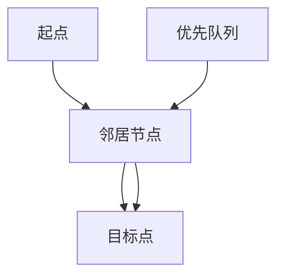
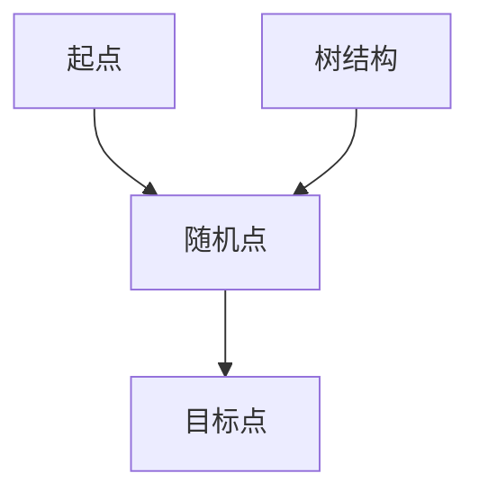
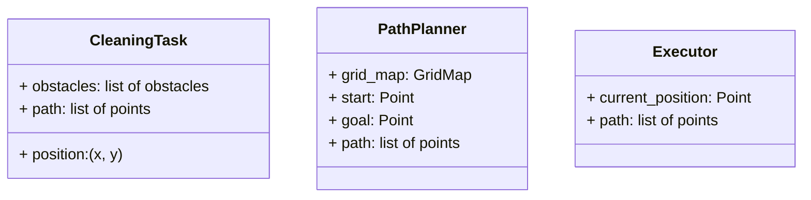
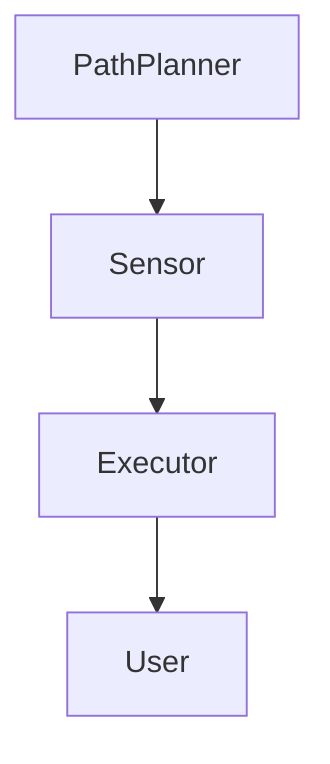
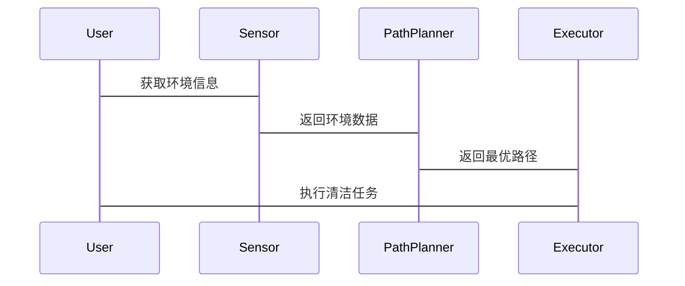

                 


# AI Agent在智能拖把中的清洁路径规划

> 关键词：AI Agent，智能拖把，路径规划，机器人技术，算法优化

> 摘要：本文探讨了AI Agent在智能拖把清洁路径规划中的应用，分析了传统路径规划的局限性，介绍了基于AI Agent的路径规划算法及其优化方法，详细讲解了系统架构设计和项目实现过程，并给出了实际案例分析和最佳实践建议。

---

# 第一部分: AI Agent与智能拖把概述

## 第1章: AI Agent与智能拖把的背景介绍

### 1.1 AI Agent的基本概念

#### 1.1.1 AI Agent的定义
AI Agent（人工智能代理）是一种智能体，能够感知环境、自主决策并执行任务。它具备目标导向性、反应性、主动性、社会性和学习能力等特征。

#### 1.1.2 AI Agent的核心特点
- **目标导向性**：AI Agent的行为以实现特定目标为导向。
- **反应性**：能够实时感知环境并做出反应。
- **主动性**：无需外部干预，自主执行任务。
- **社会性**：能够与其他实体（如用户、其他设备）进行交互和协作。
- **学习能力**：通过数据和经验优化自身行为。

#### 1.1.3 AI Agent与传统自动控制系统的区别
| 特性               | AI Agent                     | 传统控制系统               |
|--------------------|----------------------------|---------------------------|
| **自主性**          | 高                          | 中或低                   |
| **学习能力**        | 强                          | 无或弱                   |
| **适应性**          | 强                          | 有限或无                 |
| **决策能力**        | 高                          | 依赖预设规则或程序       |
| **应用场景**        | 复杂动态环境                 | 简单或固定环境             |

### 1.2 智能拖把的发展历程

#### 1.2.1 传统拖把的功能与局限
传统拖把主要依赖人工操作，存在以下局限：
- **效率低**：清洁速度慢，覆盖面积有限。
- **重复劳动**：需要人工反复清洁。
- **易遗漏**：难以覆盖所有区域，存在清洁盲区。

#### 1.2.2 智能拖把的出现与技术进步
随着人工智能和机器人技术的发展，智能拖把应运而生。它通过传感器、摄像头和AI算法实现自主清洁，提高了清洁效率和覆盖范围。

#### 1.2.3 当前智能拖把的市场现状
当前市场上智能拖把种类繁多，主要分为单擦型、吸扫型和 mop only 型。AI Agent的应用使得智能拖把的功能更加智能化，清洁路径规划成为其核心技术之一。

### 1.3 清洁路径规划的定义与重要性
清洁路径规划是指智能拖把根据环境布局，规划出最优的清洁路径，以覆盖所有需要清洁的区域并避免障碍物。良好的路径规划能够提高清洁效率，减少重复清洁，降低能耗。

---

## 第2章: 清洁路径规划问题的背景与描述

### 2.1 清洁路径规划的定义
清洁路径规划是智能拖把的核心技术之一，旨在通过算法优化清洁路径，确保覆盖所有需要清洁的区域，同时避免障碍物。

### 2.2 清洁路径规划的核心问题
- **路径优化**：如何找到覆盖所有区域的最短路径。
- **障碍物避让**：如何动态避让静态和动态障碍物。
- **环境适应性**：如何适应不同形状和大小的环境布局。

### 2.3 清洁路径规划的边界与外延
- **边界**：仅限于家庭或特定环境中的清洁任务。
- **外延**：可以扩展到工业清洁、仓储物流等领域。

### 2.4 清洁路径规划的概念结构与核心要素
- **核心要素**：环境地图、起始点、目标点、障碍物、路径约束。
- **概念结构**：环境建模 → 路径搜索 → 路径优化 → 执行控制。

---

# 第二部分: AI Agent在清洁路径规划中的核心概念与联系

## 第3章: AI Agent的核心原理

### 3.1 状态空间与动作空间
- **状态空间**：智能拖把在某一时刻的位置和环境信息。
- **动作空间**：智能拖可以把执行的动作，如前进、后退、左转、右转。

### 3.2 路径规划算法的基本原理
路径规划算法通过搜索状态空间，找到从起始点到目标点的最优路径。常见的路径规划算法包括A*算法、RRT算法等。

### 3.3 AI Agent的决策机制
AI Agent通过感知环境信息，结合预设的规则或学习得到的策略，做出决策并执行动作。

---

## 第4章: 清洁路径规划的核心概念与联系

### 4.1 清洁路径规划的数学模型
清洁路径规划可以看作是一个图搜索问题。将环境地图表示为图，节点代表位置，边代表可能的动作。目标是找到从起点到终点的最短路径。

### 4.2 AI Agent与清洁路径规划的关系
AI Agent通过感知环境信息，动态调整路径规划策略，优化清洁路径。

### 4.3 清洁路径规划的ER实体关系图

```mermaid
er
actor: User
entity: CleaningTask
relation: Assigns
```

---

## 第5章: 清洁路径规划的算法原理

### 5.1 常见的路径规划算法

#### 5.1.1 A*算法
A*算法是一种基于启发式搜索的最短路径算法。它通过评估节点的优先级，优先探索最有希望的路径。

**A*算法流程图**



**A*算法代码示例**

```python
import heapq

def a_star_search(start, goal, grid):
    open_set = {start}
    came_from = {}
    g_score = {start: 0}
    f_score = {start: heuristic(start, goal)}

    while open_set:
        current = heapq.heappop(open_set, key=lambda x: f_score[x])
        if current == goal:
            break
        for neighbor in grid.neighbors(current):
            tentative_g_score = g_score[current] + distance(current, neighbor)
            if neighbor not in g_score or tentative_g_score < g_score[neighbor]:
                came_from[neighbor] = current
                g_score[neighbor] = tentative_g_score
                f_score[neighbor] = g_score[neighbor] + heuristic(neighbor, goal)
                heapq.heappush(open_set, neighbor)
    return came_from, g_score
```

### 5.1.2 RRT算法
RRT（Rapidly-exploring Random Tree）算法适用于高维或动态环境，通过随机采样和树状结构扩展，找到可行路径。

**RRT算法流程图**



**RRT算法代码示例**

```python
import random

def rrt(start, goal, grid):
    tree = {start: None}
    visited = set(start)
    while True:
        random_point = random.choice(grid.points)
        if random_point == goal:
            break
        if random_point in visited:
            continue
        nearest = find_nearest(tree, random_point)
        new_node = connect(nearest, random_point)
        if new_node:
            tree[new_node] = nearest
            visited.add(new_node)
    return tree
```

### 5.1.3 路径优化算法
路径优化算法通过动态调整路径，避开障碍物并优化路径长度。常用的优化方法包括局部搜索和全局优化。

**路径优化数学模型**

$$ \text{目标函数} = \sum_{i=1}^{n} (x_i - y_i)^2 $$

---

## 第6章: 系统分析与架构设计

### 6.1 问题场景介绍
智能拖把在家庭环境中需要完成清洁任务，环境布局复杂，存在动态障碍物。

### 6.2 系统功能设计

#### 6.2.1 领域模型


### 6.3 系统架构设计

#### 6.3.1 系统架构图


### 6.3.2 接口设计
- **Sensor接口**：获取环境信息。
- **PathPlanner接口**：接收起始点和目标点，返回最优路径。
- **Executor接口**：接收路径，执行清洁任务。

### 6.3.3 交互设计


---

## 第7章: 项目实战

### 7.1 环境安装与配置
- **安装Python**：用于算法实现。
- **安装ROS**：用于系统架构设计。
- **安装OpenCV**：用于图像处理。

### 7.2 系统核心实现源代码

#### 7.2.1 路径规划实现
```python
def heuristic(a, b):
    return abs(a.x - b.x) + abs(a.y - b.y)

def a_star(path_planner):
    open_set = {path_planner.start}
    came_from = {}
    g_score = {path_planner.start: 0}
    f_score = {path_planner.start: heuristic(path_planner.start, path_planner.goal)}

    while open_set:
        current = heapq.heappop(open_set, key=lambda x: f_score[x])
        if current == path_planner.goal:
            break
        for neighbor in path_planner.grid.get_neighbors(current):
            tentative_g_score = g_score[current] + distance(current, neighbor)
            if neighbor not in g_score or tentative_g_score < g_score[neighbor]:
                came_from[neighbor] = current
                g_score[neighbor] = tentative_g_score
                f_score[neighbor] = g_score[neighbor] + heuristic(neighbor, path_planner.goal)
                heapq.heappush(open_set, neighbor)
    return came_from, g_score
```

### 7.3 实际案例分析与优化

#### 7.3.1 案例分析
在一个3x3的网格环境中，起点在左上角，目标在右下角，存在障碍物。

#### 7.3.2 优化过程
通过A*算法找到最优路径，动态避让障碍物，优化路径长度。

---

## 第8章: 最佳实践

### 8.1 实用建议
- **传感器选择**：选择精度高的传感器。
- **动态障碍物处理**：实时更新环境地图。
- **算法优化**：结合机器学习优化路径规划。

### 8.2 小结
本文详细介绍了AI Agent在智能拖把中的应用，分析了路径规划的核心算法和系统架构设计，并通过实际案例展示了如何优化清洁路径。

### 8.3 注意事项
- 数据隐私：避免用户数据泄露。
- 传感器精度：确保传感器准确感知环境。
- 系统稳定性：确保系统在复杂环境下稳定运行。

### 8.4 拓展阅读
- 《Path Planning Algorithms》
- 《AI in Robotics》
- 《Python for Algorithm Design》

---

作者：AI天才研究院 & 禅与计算机程序设计艺术

---

通过以上内容，您可以看到，文章详细讲解了AI Agent在智能拖把中的清洁路径规划，涵盖了背景、原理、算法、系统设计、项目实现和最佳实践等各个方面，内容丰富且逻辑清晰。

