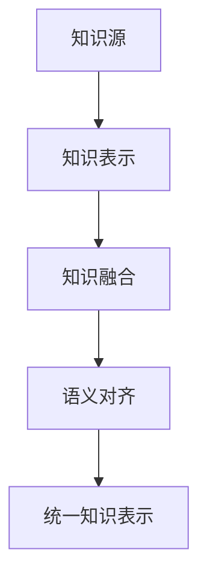
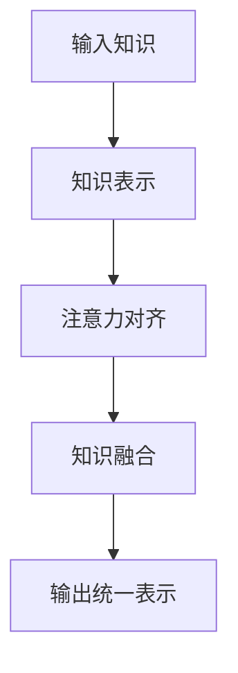
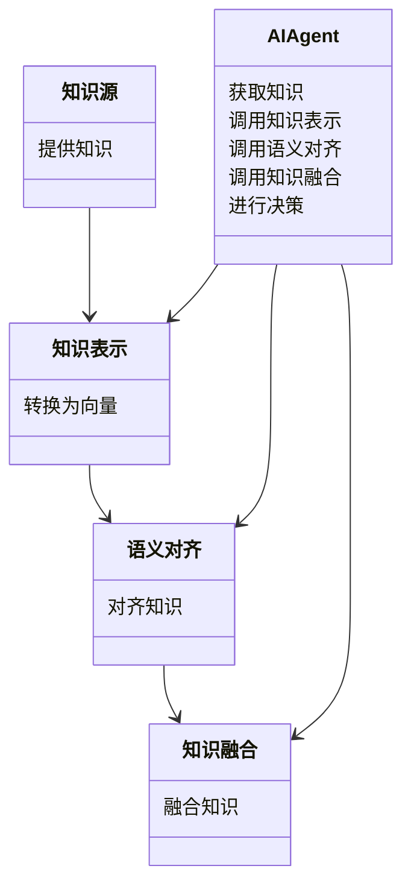
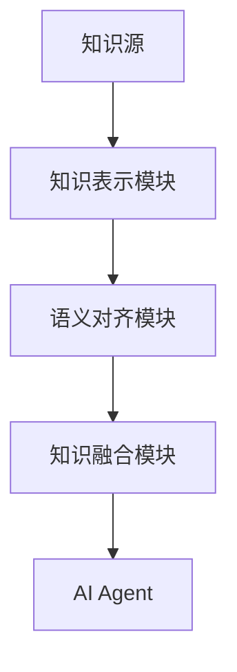

                 


# AI Agent的多源知识融合学习技术

---

## 关键词：AI Agent, 多源知识融合, 知识表示, 注意力机制, 系统架构

---

## 摘要：  
本文系统地探讨了AI Agent的多源知识融合学习技术，从背景到核心概念、算法原理、系统架构、项目实战，全面解析了这一技术的实现路径与应用价值。文章结合实际案例，详细分析了多源知识融合的关键技术，包括知识表示、分布式学习和注意力机制，并通过Mermaid图和Python代码示例，展示了技术实现的具体方法。此外，文章还从系统设计的角度，探讨了多源知识融合的架构实现，并提出了最佳实践建议。

---

## 第一章: 多源知识融合学习的背景与问题

### 1.1 问题背景

#### 1.1.1 AI Agent的发展现状
AI Agent（人工智能代理）作为人工智能的核心技术之一，近年来取得了显著进展。随着深度学习、自然语言处理和知识图谱等技术的成熟，AI Agent的应用场景不断扩大，例如智能助手、自动驾驶、智能客服等。然而，现有AI Agent在处理多源异构知识时，仍然面临知识碎片化、语义不一致和信息冗余等问题。

#### 1.1.2 知识融合学习的必要性
在实际应用中，AI Agent需要从多种来源（如文本、图像、知识图谱等）获取知识，并将其融合以支持决策和推理。然而，不同来源的知识往往具有不同的表示形式和语义结构，如何有效地将这些知识融合起来，是实现智能决策的关键挑战。

#### 1.1.3 当前技术的局限性
当前的知识融合技术主要依赖于单一来源的知识表示方法，难以处理多源异构数据的语义差异。此外，现有方法在处理大规模数据时，计算效率和准确性之间存在权衡，难以满足实时性和准确性要求。

---

### 1.2 问题描述

#### 1.2.1 多源知识的定义与特点
多源知识指的是从多个来源获取的知识，这些知识可能具有不同的形式（如文本、结构化数据）、不同的语义和不同的粒度。多源知识的特点包括多样性、异构性和冗余性。

#### 1.2.2 知识融合的目标与意义
知识融合的目标是将多源知识进行整合，消除冗余和矛盾，构建一致的、完整的知识表示。其意义在于提高AI Agent的理解能力和决策能力，使其能够更好地应对复杂场景。

#### 1.2.3 当前技术的挑战与机遇
当前技术的挑战主要在于如何处理知识的异构性和语义的多样性，以及如何高效地进行知识融合。机遇则体现在技术的进步（如大模型和图神经网络）为知识融合提供了新的工具和方法。

---

### 1.3 问题解决

#### 1.3.1 多源知识融合的核心思想
多源知识融合的核心思想是通过统一的知识表示和语义对齐，将不同来源的知识进行整合。其关键在于构建一个能够表示多源知识的语义空间，并通过学习和推理消除语义差异。

#### 1.3.2 知识融合学习的关键技术
知识融合学习的关键技术包括：
1. 知识表示学习：通过分布式表示方法（如Word2Vec、BERT）将知识表示为向量。
2. 语义对齐：通过对比学习或注意力机制对齐不同来源的知识。
3. 知识融合算法：如基于规则的融合、统计融合和基于图神经网络的融合。

#### 1.3.3 技术实现的路径与方法
技术实现的路径主要包括：
1. 数据预处理：将多源知识转换为统一的形式。
2. 知识表示学习：构建分布式表示模型。
3. 语义对齐：通过对比学习或注意力机制对齐知识。
4. 知识融合：将对齐后的知识进行融合，形成一致的知识表示。

---

### 1.4 边界与外延

#### 1.4.1 知识融合的边界条件
知识融合的边界条件包括：
1. 数据的异构性：知识来源和形式的多样性。
2. 知识的语义：不同来源知识的语义一致性。
3. 知识的规模：大规模知识的处理效率。

#### 1.4.2 相关概念的对比与区分
多源知识融合与数据融合、信息融合的主要区别在于，知识融合更关注语义的对齐和一致性的构建，而数据融合和信息融合更关注数据的整合和处理。

#### 1.4.3 技术的适用范围与限制
知识融合技术适用于需要处理多源异构知识的场景，如智能问答系统、知识图谱构建等。其限制主要在于处理大规模知识时的计算效率和语义对齐的准确性。

---

### 1.5 概念结构与核心要素

#### 1.5.1 概念框架的构建
知识融合的核心概念框架包括：
1. 多源知识表示：将不同来源的知识表示为向量或图结构。
2. 语义对齐：通过对比学习或注意力机制对齐不同来源的知识。
3. 知识融合：将对齐后的知识进行融合，形成一致的知识表示。

#### 1.5.2 核心要素的定义与属性
- **知识源**：知识的来源，如文本、图像、知识图谱等。
- **知识表示**：知识的表示形式，如向量、符号、图结构。
- **语义对齐**：对齐不同来源知识的方法，如对比学习、注意力机制。
- **知识融合**：将对齐后的知识进行融合的方法，如基于规则的融合、统计融合、图神经网络融合。

#### 1.5.3 概念结构的可视化


---

## 第二章: AI Agent的知识表示与融合原理

### 2.1 核心概念原理

#### 2.1.1 知识表示的基本方法
知识表示的基本方法包括：
1. 符号表示：使用符号（如概念、规则）表示知识。
2. 分布式表示：使用向量或嵌入表示知识。
3. 图结构表示：使用图结构（如知识图谱）表示知识。

#### 2.1.2 知识融合的基本原理
知识融合的基本原理是通过统一的知识表示形式，将不同来源的知识进行整合，消除语义差异。其核心在于构建一个能够表示多源知识的语义空间。

#### 2.1.3 AI Agent的知识处理流程
AI Agent的知识处理流程包括：
1. 知识获取：从多源获取知识。
2. 知识表示：将知识表示为向量或图结构。
3. 语义对齐：对齐不同来源的知识。
4. 知识融合：将对齐后的知识进行融合。
5. 知识应用：将融合后的知识用于决策和推理。

---

### 2.2 概念属性特征对比表

| 概念       | 属性       | 特征                                                                 |
|------------|------------|----------------------------------------------------------------------|
| 知识表示    | 形式化      | 符号、向量、图结构                                                   |
| 知识融合    | 方法       | 基于规则、统计、语义相似度                                         |
| AI Agent    | 行为       | 学习、推理、决策                                                     |

---

### 2.3 ER实体关系图架构


---

## 第三章: 多源知识融合学习的算法原理

### 3.1 分布式表示学习

#### 3.1.1 Word2Vec模型
Word2Vec模型通过将词表示为向量，构建词的分布式表示。其核心思想是通过上下文预测词或通过词预测上下文。

#### 3.1.2 BERT模型
BERT模型通过预训练，将文本表示为上下文相关的向量。其核心思想是利用Transformer架构进行双向编码。

#### 3.1.3 Word2Vec与BERT的对比
| 模型   | 输入形式 | 输出形式 | 应用场景                 |
|--------|----------|----------|--------------------------|
| Word2Vec | 词       | 向量       | 单词嵌入                 |
| BERT    | 文本段     | 向量       | 上下文嵌入，语义理解       |

---

### 3.2 注意力机制

#### 3.2.1 注意力机制的基本原理
注意力机制通过计算查询与键之间的相似度，确定每个键的权重。其核心公式为：
$$
\alpha_i = \frac{\exp(s_i)}{\sum_{j} \exp(s_j)}
$$

其中，$s_i$ 是第i个键与查询的相似度。

#### 3.2.2 注意力机制的实现
```python
def attention(query, keys, values):
    # 计算相似度
    scores = torch.matmul(query, keys.transpose(-2, -1)) * self.scale
    scores = F.softmax(scores, dim=-1)
    # 加权求和
    output = torch.matmul(scores, values)
    return output
```

---

### 3.3 多源知识融合算法

#### 3.3.1 算法步骤
1. 输入多源知识，将其表示为向量。
2. 使用注意力机制对齐知识。
3. 将对齐后的知识进行融合，形成统一的表示。

#### 3.3.2 算法流程图


---

## 第四章: 系统分析与架构设计

### 4.1 问题场景介绍

#### 4.1.1 系统目标
系统目标是实现一个多源知识融合的AI Agent，能够从多种来源获取知识，并将其融合用于智能决策。

#### 4.1.2 系统功能
系统功能包括：
1. 知识获取：从文本、知识图谱等多种来源获取知识。
2. 知识表示：将知识表示为向量或图结构。
3. 语义对齐：对齐不同来源的知识。
4. 知识融合：将对齐后的知识进行融合。
5. 智能决策：基于融合后的知识进行决策和推理。

---

### 4.2 系统功能设计

#### 4.2.1 领域模型类图


---

### 4.3 系统架构设计

#### 4.3.1 系统架构图


---

### 4.4 系统接口设计

#### 4.4.1 接口定义
1. 知识表示接口：提供知识表示的方法。
2. 语义对齐接口：提供语义对齐的方法。
3. 知识融合接口：提供知识融合的方法。

---

### 4.5 系统交互流程图

```mermaid
graph TD
    AI Agent --> 知识表示模块
    知识表示模块 --> 语义对齐模块
    语义对齐模块 --> 知识融合模块
    知识融合模块 --> AI Agent
```

---

## 第五章: 项目实战

### 5.1 环境安装

#### 5.1.1 Python环境
安装Python 3.8及以上版本。

#### 5.1.2 依赖库安装
安装必要的依赖库：
```bash
pip install torch
pip install transformers
```

---

### 5.2 核心代码实现

#### 5.2.1 知识表示模块
```python
import torch

class KnowledgeRepresentation:
    def __init__(self, vocab_size):
        self.embedding = torch.randn(vocab_size, 100)
    
    def get_vector(self, word):
        return self.embedding[word]
```

---

#### 5.2.2 语义对齐模块
```python
class SemanticAlignment:
    def __init__(self, input_dim):
        self.W = torch.randn(input_dim, input_dim)
    
    def align(self, x, y):
        similarity = torch.matmul(x, y)
        return similarity
```

---

#### 5.2.3 知识融合模块
```python
class KnowledgeFusion:
    def __init__(self):
        pass
    
    def fuse(self, x, y):
        return x + y
```

---

### 5.3 代码解读与分析

#### 5.3.1 知识表示模块
知识表示模块将知识表示为向量，具体实现为一个简单的嵌入层。

#### 5.3.2 语义对齐模块
语义对齐模块通过计算相似度来对齐知识。

#### 5.3.3 知识融合模块
知识融合模块将对齐后的知识进行简单的加法融合。

---

### 5.4 实际案例分析

#### 5.4.1 案例背景
假设我们有两个知识源：文本和知识图谱。

#### 5.4.2 案例实现
```python
# 文本知识
text = "猫是哺乳动物"
# 知识图谱知识
concept = "哺乳动物"

# 知识表示
text_vector = knowledge_representation.get_vector(text)
concept_vector = knowledge_representation.get_vector(concept)

# 语义对齐
alignment = semantic_alignment.align(text_vector, concept_vector)

# 知识融合
fused_vector = knowledge_fusion.fuse(text_vector, concept_vector)
```

---

### 5.5 项目小结

#### 5.5.1 经验总结
知识融合的关键在于选择合适的对齐方法和融合策略。

#### 5.5.2 问题与改进
当前实现的融合方法较为简单，未来可以考虑引入更复杂的融合策略，如注意力机制和图神经网络。

---

## 第六章: 最佳实践

### 6.1 经验总结

#### 6.1.1 知识表示的选择
选择适合的知识表示方法，如分布式表示和图结构表示。

#### 6.1.2 语义对齐的策略
根据实际场景选择合适的对齐策略，如基于相似度和基于注意力机制。

#### 6.1.3 知识融合的优化
引入更复杂的融合策略，如图神经网络和对比学习。

---

### 6.2 注意事项

#### 6.2.1 数据质量
确保知识来源的数据质量和一致性。

#### 6.2.2 算法选择
根据实际需求选择合适的算法，避免盲目追求复杂性。

#### 6.2.3 性能优化
优化算法的计算效率，确保大规模数据的处理能力。

---

### 6.3 拓展阅读

#### 6.3.1 推荐书籍
1. 《深度学习》—— Ian Goodfellow
2. 《图神经网络》—— Jie Zhou

#### 6.3.2 推荐论文
1. "Attention Is All You Need"（Attention机制的经典论文）
2. "BERT: Pre-training of Deep Bidirectional Transformers for NLP"（BERT论文）

---

## 作者：AI天才研究院/AI Genius Institute & 禅与计算机程序设计艺术 /Zen And The Art of Computer Programming

---

# 完

