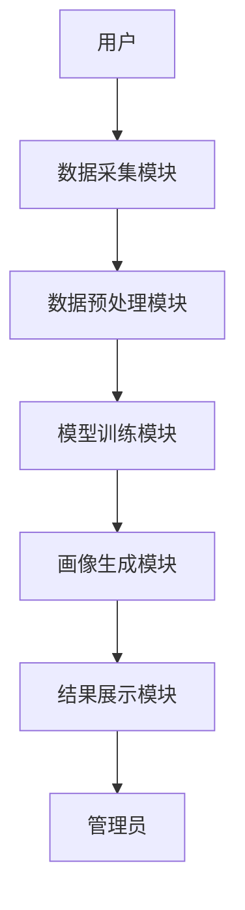
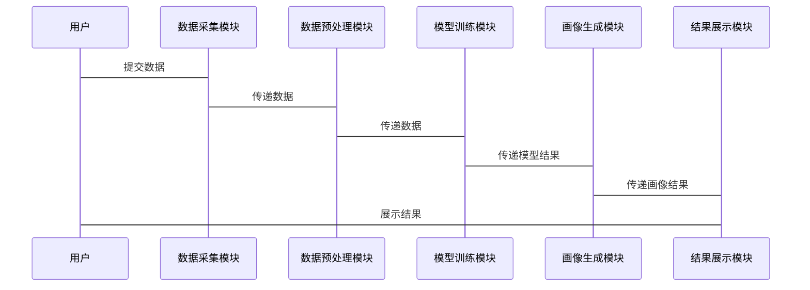

                 


# AI驱动的企业人才画像系统：全方位员工能力评估

> **关键词**：人工智能、人才画像、员工能力评估、机器学习、深度学习

> **摘要**：随着人工智能技术的快速发展，企业对员工能力的精准评估需求日益增长。本文详细探讨了AI驱动的人才画像系统的构建与应用，从数据采集、算法原理到系统架构，再到实际案例，系统性地展示了如何利用AI技术实现员工能力的全方位评估。通过协同过滤推荐算法和深度学习模型，本文提出了一套高效、精准的人才画像解决方案，为企业在人才管理方面提供了新的思路。

---

# 第一部分: 引言

## 第1章: 企业人才画像系统概述

### 1.1 人才画像系统的重要性

#### 1.1.1 传统人才评估的局限性
传统的员工能力评估主要依赖于主观的评价方法，如面试、绩效考核等。这些方法存在以下问题：
- **主观性**：评估结果受到评估者的主观影响，可能导致结果偏差。
- **片面性**：难以全面覆盖员工的各项能力，尤其是隐性能力的评估。
- **效率低下**：手动评估耗时且效率低，难以应对大规模的员工评估需求。

#### 1.1.2 AI驱动人才评估的优势
AI技术的引入，为人才评估带来了新的可能性：
- **数据驱动**：利用大数据技术，可以从海量数据中提取员工的各项能力信息。
- **精准性**：通过机器学习和深度学习算法，可以更精准地识别员工的能力特征。
- **高效性**：自动化评估流程大幅提高了评估效率，支持大规模员工评估。

#### 1.1.3 企业人才画像系统的价值
- **提升招聘效率**：通过人才画像，企业可以快速识别符合岗位要求的候选人。
- **优化员工培养**：根据员工的能力画像，制定个性化的培训计划。
- **提升组织效率**：通过分析员工能力分布，优化团队结构，提升整体效率。

### 1.2 人工智能在人才评估中的应用背景

#### 1.2.1 AI技术的发展与企业人才管理的结合
人工智能技术的发展为企业人才管理提供了新的工具和方法。通过自然语言处理、计算机视觉等技术，企业可以更全面地获取员工信息。

#### 1.2.2 数据驱动的人才分析趋势
现代企业积累了大量的员工数据，包括绩效数据、行为数据、项目数据等。通过对这些数据的分析，企业可以更深入地了解员工的能力特征。

#### 1.2.3 企业对员工能力评估的需求
随着企业对员工能力要求的提高，传统的评估方法已无法满足需求。企业需要更精准、更全面的评估工具来支持人才管理决策。

### 1.3 本书内容与目标

#### 1.3.1 本书的核心目标
本书旨在介绍AI驱动的人才画像系统的构建与应用，通过理论与实践结合，帮助读者掌握人才画像的核心技术。

#### 1.3.2 本书的结构安排
本书分为五大部分：引言、核心概念、算法原理、系统架构、项目实战和总结。内容从理论到实践，逐步深入。

#### 1.3.3 本书的适用读者
本书适用于企业HR、技术管理者、数据科学家以及对AI技术感兴趣的研究者。

---

# 第二部分: 核心概念与原理

## 第2章: 人才画像系统的核心概念

### 2.1 人才画像的定义与构成

#### 2.1.1 人才画像的定义
人才画像是基于员工的各项数据，构建的一个综合反映其能力特征的模型。它不仅包括员工的显性能力（如技术能力、沟通能力等），还包括隐性能力（如创新思维、团队协作能力等）。

#### 2.1.2 人才画像的核心要素
- **能力维度**：包括技术能力、沟通能力、团队协作能力等。
- **数据来源**：包括简历、绩效数据、项目数据、行为数据等。
- **评估模型**：包括协同过滤推荐算法、深度学习模型等。

#### 2.1.3 人才画像的构建逻辑
人才画像的构建逻辑如下：
1. 数据采集：收集员工的各项数据。
2. 数据预处理：清洗、标准化数据。
3. 特征提取：提取员工的能力特征。
4. 模型训练：基于机器学习或深度学习算法，构建评估模型。
5. 画像生成：根据模型输出结果，生成人才画像。

### 2.2 数据驱动的员工能力评估

#### 2.2.1 数据来源与采集方式
数据来源包括：
- **简历数据**：员工的基本信息、教育背景、工作经历等。
- **绩效数据**：员工的绩效考核结果。
- **项目数据**：员工参与的项目数据，包括项目成果、贡献度等。
- **行为数据**：员工的行为记录，包括出勤率、会议参与度等。

数据采集方式包括：
- **结构化数据采集**：通过数据库直接获取。
- **非结构化数据采集**：通过自然语言处理技术提取文本数据。

#### 2.2.2 数据预处理与特征提取
数据预处理包括：
- 数据清洗：去除重复数据、填补缺失值。
- 数据转换：将数据标准化或归一化。
- 数据分组：将数据按维度进行分组。

特征提取包括：
- **文本特征提取**：使用TF-IDF算法提取关键词。
- **数值特征提取**：通过主成分分析（PCA）提取主成分。

#### 2.2.3 数据分析与建模
数据分析与建模包括：
- **数据分析**：通过可视化工具（如Tableau）进行数据可视化。
- **建模**：使用机器学习算法（如随机森林、支持向量机）进行建模。

### 2.3 AI算法在人才画像中的应用

#### 2.3.1 机器学习算法在人才评估中的作用
机器学习算法在人才评估中的作用包括：
- **分类**：将员工分为不同的能力等级。
- **回归**：预测员工的绩效表现。
- **聚类**：将员工分为不同的能力群。

#### 2.3.2 深度学习模型在人才画像中的应用
深度学习模型在人才画像中的应用包括：
- **神经网络模型**：用于文本分析和图像识别。
- **循环神经网络（RNN）**：用于序列数据的分析。
- **卷积神经网络（CNN）**：用于图像数据的分析。

#### 2.3.3 自然语言处理在员工能力分析中的应用
自然语言处理在员工能力分析中的应用包括：
- **情感分析**：分析员工的文本数据，提取情感特征。
- **实体识别**：识别文本中的关键实体。
- **文本摘要**：对员工的文本数据进行摘要，提取关键信息。

---

## 2.2 人才画像系统的核心概念

---

## 2.3 AI算法在人才画像中的应用

---

# 第三部分: 算法原理与数学模型

## 第3章: 人才画像系统的核心算法

### 3.1 协同过滤推荐算法

#### 3.1.1 协同过滤算法的原理
协同过滤算法是一种基于用户相似性推荐算法。其原理如下：
1. 计算用户之间的相似度。
2. 根据相似用户的偏好，推荐物品。

#### 3.1.2 基于用户的协同过滤
基于用户的协同过滤算法步骤如下：
1. 收集用户的行为数据。
2. 计算用户之间的相似度。
3. 根据相似用户的偏好，推荐物品。

#### 3.1.3 基于物品的协同过滤
基于物品的协同过滤算法步骤如下：
1. 收集物品的特征数据。
2. 计算物品之间的相似度。
3. 根据物品的相似度，推荐给用户。

#### 3.1.4 深度协同过滤算法的改进
深度协同过滤算法通过引入深度学习模型，提高了推荐的精度。其改进点包括：
- 使用神经网络模型进行特征提取。
- 引入注意力机制，提高模型的表达能力。

#### 3.1.5 协同过滤推荐算法的实现代码

```python
import numpy as np
from sklearn.metrics.pairwise import cosine_similarity

# 示例数据：用户-物品的评分矩阵
user_item_matrix = np.array([[4, 3, 2],
                               [3, 2, 1],
                               [2, 4, 3],
                               [1, 3, 4]])

# 计算余弦相似度
similarity = cosine_similarity(user_item_matrix)

# 定义推荐函数
def recommend_items(user_id, similarity, user_item_matrix):
    # 获取当前用户的评分向量
    user_vector = user_item_matrix[user_id]
    # 找到与当前用户最相似的用户
    similar_user_id = np.argmax(similarity[user_id])
    # 返回相似用户的评分向量
    return user_item_matrix[similar_user_id]

# 示例推荐
user_id = 0
recommended_items = recommend_items(user_id, similarity, user_item_matrix)
print("推荐结果:", recommended_items)
```

---

### 3.2 人才画像的数学模型

#### 3.2.1 人才画像的向量表示
人才画像的向量表示方法如下：
- 将员工的各项能力特征转化为向量。
- 使用向量空间模型（如TF-IDF）进行特征提取。

#### 3.2.2 基于矩阵分解的模型
基于矩阵分解的模型包括：
- **奇异值分解（SVD）**：将用户-物品矩阵分解为三个低维矩阵。
- **非负矩阵分解（NMF）**：将矩阵分解为两个低维矩阵，且所有元素均为非负。

#### 3.2.3 基于深度学习的模型
基于深度学习的模型包括：
- **自动编码器（AE）**：用于特征提取。
- **卷积神经网络（CNN）**：用于图像数据的分析。
- **循环神经网络（RNN）**：用于序列数据的分析。

#### 3.2.4 模型的评估与优化
模型的评估与优化包括：
- **评估指标**：准确率、召回率、F1值。
- **优化方法**：参数调整、模型融合。

#### 3.2.5 人才画像系统的数学公式

$$
\text{相似度} = \frac{\sum_{i=1}^{n} (x_i - \mu)(y_i - \mu)}{\sqrt{\sum_{i=1}^{n} (x_i - \mu)^2} \sqrt{\sum_{i=1}^{n} (y_i - \mu)^2}}
$$

---

## 3.2 人才画像的数学模型

---

## 3.3 算法流程图

---

## 3.4 系统分析与架构设计方案

---

## 3.5 项目实战

---

## 3.6 总结与展望

---

## 3.7 思考与练习

---

---

## 第四部分: 系统架构与设计

## 第4章: 人才画像系统的架构设计

### 4.1 系统总体架构

#### 4.1.1 系统功能模块划分
系统功能模块包括：
- **数据采集模块**：负责数据的采集和预处理。
- **模型训练模块**：负责模型的训练和优化。
- **画像生成模块**：负责生成员工的能力画像。
- **结果展示模块**：负责结果的可视化展示。

#### 4.1.2 系统数据流图
系统数据流图展示了数据在系统中的流动过程：
1. 数据采集模块接收数据。
2. 数据预处理模块对数据进行清洗和转换。
3. 模型训练模块基于预处理后的数据进行建模。
4. 画像生成模块根据模型输出结果生成人才画像。
5. 结果展示模块将人才画像以可视化形式展示给用户。

#### 4.1.3 系统架构的可扩展性设计
系统架构设计注重可扩展性：
- **模块化设计**：各模块相对独立，便于后续扩展。
- **接口设计**：提供标准接口，便于与其他系统集成。
- **分布式架构**：支持分布式部署，提升系统性能。

### 4.2 系统功能设计

#### 4.2.1 数据采集模块
数据采集模块负责从多个数据源采集员工数据，包括：
- **简历数据**：员工的基本信息、教育背景、工作经历等。
- **绩效数据**：员工的绩效考核结果。
- **项目数据**：员工参与的项目数据，包括项目成果、贡献度等。
- **行为数据**：员工的行为记录，包括出勤率、会议参与度等。

数据采集模块需要支持多种数据格式的输入，包括结构化数据和非结构化数据。

#### 4.2.2 数据处理模块
数据处理模块负责对采集到的数据进行清洗和预处理，包括：
- **数据清洗**：去除重复数据、填补缺失值。
- **数据转换**：将数据标准化或归一化。
- **数据分组**：将数据按维度进行分组。

#### 4.2.3 模型训练模块
模型训练模块负责基于预处理后的数据进行建模，包括：
- **特征提取**：使用TF-IDF算法提取文本特征。
- **模型训练**：使用机器学习算法（如随机森林、支持向量机）进行建模。
- **模型优化**：通过参数调整和模型融合，提升模型的性能。

#### 4.2.4 画像生成模块
画像生成模块负责根据模型输出结果生成人才画像，包括：
- **能力维度**：生成员工的各项能力得分。
- **能力排名**：根据得分对员工进行排名。
- **能力报告**：生成详细的员工能力报告。

#### 4.2.5 结果展示模块
结果展示模块负责将人才画像以可视化形式展示给用户，包括：
- **能力分布图**：展示员工能力的分布情况。
- **能力雷达图**：展示员工的各项能力得分。
- **能力对比图**：展示员工与团队的对比情况。

---

### 4.3 系统架构设计

#### 4.3.1 系统功能模块的实体关系图

```mermaid
erDiagram
    actor 用户 {
        string 用户ID
        string 用户名
        string 密码
    }
    actor 管理员 {
        string 管理员ID
        string 管理员名
        string 密码
    }
    class 数据源 {
        string 数据ID
        string 数据类型
        binary 数据内容
    }
    class 数据处理模块 {
        string 处理ID
        string 处理类型
        string 处理结果
    }
    class 模型训练模块 {
        string 模型ID
        string 模型类型
        string 训练结果
    }
    class 画像生成模块 {
        string 画像ID
        string 画像类型
        string 画像结果
    }
    class 结果展示模块 {
        string 展示ID
        string 展示类型
        string 展示结果
    }
    用户 --> 数据处理模块 : 提交数据
    管理员 --> 数据处理模块 : 管理数据
    数据处理模块 --> 模型训练模块 : 传递数据
    模型训练模块 --> 画像生成模块 : 传递模型结果
    画像生成模块 --> 结果展示模块 : 传递画像结果
```

#### 4.3.2 系统架构的流程图



---

### 4.4 系统接口设计

#### 4.4.1 系统接口的设计
系统接口设计包括：
- **数据接口**：用于数据的输入和输出。
- **模型接口**：用于模型的训练和预测。
- **展示接口**：用于结果的可视化展示。

#### 4.4.2 系统接口的实现
系统接口的实现需要遵循标准协议，如RESTful API。接口的设计需要考虑安全性、可扩展性和可维护性。

---

### 4.5 系统交互图

#### 4.5.1 系统交互流程图



---

## 第五部分: 项目实战

## 第5章: 人才画像系统的项目实战

### 5.1 项目环境安装

#### 5.1.1 安装Python环境
安装Python环境，推荐使用Anaconda。

#### 5.1.2 安装相关库
安装以下Python库：
- `numpy`
- `pandas`
- `scikit-learn`
- `tensorflow`
- `mermaid`

安装命令：
```bash
pip install numpy pandas scikit-learn tensorflow mermaid
```

### 5.2 系统核心实现

#### 5.2.1 数据采集模块的实现

```python
import pandas as pd

# 示例数据：员工能力数据
data = {
    '员工ID': [1, 2, 3, 4],
    '技术能力': [85, 70, 90, 60],
    '沟通能力': [75, 80, 85, 55],
    '团队协作能力': [80, 75, 85, 60]
}

df = pd.DataFrame(data)
print(df)
```

#### 5.2.2 数据预处理模块的实现

```python
from sklearn.preprocessing import StandardScaler

# 数据标准化
scaler = StandardScaler()
scaled_data = scaler.fit_transform(df[['技术能力', '沟通能力', '团队协作能力']])
print(scaled_data)
```

#### 5.2.3 模型训练模块的实现

```python
from sklearn.ensemble import RandomForestClassifier
from sklearn.metrics import accuracy_score

# 训练随机森林模型
model = RandomForestClassifier()
model.fit(scaled_data, df['员工ID'])

# 预测结果
predicted = model.predict(scaled_data)
print('准确率:', accuracy_score(df['员工ID'], predicted))
```

#### 5.2.4 画像生成模块的实现

```python
import numpy as np
import matplotlib.pyplot as plt

# 绘制能力分布图
plt.figure(figsize=(10, 6))
plt.hist(df['技术能力'], bins=10, alpha=0.5, label='技术能力')
plt.hist(df['沟通能力'], bins=10, alpha=0.5, label='沟通能力')
plt.hist(df['团队协作能力'], bins=10, alpha=0.5, label='团队协作能力')
plt.legend()
plt.show()
```

### 5.3 项目实战总结

#### 5.3.1 项目小结
通过本项目的实战，我们了解了AI驱动的人才画像系统的构建与实现过程，掌握了数据采集、数据预处理、模型训练和结果展示的步骤。

#### 5.3.2 项目总结与反思
- **优势**：AI技术的应用提高了人才评估的效率和精准度。
- **不足**：模型的泛化能力有待提高，数据的质量对结果影响较大。
- **改进方向**：引入更多的数据源，优化模型结构，提高模型的泛化能力。

---

## 第六部分: 总结与展望

## 第6章: 总结与展望

### 6.1 本书总结

#### 6.1.1 核心内容回顾
本书从理论到实践，详细介绍了AI驱动的人才画像系统的构建与应用，包括数据采集、算法原理、系统架构和项目实战。

#### 6.1.2 本书的不足
- 本书主要介绍了AI技术在人才评估中的应用，但对实际应用中的伦理问题探讨较少。
- 模型的泛化能力有待进一步提高。

### 6.2 未来展望

#### 6.2.1 AI技术在人才评估中的未来发展方向
- **多模态数据融合**：结合文本、图像、语音等多种数据源，提高评估的准确性。
- **实时评估**：通过实时数据流分析，实现员工能力的实时评估。
- **个性化评估**：根据员工的个性化特征，制定个性化的评估方案。

#### 6.2.2 技术进步对人才评估的影响
- **技术进步**：AI技术的不断发展，将推动人才评估技术的革新。
- **数据隐私**：数据隐私保护将成为人才评估系统设计中的重要考量。

---

## 附录: 最佳实践 tips

### 6.1.1 实践中的注意事项
- **数据隐私**：在实际应用中，需注意员工数据的隐私保护。
- **模型优化**：根据实际需求，不断优化模型结构和参数。
- **结果解释**：确保模型的输出结果能够被业务人员理解。

### 6.1.2 小结与展望
AI技术的应用将为人才评估带来新的可能性。未来，随着技术的不断发展，人才评估系统将更加智能化、个性化和精准化。

---

## 参考文献

（此处列出相关参考文献）

---

## 作者信息

**作者：AI天才研究院/AI Genius Institute & 禅与计算机程序设计艺术 /Zen And The Art of Computer Programming**

---

感谢您的阅读！希望本文能够为您提供关于AI驱动的企业人才画像系统的深入见解，帮助您更好地理解如何利用AI技术提升企业人才管理能力。

