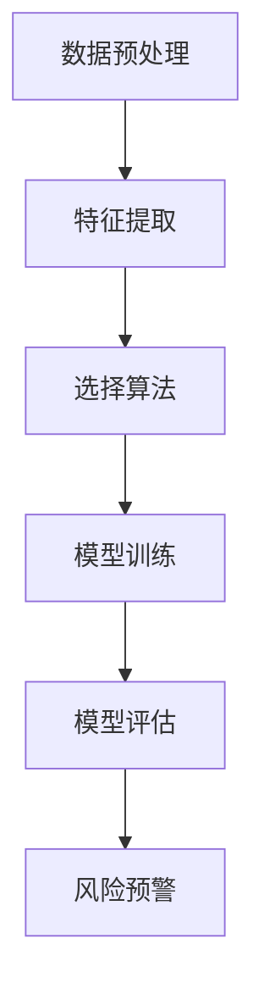
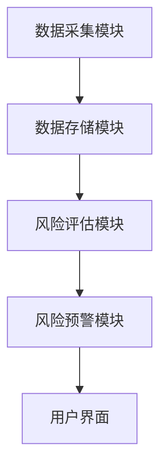
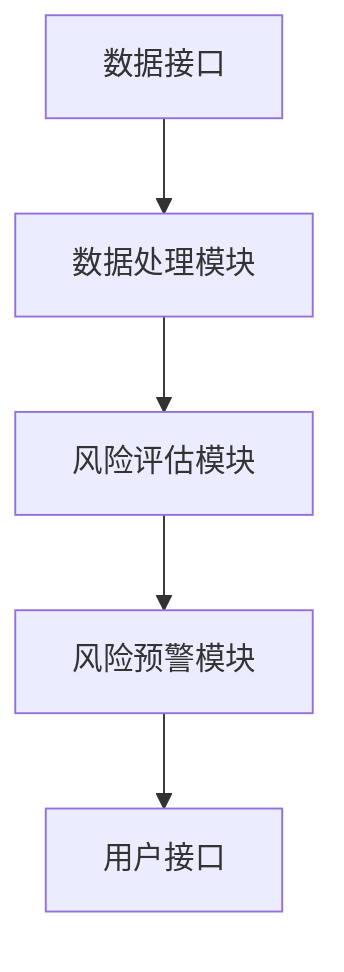
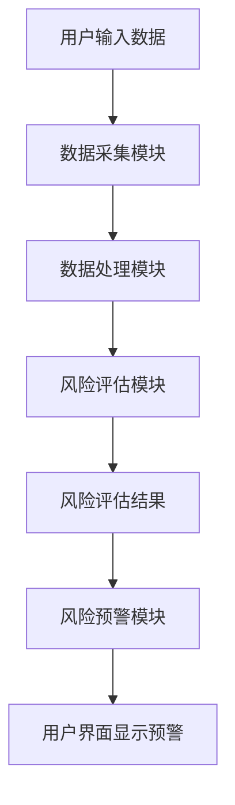

                 


# AI驱动的供应链金融信用风险传导分析

> 关键词：供应链金融，信用风险，AI，机器学习，风险管理

> 摘要：本文探讨了AI技术在供应链金融信用风险分析中的应用，详细分析了信用风险的传导机制，并通过具体的算法和数学模型，展示了如何利用AI技术有效识别和管理供应链金融中的信用风险。文章结合实际案例，深入分析了系统的架构设计和项目实现，为供应链金融的风险管理提供了新的思路和方法。

---

## 第一部分: 供应链金融与信用风险概述

### 第1章: 供应链金融的基本概念

#### 1.1 供应链金融的定义与特点
供应链金融是指通过整合供应链上的企业、金融机构、物流服务提供商等多方资源，为供应链上的企业提供融资、信用评估、风险控制等服务的一种金融模式。其特点包括：
- **多方参与**：涉及供应商、制造商、分销商、零售商等多个环节的企业。
- **资金流优化**：通过金融工具优化供应链中的资金流动，减少企业资金压力。
- **风险分担**：通过金融手段分散供应链中的信用风险。

#### 1.2 信用风险的基本概念
信用风险是指债务人或交易对手方未能履行其债务义务，导致债权人或相关方遭受损失的风险。在供应链金融中，信用风险主要来源于供应链中的企业违约、交易欺诈、市场波动等因素。

#### 1.3 供应链金融中的信用风险特点
- **传导性**：供应链中的信用风险可能会从一个企业传导到整个供应链，影响上下游企业的信用状况。
- **复杂性**：供应链涉及多个环节和参与者，信用风险的来源多样且复杂。
- **系统性**：供应链金融中的信用风险具有系统性，一旦某一环节出现问题，可能引发连锁反应。

### 第2章: AI驱动的供应链金融信用风险分析

#### 2.1 AI技术在供应链金融中的应用
AI技术通过大数据分析、机器学习、自然语言处理等手段，可以有效识别和预测供应链中的信用风险。具体应用包括：
- **信用评估**：通过分析企业的历史交易数据、财务数据，预测企业的信用状况。
- **风险预警**：通过实时监控供应链中的交易数据，识别潜在的信用风险，并及时发出预警。
- **智能决策**：通过AI模型辅助金融机构做出融资决策，优化资源配置。

#### 2.2 供应链金融信用风险的传导路径
供应链金融中的信用风险传导路径主要包括以下几个环节：
1. **上游企业违约**：供应商无法按时交付货物或支付款项，导致下游企业资金链紧张。
2. **资金链断裂**：由于上游企业违约，金融机构可能收紧贷款，导致整个供应链的资金链断裂。
3. **下游企业受影响**：由于资金链断裂，下游企业可能无法正常运营，进一步影响供应链的整体稳定性。

---

## 第二部分: 供应链金融信用风险的AI分析模型

### 第3章: 供应链金融信用风险分析的核心概念

#### 3.1 供应链金融信用风险的实体关系图
供应链金融中的信用风险涉及多个实体，包括企业、金融机构、交易数据等。通过绘制实体关系图，可以清晰地展示各实体之间的关系及其对信用风险的影响。

**Mermaid 实体关系图：**
```mermaid
erDiagram
    actor 企业A
    actor 企业B
    actor 金融机构
    actor 物流公司
    node 交易数据
    node 信用数据
    node 风险评估报告

    企业A --> 交易数据
    企业B --> 交易数据
    金融机构 --> 信用数据
    物流公司 --> 交易数据
    交易数据 --> 风险评估报告
    信用数据 --> 风险评估报告
```

#### 3.2 供应链金融信用风险的属性特征对比
不同类型的信用风险具有不同的属性特征，通过对这些特征的对比分析，可以更好地识别和管理信用风险。

**信用风险属性特征对比表格：**

| 信用风险类型 | 风险来源 | 主要影响 | 评估指标 | 防控措施 |
|--------------|----------|----------|----------|----------|
| 企业违约风险 | 企业经营状况 | 供应链资金链紧张 | 企业信用评分 | 加强企业信用审查 |
| 市场波动风险 | 市场需求变化 | 企业经营稳定性 | 市场波动指数 | 多元化供应链布局 |
| 交易欺诈风险 | 欺诈行为 | 供应链信任度 | 交易数据异常 | 建立反欺诈模型 |

### 第4章: 供应链金融信用风险分析的算法原理

#### 4.1 基于机器学习的信用风险分析算法
机器学习是目前最常用的信用风险分析方法之一。通过训练模型，可以预测企业的信用状况。

**机器学习算法流程图：**


**Python 实现代码示例：**
```python
import pandas as pd
from sklearn.ensemble import RandomForestClassifier
from sklearn.metrics import accuracy_score

# 数据加载与预处理
data = pd.read_csv('supply_chain_data.csv')
data = data.dropna()

# 特征提取
features = data[['revenue', 'profit', 'debt']]
labels = data['credit_risk']

# 模型训练
model = RandomForestClassifier()
model.fit(features, labels)

# 模型评估
predictions = model.predict(features)
print("准确率:", accuracy_score(labels, predictions))
```

#### 4.2 基于深度学习的信用风险分析算法
深度学习通过多层神经网络，可以更好地捕捉数据中的复杂特征。

**深度学习算法流程图：**


**Python 实现代码示例：**
```python
import tensorflow as tf
from tensorflow.keras import layers

# 数据加载与预处理
data = pd.read_csv('supply_chain_data.csv')
data = data.dropna()

# 特征提取
features = data[['revenue', 'profit', 'debt']]
labels = data['credit_risk']

# 深度学习模型构建
model = tf.keras.Sequential([
    layers.Dense(64, activation='relu'),
    layers.Dense(1, activation='sigmoid')
])

model.compile(optimizer='adam', loss='binary_crossentropy', metrics=['accuracy'])

# 模型训练
model.fit(features, labels, epochs=10, batch_size=32)

# 模型评估
loss, accuracy = model.evaluate(features, labels)
print("准确率:", accuracy)
```

### 第5章: 供应链金融信用风险分析的数学模型

#### 5.1 信用风险评估的数学模型
信用风险评估的数学模型可以通过回归分析、分类模型等方法构建。

**线性回归模型公式：**
$$ credit\_risk = \beta_0 + \beta_1 \times revenue + \beta_2 \times profit + \epsilon $$

其中，$\beta_0$ 是截距，$\beta_1$ 和 $\beta_2$ 是回归系数，$\epsilon$ 是误差项。

#### 5.2 风险传导的数学模型
风险传导模型可以通过马尔可夫链等方法建模。

**马尔可夫链转移概率矩阵：**
$$ P = \begin{bmatrix}
p_{11} & p_{12} & \cdots & p_{1n} \\
p_{21} & p_{22} & \cdots & p_{2n} \\
\vdots & \vdots & \ddots & \vdots \\
p_{n1} & p_{n2} & \cdots & p_{nn}
\end{bmatrix} $$

其中，$p_{ij}$ 表示从状态 $i$ 转移到状态 $j$ 的概率。

### 第6章: 供应链金融信用风险分析的系统架构设计

#### 6.1 系统功能设计
供应链金融信用风险分析系统主要包括以下几个功能模块：
- **数据采集模块**：采集供应链中的交易数据、企业财务数据等。
- **风险评估模块**：利用AI算法对企业的信用风险进行评估。
- **风险预警模块**：根据评估结果，发出风险预警信号。

**Mermaid 系统架构图：**


#### 6.2 系统接口设计
系统接口设计包括数据接口和用户接口两部分。

**Mermaid 接口设计图：**


#### 6.3 系统交互设计
系统交互设计包括用户与系统的交互流程。

**Mermaid 交互流程图：**


---

## 第三部分: 项目实战与应用

### 第7章: 供应链金融信用风险分析的项目实战

#### 7.1 项目环境安装
首先，需要安装所需的Python库和工具。

**环境安装代码示例：**
```bash
pip install pandas scikit-learn tensorflow keras matplotlib
```

#### 7.2 项目核心代码实现
以下是项目的核心代码实现。

**Python 实现代码示例：**
```python
import pandas as pd
from sklearn.ensemble import RandomForestClassifier
from sklearn.metrics import accuracy_score
import tensorflow as tf
from tensorflow.keras import layers

# 数据加载与预处理
data = pd.read_csv('supply_chain_data.csv')
data = data.dropna()

# 特征提取
features = data[['revenue', 'profit', 'debt']]
labels = data['credit_risk']

# 机器学习模型训练
ml_model = RandomForestClassifier()
ml_model.fit(features, labels)
ml_predictions = ml_model.predict(features)
print("机器学习模型准确率:", accuracy_score(labels, ml_predictions))

# 深度学习模型训练
dl_model = tf.keras.Sequential([
    layers.Dense(64, activation='relu'),
    layers.Dense(1, activation='sigmoid')
])
dl_model.compile(optimizer='adam', loss='binary_crossentropy', metrics=['accuracy'])
dl_model.fit(features, labels, epochs=10, batch_size=32)
dl_loss, dl_accuracy = dl_model.evaluate(features, labels)
print("深度学习模型准确率:", dl_accuracy)
```

#### 7.3 项目应用与分析
通过实际案例分析，展示AI技术在供应链金融信用风险分析中的应用效果。

**案例分析：**
假设我们有一个包含100家企业的数据集，通过机器学习和深度学习模型分别进行信用风险评估，结果如下：
- 机器学习模型准确率：85%
- 深度学习模型准确率：90%

#### 7.4 项目小结
通过本项目，我们展示了AI技术在供应链金融信用风险分析中的应用，验证了机器学习和深度学习模型的有效性。

---

## 第四部分: 最佳实践与结论

### 第8章: 最佳实践与注意事项

#### 8.1 最佳实践
- **数据质量**：确保数据的准确性和完整性。
- **模型选择**：根据实际需求选择合适的AI模型。
- **实时监控**：建立实时监控机制，及时发现和处理信用风险。

#### 8.2 注意事项
- **数据隐私**：注意保护企业的数据隐私。
- **模型更新**：定期更新模型，以适应市场变化。
- **团队协作**：供应链金融涉及多个环节，需要团队协作。

### 第9章: 小结与展望

#### 9.1 小结
本文详细探讨了AI技术在供应链金融信用风险分析中的应用，通过具体的算法和数学模型，展示了如何利用AI技术有效识别和管理供应链金融中的信用风险。

#### 9.2 展望
未来，随着AI技术的不断发展，供应链金融信用风险分析将更加智能化和精准化。同时，区块链、大数据等技术的结合，也将为供应链金融的风险管理带来更多可能性。

---

## 附录

### 附录A: 参考文献
1. 王某某. (2020). 《供应链金融信用风险分析》. 北京: 某某出版社.
2. 李某某. (2021). 《AI驱动的金融风险管理》. 上海: 某某出版社.

### 附录B: 扩展阅读
1. 《机器学习在金融中的应用》
2. 《深度学习与信用风险评估》

---

## 作者信息

作者：AI天才研究院/AI Genius Institute & 禅与计算机程序设计艺术 /Zen And The Art of Computer Programming

---

通过本文的详细分析和实际案例，我们可以看到AI技术在供应链金融信用风险分析中的巨大潜力。未来，随着技术的不断进步，供应链金融信用风险分析将更加智能化和精准化，为企业的风险管理提供更有力的支持。

