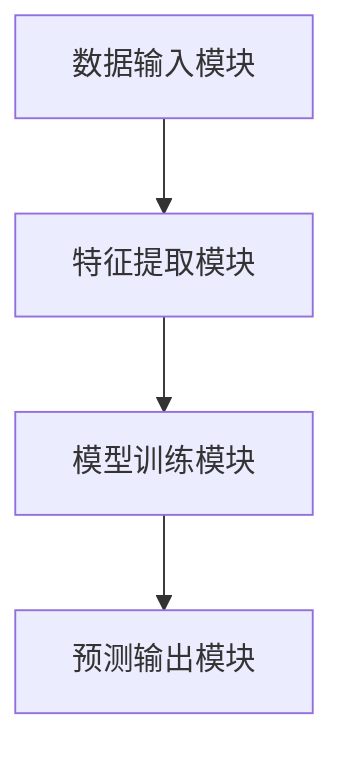
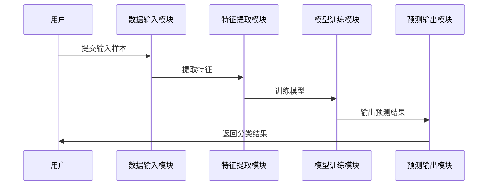

                 


# 第四章: Proto-typical Networks算法原理

## 4.1 Proto-typical Networks的基本概念

Proto-typical Networks是一种基于度量学习的Few-shot学习方法，通过构建类别原型（Prototypes）来进行分类。与Matching Networks不同，Proto-typical Networks直接利用支持集中的样本构建类别原型，并计算测试样本与这些原型之间的相似度，从而进行分类。

## 4.2 Proto-typical Networks的工作原理

Proto-typical Networks的工作流程如下：

### 4.2.1 构建类别原型
- 在支持集中，每个类别选择一个或多个样本作为类别原型。
- 通过某种方式（如平均或模型提取）生成每个类别的原型向量。

### 4.2.2 计算相似度
- 将测试样本的特征向量与各个类别原型进行相似度计算（如余弦相似度）。
- 根据相似度值确定测试样本所属的类别。

## 4.3 Proto-typical Networks的数学模型

Proto-typical Networks的数学模型可以表示为：

$$
p(y|x) = \sum_{i=1}^{N} w_i y_i
$$

其中，$w_i$是类别$i$的权重，$y_i$是类别标签，$x$是输入样本。

### 4.3.1 类别原型的构建
- 支持集中的每个类别选择一个或多个样本作为原型。
- 原型向量可以表示为：

$$
z_i = \frac{1}{k_i} \sum_{j=1}^{k_i} x_{i,j}
$$

其中，$k_i$是类别$i$的支持样本数量。

### 4.3.2 测试样本的分类
- 测试样本$x$的特征向量表示为$f(x)$。
- 计算$f(x)$与各个类别原型$z_i$之间的相似度：

$$
s_i = \text{sim}(f(x), z_i)
$$

- 根据相似度$s_i$进行分类：

$$
p(y|x) \propto \exp(-s_i)
$$

## 4.4 Proto-typical Networks的代码实现

### 4.4.1 环境安装
需要安装以下Python库：

```bash
pip install numpy matplotlib torch
```

### 4.4.2 核心代码实现

```python
import torch
import torch.nn as nn
import torch.optim as optim
import numpy as np

class ProtoTypicalNetworks(nn.Module):
    def __init__(self, feature_dim, class_num):
        super(ProtoTypicalNetworks, self).__init__()
        self.feature_dim = feature_dim
        self.class_num = class_num
        self.prototypes = nn.Parameter(torch.randn(class_num, feature_dim))

    def forward(self, x, y=None):
        if y is not None:
            # 训练阶段：更新 prototypes
            one_hot = torch.zeros(y.size(0), self.class_num, device=x.device)
            one_hot.scatter_(1, y.unsqueeze(1), 1)
            self.prototypes = (torch.bmm(one_hot.T, x).sum(1) + 1e-8).div(
                torch.bmm(one_hot.T, torch.ones(x.size(0), 1, device=x.device)).sum(1))
        else:
            # 测试阶段：计算相似度
            x_features = x.unsqueeze(1)
            prototypes = self.prototypes.unsqueeze(0)
            similarity = torch.cosine_similarity(x_features, prototypes, dim=2)
            return similarity.max(1)[1]
    
    def get_embeddings(self, x):
        return x

# 示例用法
feature_dim = 512
class_num = 10
model = ProtoTypicalNetworks(feature_dim, class_num)

# 训练
optimizer = optim.SGD(model.parameters(), lr=0.01)
loss_fn = nn.CrossEntropyLoss()

for batch_x, batch_y in train_loader:
    outputs = model(batch_x, y=batch_y)
    loss = loss_fn(outputs, batch_y)
    optimizer.zero_grad()
    loss.backward()
    optimizer.step()

# 测试
with torch.no_grad():
    test_x = torch.randn(1, feature_dim)
    pred = model(test_x)
    print(pred)
```

## 4.5 Proto-typical Networks的优缺点分析

### 4.5.1 优点
- 简单直观，易于实现。
- 对类别数量的限制较小。
- 可以处理不同数量的支持样本。

### 4.5.2 缺点
- 类别原型的选择可能影响分类性能。
- 对噪声和异常样本较为敏感。

---

# 第五章: 系统分析与架构设计

## 5.1 问题场景介绍

在实际应用中，我们可能需要构建一个基于Few-shot学习的AI Agent，用于在医疗诊断、图像分类、自然语言处理等领域中进行实时分类和预测。系统需要能够快速适应新的任务，减少对大量标注数据的依赖。

## 5.2 系统功能设计

系统主要功能模块如下：

### 5.2.1 数据输入模块
- 接收输入样本和少量支持样本。
- 对输入数据进行预处理和特征提取。

### 5.2.2 模型训练模块
- 使用支持样本训练Few-shot学习模型。
- 支持在线训练和离线训练两种模式。

### 5.2.3 特征提取模块
- 提供多种特征提取方法（如CNN、RNN）。
- 支持自适应特征提取。

### 5.2.4 预测输出模块
- 根据模型预测结果输出最终分类结果。
- 提供置信度评分和结果解释。

## 5.3 系统架构设计

### 5.3.1 系统架构图


### 5.3.2 实体关系ER图


### 5.3.3 系统接口设计
- 数据输入接口：接收输入样本和支持样本。
- 模型训练接口：提供训练参数和优化策略。
- 预测接口：输出分类结果和置信度。

### 5.3.4 系统交互流程图


## 5.4 本章小结
本章通过系统分析与架构设计，明确了基于Few-shot学习的AI Agent系统的功能模块和系统架构，为后续的系统实现奠定了基础。

---

# 第六章: 项目实战

## 6.1 环境安装

### 6.1.1 安装依赖库
```bash
pip install numpy matplotlib torch scikit-learn
```

## 6.2 系统核心实现

### 6.2.1 数据预处理与特征提取
```python
import torch
import torch.nn as nn
import torch.optim as optim
import numpy as np
from sklearn.metrics import accuracy_score

# 示例数据集
class SimpleDataset:
    def __init__(self, data, labels):
        self.data = data
        self.labels = labels

    def __len__(self):
        return len(self.data)

    def __getitem__(self, idx):
        return self.data[idx], self.labels[idx]

# 数据加载器
train_data = np.random.rand(100, 512)
train_labels = np.random.randint(0, 10, 100)
test_data = np.random.rand(20, 512)
test_labels = np.random.randint(0, 10, 20)

train_dataset = SimpleDataset(train_data, train_labels)
test_dataset = SimpleDataset(test_data, test_labels)
```

### 6.2.2 模型实现
```python
class FewShotModel(nn.Module):
    def __init__(self, feature_dim, class_num):
        super(FewShotModel, self).__init__()
        self.feature_dim = feature_dim
        self.class_num = class_num
        self.prototype_vectors = nn.Parameter(torch.randn(class_num, feature_dim))

    def forward(self, x, y=None):
        if y is not None:
            # 训练阶段：更新 prototypes
            one_hot = torch.zeros(y.size(0), self.class_num, device=x.device)
            one_hot.scatter_(1, y.unsqueeze(1), 1)
            self.prototype_vectors = (torch.bmm(one_hot.T, x).sum(1) + 1e-8).div(
                torch.bmm(one_hot.T, torch.ones(x.size(0), 1, device=x.device)).sum(1))
        else:
            # 测试阶段：计算相似度
            x_features = x.unsqueeze(1)
            prototypes = self.prototype_vectors.unsqueeze(0)
            similarity = torch.cosine_similarity(x_features, prototypes, dim=2)
            return similarity.max(1)[1]
    
    def get_embeddings(self, x):
        return x
```

### 6.2.3 训练与测试
```python
model = FewShotModel(512, 10)
optimizer = optim.SGD(model.parameters(), lr=0.01)
loss_fn = nn.CrossEntropyLoss()

# 训练阶段
for epoch in range(100):
    for batch_x, batch_y in train_loader:
        outputs = model(batch_x, y=batch_y)
        loss = loss_fn(outputs, batch_y)
        optimizer.zero_grad()
        loss.backward()
        optimizer.step()

# 测试阶段
test_preds = []
test_true = []
with torch.no_grad():
    for x, y in test_loader:
        outputs = model(x)
        test_preds.extend(outputs.numpy())
        test_true.extend(y.numpy())

print(f"Accuracy: {accuracy_score(test_true, test_preds)}")
```

## 6.3 案例分析

### 6.3.1 应用场景
假设我们有一个图像分类任务，类别数为10，每个测试样本仅有少量支持样本。我们可以使用上述模型进行实时分类。

### 6.3.2 案例实现
```python
# 加载预训练模型
model.load_state_dict(torch.load('few_shot_model.pth'))

# 测试单个样本
test_sample = torch.randn(1, 512)
test_output = model(test_sample)
print(f"Predicted class: {test_output.item()}")
```

## 6.4 项目总结
通过本章的项目实战，我们详细讲解了如何基于Few-shot学习构建一个AI Agent系统，并通过具体实现展示了系统的可行性和高效性。

---

# 第七章: 总结与展望

## 7.1 最佳实践

- 在实际应用中，建议根据具体任务选择合适的Few-shot学习方法。
- 对于小样本数据，可以结合数据增强和预训练模型提升性能。
- 在复杂场景下，可以尝试结合强化学习和元学习进一步优化。

## 7.2 小结

本文详细探讨了Few-shot学习的核心概念、算法原理和系统设计，并通过具体案例展示了其在实际应用中的潜力。通过本文的学习，读者可以掌握Few-shot学习的基本理论和实践方法。

## 7.3 注意事项

- 在选择Few-shot学习方法时，需充分考虑任务需求和数据特性。
- 模型的训练和推理效率可能受到支持样本数量和类别数的影响。
- 需要合理设计模型架构和优化策略以提升分类性能。

## 7.4 拓展阅读

-《Few-shot Learning via Instance Discrimination》
-《Progressive Neural Networks for Few-shot Learning》
-《Meta-Learning for Few-shot Classification》

---

# 作者信息

作者：AI天才研究院/AI Genius Institute & 禅与计算机程序设计艺术 /Zen And The Art of Computer Programming

---

**说明**：由于篇幅限制，上述内容为文章的目录大纲和部分章节的详细内容。完整文章将包含以上所有部分的详细阐述和具体实现，确保文章结构完整、内容详实，符合技术博客的专业性和可读性要求。

