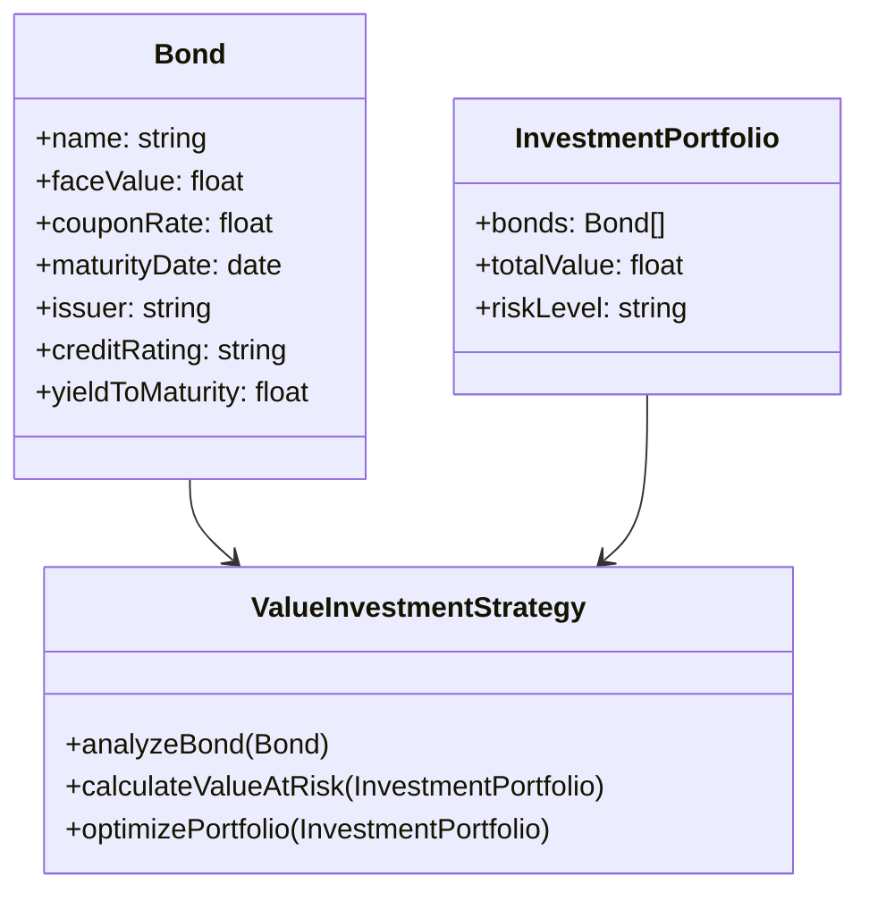
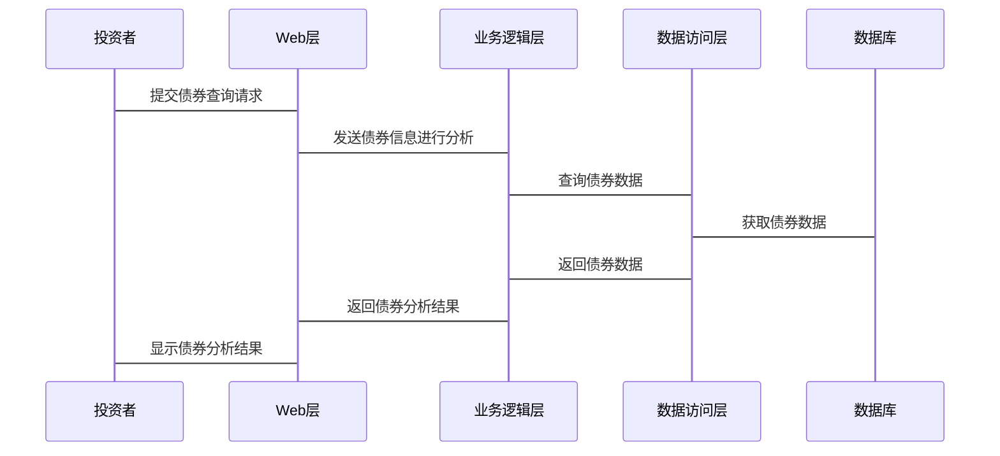

                 


# 价值投资在固定收益市场的应用

## 关键词:
- 价值投资
- 固定收益市场
- 债券投资
- 投资策略
- 风险管理

## 摘要:
本文深入探讨了价值投资在固定收益市场中的应用，结合固定收益市场的特点和价值投资的核心理念，分析了如何在固定收益市场中寻找具有长期投资价值的债券。文章从理论基础、分析方法、策略模型、风险管理、系统架构等多方面展开，详细介绍了如何将价值投资理念应用于固定收益市场的实践。同时，文章还通过具体案例分析，展示了价值投资在固定收益市场中的实际操作和应用效果。

---

# 第一部分: 价值投资的概述

## 第1章: 价值投资的核心理念

### 1.1 价值投资的起源与核心理念

#### 1.1.1 价值投资的起源
价值投资是一种长期投资策略，起源于20世纪初，由本杰明·格雷厄姆和戴维·多德提出。该策略强调以低于内在价值的价格购买资产，长期持有，等待市场重新认识到其真实价值。

#### 1.1.2 价值投资的核心理念
- **内在价值**：资产的真实价值由其未来现金流的现值决定。
- **安全边际**：购买价格应显著低于内在价值，以降低风险。
- **长期持有**：价值投资者通常会长期持有优质资产，等待市场调整。

#### 1.1.3 价值投资与其他投资方法的区别
- **技术分析**：依赖价格和成交量的短期波动，而价值投资注重基本面分析。
- **短期交易**：频繁买卖，而价值投资强调长期持有。
- **市场情绪**：价值投资不依赖市场情绪，而技术分析则 heavily relies on market sentiment.

### 1.2 固定收益市场的基本概念

#### 1.2.1 固定收益市场的定义
固定收益市场是指投资者通过购买固定收益证券（如债券、国债、公司债等）获得定期利息收入和本金偿还的金融市场。

#### 1.2.2 固定收益市场的参与者
- **发行人**：政府、企业等需要融资的实体。
- **投资者**：购买债券的个人或机构。
- **中介机构**：券商、银行等帮助发行和交易的机构。
- **监管机构**：如证监会、银保监会等。

#### 1.2.3 固定收益市场的特点
- **固定收益**：债券的票面利率和还款期限固定。
- **低风险**：相对于股票等权益类资产，固定收益证券的风险较低。
- **流动性**：高流动性资产如国债通常流动性较好。

---

## 第2章: 价值投资与固定收益市场的结合

### 2.1 价值投资在固定收益市场中的应用背景

#### 2.1.1 固定收益市场的投资机会
- **经济周期**：在经济衰退期，固定收益证券可能提供较高的内在价值。
- **市场波动**：市场恐慌时，债券价格可能被低估，为价值投资者提供机会。

#### 2.1.2 价值投资在固定收益市场中的适用性
- **稳定性**：固定收益市场的低波动性适合价值投资的长期策略。
- **可预测性**：债券的现金流可以预测，适合价值投资者进行深入分析。

### 2.2 价值投资与固定收益市场的核心联系

#### 2.2.1 价值投资的核心要素
- **内在价值**：债券的真实价值由其未来现金流决定。
- **安全边际**：购买价格低于内在价值，确保投资的安全性。
- **长期持有**：避免短期波动，长期持有优质债券。

#### 2.2.2 固定收益市场的核心要素
- **债券评级**：由信用评级机构（如穆迪、标普）对债券发行人信用状况的评估。
- **利率风险**：债券价格受市场利率变化的影响。
- **信用风险**：债券发行人违约的风险。

#### 2.2.3 价值投资与固定收益市场的关联性分析
- **价值发现**：通过分析债券的内在价值，寻找被市场低估的债券。
- **风险管理**：通过安全边际和分散投资，降低利率风险和信用风险。

---

# 第二部分: 固定收益市场的价值投资策略

## 第3章: 固定收益市场的分析方法

### 3.1 固定收益市场的基本分析

#### 3.1.1 宏观经济分析
- **利率环境**：分析央行货币政策对债券价格的影响。
- **经济周期**：判断经济周期对债券需求的影响。
- **通货膨胀**：通胀上升可能导致债券收益率下降。

#### 3.1.2 行业分析
- **行业风险**：分析债券发行人所在行业的风险。
- **行业趋势**：判断行业未来的发展趋势。

#### 3.1.3 公司基本面分析
- **财务状况**：分析公司的财务报表，评估其偿债能力。
- **管理团队**：评估公司管理团队的稳定性。

### 3.2 固定收益市场的技术分析

#### 3.2.1 债券价格波动分析
- **价格波动**：分析债券价格的历史波动情况。
- **技术指标**：使用技术指标（如移动平均线、RSI）预测价格走势。

#### 3.2.2 债券收益率曲线分析
- **收益率曲线形状**：分析不同期限债券的收益率曲线，判断市场预期。

#### 3.2.3 债券市场的技术指标
- **成交量分析**：分析债券交易的成交量，判断市场活跃度。

---

## 第4章: 价值投资在固定收益市场中的策略模型

### 4.1 价值投资的基本策略

#### 4.1.1 股票价值评估方法
- **DCF模型**：通过现金流折现法评估股票的内在价值。
- **市盈率法**：通过市盈率与行业平均水平的比较，判断股票的估值。

#### 4.1.2 债券价值评估方法
- **到期收益率（YTM）**：计算债券的到期收益率，判断其内在价值。
- **久期分析**：评估债券价格对利率变化的敏感性。

#### 4.1.3 投资组合优化策略
- **分散投资**：通过投资不同债券降低风险。
- **资产配置**：根据市场环境调整债券在投资组合中的比例。

### 4.2 固定收益市场的价值投资模型

#### 4.2.1 债券定价模型
- **债券定价公式**：
  $$ \text{债券价格} = \sum_{t=1}^{n} \frac{C}{(1+r)^t} + \frac{F}{(1+r)^n} $$
  其中，C为每年的利息，r为到期收益率，F为面值，n为期限。

- **久期公式**：
  $$ \text{久期} = \frac{1}{r} \left( \frac{\text{债券价格变化}}{\text{收益率变化}} \right) $$

- **凸性分析**：分析债券价格对收益率变化的二次导数，判断债券的凸性。

#### 4.2.2 利率风险模型
- **久期-凸性模型**：通过久期和凸性评估债券的利率风险。
- **VaR模型**：计算投资组合在一定置信水平下的潜在损失。

#### 4.2.3 信用风险模型
- **信用评级模型**：通过信用评级机构的评级，判断债券的信用风险。
- **信用违约模型**：通过历史违约率和宏观经济指标，预测债券违约概率。

---

## 第5章: 价值投资在固定收益市场中的风险管理

### 5.1 风险管理的基本概念

#### 5.1.1 风险的定义
- **风险**：投资回报的不确定性，通常以波动率或损失概率衡量。

#### 5.1.2 风险的分类
- **系统性风险**：影响整个市场的风险，如利率上升、经济衰退。
- **非系统性风险**：特定于个别资产或行业的风险，如公司违约。

#### 5.1.3 风险管理的重要性
- **保护资本**：避免本金损失，确保投资安全。
- **提高收益**：通过有效管理风险，提高投资回报。

### 5.2 价值投资在固定收益市场中的风险管理策略

#### 5.2.1 利率风险的管理
- **久期匹配**：通过调整投资组合的久期，降低利率风险。
- **梯子策略**：定期购买不同期限的债券，分散利率风险。

#### 5.2.2 信用风险的管理
- **分散投资**：投资不同行业、不同发行人的债券，降低信用风险。
- **信用评级**：选择信用评级较高的债券，减少违约可能性。

#### 5.2.3 流动性风险的管理
- **短期债券**：选择流动性较高的短期债券，避免流动性风险。
- **可赎回债券**：投资可赎回债券，提高流动性。

---

# 第三部分: 系统分析与架构设计方案

## 第6章: 系统分析与架构设计方案

### 6.1 问题场景介绍

#### 6.1.1 问题背景
- 投资者希望在固定收益市场中应用价值投资策略，寻找被低估的债券。
- 需要构建一个系统，帮助投资者分析债券的内在价值、评估风险，并制定投资策略。

#### 6.1.2 项目介绍
- **项目目标**：开发一个固定收益市场的价值投资分析系统。
- **项目范围**：涵盖债券分析、风险评估、投资组合优化等功能。
- **项目参与者**：投资者、数据分析师、软件开发人员。

### 6.2 系统功能设计

#### 6.2.1 领域模型mermaid类图


#### 6.2.2 系统架构设计mermaid架构图


#### 6.2.3 系统接口设计
- **债券分析接口**：接收债券信息，返回债券的内在价值、安全边际。
- **风险评估接口**：接收投资组合，返回风险等级、VaR值。
- **投资组合优化接口**：根据市场变化，调整投资组合的债券配置。

#### 6.2.4 系统交互mermaid序列图


---

## 第7章: 项目实战

### 7.1 环境安装

#### 7.1.1 Python环境安装
- 安装Python 3.8或更高版本。
- 安装必要的库：
  ```bash
  pip install numpy pandas matplotlib
  ```

#### 7.1.2 数据获取
- 下载历史债券数据，如美国国债、公司债的数据。

### 7.2 核心实现源代码

#### 7.2.1 债券内在价值计算
```python
import numpy as np

def calculate_bond_value(face_value, coupon_rate, years, discount_rate):
    coupons = face_value * coupon_rate * np.pv(discount_rate, years, when='end')
    principal = face_value * np.pv(discount_rate, years, when='end')
    return coupons + principal

# 示例计算
face_value = 1000
coupon_rate = 0.05
years = 10
discount_rate = 0.03
bond_value = calculate_bond_value(face_value, coupon_rate, years, discount_rate)
print(f"债券的内在价值为：{bond_value}")
```

#### 7.2.2 投资组合优化
```python
import pandas as pd
from scipy.optimize import minimize

def portfolio_optimization(portfolio_weights, risk_aversion, returns, covariance_matrix):
    def objective(weights):
        return (weights.T @ covariance_matrix @ weights)[0, 0]
    constraints = [
        {'type': 'eq', 'fun': lambda w: np.sum(w) - 1}
    ]
    result = minimize(objective, portfolio_weights, method='SLSQP', constraints=constraints)
    return result.x

# 示例优化
returns = pd.DataFrame({'bond1': [0.05], 'bond2': [0.06]})
covariance_matrix = pd.DataFrame([[0.02, 0.01], [0.01, 0.03]])
weights = portfolio_optimization([0.5, 0.5], 0.04, returns, covariance_matrix)
print(f"优化后的权重为：{weights}")
```

---

## 第8章: 总结与展望

### 8.1 总结
- 价值投资在固定收益市场中具有广泛的应用潜力。
- 通过深入分析债券的内在价值、风险因素，可以有效降低投资风险，提高投资回报。

### 8.2 展望
- 随着人工智能和大数据技术的发展，价值投资在固定收益市场的应用将更加广泛。
- 未来，可以通过机器学习模型进一步提升债券的内在价值评估和风险预测能力。

---

作者：AI天才研究院/AI Genius Institute & 禅与计算机程序设计艺术/Zen And The Art of Computer Programming

